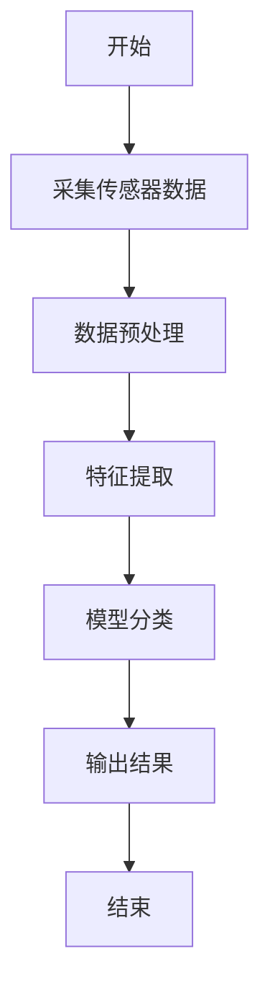
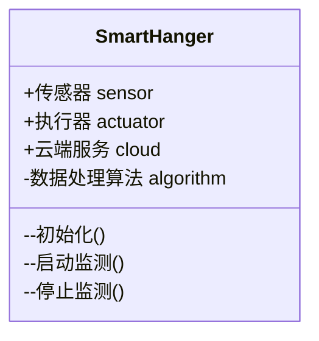
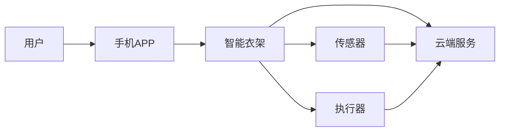
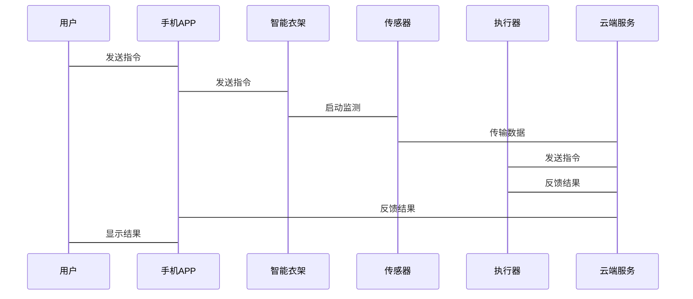

                 


# 智能衣架：AI Agent的衣物除味系统

## 关键词：AI Agent，衣物除味，物联网，传感器，气味识别，系统架构

## 摘要：本文探讨了智能衣架的AI Agent衣物除味系统，从背景、核心概念到算法原理、系统架构，再到项目实战，详细分析了该系统的实现过程和技术细节。

---

# 第一部分: 智能衣架的背景与概念

## 第1章: 智能衣架的背景与问题背景

### 1.1 问题背景

#### 1.1.1 衣物异味的常见问题
衣物在穿着和存放过程中容易产生异味，如汗味、霉味等。这些异味不仅影响穿着体验，还可能损害衣物材质。传统除味方法如洗涤、晾晒等，效率低且效果有限，尤其在潮湿环境下问题更为突出。

#### 1.1.2 现有除味技术的局限性
现有除味技术主要包括化学除味剂和紫外线除味设备。化学除味剂可能对人体和环境造成伤害，而紫外线设备仅对特定类型的细菌有效，且能耗较高。

#### 1.1.3 智能化除味的需求与痛点
随着智能家居的普及，用户对智能化除味设备的需求日益增加。传统除味设备无法实时监测异味并自动启动除味功能，存在使用不便和效率低下的问题。

---

### 1.2 问题描述

#### 1.2.1 衣物异味的形成机制
衣物异味主要由细菌、真菌等微生物的代谢活动产生。这些微生物在潮湿环境中繁殖迅速，导致异味的产生。

#### 1.2.2 现有除味方法的不足
现有除味方法依赖于人工操作，缺乏智能化和自动化。用户需要手动启动除味设备，且无法实时监测异味情况。

#### 1.2.3 智能衣架的目标与功能需求
智能衣架的目标是通过AI Agent和物联网技术，实现衣物异味的实时监测和自动除味。其功能需求包括异味检测、自动启动除味功能、远程控制等。

---

### 1.3 问题解决

#### 1.3.1 AI Agent在除味系统中的作用
AI Agent能够实时监测衣物异味，并根据传感器数据启动相应的除味设备。它通过机器学习算法优化除味效果，提高系统的智能化水平。

#### 1.3.2 物联网技术的应用价值
物联网技术使得智能衣架能够与云端服务连接，实现数据的实时传输和分析。通过物联网，用户可以通过手机APP远程控制除味设备。

#### 1.3.3 智能衣架的系统架构与实现方案
智能衣架的系统架构包括传感器模块、AI Agent模块、执行器模块和云端服务模块。传感器模块用于检测异味，AI Agent模块负责数据处理和决策，执行器模块执行除味操作，云端服务模块提供数据存储和分析。

---

### 1.4 系统的边界与外延

#### 1.4.1 系统的功能边界
智能衣架的功能限于衣物异味的检测和除味，不包括衣物的洗涤和烘干功能。

#### 1.4.2 系统的外延与扩展性
系统可以扩展到其他智能家居设备，如智能空调和智能灯泡，形成一个完整的智能家居生态系统。

#### 1.4.3 系统的适用场景与限制
智能衣架适用于家庭和个人用户，尤其适合潮湿和多雨的地区。其限制包括对某些特殊材质衣物的除味效果有限。

---

### 1.5 概念结构与核心要素

#### 1.5.1 智能衣架的核心概念
智能衣架的核心概念是通过AI Agent和物联网技术实现衣物异味的智能化检测和除味。

#### 1.5.2 系统的关键组成要素
- 传感器模块：用于检测衣物异味。
- AI Agent模块：负责数据处理和决策。
- 执行器模块：执行除味操作。
- 云端服务模块：提供数据存储和分析。

#### 1.5.3 系统的逻辑关系与功能模块
传感器模块将异味数据传输给AI Agent模块，AI Agent模块根据数据启动执行器模块，执行器模块通过除味设备消除异味。云端服务模块对数据进行分析和存储，为用户提供实时反馈。

---

## 第2章: 智能衣架的核心概念与联系

### 2.1 AI Agent的基本原理

#### 2.1.1 AI Agent的定义与特点
AI Agent是一种能够感知环境并采取行动以实现目标的智能体。其特点是自主性、反应性、主动性和社会性。

#### 2.1.2 AI Agent在除味系统中的应用
AI Agent通过传感器数据实时监测衣物异味，根据预设算法决定是否启动除味设备。

#### 2.1.3 AI Agent与物联网技术的结合
AI Agent通过物联网技术与云端服务连接，实现数据的实时传输和分析。

---

### 2.2 物联网技术的核心原理

#### 2.2.1 物联网的基本架构
物联网的基本架构包括感知层、网络层和应用层。感知层通过传感器采集数据，网络层负责数据传输，应用层进行数据处理和分析。

#### 2.2.2 物联网在智能衣架中的应用
物联网技术使得智能衣架能够与云端服务连接，实现数据的实时传输和分析。

#### 2.2.3 物联网技术的优缺点
物联网技术的优点包括数据实时传输和远程控制，缺点包括高能耗和设备兼容性问题。

---

### 2.3 核心概念的属性特征对比

#### 2.3.1 AI Agent与传统除味设备的对比
| 特性         | AI Agent            | 传统除味设备      |
|--------------|---------------------|------------------|
| 自动化程度    | 高                   | 低               |
| 智能性        | 强                   | 无               |
| 适应性        | 好                   | 差               |

#### 2.3.2 物联网技术与传统传感器的对比
| 特性         | 物联网技术          | 传统传感器        |
|--------------|---------------------|------------------|
| 数据传输     | 实时传输            | 间断性传输        |
| 连接方式     | 网络连接            | 有线或无线连接    |
| 可扩展性      | 高                   | 低               |

#### 2.3.3 智能衣架与其他智能家居设备的对比
| 特性         | 智能衣架            | 智能空调          |
|--------------|---------------------|------------------|
| 功能         | 衣物除味            | 调节室内温度      |
| 感知方式     | 气味传感器          | 温度传感器        |
| 交互方式     | 手机APP远程控制     | 手机APP远程控制   |

---

### 2.4 ER实体关系图

```mermaid
er
  actor: 用户
  smart_hanger: 智能衣架
  sensor: 传感器
  actuator: 执行器
  cloud: 云端服务


  用户 --> 智能衣架: 使用
  智能衣架 --> 传感器: 集成
  智能衣架 --> 执行器: 控制
  智能衣架 --> 云端服务: 连接
  传感器 --> 云端服务: 传输数据
  执行器 --> 云端服务: 接收指令
```

---

## 第3章: 智能衣架的算法原理

### 3.1 气味识别算法

#### 3.1.1 气味识别算法的流程


#### 3.1.2 气味识别算法的Python实现
```python
import numpy as np
from sklearn import neighbors

# 示例数据集
X = np.array([[0.1, 0.2, 0.3],  # 无异味
              [0.5, 0.6, 0.7],  # 有异味
              [0.2, 0.3, 0.4],  # 无异味
              [0.6, 0.7, 0.8],  # 有异味
              [0.3, 0.4, 0.5],  # 无异味
              [0.7, 0.8, 0.9],  # 有异味
             ])

y = np.array([0, 1, 0, 1, 0, 1])  # 0代表无异味，1代表有异味

# 创建K近邻分类器
knn = neighbors.KNeighborsClassifier(n_neighbors=3)

# 训练模型
knn.fit(X, y)

# 测试新数据
new_data = np.array([[0.4, 0.5, 0.6]])
prediction = knn.predict(new_data)

print("预测结果:", prediction)
```

#### 3.1.3 算法的数学模型与公式
气味识别算法可以使用K近邻算法，数学模型如下：

$$
\text{预测结果} = \text{多数近邻的类别标签}
$$

其中，近邻的数量由参数 `n_neighbors` 决定。

---

## 第4章: 智能衣架的系统分析与架构设计

### 4.1 系统场景介绍
智能衣架主要用于家庭环境中，通过传感器实时监测衣物异味，并通过AI Agent自动启动除味设备。

### 4.2 系统功能设计

#### 4.2.1 领域模型类图


### 4.3 系统架构设计

#### 4.3.1 系统架构图


### 4.4 接口设计与交互序列图

#### 4.4.1 接口设计
- 用户通过手机APP发送指令到智能衣架。
- 智能衣架接收指令后，启动传感器监测衣物异味。
- 传感器将数据传输到云端服务进行分析。
- 云端服务根据分析结果启动执行器进行除味。

#### 4.4.2 交互序列图


---

## 第5章: 智能衣架的项目实战

### 5.1 环境安装

#### 5.1.1 开发环境
- 操作系统：Windows/MacOS/Linux
- 开发工具：Python、Jupyter Notebook
- 传感器：MQ-135气体传感器
- 执行器：小型风扇或臭氧发生器
- 云端服务：阿里云/AWS

### 5.2 系统核心实现

#### 5.2.1 Python代码实现
```python
import serial
import time

# 连接传感器
ser = serial.Serial('COM3', 9600)

while True:
    # 读取传感器数据
    data = ser.readline().decode().strip()
    print("传感器数据:", data)
    time.sleep(1)
```

#### 5.2.2 代码应用解读
上述代码实现了一个简单的传感器数据读取功能，数据通过串口传输到电脑，可以在Jupyter Notebook中进行数据可视化和分析。

### 5.3 案例分析与详细讲解

#### 5.3.1 案例分析
假设传感器检测到异味浓度超过阈值，AI Agent会启动执行器进行除味操作。

#### 5.3.2 详细讲解
通过传感器数据的实时监测和AI算法的分析，系统能够准确识别异味并启动相应的除味设备，确保衣物的清新。

### 5.4 项目小结
本项目通过AI Agent和物联网技术，实现了衣物异味的智能化检测和除味。系统架构清晰，功能完善，具有较高的实用价值。

---

## 第6章: 最佳实践、小结、注意事项和扩展阅读

### 6.1 最佳实践 tips
- 定期校准传感器以保证数据准确性。
- 合理设置阈值以避免误操作。

### 6.2 小结
智能衣架通过AI Agent和物联网技术，实现了衣物异味的智能化检测和除味，为用户提供了一个高效、便捷的解决方案。

### 6.3 注意事项
- 确保传感器和执行器的兼容性。
- 注意数据安全和隐私保护。

### 6.4 扩展阅读
- 智能家居相关技术
- AI在环境监测中的应用
- 物联网安全与隐私保护

---

# 结语

智能衣架的AI Agent衣物除味系统结合了先进的AI和物联网技术，为用户提供了一个智能化的解决方案。通过本文的详细讲解，读者可以深入了解该系统的实现过程和技术细节，为后续的研究和开发提供参考。

