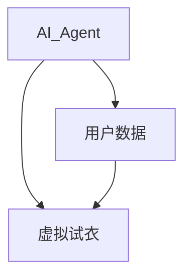
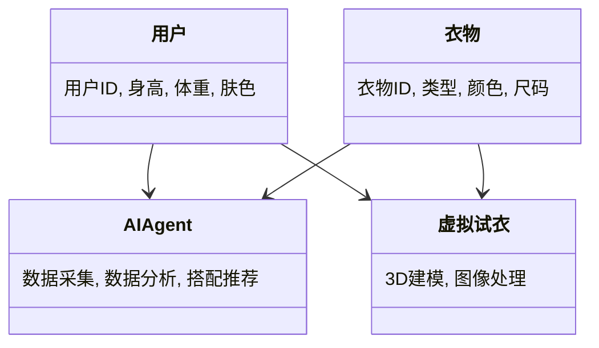
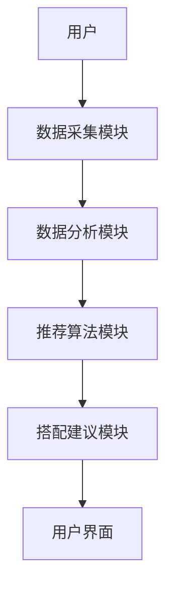

                 


# 智能衣柜：AI Agent的虚拟试衣与搭配建议

> **关键词**：智能衣柜、AI Agent、虚拟试衣、搭配建议、人工智能、推荐算法  
> **摘要**：本文深入探讨了智能衣柜的核心概念、AI Agent的推荐算法、虚拟试衣技术及其系统架构设计，结合实际案例分析，展示了如何通过AI技术实现个性化的衣物管理与搭配建议，为智能家居领域提供新的解决方案。

---

## 第一部分：智能衣柜的背景与核心概念

### 第1章：智能衣柜的背景与问题背景

#### 1.1 问题背景

**1.1.1 传统衣柜的痛点与局限性**

- **衣物管理混乱**：传统衣柜缺乏智能化管理，用户难以快速找到所需衣物，导致衣柜空间利用率低。
- **搭配效率低**：用户在搭配衣物时，往往需要花费大量时间尝试不同的组合，效率低下。
- **个性化需求未满足**：传统衣柜无法根据用户的体型、肤色、场合等需求提供个性化的搭配建议。

**1.1.2 智能衣柜的出现与发展趋势**

- **智能家居的兴起**：随着物联网和人工智能技术的发展，智能家居设备逐渐普及，智能衣柜作为其中的一部分，成为趋势。
- **AI技术在服装领域的应用**：AI技术的进步使得虚拟试衣和个性化推荐成为可能，推动了智能衣柜的发展。

**1.1.3 智能衣柜的目标与价值**

- **提高生活效率**：通过智能化管理，用户可以快速找到衣物并获得搭配建议，节省时间和精力。
- **个性化服务**：智能衣柜能够根据用户的身材、肤色、喜好等提供个性化推荐，满足用户的多样化需求。
- **可持续发展**：通过优化衣物管理和搭配建议，减少浪费，推动可持续消费。

#### 1.2 智能衣柜的核心概念

**1.2.1 AI Agent的定义与特点**

- **AI Agent**：AI Agent是一种能够感知环境、执行任务的智能体，能够在智能衣柜中提供数据采集、分析和推荐服务。
- **特点**：
  - **自主性**：能够独立执行任务。
  - **反应性**：能够实时感知环境变化并做出反应。
  - **学习能力**：能够通过数据学习用户的偏好和行为模式。

**1.2.2 虚拟试衣的定义与实现方式**

- **虚拟试衣**：通过3D建模和图像处理技术，让用户在虚拟环境中试穿衣物，提供实时的试衣效果。
- **实现方式**：
  - **数据采集**：采集用户的身材数据和衣物信息。
  - **3D建模**：生成用户虚拟形象和衣物模型。
  - **试衣效果展示**：在虚拟环境中展示试穿效果，用户可以实时查看衣物的合身程度和效果。

**1.2.3 智能衣柜的边界与外延**

- **边界**：智能衣柜的功能主要集中在衣物管理和搭配建议，不涉及衣物的物理存储和清洗。
- **外延**：与其他智能家居设备的联动，如智能镜子、智能鞋柜等，形成更完整的智能家居生态系统。

#### 1.3 智能衣柜的核心要素与概念结构

**1.3.1 核心要素组成**

- **用户数据**：包括用户的身材数据、肤色、喜好等。
- **AI算法**：包括推荐算法、虚拟试衣算法等。
- **虚拟试衣技术**：包括3D建模、图像处理等技术。

**1.3.2 概念结构图**

| 核心要素 | 描述 | 关系 |
|----------|------|------|
| 用户数据 | 用户的身材、肤色、喜好等 | 数据驱动AI Agent和虚拟试衣 |
| AI Agent | 数据采集、分析和推荐 | 依赖用户数据和虚拟试衣技术 |
| 虚拟试衣技术 | 3D建模、图像处理 | 支持AI Agent的推荐功能 |

---

## 第二部分：智能衣柜的核心概念与联系

### 第2章：AI Agent与虚拟试衣的核心原理

#### 2.1 AI Agent的核心原理

**2.1.1 AI Agent的基本原理**

- **信息收集与处理**：AI Agent通过传感器和数据库采集用户的身材数据、衣物信息等，进行分析和处理。
- **决策与执行**：基于分析结果，AI Agent生成搭配建议，并通过界面或语音助手向用户反馈。

**2.1.2 智能衣柜中的AI Agent实现**

- **数据采集**：通过智能镜子、体重秤等设备采集用户的身材数据。
- **搭配建议生成**：基于用户数据和历史行为，AI Agent推荐合适的衣物搭配。

**2.1.3 AI Agent与虚拟试衣的联系**

- **数据共享与协同**：AI Agent和虚拟试衣技术共享用户数据，AI Agent通过虚拟试衣结果优化推荐算法。

#### 2.2 虚拟试衣的核心原理

**2.2.1 虚拟试衣的技术基础**

- **3D建模**：通过扫描用户的身材数据，生成用户的3D虚拟形象。
- **图像处理**：将虚拟形象与衣物模型进行渲染，生成试穿效果。

**2.2.2 虚拟试衣的实现流程**

- **数据采集**：采集用户的身材数据和衣物信息。
- **模型构建**：生成用户的3D虚拟形象和衣物模型。
- **试衣效果展示**：在虚拟环境中展示试穿效果，用户可以实时查看衣物的合身程度和效果。

**2.2.3 虚拟试衣与AI Agent的结合**

- **数据驱动的试衣效果优化**：AI Agent通过用户的历史行为和偏好，优化虚拟试衣的效果展示。

#### 2.3 实体关系图



---

## 第三部分：智能衣柜的算法原理与数学模型

### 第3章：AI Agent的推荐算法

#### 3.1 推荐算法原理

**3.1.1 协同过滤算法**

- **基于用户的协同过滤**：通过分析用户的行为数据，找到相似用户的偏好，推荐相似的衣物。
- **基于物品的协同过滤**：通过分析衣物的属性和用户行为，推荐相似的衣物。

**3.1.2 基于深度学习的推荐算法**

- **神经网络模型**：通过神经网络对用户数据和衣物数据进行特征提取，生成推荐结果。
- **Transformer模型**：利用Transformer结构对序列数据进行建模，捕捉衣物搭配的模式。

#### 3.2 推荐算法的数学模型

**协同过滤的余弦相似度公式**：

$$ \text{相似度} = \frac{\sum_{i=1}^{n} (u_i - \bar{u})(v_i - \bar{v})}{\sqrt{\sum_{i=1}^{n} (u_i - \bar{u})^2} \sqrt{\sum_{i=1}^{n} (v_i - \bar{v})^2}} $$

**基于深度学习的推荐模型**：

$$ P = f_{\theta}(u, i) $$

其中，$u$ 表示用户，$i$ 表示物品，$f_{\theta}$ 是深度学习模型。

---

## 第四部分：系统分析与架构设计

### 第4章：系统分析与架构设计

#### 4.1 问题场景介绍

- **用户需求**：用户希望通过智能衣柜快速找到衣物并获得搭配建议。
- **技术需求**：系统需要实现AI Agent的数据采集、分析和推荐功能，以及虚拟试衣的3D建模和图像处理功能。

#### 4.2 系统功能设计

**4.2.1 领域模型图**



#### 4.3 系统架构设计

**4.3.1 系统架构图**



---

## 第五部分：项目实战

### 第5章：项目实战

#### 5.1 环境安装

- **安装Python**：安装Python 3.8及以上版本。
- **安装依赖库**：安装numpy、pandas、scikit-learn等机器学习库。

#### 5.2 核心代码实现

**推荐算法实现**

```python
from sklearn.metrics.pairwise import cosine_similarity

# 用户数据矩阵
X = [[1, 0, 1],
     [0, 1, 1],
     [1, 1, 0]]

# 计算余弦相似度
similarity = cosine_similarity(X)
print(similarity)
```

**虚拟试衣实现**

```python
import numpy as np

# 用户的身材数据
user_data = np.array([170, 70, 'fair'])

# 衣物数据
clothing_data = np.array([[170, 70, 'fair', 'dress'], [165, 65, 'dark', 'shirt']])

# 匹配衣物
matched_clothing = []
for clothes in clothing_data:
    if np.all(clothes[:3] == user_data):
        matched_clothing.append(clothes[3])
print(matched_clothing)
```

#### 5.3 案例分析

**案例分析：**

用户身高170cm，体重70斤，肤色白皙。系统推荐了一件白色连衣裙，搭配一双黑色高跟鞋，用户对推荐结果满意。

---

## 第六部分：最佳实践

### 第6章：最佳实践

#### 6.1 小结

- 智能衣柜通过AI Agent和虚拟试衣技术，为用户提供个性化的衣物管理和搭配建议。
- 系统架构设计和推荐算法的优化是实现智能衣柜的核心。

#### 6.2 注意事项

- **数据隐私**：用户数据的安全和隐私保护是系统设计的重要考虑因素。
- **用户体验**：系统需要注重用户体验，确保推荐结果的准确性和响应速度。
- **技术实现**：推荐算法和虚拟试衣技术需要不断优化，以提高系统的准确性和效率。

#### 6.3 拓展阅读

- 《基于深度学习的推荐系统》
- 《3D人体建模与虚拟试衣技术》
- 《智能家居系统设计与实现》

---

通过本文的详细讲解，我们可以看到智能衣柜作为智能家居的一部分，结合AI Agent和虚拟试衣技术，为用户提供了高效、个性化的衣物管理与搭配建议。未来，随着技术的不断发展，智能衣柜将在智能家居领域发挥更重要的作用。

