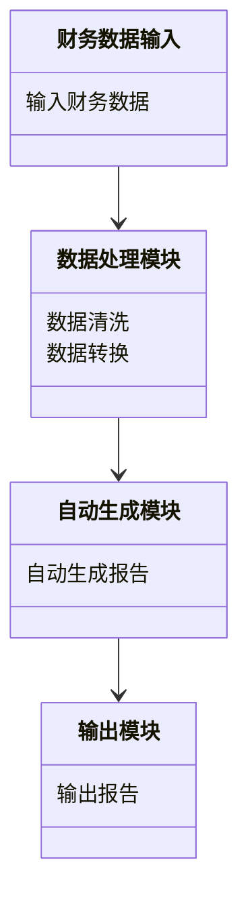
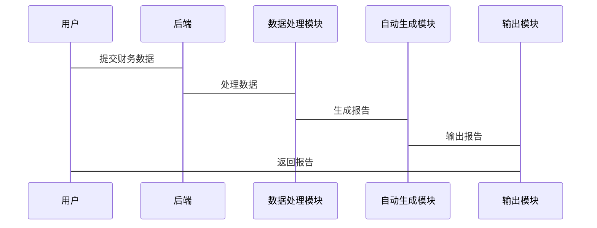

                 


# 智能财务报告自动生成系统

> 关键词：智能财务报告，自动生成系统，自然语言处理，机器学习，财务数据分析

> 摘要：本文详细探讨了智能财务报告自动生成系统的构建与应用，涵盖背景、核心概念、算法原理、系统架构及项目实战，旨在为技术与业务人员提供系统化的知识和实践指导。

---

## 第一部分：背景介绍

### 第1章：问题背景与描述

#### 1.1 问题背景

随着企业规模的扩大，传统的财务报告生成方式依赖人工操作，效率低下且易出错。企业需要快速、准确的财务报告以支持决策，而手动处理不仅耗时，还容易引入人为错误。AI技术的引入为解决这一问题提供了可能。

#### 1.2 问题描述

- **流程复杂**：财务报告生成涉及数据收集、处理、分析和呈现多个步骤，手动操作效率低。
- **数据一致性问题**：不同部门的数据格式和标准不一，导致整合困难。
- **准确性问题**：人工处理容易出错，影响报告的准确性。

#### 1.3 问题解决

通过AI技术，特别是自然语言处理和机器学习，可以实现财务数据的自动分析和报告生成，提高效率和准确性。

#### 1.4 系统边界与外延

- **边界**：系统专注于从数据输入到报告生成的自动化处理，不涉及数据源的采集。
- **外延**：生成的报告格式多样，支持多种输出格式，如PDF和Excel。

---

## 第二部分：核心概念与联系

### 第2章：核心概念原理

#### 2.1 自然语言处理（NLP）

- **输入**：财务数据与模板
- **输出**：自然语言描述
- **核心技术**：词嵌入、序列模型
- **应用场景**：将结构化数据转化为自然语言文本。

#### 2.2 机器学习（ML）

- **输入**：历史财务数据
- **输出**：数据预测与分类
- **核心技术**：监督学习、深度学习
- **应用场景**：识别财务趋势和异常。

### 第3章：核心概念对比与ER实体关系图

#### 3.1 核心概念属性特征对比表

| 概念 | 输入 | 输出 | 核心技术 | 应用场景 |
|------|------|------|----------|----------|
| NLP  | 文本数据 | 自然语言描述 | 词嵌入、序列模型 | 财务数据转化为自然语言 |
| ML   | 结构化数据 | 数据预测与分类 | 监督学习、深度学习 | 财务趋势预测 |

#### 3.2 ER实体关系图

```mermaid
erDiagram
    class 财务数据 {
        数据ID
        财务指标
        时间戳
    }
    class 自然语言报告 {
        报告ID
        内容
        生成时间
    }
    class 模型 {
        模型ID
        类型
        参数
    }
    财务数据 --> 模型 : 输入
    模型 --> 自然语言报告 : 输出
```

---

## 第三部分：算法原理讲解

### 第4章：NLP模型原理

#### 4.1 文本预处理

- **分词**：将财务数据分解为词语。
- **去停用词**：移除无意义词汇。
- **词嵌入**：使用Word2Vec生成词向量。

#### 4.2 模型训练

```python
from tensorflow.keras import layers
import numpy as np

# 示例数据
sentences = ["收入 10000 元", "支出 5000 元"]

# 模型构建
model = layers.Sequential()
model.add(layers.Embedding(input_dim=1000, output_dim=50))
model.add(layers.LSTM(64))
model.add(layers.Dense(1, activation='sigmoid'))
model.compile(optimizer='adam', loss='binary_crossentropy')
```

#### 4.3 文本生成

- **序列模型**：利用LSTM生成连续的文本段落。
- **处理逻辑**：将结构化数据转化为自然语言描述。

### 第5章：机器学习模型原理

#### 5.1 数据预处理

- **归一化**：将数据标准化。
- **特征选择**：提取关键财务指标。

#### 5.2 模型训练

```python
import numpy as np
from sklearn.linear_model import LogisticRegression

# 示例数据
X = np.array([[100, 200], [300, 400]])
y = np.array([0, 1])

model = LogisticRegression()
model.fit(X, y)
```

#### 5.3 结果预测

- **预测函数**：分类财务数据。
- **处理逻辑**：识别异常交易。

---

## 第四部分：系统分析与架构设计方案

### 第6章：系统架构设计

#### 6.1 项目介绍

- **目标**：自动生成财务报告。
- **范围**：支持多格式输出。

#### 6.2 功能设计



#### 6.3 系统架构设计


#### 6.4 接口设计

- **输入接口**：接收结构化数据。
- **输出接口**：生成报告文件。

#### 6.5 交互设计



---

## 第五部分：项目实战

### 第7章：项目实战

#### 7.1 环境安装

```bash
pip install tensorflow numpy scikit-learn
```

#### 7.2 核心代码实现

```python
import numpy as np
from tensorflow.keras.models import Sequential
from tensorflow.keras.layers import LSTM, Dense, Embedding

# 示例代码
model = Sequential()
model.add(Embedding(input_dim=1000, output_dim=50, input_length=10))
model.add(LSTM(64))
model.add(Dense(1, activation='sigmoid'))
model.compile(optimizer='adam', loss='binary_crossentropy')
model.fit(x_train, y_train, epochs=10, batch_size=32)
```

#### 7.3 代码解读与分析

- **预处理**：输入数据经过清洗和转换。
- **模型训练**：使用LSTM进行文本生成。
- **结果生成**：输出自然语言报告。

#### 7.4 实际案例分析

- **案例1**：月度财务报告生成。
- **案例2**：季度财务分析报告生成。

#### 7.5 项目小结

- **优势**：提高效率和准确性。
- **挑战**：数据质量和模型训练时间。

---

## 第六部分：最佳实践与总结

### 第8章：最佳实践

#### 8.1 注意事项

- 数据质量至关重要。
- 模型需要持续优化。

#### 8.2 小结

智能财务报告自动生成系统结合了NLP和机器学习，显著提升了财务处理效率。

#### 8.3 拓展阅读

建议阅读关于深度学习和NLP的书籍，以及研究最新的财务数据分析技术。

---

通过以上结构，本文详细介绍了智能财务报告自动生成系统的各个方面，从理论到实践，为读者提供了全面的指导。

