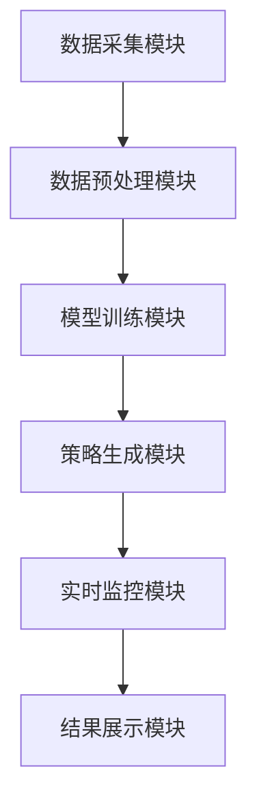

                 


# 《智能资产负债管理策略生成器》

---

## 关键词：
智能资产负债管理，策略生成器，机器学习，区块链，风险管理，智能合约

---

## 摘要：
本文系统性地探讨了智能资产负债管理策略生成器的核心原理、算法实现、系统架构及实际应用。通过结合大数据、人工智能和区块链等前沿技术，本文提出了一种创新的智能资产负债管理方法，旨在为企业和个人提供高效、精准的财务决策支持。文章从背景、核心概念、算法原理、系统架构、项目实战到高级应用，层层深入，为读者提供了从理论到实践的全面指导。

---

# 第一部分: 智能资产负债管理策略生成器的背景与基础

## 第1章: 智能资产负债管理概述

### 1.1 传统与智能资产负债管理的对比
#### 1.1.1 传统资产负债管理的定义与局限性
- 资产负债管理的定义
- 传统管理方法的核心特点
- 传统管理中的常见问题（如信息滞后、决策低效）

#### 1.1.2 智能资产负债管理的定义与优势
- 数据驱动的智能管理
- AI与大数据技术的应用
- 实时监控与动态调整

#### 1.1.3 智能资产负债管理的核心目标
- 资产负债匹配优化
- 风险最小化与收益最大化
- 系统化、自动化决策

---

## 第2章: 数据驱动的资产负债管理

### 2.1 数据在资产负债管理中的作用
#### 2.1.1 数据的来源与类型
- 内部数据（财务报表、交易记录）
- 外部数据（市场数据、宏观经济指标）

#### 2.1.2 数据的预处理与特征提取
- 数据清洗与标准化
- 特征选择与降维技术

#### 2.1.3 数据驱动的决策优势
- 精准预测
- 实时反馈
- 大数据分析能力

### 2.2 数据驱动与传统管理的对比
#### 2.2.1 数据驱动的优势
- 高效性
- 精准性
- 可扩展性

#### 2.2.2 传统管理的局限性
- 信息滞后
- 决策延迟
- 人工误差

---

# 第二部分: 智能资产负债管理的核心概念与技术原理

## 第3章: 资产负债管理的核心概念

### 3.1 资产负债的核心要素
#### 3.1.1 资产的分类与特征
- 流动资产、非流动资产
- 资产的流动性与风险性

#### 3.1.2 负债的分类与特征
- 短期负债与长期负债
- 负债的偿付能力与风险

#### 3.1.3 资产负债的平衡关系
- 资产 = 负债 + 所有者权益
- 资产负债表的结构与意义

---

## 第4章: 智能资产负债管理的技术原理

### 4.1 机器学习在资产负债管理中的应用
#### 4.1.1 线性回归模型
- 回归分析的基本原理
- 线性回归在资产定价中的应用
- 案例分析：基于线性回归的资产收益率预测

#### 4.1.2 支持向量机（SVM）
- SVM的基本原理
- 在信用评估与风险分类中的应用
- 案例分析：SVM在负债风险评估中的应用

#### 4.1.3 随机森林与梯度提升树
- 随机森林与梯度提升树的原理
- 在资产组合优化中的应用
- 案例分析：资产组合的风险评估与优化

---

## 第5章: 深度学习在资产负债管理中的应用

### 5.1 神经网络基础
#### 5.1.1 神经网络的结构与训练原理
- 输入层、隐藏层、输出层
- 损失函数与优化算法
- 案例分析：神经网络在市场趋势预测中的应用

### 5.2 长短期记忆网络（LSTM）
#### 5.2.1 LSTM的基本原理
- 门控机制（遗忘门、输入门、输出门）
- 长期记忆的保持与更新

#### 5.2.2 LSTM在时间序列分析中的应用
- 股票价格预测
- 负债波动预测
- 案例分析：LSTM在资产负债管理中的应用

### 5.3 图神经网络（GNN）
#### 5.3.1 GNN的基本原理
- 图结构数据的表示
- GNN的传播规则
- 聚合函数与聚合策略

#### 5.3.2 GNN在金融网络中的应用
- 金融网络的构建与分析
- 资产负债网络的风险传播与防控
- 案例分析：GNN在信用风险评估中的应用

---

# 第三部分: 智能资产负债管理的系统架构与实现

## 第6章: 系统架构设计

### 6.1 系统功能模块设计
#### 6.1.1 数据采集模块
- 数据源接入（数据库、API接口）
- 数据清洗与预处理

#### 6.1.2 模型训练模块
- 算法选择与参数调优
- 模型训练与评估

#### 6.1.3 策略生成模块
- 策略生成规则
- 策略优化与调整

#### 6.1.4 实时监控模块
- 实时数据监控
- 策略执行与反馈

### 6.2 系统架构图


---

## 第7章: 系统实现与代码示例

### 7.1 环境搭建
#### 7.1.1 Python环境配置
- 安装Python 3.x
- 安装必要的库（numpy、pandas、scikit-learn、keras等）

#### 7.1.2 数据集准备
- 数据获取与存储
- 数据清洗与预处理

### 7.2 核心代码实现

#### 7.2.1 线性回归模型实现
```python
import numpy as np
from sklearn.linear_model import LinearRegression

# 数据准备
X = np.array([1, 2, 3, 4, 5]).reshape(-1, 1)
y = np.array([2, 4, 5, 4, 6])

# 模型训练
model = LinearRegression()
model.fit(X, y)

# 预测
print(model.predict([[6]]))
```

#### 7.2.2 LSTM模型实现
```python
import numpy as np
from tensorflow.keras import layers

# 数据准备
X_train = np.random.randn(100, 24, 1)
y_train = np.random.randn(100, 1)

# 模型构建
model = layers.Sequential()
model.add(layers.LSTM(64, input_shape=(24, 1)))
model.add(layers.Dense(1))
model.compile(optimizer='adam', loss='mse')

# 训练
model.fit(X_train, y_train, epochs=10, batch_size=32)
```

---

# 第四部分: 智能资产负债管理的高级应用与展望

## 第8章: 强化学习与智能合约

### 8.1 强化学习在资产负债管理中的应用
#### 8.1.1 强化学习的基本原理
- 状态、动作、奖励
- Q-learning算法
- 策略梯度方法

#### 8.1.2 强化学习在智能合约中的应用
- 智能合约的定义与特点
- 强化学习驱动的智能合约优化

### 8.2 区块链技术在智能资产负债管理中的应用
#### 8.2.1 区块链的基本原理
- 分布式账本
- 加密算法
- 智能合约

#### 8.2.2 区块链在资产负债管理中的应用
- 资产记录与转移
- 负债的智能合约管理
- 透明化与去信任化

---

## 第9章: 未来展望与最佳实践

### 9.1 智能资产负债管理的未来趋势
- 技术融合：AI、大数据与区块链的结合
- 应用场景扩展：从金融到企业
- 算法优化：更高效、更智能的决策模型

### 9.2 最佳实践与注意事项
- 数据质量的重要性
- 模型的可解释性
- 系统的安全性与稳定性

---

## 结语：
智能资产负债管理策略生成器作为一项前沿技术，正在 revolutionizing 传统的财务管理模式。通过结合大数据、人工智能与区块链等技术，我们可以实现更高效、更精准的财务决策。未来，随着技术的不断进步，智能资产负债管理将在更多领域发挥重要作用。

--- 

以上是《智能资产负债管理策略生成器》的完整目录大纲，涵盖了从基础到高级的各个方面，结合理论与实践，为读者提供了全面的知识体系。

