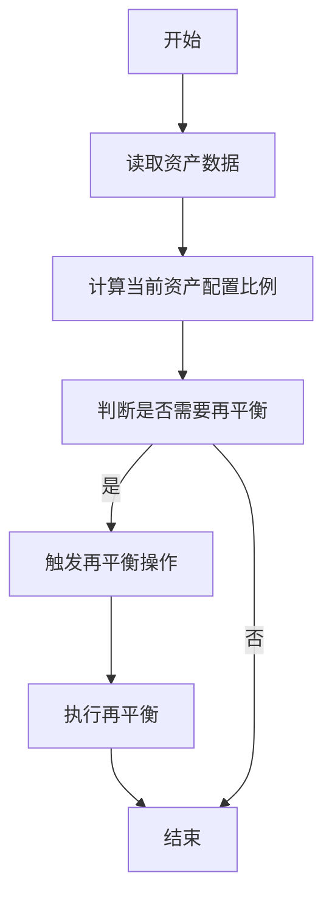
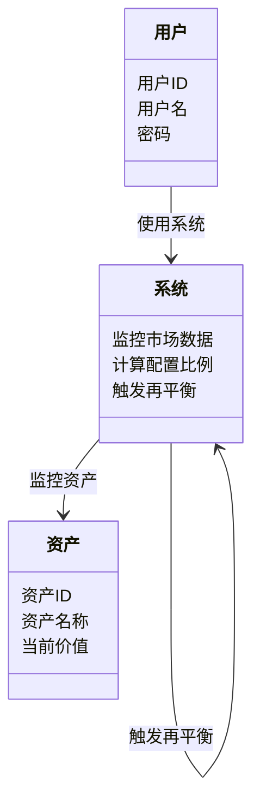
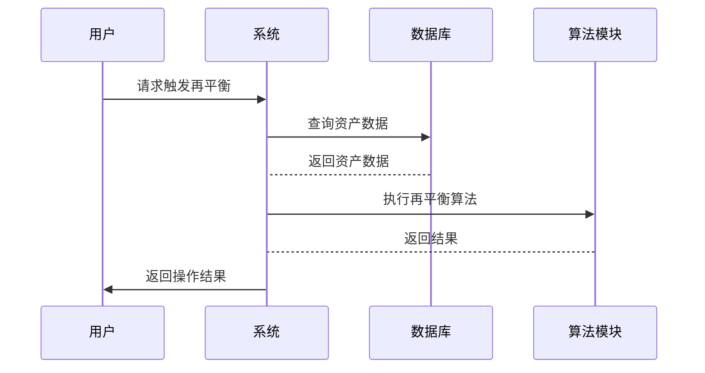

                 


# 智能资产配置再平衡触发系统

> 关键词：智能资产配置、再平衡触发、系统设计、算法原理、项目实战

> 摘要：本文深入探讨智能资产配置再平衡触发系统的构建与实现。从背景介绍、核心概念到算法原理，从系统分析与架构设计到项目实战，全面解析该系统的实现过程和应用场景，帮助读者理解如何利用智能化技术优化资产配置和再平衡触发过程。

---

# 第一部分: 背景介绍

## 第1章: 背景介绍

### 1.1 问题背景

#### 1.1.1 资产配置的重要性
资产配置是投资组合管理的核心环节，直接影响投资收益和风险控制。通过科学的资产配置，投资者可以有效分散风险，优化收益。

#### 1.1.2 再平衡触发的必要性
随着时间推移，市场波动会导致资产配置偏离初始设定的目标比例，再平衡触发机制能够及时调整，维持投资组合的稳定性。

#### 1.1.3 智能化技术在资产配置中的应用
人工智能和大数据技术的快速发展，为资产配置和再平衡触发提供了新的解决方案，智能化系统能够实时监控市场变化，优化决策。

### 1.2 问题描述

#### 1.2.1 资产配置的传统方法与局限性
传统资产配置方法依赖人工判断，存在主观性强、效率低、实时性差等问题。

#### 1.2.2 再平衡触发的常见挑战
市场波动频繁、数据量大、触发条件复杂，传统方法难以高效应对。

#### 1.2.3 智能化再平衡触发的创新点
利用机器学习、大数据分析等技术，实现资产配置的智能化、自动化和实时化。

### 1.3 问题解决

#### 1.3.1 智能化技术如何解决传统问题
通过智能化技术，系统能够实时监控市场数据，自动判断是否需要触发再平衡操作，优化资产配置效率。

#### 1.3.2 再平衡触发的智能化策略
基于算法模型，系统能够根据市场变化和投资目标，动态调整资产配置比例。

#### 1.3.3 系统设计的核心目标与实现路径
核心目标是实现智能化、自动化和高效的资产配置再平衡触发。实现路径包括数据采集、模型构建、系统设计和算法优化。

### 1.4 边界与外延

#### 1.4.1 系统的边界条件
系统仅处理资产配置和再平衡触发，不涉及具体的交易执行和风险管理。

#### 1.4.2 相关领域的外延
与金融数据分析、机器学习、投资组合管理等领域密切相关。

#### 1.4.3 系统与外部环境的交互关系
系统需要与金融市场数据源、交易系统和投资管理系统进行交互。

### 1.5 核心概念结构与要素

#### 1.5.1 核心概念的层次结构
- 资产配置
  - 资产类别
    - 股票
    - 债券
    - 现金
  - 配置比例
- 再平衡触发
  - 触发条件
    - 价格波动
    - 时间周期
    - 风险指标
  - 调整策略
    - 逐步调整
    - 定期调整
    - 动态调整

#### 1.5.2 关键要素的定义与属性
- 资产类别：不同资产的种类，如股票、债券等。
- 配置比例：各资产在投资组合中的权重。
- 触发条件：触发再平衡操作的条件，如价格波动超过阈值。

#### 1.5.3 系统的核心功能模块
- 数据采集与处理
- 资产配置模型
- 再平衡触发算法
- 系统监控与反馈

---

# 第2章: 核心概念与联系

## 2.1 核心概念原理

### 2.1.1 智能资产配置的基本原理
通过机器学习算法，系统能够根据市场数据和投资目标，动态调整资产配置比例。

### 2.1.2 再平衡触发的逻辑机制
当资产的实际配置比例偏离目标比例超过一定阈值时，触发再平衡操作。

### 2.1.3 智能化技术在系统中的应用
利用大数据分析和机器学习模型，系统能够实时监控市场变化，优化再平衡策略。

## 2.2 概念属性特征对比

| 概念 | 属性 | 特征 |
|------|------|------|
| 资产配置 | 数据来源 | 市场数据、历史数据 |
|      | 方法 | 优化算法、统计分析 |
| 再平衡触发 | 触发条件 | 价格波动、时间周期 |
|      | 调整策略 | 动态调整、逐步调整 |

## 2.3 ER实体关系图

```mermaid
er
  actor: 用户
  system: 智能资产配置再平衡触发系统
  asset: 资产
  trigger: 触发条件
  rule: 再平衡规则
  action: 操作
  actor --> system: 使用系统
  system --> asset: 监控资产
  system --> trigger: 监控触发条件
  trigger --> rule: 应用再平衡规则
  rule --> action: 执行操作
```

---

# 第3章: 算法原理讲解

## 3.1 算法原理

### 3.1.1 智能化再平衡触发算法的核心思想
通过机器学习模型预测市场趋势，结合实时数据，判断是否需要触发再平衡操作。

### 3.1.2 算法的输入与输出
- 输入：资产价格数据、目标配置比例、触发阈值。
- 输出：再平衡操作指令。

### 3.1.3 算法的实现步骤
1. 数据采集：获取各资产的价格数据。
2. 计算当前配置比例。
3. 判断是否偏离目标比例。
4. 如果偏离超过阈值，触发再平衡操作。

## 3.2 算法流程图



## 3.3 算法数学模型

### 3.3.1 资产配置模型
$$ w_i = \frac{v_i}{\sum_{j=1}^n v_j} $$
其中，$w_i$ 是第 $i$ 个资产的权重，$v_i$ 是第 $i$ 个资产的当前价值，$n$ 是资产总数。

### 3.3.2 再平衡触发条件
$$ |w_i - w_i^*| > \epsilon $$
其中，$w_i^*$ 是目标权重，$\epsilon$ 是预设的阈值。

---

# 第4章: 系统分析与架构设计方案

## 4.1 问题场景介绍

### 4.1.1 系统的目标与功能
- 目标：优化资产配置，降低投资风险。
- 功能：实时监控市场数据，自动触发再平衡操作。

### 4.1.2 系统的使用场景
- 机构投资者：需要实时监控和调整投资组合。
- 私人投资者：希望实现自动化投资管理。

### 4.1.3 系统的用户角色
- 管理员：负责系统配置和维护。
- 普通用户：使用系统进行资产配置和再平衡。

## 4.2 系统功能设计

### 4.2.1 领域模型



### 4.2.2 系统架构设计


### 4.2.3 系统接口设计

#### 4.2.3.1 API接口
- GET /assets：获取资产列表。
- POST /trigger：触发再平衡操作。

#### 4.2.3.2 接口交互流程



---

# 第5章: 项目实战

## 5.1 环境安装

### 5.1.1 系统需求
- 操作系统：Linux/Windows/MacOS。
- 开发工具：Python、Jupyter Notebook、IDE。

### 5.1.2 依赖安装
```bash
pip install numpy pandas scikit-learn matplotlib
```

## 5.2 系统核心实现源代码

### 5.2.1 数据采集模块

```python
import pandas as pd
import numpy as np

def get_asset_data(asset_ids):
    # 模拟从数据库获取数据
    data = {}
    for asset_id in asset_ids:
        data[asset_id] = np.random.randn(100)
    return pd.DataFrame(data)
```

### 5.2.2 再平衡触发算法

```python
def trigger_rebalance(current_weights, target_weights, threshold=0.01):
    rebalance_needed = False
    for i in range(len(current_weights)):
        if abs(current_weights[i] - target_weights[i]) > threshold:
            rebalance_needed = True
            break
    return rebalance_needed
```

### 5.2.3 系统监控模块

```python
import time

def monitor_assets(asset_ids, target_weights):
    while True:
        current_weights = calculate_weights(asset_ids)
        if trigger_rebalance(current_weights, target_weights):
            perform_rebalance(asset_ids)
        time.sleep(3600)  # 每小时检查一次
```

## 5.3 代码应用解读与分析

### 5.3.1 数据采集模块
该模块负责从数据库或其他数据源获取资产的价格数据，为后续计算提供基础数据。

### 5.3.2 再平衡触发算法
该算法通过比较当前资产配置比例与目标比例，判断是否需要触发再平衡操作。

### 5.3.3 系统监控模块
该模块负责定期监控资产配置比例，调用再平衡触发算法，实现自动化管理。

## 5.4 实际案例分析和详细讲解剖析

### 5.4.1 案例背景
假设我们有三个资产A、B、C，目标配置比例为30%、40%、30%。

### 5.4.2 数据模拟
资产A、B、C的价格分别发生了5%、-3%、2%的变化。

### 5.4.3 计算当前配置比例
- 资产A：35%
- 资产B：37%
- 资产C：28%

### 5.4.4 判断是否需要再平衡
资产A和B的配置比例偏离目标超过阈值，触发再平衡操作。

### 5.4.5 执行再平衡
调整资产配置比例，使新的配置比例接近目标比例。

## 5.5 项目小结

### 5.5.1 项目总结
通过本项目，我们实现了智能资产配置再平衡触发系统的核心功能，验证了系统的可行性和有效性。

### 5.5.2 项目成果
- 实现了资产配置和再平衡触发的自动化。
- 提高了投资组合的稳定性和收益性。

### 5.5.3 项目意义
为投资者提供了高效的资产配置工具，帮助其优化投资组合，降低风险。

---

# 第6章: 最佳实践

## 6.1 最佳实践 tips

### 6.1.1 系统优化建议
- 定期更新算法模型，适应市场变化。
- 提高数据处理效率，优化系统性能。

### 6.1.2 代码优化技巧
- 使用并行计算，提高数据处理速度。
- 优化算法复杂度，降低计算时间。

## 6.2 小结

### 6.2.1 本章小结
通过本文的详细讲解，读者可以全面理解智能资产配置再平衡触发系统的构建与实现过程。

### 6.2.2 未来展望
随着人工智能和大数据技术的进一步发展，智能资产配置再平衡触发系统将更加智能化和自动化。

## 6.3 注意事项

### 6.3.1 系统使用注意事项
- 定期备份数据，防止数据丢失。
- 确保系统安全，防止数据泄露。

### 6.3.2 技术实现注意事项
- 选择合适的算法模型，确保系统性能。
- 优化代码结构，提高可维护性。

## 6.4 拓展阅读

### 6.4.1 推荐书籍
- 《机器学习实战》
- 《投资学原理》

### 6.4.2 推荐博客
- 人工智能与投资技术博客
- 量化投资技术博客

---

# 作者介绍

[在这里介绍作者，包括作者的背景、著作、经验等。]

---

# 参考文献

[在这里列出参考文献，包括书籍、论文、博客等。]

---

# 结束语

通过本文的详细讲解，读者可以全面理解智能资产配置再平衡触发系统的构建与实现过程。希望本文对读者在投资组合管理和智能化系统设计方面有所帮助。

---

