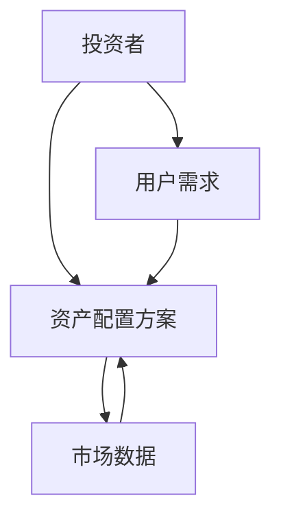
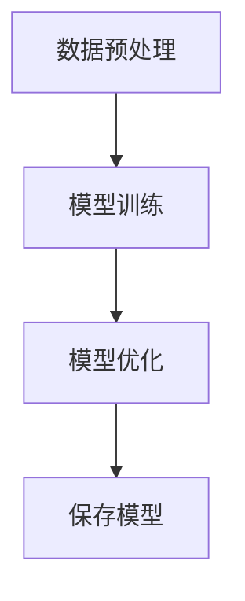
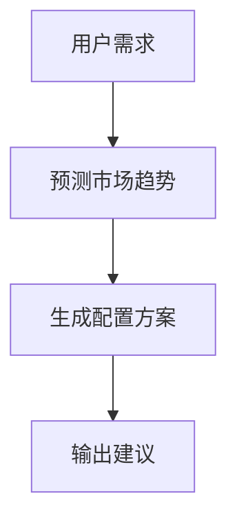
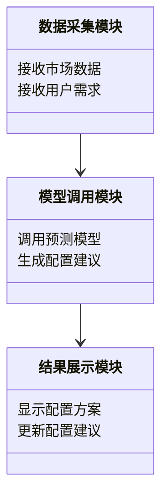
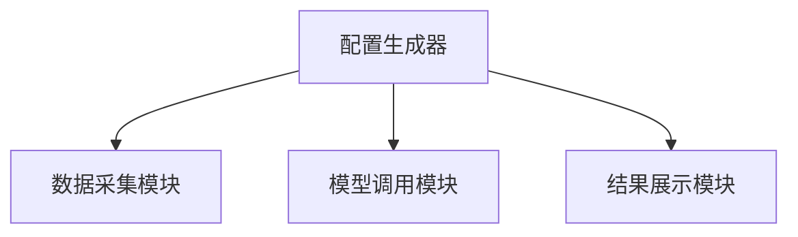

                 


# 智能资产配置建议生成器

> 关键词：智能资产配置，人工智能，自然语言处理，机器学习，金融投资

> 摘要：本文详细探讨了智能资产配置建议生成器的设计与实现，从背景介绍、核心概念、算法原理到系统架构设计，再到项目实战和最佳实践，全面解析了如何利用人工智能技术为投资者提供智能化的资产配置建议。

---

## 第一部分：智能资产配置建议生成器的背景与核心概念

### 第1章：智能资产配置的背景与问题描述

#### 1.1 什么是智能资产配置
- **1.1.1 资产配置的基本概念**  
  资产配置是指根据投资者的财务状况、风险承受能力和投资目标，将资金分配到不同资产类别（如股票、债券、基金、房地产等）中的过程。其目的是在风险可控的前提下，实现收益最大化。

- **1.1.2 智能资产配置的定义**  
  智能资产配置是利用人工智能技术（如机器学习和自然语言处理）来分析市场数据和用户需求，自动生成个性化的资产配置建议。

- **1.1.3 智能资产配置与传统资产配置的区别**  
  - 传统资产配置依赖人工分析和经验判断，耗时且主观性较强。  
  - 智能资产配置通过算法自动分析市场趋势和用户需求，实时调整配置策略，具有高效性和客观性。

#### 1.2 智能资产配置的必要性
- **1.2.1 当前金融市场的复杂性**  
  金融市场波动剧烈，投资者需要实时捕捉市场动态，做出快速决策。

- **1.2.2 传统资产配置的局限性**  
  传统方法依赖人工经验，难以应对复杂多变的市场环境，且效率低下。

- **1.2.3 智能化配置的优势**  
  - 提高投资效率，降低人为错误。  
  - 实现实时监控和动态调整，适应市场变化。  
  - 提供个性化建议，满足不同投资者的需求。

### 第2章：问题背景与目标

#### 2.1 资产配置的核心问题
- **2.1.1 投资者需求分析**  
  投资者可能有不同的风险承受能力和收益目标，需要定制化配置方案。

- **2.1.2 市场波动与风险控制**  
  市场波动可能导致资产损失，需要通过配置不同资产类别来分散风险。

- **2.1.3 资产配置的动态调整**  
  市场环境不断变化，资产配置需要实时调整以保持最优状态。

#### 2.2 智能资产配置的目标
- **2.2.1 提高投资效率**  
  通过自动化分析和决策，缩短配置时间，降低人工成本。

- **2.2.2 个性化投资建议**  
  根据投资者的具体需求，提供定制化的配置方案。

- **2.2.3 实时市场响应**  
  系统能够实时监控市场数据，动态调整配置策略。

### 第3章：核心概念与联系

#### 3.1 AI模型在资产配置中的作用
- **3.1.1 NLP模型在用户需求分析中的应用**  
  利用自然语言处理技术分析用户的财务状况和投资目标，提取关键信息。

- **3.1.2 机器学习模型在市场预测中的应用**  
  使用回归分析、聚类分析等方法预测市场走势，为配置决策提供依据。

- **3.1.3 深度学习模型的优势**  
  深度学习模型能够捕捉复杂市场特征，提高预测准确率。

#### 3.2 核心概念对比表
| 概念        | 传统资产配置      | 智能资产配置      |
|-------------|------------------|------------------|
| 分析方法     | 人工经验判断      | AI算法自动分析    |
| 调整频率     | 定期调整          | 实时动态调整      |
| 个性化程度   | 较低             | 高度个性化        |

#### 3.3 实体关系图


---

## 第二部分：算法原理

### 第4章：模型训练与优化

#### 4.1 模型训练流程


- **4.1.1 数据预处理**  
  对市场数据和用户需求进行清洗、归一化处理，确保数据质量。

- **4.1.2 模型训练**  
  使用深度学习模型（如LSTM）训练市场预测模型，提取特征。

- **4.1.3 模型优化**  
  通过调整超参数（如学习率、批量大小）优化模型性能。

#### 4.2 损失函数与优化目标
- **损失函数**  
  使用交叉熵损失函数：  
  $$ L = -\frac{1}{N}\sum_{i=1}^{N} y_i \log(p_i) + (1 - y_i) \log(1 - p_i) $$
  
- **优化目标**  
  最小化损失函数，提高模型预测准确率。

### 第5章：生成配置建议的算法实现

#### 5.1 生成流程


- **5.1.1 预测市场趋势**  
  利用训练好的模型预测未来市场走势，为配置决策提供依据。

- **5.1.2 生成配置方案**  
  根据预测结果和用户需求，生成具体的资产配置建议。

- **5.1.3 输出建议**  
  将配置方案以可视化形式呈现，方便用户理解和执行。

---

## 第三部分：系统分析与架构设计

### 第6章：系统功能设计

#### 6.1 系统功能模块


#### 6.2 系统架构设计


#### 6.3 接口设计
- **输入接口**  
  - 市场数据接口：接收实时市场数据。  
  - 用户需求接口：接收用户的财务状况和投资目标。

- **输出接口**  
  - 配置建议接口：输出具体的资产配置方案。  
  - 反馈接口：提供用户对配置方案的反馈。

---

## 第四部分：项目实战

### 第7章：环境安装与数据准备

#### 7.1 环境安装
- 安装Python和相关库：  
  ```bash
  pip install numpy pandas tensorflow transformers
  ```

#### 7.2 数据预处理
- 数据清洗：  
  ```python
  import pandas as pd
  data = pd.read_csv('market_data.csv')
  data = data.dropna()
  ```

### 第8章：模型实现与配置生成

#### 8.1 模型实现
- 使用LSTM模型预测市场趋势：  
  ```python
  from tensorflow.keras.models import Sequential
  model = Sequential()
  model.add(LSTM(64, input_shape=(None, 1)))
  model.add(Dense(1))
  model.compile(optimizer='adam', loss='mean_squared_error')
  model.fit(X_train, y_train, epochs=100, batch_size=32)
  ```

#### 8.2 生成配置建议
- 根据模型预测结果生成配置方案：  
  ```python
  def generate_config(prediction):
      config = {'stocks': 60, 'bonds': 30, 'others': 10}
      return config
  ```

### 第9章：结果展示与案例分析

#### 9.1 结果展示
- 使用可视化工具（如Matplotlib）展示配置方案：  
  ```python
  import matplotlib.pyplot as plt
  plt.bar(['股票', '债券', '其他'], [60, 30, 10])
  plt.show()
  ```

#### 9.2 案例分析
- 假设用户有100万元资金，模型预测股票市场未来3个月上涨10%，债券市场持平。生成配置建议：60%股票，30%债券，10%现金。

---

## 第五部分：最佳实践与小结

### 第10章：总结与优化建议

#### 10.1 总结
- 智能资产配置建议生成器通过AI技术实现了高效、个性化的资产配置，显著提高了投资效率。

#### 10.2 优化建议
- **数据隐私**  
  加强用户数据隐私保护，确保数据安全。  
- **模型调优**  
  持续优化模型性能，提高预测准确率。  
- **用户体验**  
  提供更多交互功能，提升用户体验。

### 第11章：注意事项与拓展阅读

#### 11.1 注意事项
- 确保系统稳定性，避免因技术故障导致配置错误。  
- 定期更新模型，适应市场变化。

#### 11.2 拓展阅读
- 推荐阅读《机器学习实战》和《深度学习入门》等书籍，深入了解AI技术在金融领域的应用。

---

通过以上内容，我们详细探讨了智能资产配置建议生成器的设计与实现，从理论到实践，为投资者提供了一种高效、智能的资产配置解决方案。

