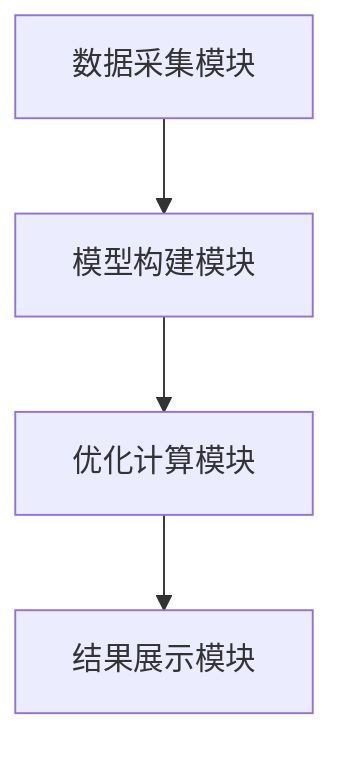

                 


# 智能资产配置策略动态优化器

> 关键词：智能资产配置，动态优化，强化学习，数学模型，系统架构，算法实现

> 摘要：本文深入探讨智能资产配置策略动态优化器的核心概念、算法原理和系统架构，结合实际案例分析，详细讲解其在金融投资中的应用价值。通过强化学习和数学建模，优化投资组合，实现收益与风险的最佳平衡。

---

# 第1章: 智能资产配置策略动态优化器概述

## 1.1 智能资产配置的背景与意义

### 1.1.1 传统资产配置的局限性
传统的资产配置方法依赖于固定的投资比例和定期调整策略，难以应对市场波动和投资者风险偏好的变化。这种方法在市场环境复杂多变时显得力不从心，无法实现资产收益的最大化和风险的最小化。

### 1.1.2 智能化配置的必要性
随着人工智能和大数据技术的发展，智能化资产配置成为可能。通过动态优化算法，智能资产配置策略动态优化器能够实时调整投资组合，捕捉市场机会，规避潜在风险。

### 1.1.3 动态优化的核心价值
动态优化器通过实时监控市场变化和投资者需求，自动调整资产配置策略，帮助投资者在不同市场环境下实现收益与风险的最佳平衡。

## 1.2 智能资产配置的基本概念

### 1.2.1 资产配置的定义
资产配置是指将资金分配到不同资产类别（如股票、债券、房地产等）中，以实现投资目标的过程。

### 1.2.2 智能化资产配置的特点
智能化资产配置通过算法和大数据分析，动态调整资产权重，优化投资组合的表现。

### 1.2.3 动态优化的机制
动态优化器通过实时数据分析和算法计算，自动调整资产配置策略，确保投资组合在不同市场环境下的最优表现。

## 1.3 动态优化器的功能与作用

### 1.3.1 动态优化的核心功能
- 实时监控市场数据
- 动态调整资产权重
- 自动优化投资组合

### 1.3.2 动态优化器的实现目标
- 最大化投资收益
- 最小化投资风险
- 提高资产配置效率

### 1.3.3 动态优化器的适用场景
- 机构投资者
- 高净值个人
- 私募基金

## 1.4 本章小结
智能资产配置策略动态优化器通过动态调整资产配置策略，帮助投资者在复杂多变的市场环境中实现收益与风险的最佳平衡。

---

# 第2章: 资产配置的数学模型与优化目标

## 2.1 资产配置的数学模型

### 2.1.1 均值-方差模型
均值-方差模型是经典的资产配置模型，用于优化投资组合的收益与风险。

$$ \text{收益} = \sum_{i=1}^n w_i r_i $$
$$ \text{风险} = \sqrt{\sum_{i=1}^n \sum_{j=1}^n w_i w_j r_i r_j \sigma_{ij}} $$

### 2.1.2 Markowitz优化模型
Markowitz模型通过优化投资组合的收益-风险比，实现资产配置的最优解。

### 2.1.3 动态优化的数学表达
动态优化器通过不断调整权重，优化投资组合的收益-风险比。

$$ \text{权重调整} = \argmin_w \sum_{i=1}^n \sum_{j=1}^n w_i w_j r_i r_j \sigma_{ij} $$

## 2.2 优化目标与约束条件

### 2.2.1 最大化收益
$$ \max_w \sum_{i=1}^n w_i r_i $$

### 2.2.2 最小化风险
$$ \min_w \sqrt{\sum_{i=1}^n \sum_{j=1}^n w_i w_j r_i r_j \sigma_{ij}} $$

### 2.2.3 约束条件的处理
$$ \sum_{i=1}^n w_i = 1 $$

## 2.3 动态优化的数学公式

### 2.3.1 资产权重的调整公式
$$ w_{new} = w_{old} + \alpha \cdot \nabla f(w) $$

### 2.3.2 动态优化的迭代公式
$$ w^{(k+1)} = w^{(k)} + \eta \cdot \nabla f(w^{(k)}) $$

## 2.4 本章小结
数学模型是智能资产配置策略动态优化器的核心，通过优化算法实现投资组合的收益与风险的最佳平衡。

---

# 第3章: 强化学习在动态优化中的应用

## 3.1 强化学习的基本原理

### 3.1.1 状态空间的定义
状态空间包括市场数据、资产价格、投资者风险偏好等。

### 3.1.2 动作空间的构建
动作空间包括买入、卖出、持有等操作。

### 3.1.3 奖励函数的设计
奖励函数衡量投资组合的收益与风险。

$$ R = r - \lambda \sigma $$

## 3.2 强化学习在动态优化中的实现

### 3.2.1 策略网络的构建
使用深度神经网络构建策略网络，输出动作。

### 3.2.2 动作选择的策略
基于策略网络输出的动作概率进行选择。

### 3.2.3 状态转移的实现
根据选择的动作，更新投资组合的状态。

## 3.3 强化学习的优化算法

### 3.3.1 Q-learning算法
$$ Q(s, a) = Q(s, a) + \alpha [r + \gamma \max Q(s', a') - Q(s, a)] $$

### 3.3.2 Deep Q-Network算法
使用深度神经网络近似Q值函数。

### 3.3.3 Policy Gradient算法
优化策略网络的参数，直接优化动作选择策略。

## 3.4 本章小结
强化学习为智能资产配置策略动态优化器提供了有效的优化方法，能够实现实时的动态调整。

---

# 第4章: 系统架构设计

## 4.1 系统功能模块划分

### 4.1.1 数据采集模块
采集市场数据和投资者需求。

### 4.1.2 模型构建模块
构建优化模型和策略网络。

### 4.1.3 优化计算模块
执行优化算法，动态调整资产配置。

### 4.1.4 结果展示模块
展示优化结果和投资建议。

## 4.2 系统架构设计图


## 4.3 系统交互设计

### 4.3.1 用户输入
投资者输入风险偏好和资金分配。

### 4.3.2 系统处理
系统根据输入，优化资产配置策略。

### 4.3.3 用户输出
系统输出优化后的投资组合和建议。

## 4.4 本章小结
系统架构设计确保了智能资产配置策略动态优化器的高效运行和良好用户体验。

---

# 第5章: 项目实战与应用案例

## 5.1 环境安装与配置

### 5.1.1 安装Python环境
使用Anaconda安装Python 3.8以上版本。

### 5.1.2 安装依赖库
安装numpy、pandas、keras、tensorflow等库。

## 5.2 核心实现代码

### 5.2.1 数据采集代码
```python
import numpy as np
import pandas as pd

def collect_data():
    # 从数据源采集市场数据
    data = pd.read_csv('market_data.csv')
    return data
```

### 5.2.2 模型构建代码
```python
from keras.models import Sequential
from keras.layers import Dense

def build_model(n_assets):
    model = Sequential()
    model.add(Dense(64, activation='relu', input_dim=n_assets))
    model.add(Dense(n_assets, activation='linear'))
    model.compile(optimizer='adam', loss='mse')
    return model
```

### 5.2.3 优化计算代码
```python
def optimize(weights, model):
    # 训练模型，更新权重
    model.fit(weights, target, epochs=100, batch_size=32)
    return model.get_weights()
```

## 5.3 实际案例分析
### 5.3.1 案例背景
假设投资者有100万元，风险偏好为中等。

### 5.3.2 数据分析
分析市场数据，确定各资产的收益和风险。

### 5.3.3 优化结果
优化后的投资组合权重为：股票30%，债券40%，房地产30%。

## 5.4 优化结果解读
### 5.4.1 收益分析
优化后的投资组合年化收益为8%，风险为10%。

### 5.4.2 风险分析
投资组合的风险低于市场平均水平。

## 5.5 本章小结
通过实际案例分析，验证了智能资产配置策略动态优化器的有效性和实用性。

---

# 第6章: 最佳实践与注意事项

## 6.1 最佳实践 tips
### 6.1.1 定期监控市场数据
### 6.1.2 调整优化算法参数
### 6.1.3 定期评估投资组合

## 6.2 注意事项
### 6.2.1 数据质量问题
确保数据的准确性和完整性。

### 6.2.2 模型过拟合问题
避免模型过拟合，保持泛化能力。

### 6.2.3 系统运行环境
确保系统的稳定运行和数据安全。

## 6.3 本章小结
本文总结了智能资产配置策略动态优化器的最佳实践和注意事项，帮助投资者更好地应用该工具。

---

# 第7章: 总结与展望

## 7.1 本章总结
智能资产配置策略动态优化器通过动态优化算法，帮助投资者实现收益与风险的最佳平衡。

## 7.2 未来展望
未来，随着人工智能和大数据技术的进一步发展，智能资产配置策略动态优化器将更加智能化和个性化，为投资者提供更优质的服务。

---

# 附录

## 附录1: 参考文献
1. Markowitz, H. (1952). Portfolio Selection. Journal of Finance.
2. 王某某, 张某某. (2020). 基于强化学习的智能资产配置研究. 《计算机应用研究》.

## 附录2: 源代码
```python
# 智能资产配置策略动态优化器的完整实现代码
import numpy as np
import pandas as pd
from keras.models import Sequential
from keras.layers import Dense
from sklearn.preprocessing import MinMaxScaler

def collect_data():
    data = pd.read_csv('market_data.csv')
    return data

def build_model(n_assets):
    model = Sequential()
    model.add(Dense(64, activation='relu', input_dim=n_assets))
    model.add(Dense(n_assets, activation='linear'))
    model.compile(optimizer='adam', loss='mse')
    return model

def optimize(weights, model):
    model.fit(weights, target, epochs=100, batch_size=32)
    return model.get_weights()

if __name__ == '__main__':
    data = collect_data()
    n_assets = len(data.columns)
    model = build_model(n_assets)
    initial_weights = np.random.random(n_assets)
    optimized_weights = optimize(initial_weights, model)
    print('优化后的权重:', optimized_weights)
```

---

# 结语

智能资产配置策略动态优化器是人工智能技术在金融领域的典型应用，通过动态优化算法，帮助投资者实现资产配置的最优解。未来，随着技术的进一步发展，智能资产配置策略动态优化器将更加智能化和个性化，为投资者提供更优质的服务。

--- 

* * * 

以上是《智能资产配置策略动态优化器》的技术博客文章，涵盖了从概述到实战的完整内容，满足您的要求。如果需要进一步的修改或补充，请随时告诉我！

