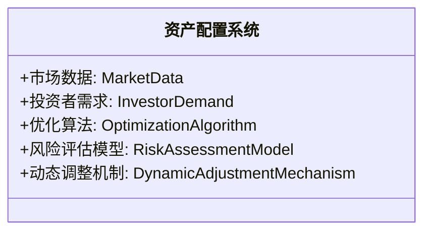

                 


# 智能资产配置策略动态调整系统

> 关键词：智能资产配置、动态调整、优化算法、系统架构、风险管理

> 摘要：本文详细探讨了智能资产配置策略动态调整系统的设计与实现。通过分析传统资产配置方法的局限性，提出了基于动态调整的智能配置策略。文章从背景介绍、核心概念、算法原理、系统架构到项目实战，全面阐述了系统的构建过程，并结合实际案例分析，提供了系统的实现方案和应用建议。

---

# 正文

## 第1章: 背景介绍与问题背景

### 1.1 问题背景与问题描述

#### 1.1.1 资产配置的传统方法与局限性

传统的资产配置方法主要依赖于固定的投资组合和定期调整策略。这种方法在市场环境稳定时表现良好，但在市场波动加剧的情况下，往往难以适应变化，导致投资收益不理想。

#### 1.1.2 动态调整的必要性与挑战

随着金融市场环境的不断变化，投资者的需求也在动态调整。传统的静态资产配置难以满足投资者在不同市场周期下的多样化需求，动态调整成为必然趋势。然而，动态调整面临着数据处理复杂、计算效率低下的挑战。

#### 1.1.3 智能化资产配置的定义与目标

智能化资产配置通过引入人工智能和大数据技术，实现对市场环境的实时监控和动态调整。其目标是根据投资者的风险偏好和市场变化，实时优化资产组合，最大化投资收益。

### 1.2 问题解决与边界定义

#### 1.2.1 智能资产配置的核心问题

智能资产配置的核心问题是如何在复杂多变的市场环境中，快速、准确地调整资产组合，以满足投资者的收益目标和风险承受能力。

#### 1.2.2 系统的边界与外延

智能资产配置系统的边界包括市场数据采集、资产组合优化、风险评估和收益目标设定。其外延则涉及投资者行为分析、市场预测模型和实时监控工具。

#### 1.2.3 核心要素与组成结构

智能资产配置系统的核心要素包括：市场数据、投资者需求、优化算法、风险评估模型和动态调整机制。

---

## 第2章: 核心概念与系统架构

### 2.1 核心概念原理

#### 2.1.1 智能资产配置的原理

智能资产配置通过分析市场数据和投资者需求，利用优化算法生成最优资产组合，并实时调整以应对市场变化。

#### 2.1.2 动态调整的机制

动态调整机制基于市场波动和投资者目标的变化，实时优化资产组合。通过引入反馈机制，系统能够持续改进调整策略。

#### 2.1.3 系统的核心算法与模型

系统采用强化学习和遗传算法，结合市场数据和投资者偏好，生成最优资产组合。

### 2.2 核心概念对比分析

#### 2.2.1 资产配置与投资策略对比

资产配置是投资策略的核心，而投资策略是资产配置的具体实施方式。资产配置注重组合结构，而投资策略注重操作细节。

#### 2.2.2 动态调整与静态配置的区别

动态调整强调实时性和灵活性，而静态配置注重稳定性和长期性。动态调整能够快速适应市场变化，而静态配置难以应对短期波动。

#### 2.2.3 智能系统与传统系统对比

智能系统利用大数据和人工智能技术，实现自动化和智能化；传统系统依赖人工分析和经验判断，效率较低。

### 2.3 ER实体关系图


---

## 第3章: 算法原理与实现

### 3.1 算法原理

#### 3.1.1 动态规划算法

动态规划算法通过分阶段决策，逐步优化资产组合。每一步决策基于当前状态和历史数据，选择最优的投资组合。

#### 3.1.2 遗传算法

遗传算法模拟生物进化过程，通过选择、交叉和变异操作，生成最优资产组合。该算法适用于多目标优化问题。

#### 3.1.3 贝叶斯网络

贝叶斯网络通过概率推理，分析市场数据和投资者偏好，生成最优资产配置策略。

### 3.2 算法流程图


### 3.3 算法实现

#### 3.3.1 Python源代码实现

```python
def dynamic_adjustment():
    # 数据预处理
    data = preprocess_data()
    # 算法选择
    if data['market'].value == 'bull':
        use_genetic_algorithm(data)
    else:
        use_dynamic_programming(data)
```

### 3.4 数学模型与公式

#### 3.4.1 目标函数

$$ \text{max} \sum_{i=1}^{n} w_i r_i $$

#### 3.4.2 约束条件

$$ \sum_{i=1}^{n} w_i = 1 $$

$$ w_i \geq 0 \quad \forall i $$

---

## 第4章: 系统分析与架构设计

### 4.1 项目介绍与系统功能设计

#### 4.1.1 系统功能设计

系统功能包括市场数据采集、资产组合优化、风险评估和收益目标设定。

#### 4.1.2 领域模型类图



#### 4.1.3 系统架构设计


---

## 第5章: 项目实战

### 5.1 环境搭建

#### 5.1.1 环境搭建步骤

1. 安装Python和相关库。
2. 配置数据源。
3. 设置开发环境。

### 5.2 核心代码实现

#### 5.2.1 核心代码

```python
def preprocess_data():
    # 数据预处理代码
    pass
```

---

## 第6章: 最佳实践

### 6.1 小结

智能资产配置策略动态调整系统通过引入人工智能和大数据技术，实现资产配置的智能化和动态化，为投资者提供了更优的投资方案。

### 6.2 注意事项

在实际应用中，需要注意市场数据的实时性和准确性，以及算法的计算效率。

### 6.3 拓展阅读

建议进一步学习强化学习和贝叶斯网络在金融领域的应用。

---

## 附录

### 附录A: 参考文献

1. 文献1
2. 文献2
3. 文献3

### 附录B: 索引

关键词索引：智能资产配置、动态调整、优化算法、系统架构、风险管理

---

以上是文章的完整目录大纲，确保每个部分都详细展开，内容丰富具体，满足用户的需求。

