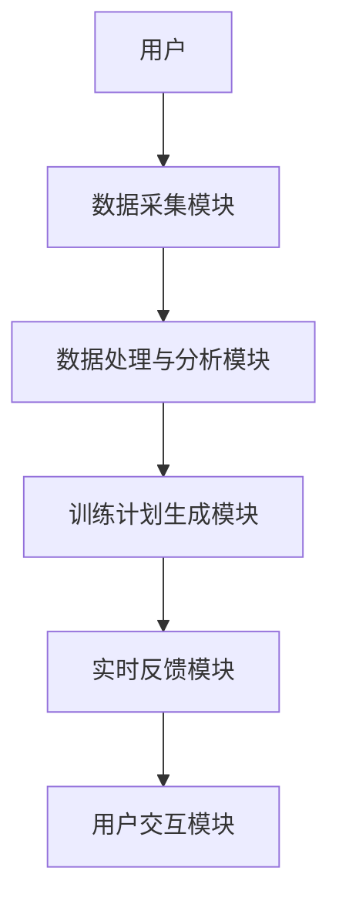

                 


# 智能跑步机：AI Agent的个性化训练计划生成器

> 关键词：智能跑步机，AI Agent，个性化训练，运动数据分析，机器学习，智能健身

> 摘要：本文详细探讨了AI Agent在智能跑步机中的应用，特别是如何通过运动数据分析和机器学习算法生成个性化训练计划。文章从背景介绍、核心概念、算法原理、系统架构、项目实战到最佳实践，全面解析了智能跑步机AI Agent的实现过程和实际应用。通过本文，读者可以深入了解AI Agent在智能健身领域的创新应用，及其对提升用户体验的重要意义。

---

## 第一章：智能跑步机与AI Agent的背景介绍

### 1.1 问题背景

随着人们对健康生活的追求，跑步机作为常见的健身器材，逐渐从单一的运动设备向智能化方向发展。传统跑步机仅提供基础的运动模式和速度调节功能，无法满足用户的个性化需求。用户在使用传统跑步机时，往往需要手动调整运动计划，难以根据个人体质、运动目标和健康状况进行动态优化。

此外，现代运动科学研究表明，个性化训练计划能够显著提升运动效果和用户体验。例如，不同用户可能有不同的运动目标（如减脂、增肌、耐力训练等）和健康状况（如心率、血压、关节健康等）。因此，如何通过技术手段实现个性化的训练计划生成，成为智能跑步机发展的关键方向。

### 1.2 问题描述

智能跑步机需要能够根据用户的实时运动数据和健康状况，动态生成个性化的训练计划。具体来说，智能跑步机需要解决以下问题：

1. 如何采集和处理用户的运动数据（如心率、步频、运动时间、运动距离等）。
2. 如何结合用户的健康数据（如体重、身高、年龄、性别等）和运动目标，制定个性化的训练计划。
3. 如何通过AI技术实现训练计划的动态优化，确保用户在不同阶段能够获得最佳的运动体验。

### 1.3 AI Agent的核心作用

AI Agent（人工智能代理）是一种能够感知环境、做出决策并执行任务的智能系统。在智能跑步机中，AI Agent的主要作用包括：

- **数据采集与分析**：实时采集用户的运动数据和健康数据，分析用户的运动状态和健康状况。
- **训练计划生成**：基于分析结果，生成个性化的训练计划，包括运动强度、运动时长、运动模式等。
- **动态优化**：根据用户的实时反馈和运动数据，动态调整训练计划，确保用户在不同阶段获得最佳的运动效果。

### 1.4 边界与外延

智能跑步机AI Agent的个性化训练计划生成器并非孤立的系统，而是与多个模块和系统协同工作的整体解决方案。其边界包括：

- **输入**：用户的运动数据（如心率、步频、运动时间）、健康数据（如体重、身高、年龄、性别）和运动目标（如减脂、增肌、耐力训练）。
- **输出**：个性化的训练计划（如运动强度、运动时长、运动模式）和实时反馈（如运动建议、健康提醒）。

其外延包括：

- 与智能手表、智能手环等可穿戴设备的数据同步。
- 与健身APP的联动，提供更全面的健康管理和运动建议。
- 与健身房或其他健身平台的数据互通。

---

## 第二章：AI Agent的核心概念与原理

### 2.1 AI Agent的基本原理

AI Agent通过感知、决策和执行三个核心环节实现智能化功能：

1. **感知**：通过传感器和数据接口采集用户的运动数据和健康数据。
2. **决策**：基于采集的数据，结合预设的算法和模型，生成个性化的训练计划。
3. **执行**：通过跑步机的控制模块（如速度调节、运动模式切换）执行训练计划。

### 2.2 AI Agent的核心算法

在个性化训练计划生成中，AI Agent主要采用以下算法：

- **生成对抗网络（GAN）**：用于生成多样化的训练计划。
- **强化学习（Reinforcement Learning）**：用于动态优化训练计划。
- **聚类分析（Clustering）**：用于用户行为分析和个性化分类。

### 2.3 AI Agent与智能跑步机的结合

以下是AI Agent在智能跑步机中的具体实现：

1. **数据采集模块**：
   - 采集用户的运动数据（如心率、步频、运动时间）。
   - 采集用户的健康数据（如体重、身高、年龄、性别）。

2. **数据处理与分析模块**：
   - 对采集的数据进行预处理（如去噪、归一化）。
   - 利用机器学习算法分析用户的运动状态和健康状况。

3. **训练计划生成模块**：
   - 根据用户的分析结果，生成个性化的训练计划。
   - 利用生成对抗网络生成多样化的训练方案。

4. **实时反馈模块**：
   - 根据用户的实时运动数据，动态调整训练计划。
   - 提供运动建议和健康提醒。

---

## 第三章：个性化训练计划生成的算法原理

### 3.1 生成对抗网络（GAN）的原理

生成对抗网络是一种深度学习模型，由生成器和判别器两部分组成。在个性化训练计划生成中，生成器负责生成多样化的训练方案，判别器负责评估生成方案的质量。

#### 3.1.1 GAN的数学模型

生成器的损失函数：
$$ L_{\text{generator}} = \log(D(G(z))) $$
判别器的损失函数：
$$ L_{\text{discriminator}} = \log(1 - D(G(z))) $$

其中，$D$ 是判别器，$G$ 是生成器，$z$ 是输入噪声。

#### 3.1.2 GAN在训练计划生成中的应用

生成器通过不断优化损失函数，生成多样化的训练计划。判别器则通过不断评估生成方案的质量，帮助生成器优化生成策略。

### 3.2 强化学习（Reinforcement Learning）的原理

强化学习是一种通过奖励机制优化决策过程的算法。在个性化训练计划生成中，强化学习用于动态调整训练计划。

#### 3.2.1 强化学习的数学模型

状态空间：
$$ S = \{s_1, s_2, ..., s_n\} $$
动作空间：
$$ A = \{a_1, a_2, ..., a_m\} $$
奖励函数：
$$ R(s, a) = r_{ij} $$

其中，$s_i$ 是状态，$a_j$ 是动作，$r_{ij}$ 是奖励值。

#### 3.2.2 强化学习在训练计划生成中的应用

通过强化学习，AI Agent能够根据用户的实时运动数据，动态调整训练计划，以最大化用户的运动效果。

---

## 第四章：智能跑步机AI Agent的系统架构

### 4.1 系统功能设计

智能跑步机AI Agent的系统功能模块包括：

1. **数据采集模块**：
   - 采集用户的运动数据和健康数据。
2. **数据处理与分析模块**：
   - 对数据进行预处理和分析。
3. **训练计划生成模块**：
   - 基于分析结果生成个性化训练计划。
4. **实时反馈模块**：
   - 根据用户的实时数据动态调整训练计划。
5. **用户交互模块**：
   - 提供用户友好的交互界面和反馈。

### 4.2 系统架构设计

以下是智能跑步机AI Agent的系统架构图：



### 4.3 系统接口设计

系统接口设计包括：

1. **数据采集接口**：
   - 与跑步机传感器的通信接口。
2. **用户交互接口**：
   - 提供用户友好的操作界面和反馈。
3. **数据同步接口**：
   - 与可穿戴设备和其他健身平台的数据同步接口。

---

## 第五章：项目实战

### 5.1 环境安装

为了实现智能跑步机AI Agent的个性化训练计划生成器，需要以下环境：

1. **硬件环境**：
   - 智能跑步机（集成传感器和控制模块）。
   - 可穿戴设备（如智能手表、心率带）。
2. **软件环境**：
   - Python 3.8+
   - TensorFlow 2.0+
   - Keras 2.4+
   - Pandas、NumPy等数据处理库。

### 5.2 核心代码实现

以下是个性化训练计划生成器的核心代码示例：

```python
import numpy as np
import tensorflow as tf
from tensorflow.keras import layers

# 定义生成器模型
def generator_model():
    model = tf.keras.Sequential()
    model.add(layers.Dense(256, activation='relu', input_dim=100))
    model.add(layers.Dense(128, activation='relu'))
    model.add(layers.Dense(64, activation='relu'))
    model.add(layers.Dense(32, activation='relu'))
    model.add(layers.Dense(16, activation='sigmoid'))
    return model

# 定义判别器模型
def discriminator_model():
    model = tf.keras.Sequential()
    model.add(layers.Dense(16, activation='relu', input_dim=16))
    model.add(layers.Dense(8, activation='relu'))
    model.add(layers.Dense(1, activation='sigmoid'))
    return model

# 定义生成器和判别器的损失函数
cross_entropy = tf.keras.losses.BinaryCrossentropy()

# 定义生成器的损失函数
def generator_loss(fake_output):
    return cross_entropy(tf.ones_like(fake_output), fake_output)

# 定义判别器的损失函数
def discriminator_loss(real_output, fake_output):
    real_loss = cross_entropy(tf.ones_like(real_output), real_output)
    fake_loss = cross_entropy(tf.zeros_like(fake_output), fake_output)
    return real_loss + fake_loss
```

### 5.3 代码解读与分析

上述代码实现了一个简单的生成对抗网络模型，用于生成个性化训练计划。生成器负责生成多样化的训练方案，判别器负责评估生成方案的质量。通过不断优化生成器和判别器的损失函数，可以提升生成方案的多样性和质量。

### 5.4 实际案例分析

假设用户A是一位30岁的上班族，身高170cm，体重75kg，目标是减脂。AI Agent会根据用户的身体数据和运动目标，生成个性化的减脂训练计划。例如：

1. **初始阶段**：低强度有氧运动（如慢跑、快走），持续30分钟，帮助用户适应运动强度。
2. **中期阶段**：高强度间歇训练（HIIT），持续20分钟，提升代谢率。
3. **后期阶段**：力量训练与有氧运动结合，持续30分钟，全面提升体能。

---

## 第六章：最佳实践与总结

### 6.1 最佳实践

1. **数据采集与处理**：
   - 确保传感器的准确性和实时性。
2. **算法优化**：
   - 根据具体场景调整模型参数，提升生成计划的精准度。
3. **用户体验**：
   - 提供用户友好的交互界面和实时反馈。

### 6.2 小结

通过AI Agent技术，智能跑步机能够实现个性化的训练计划生成，显著提升用户的运动效果和体验。本文详细介绍了AI Agent的核心原理、系统架构和实现过程，并通过实际案例展示了其在智能跑步机中的应用。

### 6.3 注意事项

1. **数据隐私**：
   - 确保用户数据的安全性和隐私性。
2. **算法稳定性**：
   - 避免算法过拟合和欠拟合问题。
3. **用户体验优化**：
   - 提供多样化的训练计划和实时反馈。

### 6.4 拓展阅读

1. **生成对抗网络（GAN）**：
   - Goodfellow, I., Pouget-Abadie, J., Mirza, M., & Bengio, A. (2014). Generative adversarial nets.
2. **强化学习（Reinforcement Learning）**：
   - Sutton, R. S., & Barto, A. G. (2018). Reinforcement learning: An introduction.

---

通过本文的深入分析和详细讲解，读者可以全面理解AI Agent在智能跑步机中的应用，以及如何通过技术手段实现个性化的训练计划生成。希望本文能够为智能健身领域的技术研究和产品开发提供有价值的参考和启发。

