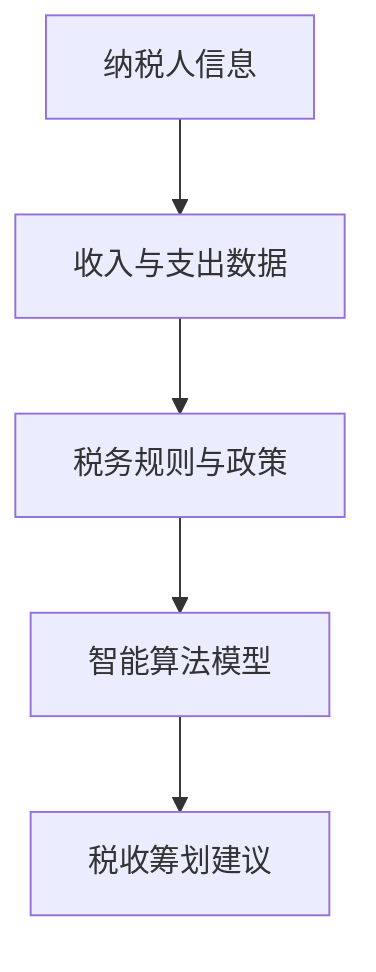

                 

# 智能跨境税收筹划建议系统

> 关键词：智能税收筹划，跨境税务，人工智能算法，系统架构，税收优化

> 摘要：本文探讨了智能跨境税收筹划建议系统的构建与应用。通过分析跨境税收筹划的复杂性，介绍了智能系统在其中的应用优势。详细讲解了支持向量机和遗传算法的原理及其在税收优化中的应用。通过系统架构设计和项目实战案例，展示了如何利用智能技术实现高效的跨境税收管理。

---

## 第一章 背景介绍

### 1.1 问题背景与现状

跨境税收筹划涉及多个国家的税务法规，复杂性高且容易出错。传统方法依赖人工分析，效率低且容易遗漏最优解。随着人工智能的发展，智能系统在税收筹划中的应用成为可能。

### 1.2 智能跨境税收筹划的核心概念

智能跨境税收筹划通过AI技术优化税务结构，降低税负。其核心概念包括数据采集、算法模型和系统架构。系统的边界是提供税收建议，不直接处理申报，而是辅助决策。

---

## 第二章 核心概念与联系

### 2.1 核心概念原理

智能系统通过数据采集和处理，结合算法模型生成税收建议。数据采集包括企业财务数据和税务政策，处理步骤涉及清洗和特征提取。算法模型如SVM和GA用于预测和优化。

### 2.2 ER实体关系图

---

## 第三章 算法原理讲解

### 3.1 支持向量机（SVM）算法

SVM用于分类和回归，目标函数最大化间隔，约束条件确保数据正确分类。流程图展示数据预处理、特征提取、模型训练和结果预测。

### 3.2 遗传算法（GA）应用

GA通过适应度评估、选择和交叉变异优化解。流程图展示初始化种群、评估适应度、选择变异生成新种群。

---

## 第四章 系统分析与架构设计方案

### 4.1 问题场景介绍

系统目标是优化跨境税务结构，功能模块包括数据采集、算法处理和结果展示。用户包括财务人员和企业高管。

### 4.2 系统架构设计

模块划分：数据处理、算法引擎、用户界面。架构图展示分层结构，接口设计使用JSON格式。序列图展示用户请求、处理和返回结果。

---

## 第五章 项目实战

### 5.1 环境安装与配置

安装Python、机器学习库和数据处理工具，配置开发环境。

### 5.2 核心代码实现

实现数据清洗、特征提取和模型训练，代码示例展示数据处理和模型调用。

### 5.3 实际案例分析

以跨国公司为例，展示如何利用系统优化税务结构，减少税负。

---

## 第六章 总结与展望

### 6.1 最佳实践

数据质量、算法选择和系统安全性是关键。持续优化模型和扩展功能是未来方向。

### 6.2 小结

智能系统在跨境税收中的应用前景广阔，通过技术创新和实践应用，能够显著提升税收管理效率。

---

通过以上章节的详细讲解，读者可以全面理解智能跨境税收筹划系统的构建与应用，掌握其实现原理和实际案例，为未来的应用提供参考。

