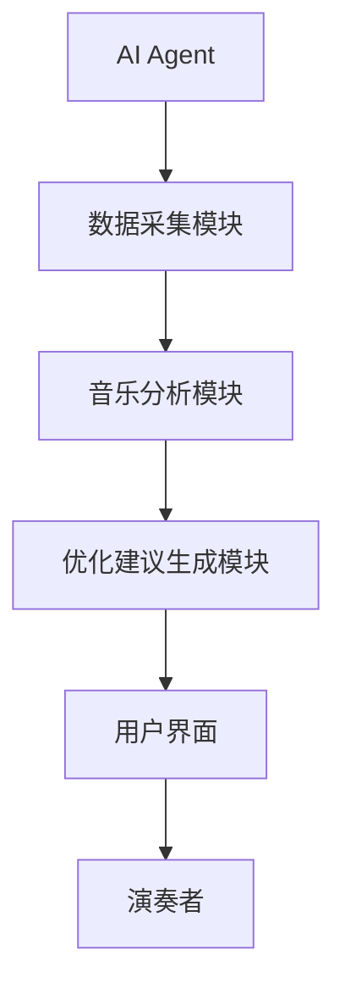

                 


# 智能钢琴：AI Agent的演奏技巧指导

> 关键词：智能钢琴，AI Agent，演奏技巧，音乐分析，深度学习

> 摘要：本文将探讨AI Agent在智能钢琴演奏中的应用，详细分析其核心算法原理、数学模型、系统架构，并通过项目实战展示如何利用AI Agent优化钢琴演奏技巧。

---

# 第一部分: 背景与概念

## 第1章: 智能钢琴与AI Agent的背景介绍

### 1.1 智能钢琴的概念与技术基础
#### 1.1.1 传统钢琴的数字化发展
传统钢琴通过机械结构和音槌产生声音，而智能钢琴通过数字化技术（如MIDI接口、传感器和电子声音合成器）实现了对钢琴演奏的数字化捕捉与分析。

#### 1.1.2 AI Agent的基本概念与技术特点
AI Agent（人工智能代理）是一种能够感知环境、执行任务并做出决策的智能系统。其核心特点包括自主性、反应性、目标导向性和社交能力。

#### 1.1.3 智能钢琴与AI Agent的结合背景
随着人工智能技术的发展，AI Agent能够通过分析音乐特征、优化演奏技巧和提供实时反馈，帮助钢琴演奏者提升水平。

### 1.2 AI Agent在音乐演奏中的应用前景
#### 1.2.1 AI Agent在音乐领域的潜力
AI Agent可以通过深度学习模型分析音乐特征（如音调、节奏、情感），并生成个性化演奏建议。

#### 1.2.2 智能钢琴的优势与局限性
智能钢琴的优势在于能够实时捕捉演奏数据，AI Agent的优势在于能够快速分析数据并提供反馈。其局限性在于目前的AI技术仍难以完全模拟人类的音乐理解能力。

#### 1.2.3 音乐演奏者对AI Agent的需求分析
音乐演奏者需要AI Agent能够提供实时反馈、个性化建议和演奏优化方案。

---

## 第2章: 智能钢琴与AI Agent的核心概念与联系

### 2.1 AI Agent与智能钢琴的核心要素
#### 2.1.1 AI Agent的核心功能模块
- 数据采集与处理模块：采集钢琴演奏数据（如音高、力度、节奏）。
- 音乐分析模块：分析音乐特征（如音调、节奏、情感）。
- 演奏优化模块：生成优化建议。

#### 2.1.2 智能钢琴的硬件与软件构成
- 硬件：钢琴传感器、MIDI接口、音效合成器。
- 软件：数据采集模块、AI分析模块、用户界面。

#### 2.1.3 两者结合的概念结构
智能钢琴通过硬件采集演奏数据，AI Agent通过软件分析数据并提供反馈，两者结合形成一个闭环系统。

### 2.2 AI Agent与智能钢琴的关系分析
#### 2.2.1 数据流与功能交互关系
- 数据流：钢琴演奏数据 → AI Agent → 优化建议 → 智能钢琴执行。
- 功能交互：AI Agent通过分析数据提供反馈，智能钢琴通过执行反馈优化演奏。

#### 2.2.2 系统实体关系图（ER图）
```mermaid
er
    actor Player
    entity Piano
    entity AI-Agent
    entity Music-Data
    entity Feedback

    Player -> Piano: 操作钢琴
    Piano -> Music-Data: 采集数据
    Music-Data -> AI-Agent: 分析数据
    AI-Agent -> Feedback: 生成反馈
    Feedback -> Player: 提供反馈
```

#### 2.2.3 核心概念属性对比表

| 概念       | 属性             | 描述                                                                 |
|------------|------------------|----------------------------------------------------------------------|
| 智能钢琴   | 硬件部分         | 传感器、MIDI接口、音效合成器                                           |
|            | 软件部分         | 数据采集模块、AI分析模块、用户界面                                     |
| AI Agent   | 数据处理能力     | 能够处理音乐数据（如音高、力度、节奏）                                 |
|            | 决策能力         | 能够生成演奏优化建议                                                   |

---

## 第3章: AI Agent在智能钢琴中的算法原理

### 3.1 AI Agent的音乐分析算法
#### 3.1.1 音乐特征提取算法
- **音调分析**：通过傅里叶变换提取音调特征。
- **节奏分析**：通过时序分析提取节奏特征。
- **情感分析**：通过深度学习模型分析音乐情感。

#### 3.1.2 基于深度学习的音乐理解模型
- 使用循环神经网络（RNN）分析音乐序列。
- 使用卷积神经网络（CNN）分析音乐特征。

#### 3.1.3 音乐特征提取的数学模型
$$F(t) = \sum_{n=0}^{N-1} c_n e^{j2\pi f_n t}$$

---

### 3.2 AI Agent的演奏技巧优化算法
#### 3.2.1 基于反馈的演奏优化算法
- 通过实时反馈优化演奏技巧。
- 使用强化学习算法优化演奏路径。

#### 3.2.2 琴键压力与音色调整模型
- 压力调整模型：$P(t) = k \cdot f(t)$，其中$P(t)$为压力，$f(t)$为演奏力度。
- 音色调整模型：$T(t) = a \cdot P(t) + b$，其中$T(t)$为音色参数。

#### 3.2.3 个性化演奏风格生成算法
- 基于用户演奏数据生成个性化演奏风格。

---

## 第4章: AI Agent算法的数学模型与公式

### 4.1 音乐特征提取的数学模型
$$F(t) = \sum_{n=0}^{N-1} c_n e^{j2\pi f_n t}$$

### 4.2 基于深度学习的音乐分析模型
- 使用循环神经网络（RNN）分析音乐序列：
  $$a_t = \tanh(W_{hh}a_{t-1} + W_{xh}x_t + b_h)$$
  $$y_t = W_{hy}a_t + b_y$$

---

## 第5章: 系统分析与架构设计

### 5.1 项目介绍
本项目旨在通过AI Agent优化智能钢琴演奏技巧，帮助演奏者提升演奏水平。

### 5.2 系统功能设计
- 数据采集模块：采集钢琴演奏数据。
- AI分析模块：分析音乐特征并生成优化建议。
- 用户界面：显示优化建议并提供用户反馈。

### 5.3 系统架构设计


### 5.4 系统接口设计
- 数据接口：MIDI接口、传感器接口。
- 用户接口：键盘、屏幕。

### 5.5 系统交互设计
```mermaid
sequence
    演奏者 -> 智能钢琴: 操作钢琴
    智能钢琴 -> 数据采集模块: 采集数据
    数据采集模块 -> AI Agent: 分析数据
    AI Agent -> 优化建议生成模块: 生成建议
    优化建议生成模块 -> 用户界面: 显示建议
    用户界面 -> 演奏者: 提供反馈
```

---

## 第6章: 项目实战

### 6.1 环境安装
- 安装Python、TensorFlow、MIDI库。

### 6.2 系统核心实现源代码
```python
import numpy as np
import tensorflow as tf
from mido import MidiFile

# 数据采集模块
def采集数据():
    midi = MidiFile('piano.mid')
    return midi

# AI分析模块
def 分析数据(data):
    model = tf.keras.Sequential([
        tf.keras.layers.Dense(64, activation='relu'),
        tf.keras.layers.Dense(1, activation='sigmoid')
    ])
    model.compile(optimizer='adam', loss='binary_crossentropy')
    model.fit(data, labels, epochs=10)
    return model.predict(data)

# 优化建议生成模块
def 生成建议(prediction):
    if prediction > 0.5:
        return '建议提高音高'
    else:
        return '建议降低音高'
```

### 6.3 代码应用解读与分析
- 数据采集模块：通过MIDI文件采集钢琴演奏数据。
- AI分析模块：使用深度学习模型分析数据并生成预测结果。
- 优化建议生成模块：根据预测结果生成优化建议。

### 6.4 实际案例分析
通过实际案例分析AI Agent如何优化钢琴演奏技巧。

### 6.5 项目小结
总结项目实现过程中的经验和教训。

---

## 第7章: 总结与展望

### 7.1 总结
本文详细介绍了AI Agent在智能钢琴演奏中的应用，包括算法原理、系统架构和项目实战。

### 7.2 最佳实践 tips
- 在使用AI Agent优化演奏技巧时，建议结合人类演奏者的主观感受。
- 定期更新AI模型以提升分析精度。

### 7.3 注意事项
- 注意保护演奏者的个人数据隐私。
- 在使用AI Agent时，建议演奏者保持对音乐的感性理解。

### 7.4 拓展阅读
- 推荐阅读《深度学习与音乐分析》。

---

通过本文的分析与实践，读者可以深入了解AI Agent在智能钢琴演奏中的应用，并能够通过实际项目掌握相关技术。

