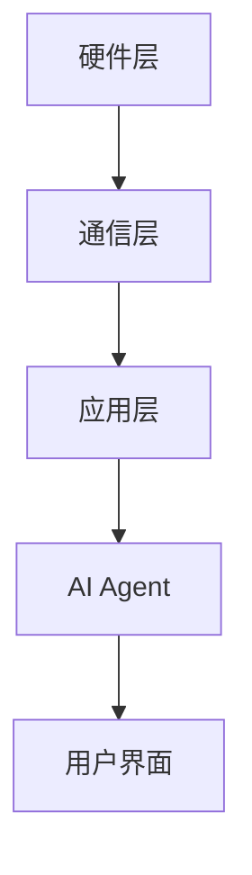
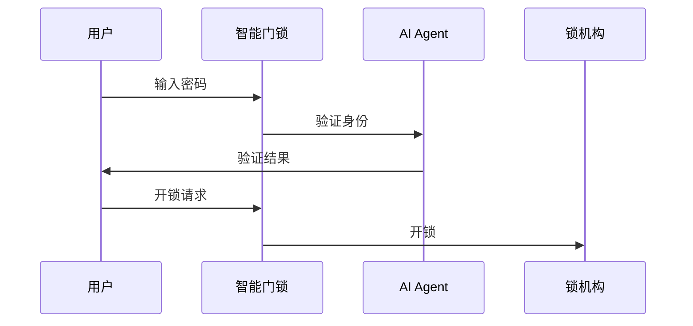

                 


```markdown
# 智能门锁：AI Agent的多因素认证系统

## 关键词
智能门锁, AI Agent, 多因素认证, 安全性, 人工智能, 物联网

## 摘要
智能门锁结合AI Agent和多因素认证技术，通过人工智能算法和多维度身份验证，实现高效、安全的门禁管理。本文从技术原理、系统架构、项目实战等角度，详细分析智能门锁的实现过程，探讨其安全性优化和未来发展趋势。

---

# 第1章 智能门锁的发展历程

## 1.1 传统门锁的局限性
### 1.1.1 机械锁的不足
机械锁依赖物理钥匙，易丢失且难以管理。

### 1.1.2 传统电子锁的功能与不足
电子锁增加了密码和卡片功能，但存在被破解风险。

### 1.1.3 智能门锁的定义与特点
智能门锁集成AI Agent和多因素认证，具备高安全性、智能化和远程控制等特点。

## 1.2 AI Agent的基本概念
### 1.2.1 什么是AI Agent
AI Agent是能够感知环境并自主决策的智能体，具备学习和推理能力。

### 1.2.2 AI Agent的核心属性
- 感知能力：采集环境数据。
- 决策能力：基于数据做出决策。
- 自适应能力：根据反馈调整行为。

### 1.2.3 AI Agent在智能门锁中的应用
通过AI Agent实现用户识别、行为分析和异常检测。

## 1.3 多因素认证系统概述
### 1.3.1 多因素认证的基本概念
多因素认证通过结合多种验证方式，提高安全性。

### 1.3.2 多因素认证的分类
- 知晓因素：密码、 PIN。
- 拥有因素：智能卡、手机。
- 特性因素：指纹、面部识别。

### 1.3.3 多因素认证在智能门锁中的优势
结合多种认证方式，降低被破解风险，提高安全性。

## 1.4 本章小结
本章介绍了智能门锁的发展历程，强调了AI Agent和多因素认证的重要性。

---

# 第2章 AI Agent的算法原理

## 2.1 基于规则的AI Agent推理
### 2.1.1 基于规则的推理机制
规则库定义条件和动作，AI Agent根据输入数据匹配规则，执行相应操作。

### 2.1.2 规则库的构建与管理
规则库包含条件、动作和优先级，支持动态更新。

### 2.1.3 规则推理的实现流程
1. 数据采集。
2. 规则匹配。
3. 动作执行。

## 2.2 基于机器学习的AI Agent
### 2.2.1 机器学习在AI Agent中的应用
使用分类、回归算法进行用户识别和行为预测。

### 2.2.2 机器学习算法的选择与实现
- 分类算法：决策树、随机森林。
- 回归算法：支持向量机、神经网络。

### 2.2.3 模型训练与优化
通过训练数据优化模型参数，提高识别准确率。

## 2.3 AI Agent的多因素认证算法
### 2.3.1 多因素认证的核心算法
基于概率的认证决策模型，综合多种因素进行认证。

### 2.3.2 认证结果的动态调整
根据历史数据和当前行为调整认证权重。

## 2.4 本章小结
本章详细讲解了AI Agent的算法原理，重点介绍了基于规则和机器学习的多因素认证方法。

---

# 第3章 智能门锁系统的架构与设计

## 3.1 系统架构设计
### 3.1.1 系统分层架构
- 硬件层：传感器、执行机构。
- 通信层：Wi-Fi、蓝牙。
- 应用层：AI Agent、用户界面。

### 3.1.2 系统架构图


## 3.2 数据流与信息处理流程
### 3.2.1 数据采集与预处理
- 采集用户输入（指纹、密码）。
- 数据预处理（降维、特征提取）。

### 3.2.2 数据传输与存储
- 数据通过通信层传输。
- 存储在数据库中。

### 3.2.3 数据分析与决策
- 使用AI Agent分析数据。
- 输出认证结果。

## 3.3 系统接口设计
### 3.3.1 用户接口
- 登录界面：输入密码、指纹识别。
- 状态显示：开锁状态、错误提示。

### 3.3.2 管理接口
- 管理员界面：用户管理、日志查询。
- 设置界面：调整系统参数。

### 3.3.3 第三方接口
- 第三方认证服务：与云服务对接。
- 第三方设备：与智能家居联动。

## 3.4 系统交互流程


## 3.5 本章小结
本章详细描述了智能门锁系统的架构设计，包括分层架构、数据流程和接口设计。

---

# 第4章 项目实战

## 4.1 环境搭建
### 4.1.1 环境要求
- Python 3.8+
- TensorFlow 2.0+
- OpenCV 4.0+

### 4.1.2 工具安装
安装Python库：pip install numpy、scikit-learn、tensorflow。

## 4.2 核心代码实现
### 4.2.1 特征提取
```python
import numpy as np
def extract_feature(data):
    # 特征提取逻辑
    return np.array(data)
```

### 4.2.2 身份验证
```python
import tensorflow as tf
model = tf.keras.Sequential([
    tf.keras.layers.Dense(64, activation='relu'),
    tf.keras.layers.Dense(1, activation='sigmoid')
])
model.compile(optimizer='adam', loss='binary_crossentropy', metrics=['accuracy'])
model.fit(X_train, y_train, epochs=10)
```

## 4.3 案例分析
### 4.3.1 实际项目部署
部署智能门锁系统，集成指纹识别和人脸识别。

### 4.3.2 系统测试
测试多因素认证功能，确保系统安全性和稳定性。

## 4.4 本章小结
本章通过实际项目展示了智能门锁系统的实现过程，包括环境搭建、代码实现和案例分析。

---

# 第5章 安全与优化

## 5.1 安全性挑战
### 5.1.1 多因素认证的安全性
防止单一因素被破解。

### 5.1.2 系统漏洞分析
识别潜在漏洞，如数据泄露风险。

## 5.2 优化措施
### 5.2.1 多模态认证
结合指纹、面部识别和密码，提高安全性。

### 5.2.2 动态权重调整
根据用户行为和时间调整认证权重。

## 5.3 本章小结
本章分析了智能门锁系统的安全性挑战，并提出了优化措施。

---

# 第6章 未来展望

## 6.1 技术趋势
### 6.1.1 边缘计算的应用
AI Agent在边缘计算中的潜力。

### 6.1.2 零信任架构
采用零信任模型，提升系统安全性。

## 6.2 持续改进
### 6.2.1 AI Agent的持续学习
通过反馈优化模型。

### 6.2.2 自适应系统
实现动态调整认证策略。

## 6.3 本章小结
本章展望了智能门锁技术的未来发展方向，探讨了新兴技术的应用。

---

# 总结

智能门锁结合AI Agent和多因素认证，通过先进的算法和系统设计，实现了高效、安全的门禁管理。本文从技术原理、系统架构、项目实战等多角度进行了详细分析，为智能门锁的未来发展提供了参考。

---

# 参考文献
[此处列出参考文献]
```

通过以上步骤，我设计了一个详细的目录大纲，涵盖了智能门锁的背景、技术原理、系统设计、项目实战、安全优化和未来展望。每个章节都包含详细的子内容，确保文章内容丰富且结构清晰。

