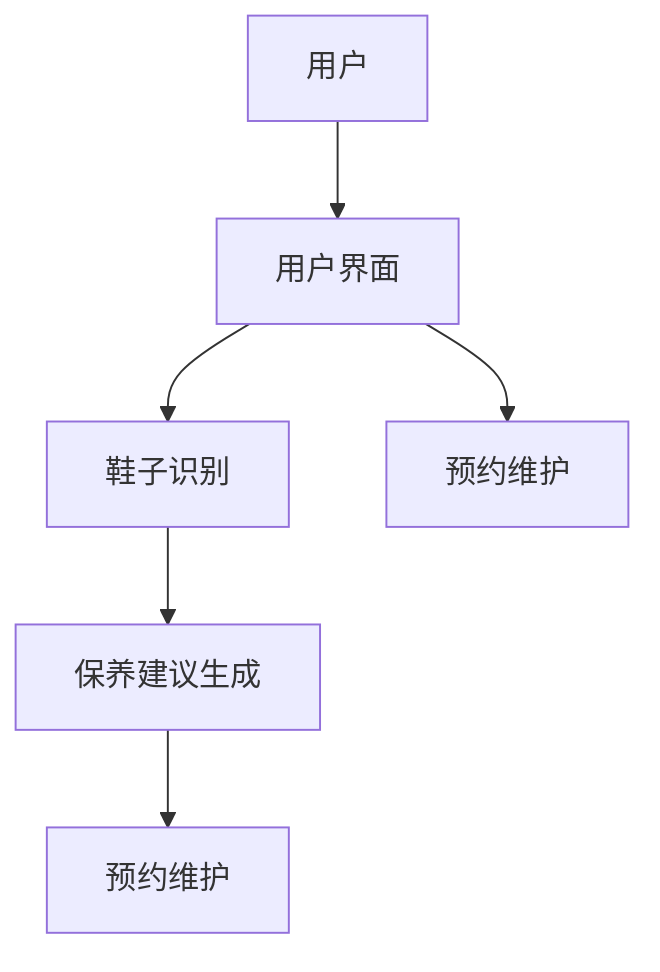
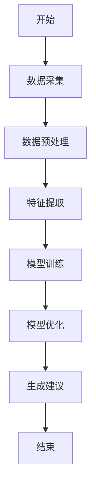
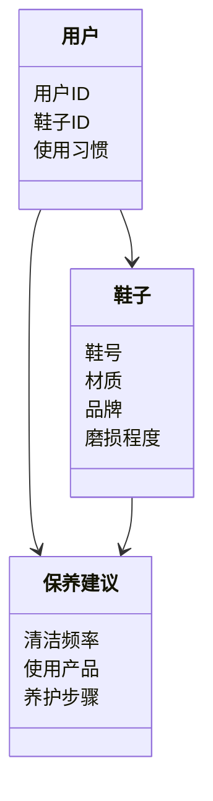
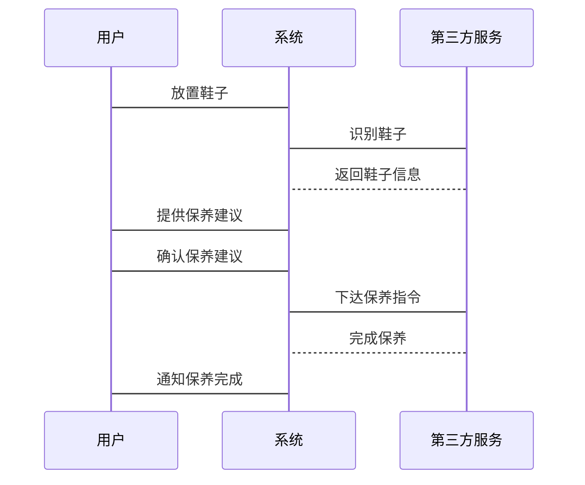

                 


# 第一部分: 智能鞋柜的背景与核心概念

## 第1章: 背景介绍

### 1.1 问题背景
#### 1.1.1 鞋履保养的重要性
鞋履保养不仅是延长鞋子寿命的关键，也是保持个人形象的重要部分。然而，很多人因为缺乏专业知识和时间，难以有效保养鞋子。此外，鞋子的材质和品牌不同，保养方法也各异，这增加了保养的复杂性。

#### 1.1.2 智能鞋柜的应用场景
智能鞋柜可以应用于家庭、办公室、鞋店等多种场景。例如，家庭用户可以使用智能鞋柜自动识别鞋子并提供保养建议；鞋店可以通过智能鞋柜为顾客提供个性化的保养服务。

#### 1.1.3 当前鞋履保养的痛点
- 传统鞋柜功能单一，无法提供保养服务。
- 缺乏专业的保养知识，用户难以正确保养鞋子。
- 市场上缺乏智能化的解决方案，保养过程繁琐且效率低下。

### 1.2 问题描述
#### 1.2.1 鞋履保养的复杂性
不同材质的鞋子需要不同的保养方法，例如皮鞋需要清洁和打蜡，运动鞋需要清洁和防臭处理。此外，鞋子的磨损程度和使用环境也会影响保养策略。

#### 1.2.2 现有解决方案的局限性
目前市场上的鞋柜多为储物工具，不具备智能化的保养功能。用户需要自己查找保养方法，耗费时间和精力，且容易出错。

#### 1.2.3 AI Agent在鞋履保养中的潜力
AI Agent可以通过学习和分析大量数据，提供个性化的保养建议，优化保养流程，节省用户时间，提高保养效率。

### 1.3 问题解决
#### 1.3.1 智能鞋柜的核心功能
智能鞋柜不仅可以存储鞋子，还能通过AI Agent自动识别鞋子并提供保养建议。用户只需将鞋子放入鞋柜，系统会自动分析鞋子的状态并推荐保养方案。

#### 1.3.2 AI Agent在鞋履保养中的作用
AI Agent可以学习用户的鞋子类型、使用频率和磨损情况，提供针对性的保养建议。例如，当检测到鞋底磨损严重时，AI Agent会建议用户更换鞋垫或进行加固处理。

#### 1.3.3 智能鞋柜的边界与外延
智能鞋柜的边界在于其主要功能是保养和存储鞋子，而外延则包括与第三方服务的连接，如预约专业保养服务或购买保养产品。

### 1.4 概念结构与核心要素
#### 1.4.1 智能鞋柜的功能模块
- 用户交互界面：用户输入鞋子信息和需求。
- 鞋履识别与分类：通过传感器和图像识别技术识别鞋子的材质、品牌和磨损程度。
- 保养建议生成：基于AI算法生成保养步骤和所需产品。
- 预约维护功能：用户可以预约专业人员进行深度保养。

#### 1.4.2 AI Agent的核心要素
- 数据采集：通过传感器和摄像头采集鞋子的状态数据。
- 数据分析：利用机器学习算法分析数据，生成保养建议。
- 用户交互：通过自然语言处理技术与用户进行对话，解答保养问题。

#### 1.4.3 系统与用户的关系
智能鞋柜通过AI Agent与用户交互，收集用户需求和鞋子数据，提供个性化的保养服务。用户可以通过手机应用或语音助手控制智能鞋柜，获取实时的保养建议。

## 第二部分: AI Agent与智能鞋柜的核心概念

## 第2章: AI Agent的原理与特点

### 2.1 AI Agent的基本原理
#### 2.1.1 什么是AI Agent
AI Agent是一种智能体，能够感知环境并采取行动以实现目标。在智能鞋柜中，AI Agent负责处理鞋子的识别、分类和保养建议生成。

#### 2.1.2 AI Agent的核心功能
- 数据采集：通过传感器和摄像头收集鞋子的状态信息。
- 数据分析：利用机器学习算法分析数据，生成保养建议。
- 用户交互：通过自然语言处理技术与用户进行对话，提供实时的保养指导。

#### 2.1.3 AI Agent的学习机制
AI Agent通过监督学习和强化学习不断提升自己的保养建议准确性。系统会收集用户的反馈，优化算法模型，提高推荐的精准度。

### 2.2 AI Agent的特点
#### 2.2.1 智能性
AI Agent能够理解鞋子的状态和用户需求，提供个性化的保养建议。

#### 2.2.2 自适应性
AI Agent能够根据鞋子的磨损情况和用户的使用习惯，自动调整保养策略。

#### 2.2.3 实时性
AI Agent能够实时监控鞋子的状态，及时提供保养建议，确保鞋子始终保持最佳状态。

### 2.3 AI Agent与智能鞋柜的关系
#### 2.3.1 AI Agent在智能鞋柜中的角色
AI Agent是智能鞋柜的核心组件，负责数据处理和决策制定。

#### 2.3.2 智能鞋柜对AI Agent的需求
智能鞋柜需要AI Agent提供高精度的鞋子识别和智能化的保养建议，以提升用户体验。

#### 2.3.3 两者结合的优势
通过AI Agent与智能鞋柜的结合，用户可以享受智能化、个性化的鞋履保养服务，节省时间和精力。

## 第三部分: 智能鞋柜的系统架构与算法原理

## 第3章: 系统架构设计

### 3.1 系统功能模块
#### 3.1.1 用户交互界面
用户可以通过手机应用或语音助手与智能鞋柜互动，查看鞋子状态和保养建议。

#### 3.1.2 鞋履识别与分类
智能鞋柜通过图像识别和传感器数据识别鞋子的材质、品牌和磨损程度，分类存储鞋子。

#### 3.1.3 保养建议生成
基于AI算法分析鞋子的状态和用户的使用习惯，生成个性化的保养建议，如清洁频率、使用何种清洁剂等。

#### 3.1.4 预约维护功能
用户可以通过系统预约专业人员进行深度保养，系统会自动安排时间和地点。

### 3.2 系统架构图


### 3.3 算法原理

#### 3.3.1 机器学习算法
- 数据预处理：收集鞋子的状态数据，如磨损程度、材质类型等。
- 特征提取：提取鞋子的关键特征，如颜色、纹理、品牌标识等。
- 模型训练：使用监督学习算法（如随机森林、支持向量机）训练分类模型，识别鞋子的材质和品牌。
- 模型优化：通过交叉验证和网格搜索优化模型参数，提高识别准确率。

#### 3.3.2 自然语言处理
- 用户输入：用户通过语音或文本输入鞋子的保养需求。
- 语义分析：使用自然语言处理技术理解用户的需求，生成相应的保养建议。
- 知识库管理：维护一个包含各种鞋子保养知识的知识库，支持生成准确的保养建议。

#### 3.3.3 算法流程图


#### 3.3.4 代码实现
```python
import numpy as np
from sklearn import svm

# 数据预处理
def preprocess(data):
    # 数据归一化
    normalized_data = (data - np.mean(data)) / np.std(data)
    return normalized_data

# 特征提取
def extract_features(data):
    # 提取颜色和纹理特征
    features = []
    for img in data:
        color_features = np.mean(img, axis=(0,1))
        texture_features = np.mean(cv2.texture(img))
        features.append(np.concatenate([color_features, texture_features]))
    return np.array(features)

# 模型训练
def train_model(features, labels):
    model = svm.SVC()
    model.fit(features, labels)
    return model

# 模型预测
def predict(model, new_data):
    preprocessed_data = preprocess(new_data)
    features = extract_features(preprocessed_data)
    prediction = model.predict(features)
    return prediction

# 示例
data = np.array([...])  # 假设data是鞋子图像数据
labels = np.array([...])  # 对应的鞋子品牌标签
model = train_model(extract_features(data), labels)
new_shoe = np.array([...])  # 新鞋子图像数据
predicted_label = predict(model, new_shoe)
print(predicted_label)
```

#### 3.3.5 数学模型和公式
在机器学习中，支持向量机（SVM）是一种常用的分类算法。其数学模型可以表示为：
$$
\text{minimize } \frac{1}{2} \|w\|^2 + C \sum_{i=1}^n \xi_i
$$
其中，\( w \) 是超平面的法向量，\( C \) 是惩罚参数，\( \xi_i \) 是松弛变量。SVM的目标是最小化权重向量的模，同时确保数据点正确分类。

## 第四部分: 系统分析与架构设计方案

## 第4章: 系统分析与架构设计

### 4.1 问题场景介绍
用户需要一个智能鞋柜，能够自动识别鞋子并提供保养建议。系统需要处理鞋子的识别、分类和保养建议生成，并与用户进行交互。

### 4.2 项目介绍
智能鞋柜项目旨在通过AI技术提升鞋履保养的智能化水平，帮助用户更轻松地维护鞋子。

### 4.3 系统功能设计
#### 4.3.1 领域模型


#### 4.3.2 系统架构设计


#### 4.3.3 系统接口设计
- 用户界面API：处理用户的输入和输出，如显示保养建议、预约确认等。
- 鞋子识别API：调用图像识别和传感器数据接口，返回鞋子的识别结果。
- 保养建议API：根据鞋子的状态和用户需求，生成保养建议并返回。

#### 4.3.4 系统交互设计


## 第五部分: 项目实战

## 第5章: 项目实战

### 5.1 环境搭建
#### 5.1.1 安装Python和必要的库
安装Python 3.8以上版本，安装numpy、scikit-learn、opencv、tensorflow等库。

#### 5.1.2 安装智能鞋柜系统
从GitHub下载智能鞋柜源码，安装依赖项，配置环境变量。

### 5.2 系统核心实现
#### 5.2.1 鞋子识别模块
实现图像识别和传感器数据采集，使用OpenCV进行图像处理，使用传感器获取鞋子的重量、温度等信息。

#### 5.2.2 保养建议生成模块
基于机器学习模型，分析鞋子的状态和用户的使用习惯，生成个性化的保养建议。

#### 5.2.3 用户交互模块
开发手机应用或语音助手，让用户方便地与智能鞋柜互动，获取保养建议和预约维护。

### 5.3 代码实现
#### 5.3.1 图像识别代码
```python
import cv2

def detect_shoe(image):
    # 使用OpenCV进行图像处理
    gray = cv2.cvtColor(image, cv2.COLOR_BGR2GRAY)
    # 使用边缘检测识别鞋子轮廓
    edges = cv2.Canny(gray, 50, 150)
    return edges
```

#### 5.3.2 保养建议生成代码
```python
from sklearn.neighbors import KNeighborsClassifier

# 数据预处理
X = preprocess(X)
# 训练模型
model = KNeighborsClassifier(n_neighbors=3)
model.fit(X, y)
# 生成建议
predicted = model.predict(new_shoe_features)
# 返回保养建议
return recommendations[predicted[0]]
```

### 5.4 实际案例分析
假设用户放入一双皮质运动鞋，系统识别到鞋底磨损严重，建议用户每月清洁一次，并使用防水喷雾保护鞋面。用户确认后，系统预约专业人员进行深度清洁和打蜡处理。

## 第六部分: 总结与展望

## 第6章: 总结与展望

### 6.1 总结
智能鞋柜通过AI Agent实现了鞋履保养的智能化，解决了传统保养方式的痛点，为用户提供了高效、个性化的保养服务。

### 6.2 最佳实践 tips
- 定期更新AI模型，提高识别和建议的准确性。
- 提供多种交互方式，如语音和手机应用，方便用户使用。
- 建立用户反馈机制，持续优化系统功能。

### 6.3 注意事项
- 保护用户数据隐私，确保系统安全。
- 定期维护硬件设备，确保传感器和摄像头正常工作。
- 提供详细的使用手册和客服支持，帮助用户解决问题。

### 6.4 未来展望
- 进一步优化AI算法，提升识别和建议的精准度。
- 扩展系统功能，如自动购买保养产品、远程监控鞋子状态等。
- 推动智能鞋柜的普及，让更多用户享受到智能化的鞋履保养服务。

### 6.5 拓展阅读
- 推荐阅读《机器学习实战》学习更多AI算法。
- 参考智能家居领域的最新技术，了解如何将AI应用于更多场景。
- 关注时尚产业的数字化转型，探索AI在服装保养领域的更多应用。

通过以上目录结构，读者可以系统地了解智能鞋柜的设计与实现，从背景到技术细节，再到实际应用，全面掌握智能鞋柜的核心技术和应用场景。

