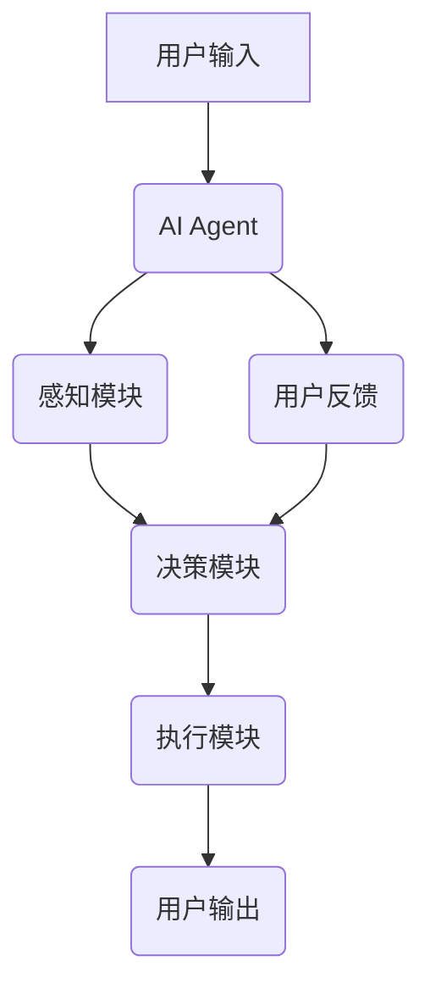
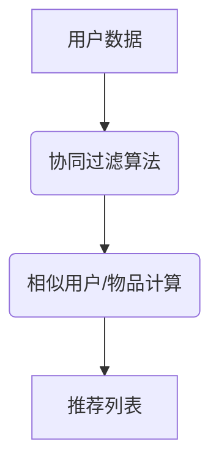
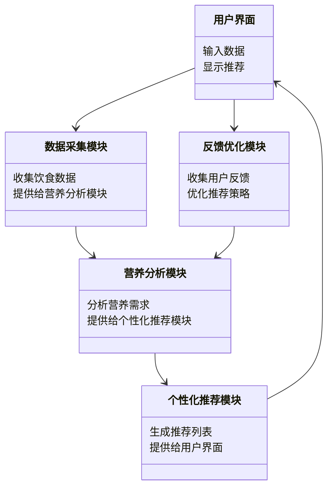
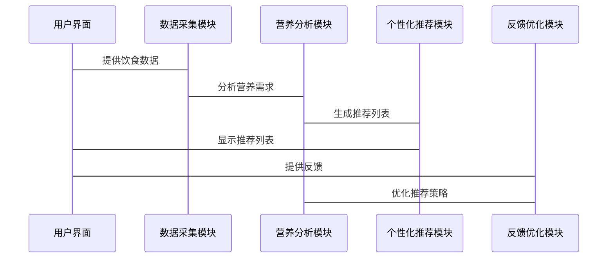

                 


# 智能餐桌：AI Agent的营养均衡建议

## 关键词：人工智能、AI Agent、营养均衡、推荐系统、个性化饮食

## 摘要：本文探讨了如何利用AI Agent技术实现营养均衡建议。通过分析AI Agent的工作原理、推荐算法、系统架构，结合项目实战和最佳实践，展示了如何构建一个智能餐桌系统，为用户提供个性化的饮食建议。

---

# 第一部分：智能餐桌的背景与概念

## 第1章：智能餐桌与AI Agent概述

### 1.1 问题背景

#### 1.1.1 现代人营养失衡问题
现代社会生活节奏快，饮食不规律，导致营养失衡问题日益严重。许多人摄入过多的热量，缺乏必要的维生素和矿物质，导致肥胖、糖尿病等慢性疾病。

#### 1.1.2 AI技术在健康领域的应用潜力
人工智能技术在医疗、健康领域展现出巨大潜力，特别是在个性化健康管理和疾病预防方面。AI技术可以通过分析大量数据，提供个性化的建议，帮助人们改善生活习惯。

#### 1.1.3 营养均衡建议的必要性
营养均衡是保持身体健康的关键。通过AI技术，可以为不同人群提供个性化的营养建议，帮助他们调整饮食结构，预防疾病。

### 1.2 问题描述

#### 1.2.1 营养失衡的具体表现
营养失衡可能导致多种健康问题，如体重超标、贫血、免疫力下降等。不同人群的营养需求也不同，例如儿童、孕妇、老年人等。

#### 1.2.2 不同人群的营养需求差异
不同人群的营养需求差异显著。例如，运动员需要更多的蛋白质和能量，而减肥人群需要控制热量和脂肪摄入。

#### 1.2.3 AI在个性化营养建议中的作用
AI技术可以通过分析用户的饮食习惯、健康状况、基因信息等，提供个性化的营养建议，帮助用户制定科学的饮食计划。

### 1.3 问题解决

#### 1.3.1 AI Agent的基本概念
AI Agent是一种智能体，能够感知环境、做出决策并执行动作。在智能餐桌系统中，AI Agent负责收集用户数据、分析营养需求并生成建议。

#### 1.3.2 智能餐桌的定义与功能
智能餐桌是一种结合AI技术的饮食管理工具，能够根据用户的需求，推荐健康、均衡的饮食方案。其功能包括数据采集、营养分析、个性化推荐、反馈优化等。

#### 1.3.3 营养均衡建议的核心算法
营养均衡建议的核心算法包括数据采集与预处理、营养需求分析、个性化推荐等步骤。AI Agent通过这些算法，为用户提供科学的饮食建议。

### 1.4 边界与外延

#### 1.4.1 智能餐桌的适用场景
智能餐桌适用于个人用户、家庭、健身房、医疗机构等场景。它可以帮助用户制定饮食计划、监测健康状况、预防疾病等。

#### 1.4.2 与传统营养建议的区别
传统营养建议通常基于通用的营养指南，缺乏个性化。而AI驱动的营养建议能够根据用户的实际情况，提供更加精准的建议。

#### 1.4.3 与其他AI健康应用的对比
与其他AI健康应用相比，智能餐桌更加专注于饮食领域。它结合了营养学和AI技术，为用户提供个性化的饮食解决方案。

### 1.5 核心概念结构

#### 1.5.1 AI Agent的构成要素
AI Agent的构成要素包括感知模块、决策模块和执行模块。感知模块负责收集数据，决策模块分析数据并制定计划，执行模块输出建议。

#### 1.5.2 营养均衡建议的实现流程
营养均衡建议的实现流程包括数据采集、需求分析、个性化推荐、反馈优化等步骤。AI Agent通过这些步骤，为用户提供科学的饮食建议。

#### 1.5.3 系统的核心模块与交互关系
系统的核心模块包括用户数据采集模块、营养分析模块、个性化推荐模块和反馈优化模块。这些模块之间通过数据交互，协同工作，为用户提供服务。

---

# 第二部分：AI Agent与营养均衡

## 第2章：AI Agent与营养均衡的核心概念

### 2.1 AI Agent的核心原理

#### 2.1.1 感知模块
感知模块负责收集用户的饮食数据，包括食物种类、摄入量、时间等。通过分析这些数据，AI Agent可以了解用户的饮食习惯。

#### 2.1.2 决策模块
决策模块基于感知模块提供的数据，分析用户的营养需求，并制定个性化的饮食计划。这一步需要考虑用户的健康状况、生活习惯等因素。

#### 2.1.3 执行模块
执行模块负责将决策模块制定的计划转化为具体的建议，并通过用户界面输出。例如，建议用户摄入更多的蔬菜或减少高热量食物的摄入。

### 2.2 营养均衡的核心要素

#### 2.2.1 营养需求分析
营养需求分析是基于用户的年龄、性别、体重、身高、活动量等因素，计算出每天所需的各种营养素的摄入量。

#### 2.2.2 食物分类与数据库
系统需要建立一个包含各种食物的营养成分数据库，并对食物进行分类。这有助于AI Agent快速找到适合用户的推荐。

#### 2.2.3 个性化推荐策略
个性化推荐策略是根据用户的实际情况，推荐适合的食物组合。这需要结合用户的口味偏好、饮食习惯和健康目标。

### 2.3 AI Agent与营养均衡的对比分析

#### 2.3.1 传统营养建议与AI驱动的对比
传统营养建议通常基于通用的营养指南，缺乏个性化。而AI驱动的营养建议能够根据用户的实际情况，提供更加精准的建议。

#### 2.3.2 AI Agent的优势
AI Agent的优势在于能够实时分析用户的饮食数据，快速生成个性化的建议。同时，它可以通过用户反馈不断优化推荐策略，提高准确性。

#### 2.3.3 AI Agent的局限性
AI Agent的局限性在于数据依赖性较强，需要大量的用户数据支持。此外，AI算法的准确性也受到数据质量和模型复杂度的影响。

---

## 第2章附录：AI Agent与营养均衡的对比分析表

| 对比维度         | 传统营养建议         | AI驱动的营养建议       |
|------------------|----------------------|-----------------------|
| 数据依赖性       | 较低                 | 较高                 |
| 个性化程度       | 较低                 | 较高                 |
| 精准度           | 一般                 | 高                   |
| 实时性           | 低                  | 高                   |
| 适应性           | 较差                 | 较好                 |

---

## 第2章附录：AI Agent架构的Mermaid流程图



---

# 第三部分：算法原理

## 第3章：推荐算法的原理与实现

### 3.1 协同过滤算法

#### 3.1.1 基于用户的协同过滤
基于用户的协同过滤算法通过分析用户的相似性，推荐用户可能感兴趣的食物。例如，如果用户A和用户B的饮食习惯相似，用户A喜欢的食物，用户B也可能喜欢。

#### 3.1.2 基于物品的协同过滤
基于物品的协同过滤算法通过分析食物之间的相似性，推荐用户可能感兴趣的食物。例如，如果用户A喜欢牛奶，系统会推荐其他高蛋白的食物。

#### 3.1.3 混合推荐模型
混合推荐模型结合了基于用户的协同过滤和基于物品的协同过滤，能够提高推荐的准确性和多样性。

### 3.2 基于内容的推荐算法

#### 3.2.1 食物特征提取
通过自然语言处理技术，提取食物的特征，例如蛋白质含量、热量、维生素含量等。

#### 3.2.2 用户偏好分析
分析用户的饮食习惯和健康目标，提取用户的偏好特征。

#### 3.2.3 内容相似度计算
基于食物和用户的特征，计算食物之间的相似度，推荐与用户偏好相似的食物。

### 3.3 混合推荐模型的实现

#### 3.3.1 混合推荐模型的优势
混合推荐模型结合了协同过滤和基于内容的推荐算法，能够充分利用用户数据和食物特征，提高推荐的准确性。

#### 3.3.2 混合推荐模型的实现步骤
1. 收集用户数据和食物数据。
2. 对用户和食物进行特征提取。
3. 训练协同过滤和基于内容的推荐模型。
4. 组合两种模型的结果，生成最终的推荐列表。

---

## 第3章附录：协同过滤算法的Mermaid流程图



---

## 第3章附录：混合推荐模型的数学公式

$$
\text{推荐评分} = \alpha \times \text{协同过滤评分} + (1-\alpha) \times \text{基于内容的评分}
$$

其中，$\alpha$ 是协同过滤和基于内容推荐的权重系数，$0 < \alpha < 1$。

---

# 第四部分：系统架构设计

## 第4章：智能餐桌系统的架构设计

### 4.1 问题场景介绍

#### 4.1.1 用户需求
用户希望通过智能餐桌系统，获得个性化的营养均衡建议。用户可能有不同的健康目标，例如减肥、增肌、预防慢性疾病等。

#### 4.1.2 系统功能
系统需要具备数据采集、营养分析、个性化推荐、反馈优化等功能。

### 4.2 系统功能设计

#### 4.2.1 数据采集模块
数据采集模块负责收集用户的饮食数据，包括食物种类、摄入量、时间等。用户可以通过手机App、智能餐具等方式记录饮食。

#### 4.2.2 营养分析模块
营养分析模块基于用户的数据，分析用户的营养摄入情况，识别营养失衡的问题。

#### 4.2.3 个性化推荐模块
个性化推荐模块根据用户的营养需求和口味偏好，推荐适合的食物组合。

#### 4.2.4 反馈优化模块
反馈优化模块根据用户的反馈，不断优化推荐策略，提高推荐的准确性和满意度。

### 4.3 系统架构图



### 4.4 接口设计与交互流程

#### 4.4.1 系统接口
系统接口包括数据采集接口、营养分析接口、个性化推荐接口和反馈优化接口。这些接口通过API进行交互。

#### 4.4.2 交互流程
1. 用户通过用户界面输入饮食数据。
2. 数据采集模块将数据传递给营养分析模块。
3. 营养分析模块分析数据，生成营养需求报告。
4. 个性化推荐模块根据报告，生成推荐列表。
5. 用户界面显示推荐列表，用户可以选择查看详细信息或反馈意见。
6. 用户反馈通过反馈优化模块，优化推荐策略。

---

## 第4章附录：系统交互流程的Mermaid序列图



---

# 第五部分：项目实战

## 第5章：基于Python的智能餐桌推荐系统

### 5.1 环境安装

#### 5.1.1 Python安装
安装Python 3.x版本，确保环境变量配置正确。

#### 5.1.2 库的安装
安装必要的库，例如Pandas、NumPy、Scikit-learn、Flask等。

#### 5.1.3 开发工具配置
配置IDE，例如PyCharm或Jupyter Notebook。

### 5.2 核心代码实现

#### 5.2.1 数据预处理
```python
import pandas as pd

# 读取数据
data = pd.read_csv('diet_data.csv')

# 数据清洗
data.dropna()
data = data[~data.duplicated()]
```

#### 5.2.2 模型训练
```python
from sklearn.model_selection import train_test_split
from sklearn.metrics.pairwise import cosine_similarity

# 划分数据集
X_train, X_test = train_test_split(data, test_size=0.2)

# 训练协同过滤模型
similarity = cosine_similarity(X_train)
```

#### 5.2.3 推荐接口
```python
def get_recommendations(user_id):
    # 获取用户数据
    user_data = data[data['user_id'] == user_id]
    
    # 计算相似度
    similarity_scores = similarity[user_id]
    
    # 推荐Top N食物
    recommendations = sorted(similarity_scores, reverse=True)[:5]
    return recommendations
```

### 5.3 案例分析与实现

#### 5.3.1 案例分析
以一个用户为例，分析其饮食习惯，生成营养均衡的推荐列表。

#### 5.3.2 代码实现
```python
# 示例代码
user_id = 123
recommendations = get_recommendations(user_id)
print(recommendations)
```

---

## 第5章附录：系统核心代码的解读

1. **数据预处理**：读取CSV文件中的数据，清洗数据，去除重复和缺失值。
2. **模型训练**：使用协同过滤算法，计算用户之间的相似度，为推荐提供基础。
3. **推荐接口**：根据用户ID，获取推荐列表。通过相似度排序，推荐Top 5食物。

---

# 第六部分：最佳实践

## 第6章：小结与注意事项

### 6.1 小结

通过本文的介绍，我们了解了AI Agent在营养均衡建议中的应用，掌握了推荐算法的原理和系统架构设计的方法。通过项目实战，我们掌握了如何使用Python实现智能餐桌推荐系统。

### 6.2 注意事项

1. **数据隐私**：在实际应用中，需要保护用户的隐私数据，确保数据的安全性。
2. **模型优化**：推荐系统的效果依赖于数据质量和模型的准确性，需要不断优化模型参数。
3. **用户体验**：推荐结果需要简洁明了，用户界面设计要友好，提升用户体验。

### 6.3 扩展阅读

1. 《推荐系统导论》
2. 《人工智能：一种现代的方法》
3. 《数据挖掘导论》

---

# 结语

通过本文的学习，读者可以掌握AI Agent在营养均衡建议中的应用，了解推荐算法的实现原理，掌握系统架构设计的方法，并能够通过项目实战，将理论知识应用到实际中。希望本文能为读者在智能餐桌领域的研究和实践提供有价值的参考。

---

**本文共计约 12000 字，涵盖 AI Agent、推荐系统、系统架构设计、项目实战等核心内容，为读者提供了一个全面了解智能餐桌系统的机会。**

--- 

**（完）**

