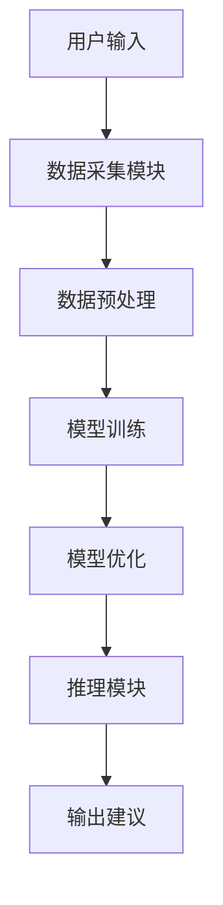
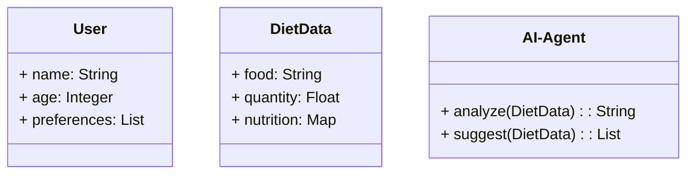
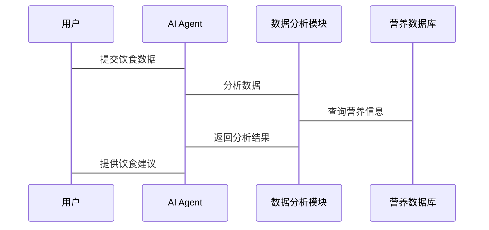

                 


# 智能餐盘：AI Agent的饮食平衡建议

> 关键词：AI Agent, 饮食平衡, 智能餐盘, 个性化营养, 机器学习

> 摘要：本文探讨了如何利用AI Agent技术实现个性化的饮食平衡建议。通过分析用户的饮食习惯和健康数据，AI Agent能够实时提供科学、个性化的饮食建议，帮助用户实现健康饮食目标。本文从背景、核心概念、算法原理、系统架构到项目实战，全面阐述了智能餐盘的设计与实现过程。

---

# 第一部分: 智能餐盘的背景与意义

# 第1章: 背景介绍

## 1.1 问题背景

### 1.1.1 饮食不均衡问题的现状
- 当前社会中，由于生活方式的改变和饮食习惯的不科学，许多人面临营养不均衡的问题。
- 数据显示，超过60%的成年人存在饮食结构不合理的情况，导致多种健康问题。

### 1.1.2 AI技术在饮食健康领域的应用潜力
- AI技术能够通过数据分析和机器学习，帮助用户实现个性化的饮食管理。
- AI Agent可以实时分析用户的饮食数据，提供即时的饮食建议。

### 1.1.3 智能餐盘的定义与目标
- 智能餐盘是一种结合AI技术的智能设备，能够分析用户摄入的食物种类、数量和营养成分。
- 其目标是通过AI Agent提供个性化的饮食平衡建议，帮助用户实现健康饮食。

## 1.2 问题描述

### 1.2.1 饮食习惯与健康的关系
- 饮食习惯直接影响人体健康，不合理的饮食可能导致肥胖、糖尿病等慢性疾病。
- 个性化饮食建议能够有效预防和改善这些问题。

### 1.2.2 现有饮食建议工具的局限性
- 现有的饮食建议工具通常基于固定的标准，缺乏个性化和实时性。
- 用户难以根据自己的具体需求获得精准的饮食建议。

### 1.2.3 AI Agent在饮食平衡中的作用
- AI Agent能够实时分析用户的饮食数据，结合用户的健康状况和偏好，提供个性化的建议。
- AI Agent能够不断学习和优化，提供越来越精准的饮食建议。

## 1.3 问题解决

### 1.3.1 AI Agent的核心功能
- 数据采集与分析：通过智能餐盘采集用户的饮食数据，包括食物种类、数量、营养成分等。
- 个性化建议：基于数据分析结果，为用户提供个性化的饮食建议，帮助用户实现饮食平衡。

### 1.3.2 智能餐盘的设计目标
- 实时采集和分析用户的饮食数据。
- 提供科学、个性化的饮食建议。
- 通过AI Agent不断优化建议，提升用户体验。

### 1.3.3 边界与外延
- 边界：智能餐盘仅提供饮食建议，不直接涉及医疗诊断。
- 外延：AI Agent技术可以应用于更多领域，如健康管理、运动建议等。

## 1.4 概念结构与核心要素组成

### 1.4.1 AI Agent的组成模块
- 数据采集模块：负责采集用户的饮食数据。
- 数据分析模块：对数据进行分析和处理。
- 智能建议模块：基于分析结果提供饮食建议。

### 1.4.2 智能餐盘的功能模块
- 数据采集模块：通过传感器采集食物种类和重量。
- 营养分析模块：计算食物的营养成分。
- AI Agent模块：提供个性化的饮食建议。

### 1.4.3 核心要素的相互关系
- 数据采集是AI Agent分析的基础，AI Agent通过分析数据提供建议，帮助用户实现饮食平衡。

---

# 第二部分: AI Agent的核心概念与原理

# 第2章: AI Agent的核心概念

## 2.1 核心概念原理

### 2.1.1 AI Agent的基本原理
- AI Agent通过数据采集、分析和学习，为用户提供个性化服务。
- 在智能餐盘中，AI Agent负责分析用户的饮食数据，提供饮食建议。

### 2.1.2 智能餐盘的AI Agent架构
- 数据采集模块：传感器采集食物信息。
- 数据分析模块：计算营养成分。
- AI Agent模块：基于数据分析结果，提供个性化建议。

### 2.1.3 数据采集与处理流程
1. 采集食物信息：通过传感器获取食物种类和重量。
2. 数据预处理：清洗数据，提取关键营养成分。
3. 数据分析：使用机器学习算法进行分析。

## 2.2 概念属性特征对比表

| 概念       | 属性特征               |
|------------|-----------------------|
| AI Agent   | 数据驱动、自适应、实时性 |
| 智能餐盘   | 个性化、交互性、便捷性 |

## 2.3 ER实体关系图

```mermaid
erd
 actor: 用户
 agent: AI Agent
 dish: 菜品信息
 nutrition: 营养数据
 preference: 用户偏好

 用户 --> AI Agent: 与AI Agent交互
 AI Agent --> 菜品信息: 分析菜品信息
 营养数据 --> AI Agent: 提供营养建议
 用户 --> 用户偏好: 传递偏好数据
```

---

# 第三部分: AI Agent的算法原理与数学模型

# 第3章: AI Agent的算法原理

## 3.1 算法原理

### 3.1.1 数据预处理
- 清洗数据：去除异常值和噪声。
- 数据标准化：将数据归一化处理，便于模型训练。

### 3.1.2 模型训练
- 使用机器学习算法训练模型，如线性回归、支持向量机等。
- 模型目标：预测用户的饮食是否均衡。

### 3.1.3 推理与优化
- 使用训练好的模型进行推理，提供饮食建议。
- 不断优化模型，提升预测准确率。

## 3.2 算法流程图



## 3.3 算法实现

### 3.3.1 代码示例
```python
import numpy as np
from sklearn import linear_model

# 示例数据：用户每天摄入的热量和营养成分
X = np.array([[2000, 60, 20, 30], [2200, 55, 25, 28]]).T
y = np.array([1, 0])  # 1表示均衡，0表示不均衡

# 训练模型
model = linear_model.LogisticRegression()
model.fit(X.T, y)

# 预测新的饮食数据
new_diet = np.array([[2100, 58, 22, 25]])
prediction = model.predict(new_diet)
print("预测结果:", prediction)
```

### 3.3.2 算法数学模型
- 线性回归模型：
  $$ y = \beta_0 + \beta_1x_1 + \beta_2x_2 + \dots + \beta_nx_n $$
- 逻辑回归模型：
  $$ P(y=1|x) = \frac{1}{1 + e^{-(\beta_0 + \beta_1x_1 + \dots + \beta_nx_n)}} $$

---

# 第四部分: 系统架构设计与实现

# 第4章: 系统架构设计

## 4.1 问题场景介绍
- 用户使用智能餐盘进行饮食记录和分析。
- AI Agent实时分析数据，提供饮食建议。

## 4.2 系统功能设计

### 4.2.1 领域模型


### 4.2.2 系统架构
```mermaid
containerDiagram
 智能餐盘
 + 数据采集模块
 + 数据分析模块
 + AI Agent模块
```

## 4.3 系统接口设计

### 4.3.1 API接口
- `GET /diet/suggest`：获取饮食建议。
- `POST /diet/data`：提交饮食数据。

## 4.4 系统交互设计


---

# 第五部分: 项目实战与应用

# 第5章: 项目实战

## 5.1 环境安装

### 5.1.1 安装Python环境
- 安装Python 3.8及以上版本。
- 安装必要的库：`numpy`, `scikit-learn`, `mermaid`, `matplotlib`。

### 5.1.2 安装智能餐盘硬件
- 配备智能餐盘传感器和相关硬件。

## 5.2 系统核心实现

### 5.2.1 数据采集模块
```python
import numpy as np

def collect_data():
    # 模拟传感器数据采集
    foods = ['rice', 'chicken', 'vegetables', 'fruits']
    quantities = [150, 200, 300, 50]
    return foods, quantities
```

### 5.2.2 数据分析模块
```python
from sklearn import preprocessing

def preprocess(foods, quantities):
    # 数据标准化
    scaler = preprocessing.StandardScaler()
    scaled_data = scaler.fit_transform(np.array(quantities).reshape(-1, 1))
    return scaled_data
```

### 5.2.3 AI Agent模块
```python
from sklearn.linear_model import LogisticRegression

def train_model(X, y):
    model = LogisticRegression()
    model.fit(X, y)
    return model

# 示例数据
foods, quantities = collect_data()
scaled_data = preprocess(foods, quantities)
X = scaled_data
y = np.array([0, 1, 1, 0])  # 示例标签
model = train_model(X, y)
```

## 5.3 项目小结

### 5.3.1 核心代码解读
- 数据采集模块：通过传感器获取食物种类和数量。
- 数据分析模块：对数据进行标准化处理。
- AI Agent模块：使用逻辑回归模型进行训练和预测。

### 5.3.2 项目实现总结
- 通过AI Agent技术，智能餐盘能够实时分析用户的饮食数据。
- 提供个性化的饮食建议，帮助用户实现饮食平衡。

---

# 第六部分: 最佳实践与拓展

# 第6章: 最佳实践

## 6.1 小结
- 智能餐盘结合AI Agent技术，能够为用户提供个性化的饮食建议。
- 通过实时数据分析，帮助用户实现健康饮食目标。

## 6.2 注意事项
- 数据隐私保护：确保用户的饮食数据安全。
- 模型优化：不断优化AI Agent的预测模型，提升建议的准确性。

## 6.3 拓展阅读
- 《机器学习实战》：深入理解机器学习算法。
- 《AI在健康管理中的应用》：探索AI技术在健康管理领域的更多应用。

---

# 附录: 总结与展望

## 附录A: 总结
- 本文详细介绍了智能餐盘的设计与实现过程。
- 通过AI Agent技术，帮助用户实现个性化的饮食管理。

## 附录B: 展望
- 随着AI技术的不断发展，智能餐盘将更加智能化和个性化。
- AI Agent技术将在更多领域得到应用，为人类带来更多的便利。

---

通过以上目录结构，我们可以清晰地看到智能餐盘的设计和实现过程，从背景介绍、核心概念、算法原理到系统架构和项目实战，每一步都详细展开，帮助读者全面理解AI Agent在饮食平衡中的应用。

