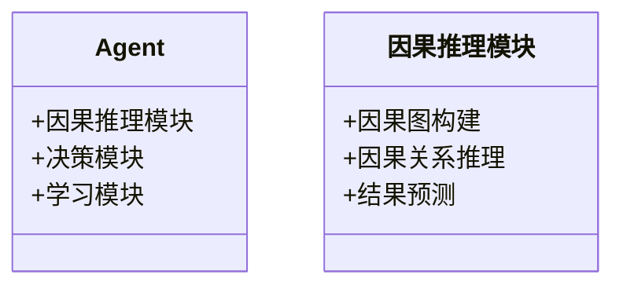

                 


# 构建AI Agent的因果推理模块

---

## 关键词：
- AI Agent
- 因果推理
- 智能系统
- 算法设计
- 系统架构

---

## 摘要：
因果推理是AI Agent实现智能决策的核心技术之一。本文系统地探讨了如何构建AI Agent的因果推理模块，从理论基础到算法实现，再到系统设计与项目实战，全面解析因果推理在AI Agent中的应用。文章结合实际案例，深入分析了因果图、概率图模型、潜在结果框架等关键概念，并通过Mermaid图和数学公式详细阐述了因果推理的算法原理和系统架构设计。最后，本文总结了构建AI Agent因果推理模块的关键要点和未来发展方向。

---

# 第一部分: 构建AI Agent的因果推理模块背景与基础

## 第1章: 因果推理与AI Agent概述

### 1.1 因果推理的基本概念
#### 1.1.1 什么是因果推理
因果推理是研究因果关系的科学方法，旨在理解变量之间的因果关系，而非仅仅是相关关系。通过因果推理，AI Agent能够从数据中推断出因果关系，并基于这些关系做出决策。

#### 1.1.2 因果推理的核心特点
- **干预性**：因果推理关注的是干预（即主动改变某个变量）对其他变量的影响。
- **反事实推理**：因果推理允许我们推理“如果...会怎样”的反事实情况。
- **可解释性**：因果推理的结果具有较强的可解释性，能够帮助人类理解AI Agent的决策过程。

#### 1.1.3 因果推理与相关概念的区别
| 概念       | 描述                                                                 |
|------------|----------------------------------------------------------------------|
| 相关关系   | 描述变量之间的统计关联性，不考虑因果关系。                       |
| 因果关系   | 描述变量之间的因果关系，强调“原因”与“结果”的关系。           |
| 预测模型   | 基于数据拟合函数，预测目标变量的值，不考虑因果关系。             |

---

### 1.2 AI Agent的基本概念
#### 1.2.1 什么是AI Agent
AI Agent（人工智能代理）是指在计算机系统中，能够感知环境、自主决策并执行任务的智能实体。AI Agent可以是软件程序、机器人或其他智能系统。

#### 1.2.2 AI Agent的分类与特点
| 分类         | 描述                                                                 |
|--------------|----------------------------------------------------------------------|
| 简单反射型代理 | 基于简单的规则进行反应式决策。                                         |
| 基于模型的代理 | 基于环境模型和目标进行决策。                                           |
| 基于学习的代理 | 通过机器学习模型从经验中学习并进行决策。                             |

#### 1.2.3 AI Agent的应用场景
- 智能助手（如Siri、Alexa）
- 自动驾驶系统
- 医疗诊断辅助系统
- 金融交易自动化

---

### 1.3 因果推理在AI Agent中的重要性
#### 1.3.1 因果推理对AI Agent决策的影响
因果推理使AI Agent能够理解干预的效果，从而做出更合理的决策。例如，在医疗诊断中，AI Agent可以通过因果推理确定某种药物对患者病情的具体影响。

#### 1.3.2 因果推理在AI Agent中的应用场景
- **医疗领域**：预测不同治疗方案的效果。
- **金融领域**：评估投资决策对市场的影响。
- **自动驾驶**：预测不同操作（如刹车、加速）对车辆运动的影响。

#### 1.3.3 因果推理对AI Agent性能的提升
因果推理使AI Agent能够更好地处理复杂环境中的不确定性，并提高决策的可解释性和可靠性。

---

### 1.4 本章小结
本章介绍了因果推理的基本概念、AI Agent的基本概念以及因果推理在AI Agent中的重要性。通过对比相关概念，明确了因果推理的独特优势和应用场景。

---

## 第2章: 因果推理的理论基础

### 2.1 因果图的基本概念
#### 2.1.1 因果图的定义
因果图是一种有向图，用于表示变量之间的因果关系。节点代表变量，边代表因果关系。

#### 2.1.2 因果图的结构与属性
- **因果链**：一系列因果关系的连接。
- **共同原因**：一个变量同时影响多个结果变量。
- **混杂变量**：可能影响因果关系的其他变量。

#### 2.1.3 因果图的绘制方法
绘制因果图需要结合领域知识，识别变量之间的因果关系，并通过图结构表示。

---

### 2.2 概率图模型与因果推理
#### 2.2.1 概率图模型的基本概念
概率图模型是一种结合概率论和图论的数学模型，用于表示变量之间的概率关系。

#### 2.2.2 概率图模型在因果推理中的应用
- **贝叶斯网络**：用于表示变量之间的概率关系，并支持因果推理。
- **马尔可夫网络**：用于表示无向图中的条件独立性。

#### 2.2.3 概率图模型与因果图的关系
概率图模型可以表示因果关系，但因果图更强调因果关系的方向性和干预效应。

---

### 2.3 因果关系的数学基础
#### 2.3.1 因果关系的数学定义
因果关系可以通过潜在结果框架（Potential Outcome Framework）进行数学定义。

#### 2.3.2 因果关系的数学模型
假设我们有变量X和Y，X对Y的因果效应可以通过以下公式表示：
$$ Y = f(X) + \epsilon $$
其中，$\epsilon$是误差项。

#### 2.3.3 因果关系的数学公式
潜在结果框架中的因果效应可以通过以下公式计算：
$$ E[Y | do(X=x)] = \sum_{x'} P(Y=y | X=x, X'=x') P(X'=x') $$
其中，$do(X=x)$表示对X进行干预，使其固定为x。

---

### 2.4 本章小结
本章介绍了因果图的基本概念、概率图模型在因果推理中的应用以及因果关系的数学基础。通过数学公式和图表，明确了因果关系的建模方法。

---

## 第3章: 因果推理的核心算法

### 3.1 潜在结果框架
#### 3.1.1 潜在结果框架的基本概念
潜在结果框架是一种用于估计因果效应的数学框架，通过定义每个单位在不同处理情况下的潜在结果。

#### 3.1.2 潜在结果框架的数学模型
假设我们有n个单位，每个单位在处理X=x时的潜在结果为$Y_i(x)$，则因果效应可以通过以下公式计算：
$$ \text{ATE} = \frac{1}{n} \sum_{i=1}^{n} (Y_i(1) - Y_i(0)) $$ $$其中，ATE表示平均处理效应。$$

#### 3.1.3 潜在结果框架的算法流程
1. 收集数据。
2. 确定处理变量和结果变量。
3. 估计因果效应。

---

### 3.2 因果森林
#### 3.2.1 因果森林的基本概念
因果森林是一种基于树结构的因果推断方法，用于估计多个处理组的因果效应。

#### 3.2.2 因果森林的算法原理
因果森林通过构建多棵决策树，估计每个样本的因果效应，并通过投票或平均的方式得到最终的因果效应估计值。

#### 3.2.3 因果森林的实现步骤
1. 数据预处理。
2. 构建决策树。
3. 估计因果效应。
4. 输出结果。

---

### 3.3 贝叶斯网络
#### 3.3.1 贝叶斯网络的基本概念
贝叶斯网络是一种有向无环图（DAG），用于表示变量之间的概率关系。

#### 3.3.2 贝叶斯网络在因果推理中的应用
- 用于估计因果效应。
- 用于计算条件概率。

#### 3.3.3 贝叶斯网络的算法流程
1. 构建贝叶斯网络。
2. 学习网络参数。
3. 推理因果效应。

---

### 3.4 本章小结
本章介绍了潜在结果框架、因果森林和贝叶斯网络三种因果推理的核心算法，并通过数学公式和算法流程图详细阐述了它们的实现原理。

---

## 第4章: 系统分析与架构设计方案

### 4.1 问题场景介绍
#### 4.1.1 问题背景
在构建AI Agent的因果推理模块时，我们需要解决如何将因果推理算法集成到AI Agent中，并实现高效的因果推理。

#### 4.1.2 问题描述
AI Agent需要具备因果推理能力，以支持智能决策。

#### 4.1.3 问题解决目标
通过构建因果推理模块，实现对因果关系的建模和推理。

---

### 4.2 系统功能设计
#### 4.2.1 领域模型设计（Mermaid类图）


---

### 4.3 系统架构设计
#### 4.3.1 系统架构设计（Mermaid架构图）
```mermaid
architectural
    title 系统架构设计
    client --> Agent: 请求
    Agent --> 因果推理模块: 接收数据
    因果推理模块 --> 决策模块: 提供推理结果
    决策模块 --> 学习模块: 更新模型
```

---

### 4.4 本章小结
本章通过Mermaid图详细展示了AI Agent的系统架构设计，包括领域模型设计和系统架构设计。

---

## 第5章: 项目实战

### 5.1 环境安装与配置
- **Python版本**：Python 3.8及以上
- **依赖库**：安装numpy、pandas、scikit-learn、pytorch等。

### 5.2 系统核心实现源代码
#### 5.2.1 因果推理模块的实现
```python
class CausalInferenceModule:
    def __init__(self, causal_graph):
        self.causal_graph = causal_graph

    def infer_causal_effect(self, treatment, outcome):
        # 假设causal_graph是一个贝叶斯网络
        return self.causal_graph.do_inference(treatment, outcome)
```

#### 5.2.2 决策模块的实现
```python
class DecisionModule:
    def __init__(self, causal_inference_module):
        self.causal_inference_module = causal_inference_module

    def make_decision(self, context):
        effect = self.causal_inference_module.infer_causal_effect(context.treatment, context.outcome)
        return effect
```

---

### 5.3 代码应用解读与分析
通过上述代码，我们可以看到因果推理模块和决策模块的交互过程。因果推理模块负责计算因果效应，决策模块基于因果效应做出决策。

---

### 5.4 实际案例分析
以医疗数据分析为例，假设我们有一个医疗数据集，包含患者的各项指标和治疗方案。通过因果推理模块，我们可以估计不同治疗方案对患者康复效果的影响。

---

### 5.5 项目小结
通过本章的项目实战，我们掌握了如何将因果推理算法集成到AI Agent中，并实现高效的因果推理。

---

## 第6章: 总结与展望

### 6.1 本章总结
本文系统地探讨了如何构建AI Agent的因果推理模块，从理论基础到算法实现，再到系统设计与项目实战，全面解析了因果推理在AI Agent中的应用。

---

### 6.2 未来展望
未来的研究方向包括：
1. 更高效的因果推理算法。
2. 更强的可解释性。
3. 更广泛的应用场景。

---

## 附录: 最佳实践与注意事项

### 6.3 最佳实践
- **数据质量**：确保数据的完整性和准确性。
- **模型选择**：根据具体场景选择合适的因果推理算法。
- **可解释性**：注重因果推理结果的可解释性。

### 6.4 注意事项
- **避免过度拟合**：在训练模型时，要注意避免过度拟合。
- **数据隐私**：在处理敏感数据时，要注意数据隐私保护。

---

## 参考文献
1. Pearl, J. (2009). Causal inference: What if the coin is biased?

