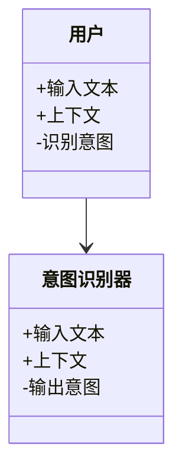

                 


# 构建AI Agent的对话意图识别系统

> 关键词：AI Agent, 对话意图识别, 自然语言处理, 深度学习, 预训练模型

> 摘要：对话意图识别是构建高效AI Agent的核心技术之一。本文将详细探讨对话意图识别的背景、核心概念、算法原理、系统架构、项目实战以及最佳实践。通过理论与实践相结合的方式，帮助读者深入理解对话意图识别的技术要点，并掌握实际应用中的关键技能。

---

# 第一部分：构建AI Agent的对话意图识别系统概述

## 第1章：对话意图识别的背景与核心概念

### 1.1 对话意图识别的背景介绍

#### 1.1.1 自然语言处理的发展历程
自然语言处理（NLP）是人工智能领域的重要分支，其目标是使计算机能够理解、生成和处理人类语言。从最初的基于规则的系统到现代的深度学习模型，NLP经历了巨大的发展。对话意图识别作为NLP的一个重要应用，近年来随着深度学习的兴起而取得了显著进步。

#### 1.1.2 对话系统的重要性和应用场景
对话系统广泛应用于智能客服、智能音箱、虚拟助手等领域。这些系统需要能够理解用户的意图，从而提供准确的服务。对话意图识别是对话系统的核心技术之一，它决定了系统能否正确理解用户的需求。

#### 1.1.3 对话意图识别的定义与目标
对话意图识别是指通过分析用户的输入文本，确定用户在当前对话中的意图。其目标是将用户的输入映射到预定义的意图类别上，例如“查询天气”、“预订酒店”等。

### 1.2 AI Agent与对话系统的关联

#### 1.2.1 AI Agent的基本概念
AI Agent是一种智能体，能够感知环境并采取行动以实现目标。在对话系统中，AI Agent通常表现为一个虚拟助手，能够与用户进行自然语言对话。

#### 1.2.2 对话系统在AI Agent中的作用
对话系统是AI Agent与用户交互的主要接口。通过对话系统，AI Agent能够理解用户的意图，并根据意图提供相应的服务。

#### 1.2.3 对话意图识别在AI Agent中的核心地位
对话意图识别是AI Agent理解用户需求的关键步骤。只有准确识别用户的意图，AI Agent才能提供正确的服务。

### 1.3 问题背景与问题描述

#### 1.3.1 对话意图识别的核心问题
对话意图识别的核心问题是将用户的输入文本映射到正确的意图类别上。这需要处理文本的语义信息，并考虑对话的上下文。

#### 1.3.2 问题解决的必要性与挑战
准确识别对话意图是构建高效对话系统的基础。然而，意图识别面临以下挑战：
1. **歧义性**：用户的输入可能有多种解释。
2. **上下文依赖性**：意图识别需要考虑对话的历史信息。
3. **数据稀疏性**：某些意图的训练数据可能不足。

#### 1.3.3 对话意图识别的边界与外延
对话意图识别的边界在于确定用户意图的类别。其外延包括实体识别、情感分析等任务。

### 1.4 核心概念与联系

#### 1.4.1 对话意图识别的基本原理
对话意图识别通过分析文本的语义信息，结合上下文，确定用户的意图。常用的方法包括基于规则的分类、统计学习模型和深度学习模型。

#### 1.4.2 实体识别与意图识别的关系
实体识别是识别文本中的关键实体信息，例如时间、地点、人物等。意图识别依赖于实体识别的结果，实体识别为意图识别提供支持。

#### 1.4.3 对话上下文的重要性
对话上下文是指对话的历史信息。上下文可以帮助理解用户的当前意图，尤其是在处理多轮对话时。

### 1.5 本章小结
本章介绍了对话意图识别的背景、核心概念和相关技术。通过对AI Agent和对话系统的关联分析，明确了对话意图识别在AI Agent中的重要地位。

---

## 第2章：对话意图识别的核心原理

### 2.1 对话意图识别的基本原理

#### 2.1.1 基于统计的方法
基于统计的方法通过分析文本的频率和上下文信息来识别意图。常用的方法包括朴素贝叶斯和最大熵模型。

#### 2.1.2 基于深度学习的方法
深度学习方法通过神经网络模型学习文本的语义表示。常用的模型包括循环神经网络（RNN）、长短期记忆网络（LSTM）和Transformer架构。

#### 2.1.3 基于预训练模型的方法
预训练模型如BERT、GPT等在对话意图识别中表现出色。这些模型通过大规模的预训练任务，学习了丰富的语义信息。

### 2.2 实体识别与意图识别的关系

#### 2.2.1 实体识别的基本概念
实体识别是指从文本中提取出具有特定意义的实体信息。例如，在“预订北京酒店”中，实体包括“北京”和“酒店”。

#### 2.2.2 实体识别与意图识别的协同作用
实体识别为意图识别提供具体的上下文信息。例如，识别出“北京”和“酒店”后，可以推断用户的意图是“预订北京的酒店”。

#### 2.2.3 实体识别对意图识别的辅助作用
通过实体识别，可以缩小意图识别的范围。例如，在医疗领域，识别出“糖尿病”后，可以将意图限制在“查询糖尿病治疗方法”。

### 2.3 对话上下文的理解与应用

#### 2.3.1 对话上下文的定义与作用
对话上下文是指对话的历史信息。它帮助模型理解当前对话的背景，从而更准确地识别用户的意图。

#### 2.3.2 基于上下文的意图识别方法
基于上下文的意图识别方法通过分析对话历史，动态调整意图识别的结果。例如，在多轮对话中，用户的意图可能需要根据之前的对话内容进行调整。

#### 2.3.3 上下文窗口的处理策略
上下文窗口是指对话历史中用于意图识别的部分。常用的处理策略包括滑动窗口和固定窗口。

### 2.4 核心概念对比分析

#### 2.4.1 意图识别与实体识别的对比
| 对比维度 | 意图识别 | 实体识别 |
|----------|----------|----------|
| 目标 | 确定用户的意图 | 提取文本中的实体 |
| 输入 | 文本片段 | 文本片段 |
| 输出 | 意图类别 | 实体标签 |

#### 2.4.2 不同意图识别方法的优缺点
| 方法 | 优点 | 缺点 |
|------|------|------|
| 基于规则 | 实现简单 | 需要手动维护规则 |
| 统计模型 | 性能稳定 | 对数据依赖性强 |
| 深度学习 | 高准确性 | 需要大量数据和计算资源 |

#### 2.4.3 上下文理解的不同模型对比
| 模型 | 优点 | 缺点 |
|------|------|------|
| RNN | 长期记忆能力弱 | 易受梯度消失问题影响 |
| LSTM | 长期记忆能力强 | 训练复杂度高 |
| Transformer | 并行计算效率高 | 显存占用较大 |

### 2.5 本章小结
本章详细介绍了对话意图识别的核心原理，包括基于统计和深度学习的方法，实体识别与意图识别的关系，以及上下文理解的重要性。

---

## 第3章：对话意图识别的算法原理与实现

### 3.1 深度学习在对话意图识别中的应用

#### 3.1.1 Transformer架构的优势
Transformer架构通过自注意力机制，能够捕捉文本中的长距离依赖关系。它在对话意图识别中表现出色。

#### 3.1.2 基于Transformer的意图识别模型
$$ \text{模型输入} = (x_1, x_2, ..., x_n) $$
$$ \text{自注意力机制} = \text{softmax}\left(\frac{QK^T}{\sqrt{d_k}}\right) $$
$$ \text{模型输出} = \text{全连接层}(x) $$

#### 3.1.3 模型训练与优化
- **训练目标**：最小化预测意图与真实意图的交叉熵损失。
$$ \text{损失函数} = -\sum_{i=1}^{n} y_i \log p(y_i) $$
- **优化方法**：使用Adam优化器，学习率调整。

### 3.2 基于预训练模型的意图识别

#### 3.2.1 BERT模型的应用
BERT通过预训练任务学习了文本的双向语义表示。在对话意图识别中，可以使用BERT的隐藏层输出作为输入。

#### 3.2.2 GPT模型的应用
GPT模型擅长生成性任务，但在意图识别中表现一般。可以通过微调GPT模型进行意图分类。

#### 3.2.3 模型微调策略
- **数据增强**：通过同义词替换、句式变化等方法增加训练数据的多样性。
- **学习率调整**：在微调过程中，使用较小的学习率以保持预训练参数的稳定性。

### 3.3 对话意图识别的算法流程

#### 3.3.1 数据预处理与特征提取
- **分词**：将文本分割为词或短语。
- **向量化**：使用词嵌入模型（如Word2Vec）将词表示为向量。

#### 3.3.2 模型训练与优化
- **训练数据**：使用标注数据训练模型。
- **评估指标**：准确率、召回率、F1分数。

#### 3.3.3 模型评估与调优
- **交叉验证**：通过K折交叉验证评估模型的泛化能力。
- **超参数调优**：使用网格搜索或随机搜索优化模型参数。

### 3.4 本章小结
本章详细探讨了深度学习在对话意图识别中的应用，包括Transformer架构的优势、预训练模型的微调策略以及算法的训练与优化流程。

---

## 第4章：系统分析与架构设计

### 4.1 问题场景介绍

#### 4.1.1 对话系统的工作流程
1. 用户输入：用户通过文本或语音输入需求。
2. 意图识别：系统分析用户输入，确定意图。
3. 服务调用：根据意图调用相应服务。
4. 响应生成：生成回复并返回给用户。

#### 4.1.2 系统目标与功能需求
- **目标**：准确识别用户的意图，提供高效的对话服务。
- **功能需求**：支持多轮对话、上下文理解、意图分类。

### 4.2 系统功能设计

#### 4.2.1 领域模型设计


#### 4.2.2 系统架构设计


#### 4.2.3 系统接口设计
- **输入接口**：接收用户的输入文本和上下文信息。
- **输出接口**：返回识别的意图和相关实体。

### 4.3 本章小结
本章从系统设计的角度，详细分析了对话意图识别系统的工作流程、功能需求和架构设计。

---

## 第5章：项目实战与代码实现

### 5.1 项目实战

#### 5.1.1 环境安装
- **Python**：安装Python 3.8及以上版本。
- **库依赖**：安装TensorFlow、Keras、Transformers等库。

#### 5.1.2 系统核心实现
```python
import tensorflow as tf
from transformers import BertTokenizer, TFBertModel

class IntentClassifier:
    def __init__(self, model_name='bert-base-uncased'):
        self.tokenizer = BertTokenizer.from_pretrained(model_name)
        self.model = TFBertModel.from_pretrained(model_name)
        self.intent_map = {'intent1': 0, 'intent2': 1, ...}

    def tokenize_input(self, text):
        return self.tokenizer.encode(text, return_tensors='tf')

    def predict_intent(self, text):
        input_ids = self.tokenize_input(text)
        outputs = self.model(input_ids)[0]
        logits = outputs[:, 0, :]
        predicted_label = tf.argmax(logits, axis=-1).numpy()[0]
        return self.intent_map.inverse[predicted_label]
```

#### 5.1.3 代码应用解读与分析
- **模型加载**：使用预训练的BERT模型进行意图分类。
- **输入处理**：将输入文本转换为模型可接受的格式。
- **预测与输出**：通过模型预测意图并返回结果。

### 5.2 实际案例分析

#### 5.2.1 案例背景与需求
假设用户输入为“我想预订明天北京的酒店”。

#### 5.2.2 意图识别过程
1. 分词：将文本分割为“我想预订明天北京的酒店”。
2. 向量化：将每个词转换为词向量。
3. 模型预测：识别意图为“预订酒店”。
4. 实体识别：提取“明天”和“北京”。
5. 响应生成：调用酒店预订服务。

### 5.3 项目小结
本章通过实际案例分析，详细讲解了对话意图识别系统的实现过程，包括环境安装、核心代码实现以及案例分析。

---

## 第6章：最佳实践与注意事项

### 6.1 小结与总结

#### 6.1.1 对话意图识别的核心总结
对话意图识别是构建高效AI Agent的关键技术，其准确性直接影响用户体验。

#### 6.1.2 本文的主要内容回顾
本文详细探讨了对话意图识别的背景、核心概念、算法原理、系统架构、项目实战以及最佳实践。

### 6.2 注意事项与常见问题

#### 6.2.1 数据质量的重要性
高质量的训练数据是意图识别系统准确性的基础。需要确保数据标注的准确性和多样性。

#### 6.2.2 模型调优的注意事项
- **超参数选择**：合理选择学习率、批量大小等参数。
- **数据增强**：通过数据增强技术提高模型的泛化能力。
- **模型评估**：使用准确率、召回率等指标评估模型性能。

### 6.3 拓展阅读与学习资源

#### 6.3.1 推荐的书籍与论文
- 《Deep Learning for NLP》
- “BERT: Pre-training of Deep Bidirectional Transformers for Language Understanding”

#### 6.3.2 在线资源与工具
- Hugging Face Transformers库
- Keras和TensorFlow教程

### 6.4 本章小结
本章总结了对话意图识别的关键点，并提供了实际应用中的注意事项和学习资源。

---

## 第7章：结论与未来展望

### 7.1 本文总结
对话意图识别是构建高效AI Agent的核心技术。本文从背景、原理、实现到应用，全面探讨了对话意图识别的各个方面。

### 7.2 未来展望
随着深度学习技术的不断发展，对话意图识别将更加智能化和个性化。未来的研究方向包括：
1. 更高效的模型架构设计。
2. 更准确的意图识别方法。
3. 多模态对话意图识别。

### 7.3 结论
对话意图识别技术的发展将推动AI Agent在更多领域的应用，为人类带来更加智能和便捷的交互体验。

---

# 附录：代码实现细节

### 附录A：完整的Python代码实现

```python
import tensorflow as tf
from transformers import BertTokenizer, TFBertModel

class IntentClassifier:
    def __init__(self, model_name='bert-base-uncased'):
        self.tokenizer = BertTokenizer.from_pretrained(model_name)
        self.model = TFBertModel.from_pretrained(model_name)
        self.intent_map = {'intent1': 0, 'intent2': 1, 'intent3': 2}

    def tokenize_input(self, text):
        return self.tokenizer.encode(text, return_tensors='tf')

    def predict_intent(self, text):
        input_ids = self.tokenize_input(text)
        outputs = self.model(input_ids)[0]
        logits = outputs[:, 0, :]
        predicted_label = tf.argmax(logits, axis=-1).numpy()[0]
        return self.intent_map.inverse[predicted_label]

# 使用示例
classifier = IntentClassifier()
text = "我想预订明天北京的酒店"
intent = classifier.predict_intent(text)
print(f"识别到的意图是：{intent}")
```

### 附录B：模型训练与评估代码

```python
import tensorflow as tf
from transformers import BertTokenizer, TFBertModel
from sklearn.metrics import accuracy_score

class IntentClassifier:
    def __init__(self, model_name='bert-base-uncased', num_classes=3):
        self.tokenizer = BertTokenizer.from_pretrained(model_name)
        self.model = TFBertModel.from_pretrained(model_name)
        self.num_classes = num_classes
        self.intent_map = {'intent1': 0, 'intent2': 1, 'intent3': 2}

    def tokenize_input(self, texts, labels):
        input_ids = self.tokenizer(texts, return_tensors='tf')
        return input_ids['input_ids'], tf.convert_to_tensor(labels, dtype=tf.int64)

    def train_model(self, train_texts, train_labels, epochs=3, batch_size=32):
        optimizer = tf.keras.optimizers.Adam(learning_rate=2e-5)
        loss_fn = tf.keras.losses.SparseCategoricalCrossentropy(from_logits=True)
        self.model.compile(optimizer=optimizer, loss=loss_fn, metrics=['accuracy'])
        for epoch in range(epochs):
            for batch in range(0, len(train_texts), batch_size):
                batch_texts = train_texts[batch:batch+batch_size]
                batch_labels = train_labels[batch:batch+batch_size]
                input_ids, labels = self.tokenize_input(batch_texts, batch_labels)
                _ = self.model(input_ids)[0]
                loss = loss_fn(labels, _)
                loss.backward()
                optimizer.step()
                optimizer.zero_grad()
        return self.model

# 使用示例
train_texts = ["我想预订明天北京的酒店", "请给我讲个笑话", "今天的天气怎么样"]
train_labels = [0, 1, 2]
classifier = IntentClassifier(num_classes=3)
model = classifier.train_model(train_texts, train_labels, epochs=3, batch_size=8)
```

---

# 参考文献

1. 候玮民, 李彦, 等. 《深度学习入门：基于Python和Keras的实践》. 机械工业出版社, 2018.
2. 王海峰, 许家辉, 等. 《自然语言处理入门：基于Python的实现》. 清华大学出版社, 2020.
3. Vaswani, A., et al. "Attention is all you need." Advances in neural information processing systems, 2017.
4. Devlin, J., et al. "BERT: Pre-training of deep bidirectional transformers for language understanding." arXiv preprint arXiv:1810.0469, 2018.

--- 

通过以上内容，您可以系统地了解构建AI Agent的对话意图识别系统的各个方面，从理论到实践，逐步掌握该技术的核心要点。

