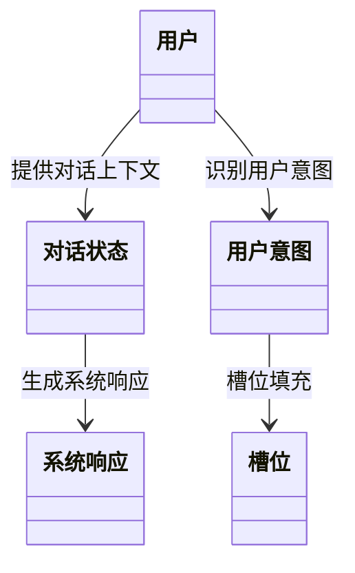
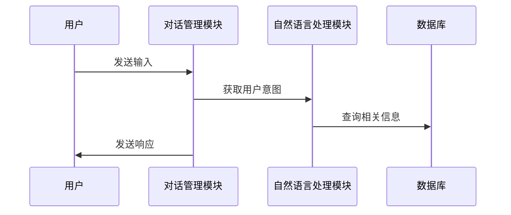

                 


# 构建AI Agent的对话管理系统

## 关键词：AI Agent，对话管理，自然语言处理，人机交互，系统架构

## 摘要：  
本文详细探讨了构建AI Agent对话管理系统的各个方面，从核心概念到算法原理，再到系统设计和项目实战，帮助读者全面理解对话管理系统的构建过程。文章结合理论与实践，通过案例分析和代码示例，深入剖析了对话管理系统的实现细节，为读者提供了从基础到实战的完整指南。

---

## 第1章: AI Agent与对话管理系统的背景介绍

### 1.1 问题背景与定义
#### 1.1.1 对话管理系统的定义
对话管理系统（DIALOGUE MANAGEMENT SYSTEM）是一种用于管理和控制人机交互过程中对话流程的系统。它负责理解用户输入、确定系统响应，并维护对话的状态，以实现有效的交流。

#### 1.1.2 问题背景：人机交互的挑战
随着人工智能技术的快速发展，人机交互已成为许多应用的核心。然而，实现高效的对话管理面临诸多挑战，如用户意图的理解、对话状态的维护以及系统响应的生成等。

#### 1.1.3 问题解决：AI Agent的作用
AI Agent（人工智能代理）通过自然语言处理和机器学习技术，能够理解和生成自然语言，从而实现与用户的有效对话，解决传统对话系统中的诸多问题。

#### 1.1.4 边界与外延
对话管理系统不仅关注对话本身，还包括用户意图的理解和系统响应的生成。其外延涉及自然语言处理、机器学习和系统架构等多个领域。

#### 1.1.5 核心要素组成
对话管理系统的组成包括对话状态表示、用户意图识别、系统响应生成等核心要素。

---

### 1.2 对话管理系统的分类与特点
#### 1.2.1 基于规则的对话系统
基于规则的对话系统通过预定义的规则来管理对话流程，适用于特定场景，如客服系统。

#### 1.2.2 统计模型驱动的对话系统
统计模型驱动的对话系统利用数据统计和概率模型进行对话管理，能够处理更复杂的场景。

#### 1.2.3 基于深度学习的对话系统
基于深度学习的对话系统通过神经网络模型学习对话模式，能够生成更自然的响应。

#### 1.2.4 对比分析与选择策略
通过对比不同模型的优缺点，选择适合特定场景的对话管理系统。

---

## 第2章: 对话管理系统的原理与核心概念

### 2.1 对话管理的核心原理
#### 2.1.1 对话状态表示
对话状态表示是对话管理的基础，通常包括当前对话的上下文信息。

#### 2.1.2 用户意图识别
通过自然语言处理技术，识别用户的意图，如槽位填充和意图分类。

#### 2.1.3 系统响应生成
根据对话状态和用户意图，生成系统的响应。

### 2.2 对话管理模型的属性特征对比
使用表格对比不同模型的优缺点：

| 模型类型       | 优点                           | 缺点                           |
|----------------|--------------------------------|--------------------------------|
| 基于规则       | 实现简单，适用于特定场景       | 灵活性差，难以处理复杂场景     |
| 基于统计       | 能处理更多数据，灵活性高       | 需大量数据支持，结果不确定性    |
| 基于深度学习    | 自然语言处理能力强，结果更自然 | 计算资源需求高，训练复杂        |

### 2.3 对话管理系统架构的ER实体关系图
使用Mermaid绘制的实体关系图：

```mermaid
erDiagram
    user : 用户
    dialog_state : 对话状态
    response : 系统响应
    intent : 用户意图
    slot : 槽位
    user --> dialog_state : 提供对话上下文
    dialog_state --> response : 生成系统响应
    user --> intent : 识别用户意图
    intent --> slot : 槽位填充
```

---

## 第3章: 对话管理系统的算法原理

### 3.1 基于决策树的对话管理
#### 3.1.1 决策树的构建过程
通过ID3算法构建决策树，用于分类用户意图。

#### 3.1.2 信息增益公式
信息增益公式：$$\text{信息增益} = \sum p \log \frac{1}{p}$$

#### 3.1.3 示例：使用ID3算法进行对话树构建
通过一个简单的示例，说明如何使用ID3算法构建对话树。

### 3.2 基于神经网络的对话管理
#### 3.2.1 神经网络的结构与训练过程
使用RNN或Transformer模型处理对话序列。

#### 3.2.2 损失函数：交叉熵损失
交叉熵损失公式：$$\text{交叉熵损失} = -\sum y \log p(y|x)$$

#### 3.2.3 示例：使用RNN处理对话序列
通过代码示例说明如何使用RNN进行对话管理。

---

## 第4章: 对话管理系统的系统分析与架构设计

### 4.1 问题场景介绍
#### 4.1.1 对话管理系统的典型应用场景
如智能客服、虚拟助手等。

#### 4.1.2 项目介绍与目标
介绍一个具体的项目，如构建一个智能客服对话管理系统。

### 4.2 系统功能设计
#### 4.2.1 领域模型设计
使用Mermaid类图展示领域模型：



#### 4.2.2 系统架构设计
使用Mermaid架构图展示系统架构：

```mermaid
archiDiagram
    component 用户界面
    component 对话管理模块
    component 自然语言处理模块
    component 数据库
    用户界面 --> 对话管理模块 : 发送用户输入
    对话管理模块 --> 自然语言处理模块 : 获取用户意图
    自然语言处理模块 --> 数据库 : 查询相关信息
    对话管理模块 --> 用户界面 : 发送系统响应
```

### 4.3 系统接口设计和交互
#### 4.3.1 接口设计
定义接口，如`getUserIntent(input: str) -> str`。

#### 4.3.2 交互序列图
使用Mermaid序列图展示系统交互：



---

## 第5章: 对话管理系统的项目实战

### 5.1 环境安装
#### 5.1.1 安装Python和必要的库
如`numpy`, `pandas`, `scikit-learn`, `transformers`等。

### 5.2 系统核心实现
#### 5.2.1 对话状态表示的实现
编写代码实现对话状态的表示。

#### 5.2.2 用户意图识别的实现
使用机器学习模型进行用户意图识别。

#### 5.2.3 系统响应生成的实现
基于预训练模型生成系统响应。

### 5.3 代码示例
```python
from sklearn.tree import DecisionTreeClassifier
from sklearn.metrics import accuracy_score

# 数据准备
X = [[...], [...]]  # 特征
y = [0, 1]          # 标签

# 模型训练
model = DecisionTreeClassifier()
model.fit(X, y)

# 预测
predicted = model.predict(X)
print("准确率:", accuracy_score(y, predicted))
```

### 5.4 实际案例分析
通过一个具体案例，说明如何使用对话管理系统解决问题。

---

## 第6章: 对话管理系统的最佳实践与小结

### 6.1 最佳实践
#### 6.1.1 数据质量的重要性
确保数据多样性和代表性。

#### 6.1.2 模型选择的策略
根据具体场景选择合适的模型。

#### 6.1.3 系统优化建议
如使用更复杂的模型、优化对话流程等。

### 6.2 小结
总结对话管理系统的构建过程，强调理论与实践的结合。

### 6.3 注意事项
在实际应用中，注意数据隐私和系统性能优化。

### 6.4 拓展阅读
推荐阅读相关领域的书籍和论文，如自然语言处理和机器学习。

---

## 总结

本文系统地介绍了构建AI Agent对话管理系统的各个方面，从背景到实现，从理论到实践，帮助读者全面掌握对话管理系统的构建过程。通过本文的学习，读者可以深入了解对话管理系统的原理和实现方法，并能够将其应用到实际项目中。

