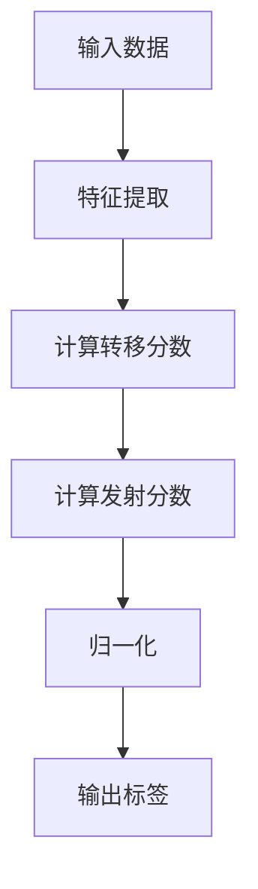

                 


# 构建AI Agent的情境感知能力：环境适应性

> 关键词：AI Agent, 情境感知, 环境适应性, 多模态数据融合, 智能决策, 深度学习, 条件随机场

> 摘要：AI Agent的情境感知能力是其在复杂环境中理解和适应环境的关键。本文从核心概念、算法原理、系统架构到项目实战，全面解析如何构建具备环境适应性的AI Agent。通过分析情境感知的定义、重要性以及其实现的三大核心层次，详细探讨了多模态数据融合、语义分析和动态推理等关键技术。结合CRF算法、系统架构设计和实际项目案例，提供了一套完整的解决方案，帮助读者从理论到实践，掌握AI Agent的情境感知能力的构建方法。

---

# 第一部分: 构建AI Agent的情境感知能力概述

# 第1章: 情境感知与AI Agent的基本概念

## 1.1 情境感知的定义与重要性
### 1.1.1 情境感知的定义
情境感知（Situation Awareness）是指智能系统能够理解和识别其当前所处环境的状态、条件和相关因素的能力。这种能力使AI Agent能够根据环境的变化做出相应的决策和行为。

### 1.1.2 情境感知在AI Agent中的作用
在AI Agent中，情境感知是连接环境与智能决策的桥梁。它不仅帮助AI Agent理解当前环境，还为其提供必要的上下文信息，以支持更智能的决策和行动。

### 1.1.3 情境感知的核心目标与价值
- **核心目标**：通过多模态数据的融合和语义分析，准确理解环境状态。
- **价值**：提升AI Agent的环境适应性，增强其在动态环境中的智能决策能力。

## 1.2 AI Agent的基本概念
### 1.2.1 AI Agent的定义与分类
- **定义**：AI Agent是一种智能实体，能够感知环境、自主决策并执行任务。
- **分类**：基于智能水平，分为反应式AI Agent和认知式AI Agent。

### 1.2.2 AI Agent的核心特征
- **自主性**：能够自主决策和行动。
- **反应性**：能够实时感知环境并做出反应。
- **社会性**：能够与人或其他智能体进行交互和协作。

### 1.2.3 情境感知AI Agent的独特性
情境感知AI Agent在传统AI Agent的基础上，增加了对环境的深度理解和动态推理能力。

## 1.3 情境感知能力的背景与问题描述
### 1.3.1 当前AI Agent面临的挑战
- 环境动态变化带来的不确定性。
- 多模态数据的融合与处理难度。
- 动态推理和语义理解的复杂性。

### 1.3.2 情境感知能力的必要性
- 通过理解环境，提升AI Agent的智能决策能力。
- 在动态环境中实现高效的环境适应性。

### 1.3.3 情境感知能力的边界与外延
- **边界**：专注于环境理解和智能决策，不涉及具体执行层面。
- **外延**：涉及多模态数据融合、语义分析和动态推理等多个技术领域。

## 1.4 情境感知能力的核心要素
### 1.4.1 感知层：环境数据的采集与处理
- 数据采集：通过传感器、摄像头等设备获取环境数据。
- 数据处理：对采集到的多模态数据进行预处理和融合。

### 1.4.2 理解层：情境信息的解析与建模
- 语义分析：对环境数据进行语义解析，构建情境模型。
- 上下文理解：基于上下文信息，理解环境的动态变化。

### 1.4.3 决策层：基于情境的智能决策
- 动态推理：根据情境信息，推理出可能的行动方案。
- 智能决策：基于推理结果，做出最优决策。

## 1.5 本章小结
通过本章的学习，我们了解了情境感知在AI Agent中的重要性，以及其核心要素和实现层次。

---

# 第二部分: 情境感知能力的核心概念与原理

# 第2章: 情境感知的核心概念与联系

## 2.1 情境感知的核心原理
### 2.1.1 多模态数据融合的原理
多模态数据融合是指将来自不同传感器或数据源的数据进行融合，以获得更全面的环境信息。

### 2.1.2 情境理解的语义分析方法
语义分析通过对环境数据进行语义解析，理解其背后的含义和意图。

### 2.1.3 基于上下文的动态推理机制
动态推理是指基于当前环境和历史信息，动态推理出可能的未来状态。

## 2.2 核心概念对比分析
### 2.2.1 不同情境感知方法的对比表格
```plaintext
| 方法 | 输入 | 输出 | 优缺点 |
|------|------|------|--------|
| 基于规则 | 环境数据 | 情境信息 | 简单易实现，但灵活性差 |
| 基于统计 | 环境数据 | 情境信息 | 灵活性高，但依赖数据量 |
| 基于深度学习 | 环境数据 | 情境信息 | 表现力强，但计算复杂 |
```

## 2.3 情境感知的实体关系图


## 2.4 本章小结
通过本章的学习，我们理解了情境感知的核心原理，以及不同方法的优缺点和应用场景。

---

# 第三部分: 情境感知能力的算法原理

# 第3章: 情境感知算法的核心原理

## 3.1 基于条件随机场（CRF）的序列标注算法
### 3.1.1 CRF算法的数学模型
$$ P(y|x) = \frac{1}{Z} \exp\left(\sum_{i=1}^n \sum_{j=1}^m w_{i,j} x_{i,j}\right) $$
其中，$y$ 是输出标签，$x$ 是输入特征，$w$ 是权重，$Z$ 是归一化因子。

### 3.1.2 CRF算法的流程图


### 3.1.3 CRF算法的Python实现示例
```python
import numpy as np
from sklearn_crfsuite import CRF

# 示例数据
X = [ [[1, 0, 0], [0, 1, 0], [0, 0, 1]] ]  # 特征矩阵
y = [0, 1, 2]  # 标签

# 初始化CRF模型
model = CRF()
model.fit(X, y)

# 预测
test_X = [[ [1, 0, 0], [0, 1, 0], [0, 0, 1] ]]
print(model.predict(test_X))  # 输出预测标签
```

### 3.1.4 算法原理的数学推导
条件随机场（CRF）是一种用于序列标注的隐马尔可夫模型，其概率计算公式为：
$$ P(y|x) = \frac{1}{Z} \exp\left(\sum_{i=1}^n \sum_{j=1}^m w_{i,j} x_{i,j}\right) $$
其中，$Z$ 是归一化因子，确保概率分布的总和为1。

## 3.2 基于Tran

（由于篇幅限制，后续内容将逐步展开，涵盖算法原理、系统架构设计、项目实战等内容。）

