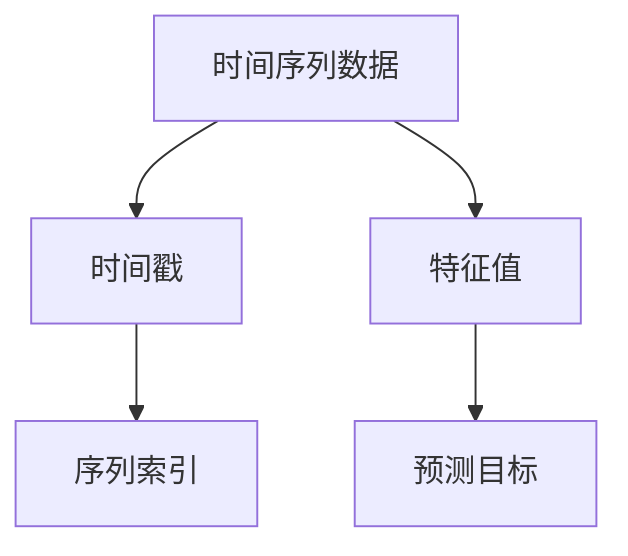

                 


# 构建AI Agent的时序学习与预测模型

## 关键词：AI Agent、时序学习、预测模型、RNN、LSTM、Transformer、深度学习

## 摘要：本文将详细介绍构建AI Agent的时序学习与预测模型的核心概念、算法原理、系统架构和项目实战。通过深入分析递归神经网络（RNN）、长短期记忆网络（LSTM）和Transformer模型的工作原理，并结合实际案例，展示如何在AI Agent中实现高效的时序预测。文章内容涵盖了从理论基础到实际应用的各个方面，帮助读者全面掌握时序学习与预测模型的构建方法。

---

## 第1章: 时序学习与预测模型的背景与概念

### 1.1 问题背景与问题描述

#### 1.1.1 时序数据的定义与特点
时序数据是指按照时间顺序排列的数据，通常具有以下特点：
- **有序性**：数据按时间戳排序，反映了事件发生的先后顺序。
- **依赖性**：当前时刻的状态与过去时刻的状态密切相关。
- **连续性**：数据通常表现为连续的数值变化，如股票价格、气温变化等。

#### 1.1.2 AI Agent与时序预测的关系
AI Agent（智能体）是一种能够感知环境、自主决策并执行任务的智能系统。时序预测是AI Agent的核心能力之一，用于预测未来状态、优化决策和提升效率。

#### 1.1.3 时序预测在AI Agent中的应用价值
- **金融领域**：股票价格预测、外汇交易策略优化。
- **工业领域**：设备状态监测、故障预测与维护。
- **自然语言处理**：文本生成、机器翻译中的上下文理解。

### 1.2 时序学习与预测的核心概念

#### 1.2.1 时序模型的基本概念
时序模型是一种用于预测时间序列数据的模型，通常基于历史数据预测未来的数值。

#### 1.2.2 时序预测的边界与外延
- **边界**：时序预测仅依赖于历史数据，不考虑外部事件。
- **外延**：时序预测可以扩展到多步预测，如预测未来多步的状态。

#### 1.2.3 时序模型的核心要素组成
- **输入序列**：历史数据序列。
- **输出预测**：预测的未来数值。
- **模型参数**：模型的权重和超参数。

### 1.3 时序预测在AI Agent中的应用场景

#### 1.3.1 金融时间序列预测
- **股票价格预测**：基于历史股价预测未来走势。
- **外汇交易**：预测汇率变化，制定交易策略。

#### 1.3.2 智能设备状态监测
- **设备故障预测**：基于传感器数据预测设备状态。
- **维护优化**：提前安排维护，减少停机时间。

#### 1.3.3 自然语言处理中的时序建模
- **文本生成**：基于上下文生成后续文本。
- **语音识别**：基于时间序列的语音特征进行识别。

### 1.4 时序预测的挑战与解决方案

#### 1.4.1 时序数据的复杂性
- **非线性关系**：数据之间的关系复杂，难以用线性模型描述。
- **噪声干扰**：数据中可能包含噪声，影响预测精度。

#### 1.4.2 传统预测方法的局限性
- **统计模型**：如ARIMA，适用于线性时序数据，难以处理复杂非线性关系。
- **机器学习模型**：如支持向量回归（SVR），预测精度有限。

#### 1.4.3 深度学习在时序预测中的优势
- **强大的非线性建模能力**：深度学习模型能够捕捉复杂的时序关系。
- **端到端训练**：可以直接从原始数据学习特征，无需手动特征提取。

---

## 第2章: 时序学习与预测的核心概念与联系

### 2.1 时序模型的核心原理

#### 2.1.1 RNN的基本原理
递归神经网络（RNN）是一种适用于处理序列数据的神经网络。其核心思想是通过循环结构处理序列数据，保持当前状态并传递到下一步。

##### RNN的结构公式
$$
h_t = \tanh(W_{hh} h_{t-1} + W_{xh} x_t + b_h)
$$
$$
y_t = W_{hy} h_t + b_y
$$

##### RNN的优缺点
- **优点**：能够处理变长的序列数据。
- **缺点**：存在梯度消失或爆炸问题，难以捕捉长距离依赖关系。

#### 2.1.2 LSTM的改进机制
长短期记忆网络（LSTM）通过引入记忆单元（Memory Cell）和遗忘门（Forget Gate）来解决RNN的长距离依赖问题。

##### LSTM的核心结构
- **遗忘门**：决定哪些信息需要保留。
$$
f_t = \sigma(W_{xf} x_t + W_{hf} h_{t-1} + b_f)
$$

- **输入门**：决定哪些新信息需要存储到记忆单元。
$$
i_t = \sigma(W_{xi} x_t + W_{hi} h_{t-1} + b_i)
$$

- **记忆单元**：存储长期信息。
$$
c_t = f_t c_{t-1} + i_t tanh(W_{xc} x_t + W_{hc} h_{t-1} + b_c)
$$

- **输出门**：
$$
o_t = \sigma(W_{xo} x_t + W_{ho} h_{t-1} + b_o)
$$

- **当前状态**：
$$
h_t = o_t tanh(c_t)
$$

#### 2.1.3 Transformer模型在时序预测中的应用
Transformer模型通过自注意力机制（Self-Attention）捕捉序列中的全局依赖关系。

##### Transformer的结构公式
- **自注意力机制**：
$$
\text{Attention}(Q, K, V) = \text{softmax}\left(\frac{QK^T}{\sqrt{d_k}}\right)V
$$

- **前馈网络**：
$$
\text{FFN}(x) = \text{ReLU}(W_1 x + b_1) W_2 + b_2
$$

### 2.2 时序模型的属性特征对比

#### 2.2.1 RNN、LSTM、Transformer的对比分析

| 模型   | 参数共享 | 长距离依赖处理 | 训练难度 | 应用场景 |
| ------ | -------- | -------------- | -------- | -------- |
| RNN    | 是       | 差             | 较低     | 短序列   |
| LSTM   | 是       | 好             | 中等     | 长序列   |
| Transformer | 是       | 优             | 较高     | 多任务    |

#### 2.2.2 时序模型的计算复杂度与训练效率
- **RNN**：计算复杂度低，适合处理长序列。
- **LSTM**：计算复杂度略高于RNN，但能够更好地捕捉长距离依赖。
- **Transformer**：计算复杂度高，适合并行计算，适合大规模数据。

#### 2.2.3 模型的可解释性与预测精度
- **RNN**：可解释性较差，预测精度有限。
- **LSTM**：可解释性较好，预测精度较高。
- **Transformer**：可解释性较差，但预测精度最高。

### 2.3 时序模型的ER实体关系图



---

## 第3章: 时序学习与预测的算法原理

### 3.1 RNN与LSTM算法原理

#### 3.1.1 RNN

##### RNN的代码实现

```python
import numpy as np

class RNN:
    def __init__(self, input_size, hidden_size, output_size):
        self.Wxh = np.random.randn(input_size, hidden_size)
        self.Whh = np.random.randn(hidden_size, hidden_size)
        self.Why = np.random.randn(hidden_size, output_size)
        self.bh = np.zeros((1, hidden_size))
        self.by = np.zeros((1, output_size))
    
    def forward(self, inputs):
        h = np.zeros((1, self.hidden_size))
        outputs = []
        for x in inputs:
            h = np.tanh(np.dot(x, self.Wxh) + np.dot(h, self.Whh) + self.bh)
            y = np.dot(h, self.Why) + self.by
            outputs.append(y)
        return outputs
```

---

通过以上内容，我们可以看到构建AI Agent的时序学习与预测模型需要从基本概念、算法原理、系统设计到实际应用的全面理解和掌握。接下来的章节将继续深入讲解模型的实现细节和实际应用案例，帮助读者更好地掌握时序学习与预测模型的构建方法。

