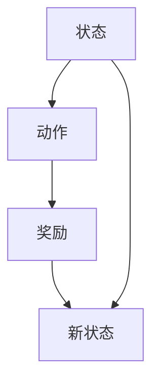
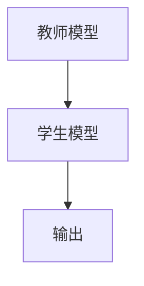
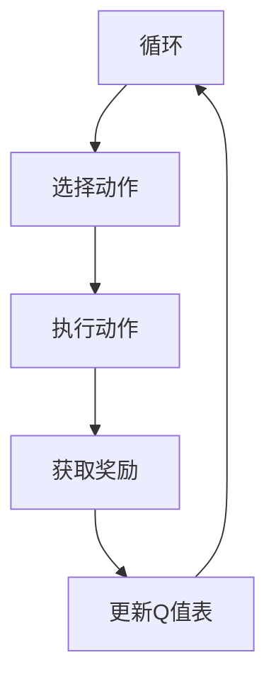
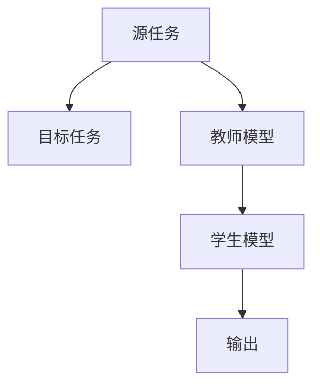
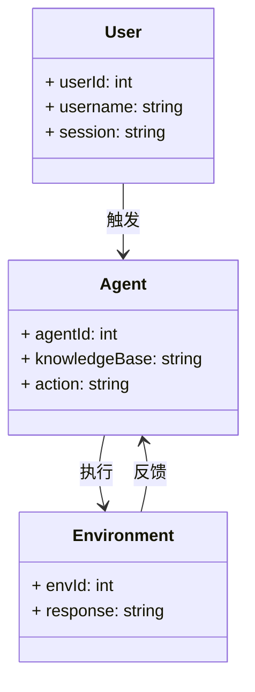
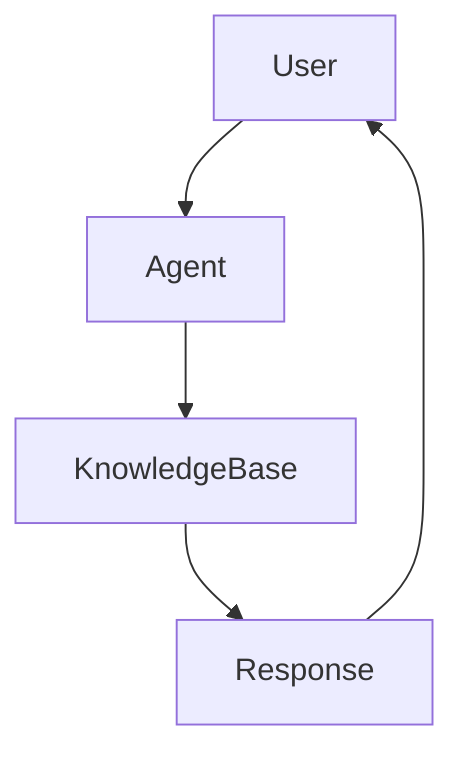
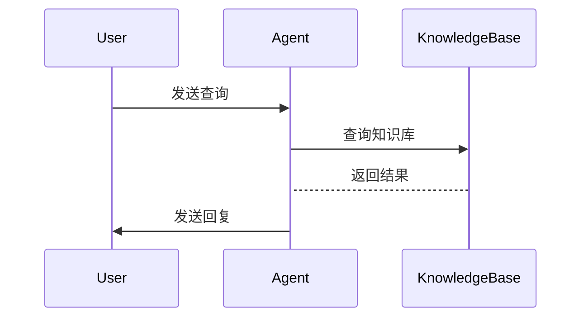

                 


# 构建AI Agent的概念抽象与泛化能力

## 关键词
AI Agent, 概念抽象, 泛化能力, 强化学习, 转移学习, 系统架构

## 摘要
AI Agent作为人工智能领域的重要组成部分，其核心能力在于概念抽象与泛化。本文将从AI Agent的基本概念出发，深入探讨其核心概念、算法原理、数学模型、系统架构，并通过实际案例分析，帮助读者全面理解AI Agent的概念抽象与泛化能力。通过本文，读者将能够掌握AI Agent的核心原理，并能够实际应用于相关项目中。

---

## 第1章 AI Agent概述

### 1.1 AI Agent的基本概念
AI Agent（人工智能代理）是指能够感知环境、自主决策并执行任务的智能实体。与传统的被动程序不同，AI Agent具备主动性和适应性，能够在动态环境中完成复杂任务。

#### 1.1.1 什么是AI Agent
AI Agent是一种能够感知环境、采取行动以实现目标的智能系统。它可以是一个软件程序，也可以是一个物理设备，例如智能机器人。

#### 1.1.2 AI Agent的定义与特点
- **定义**：AI Agent是一个具备感知、决策、执行能力的智能实体。
- **特点**：
  1. 主动性：能够主动采取行动。
  2. 反应性：能够根据环境变化调整行为。
  3. 学习能力：能够通过经验改进性能。

#### 1.1.3 AI Agent与其他智能系统的关系
- **与机器学习的关系**：AI Agent依赖机器学习算法实现感知和决策。
- **与深度学习的关系**：深度学习为AI Agent提供强大的特征提取能力。
- **与强化学习的关系**：强化学习是AI Agent实现自主决策的核心技术。

### 1.2 AI Agent的历史与演进
AI Agent的概念起源于20世纪60年代的知识表示与推理研究，经历了从专家系统到深度强化学习的演进。

#### 1.2.1 AI Agent的起源与发展
- **起源**：20世纪60年代的知识表示与推理研究。
- **发展**：随着机器学习和深度学习的发展，AI Agent逐渐具备更强的自主决策能力。

#### 1.2.2 AI Agent在不同领域的应用
- **智能助手**：例如Siri、Alexa。
- **自动驾驶**：例如特斯拉的自动驾驶系统。
- **智能客服**：例如自动响应的客服系统。

#### 1.2.3 当前AI Agent研究的热点与趋势
- **热点**：强化学习、人机协作、边缘计算。
- **趋势**：向更通用化、智能化方向发展。

### 1.3 AI Agent的核心问题与挑战
AI Agent的核心问题在于如何实现概念抽象与泛化能力。

#### 1.3.1 概念抽象的难点
- **复杂性**：需要处理多维度的信息。
- **不确定性**：环境中的不确定性增加了概念抽象的难度。

#### 1.3.2 泛化能力的实现路径
- **数据驱动**：通过大量数据学习通用模式。
- **知识驱动**：结合领域知识提升泛化能力。

#### 1.3.3 AI Agent的实际应用场景与限制
- **应用场景**：智能监控、智能医疗、智能金融。
- **限制**：数据依赖性强、处理复杂场景的能力有限。

## 第2章 AI Agent的核心概念

### 2.1 AI Agent的组成要素
AI Agent由感知、决策、执行三个核心模块组成。

#### 2.1.1 感知模块
- **功能**：通过传感器或数据源获取环境信息。
- **示例**：计算机视觉、自然语言处理。

#### 2.1.2 决策模块
- **功能**：根据感知信息制定行动方案。
- **示例**：路径规划、策略选择。

#### 2.1.3 执行模块
- **功能**：将决策结果转化为实际行动。
- **示例**：机器人执行动作、智能系统发送响应。

### 2.2 AI Agent的行为模式
AI Agent的行为模式包括监督学习、强化学习和无监督学习。

#### 2.2.1 监督学习模式
- **特点**：需要大量标注数据。
- **示例**：分类任务、回归任务。

#### 2.2.2 强化学习模式
- **特点**：通过与环境交互学习策略。
- **示例**：游戏AI、机器人控制。

#### 2.2.3 无监督学习模式
- **特点**：无需标注数据，发现数据内在结构。
- **示例**：聚类分析、异常检测。

### 2.3 AI Agent的属性特征对比
通过表格对比AI Agent的属性特征，帮助读者更好地理解其特点。

| 特性 | 监督学习 | 强化学习 | 无监督学习 |
|------|----------|----------|------------|
| 数据需求 | 标注数据 | 环境反馈 | 无标注数据 |
| 学习目标 | 分类/回归 | 最大化奖励 | 发现数据结构 |
| 应用场景 | 图像分类 | 游戏AI | 聚类分析 |

### 2.4 AI Agent的ER实体关系图
通过ER图展示AI Agent的核心实体及其关系。

```mermaid
erDiagram
    actor User {
        string userId
        string username
    }
    agent AI-Agent {
        string agentId
        string agentName
    }
    action Action {
        string actionId
        string actionDesc
    }
    environment Environment {
        string envId
        string envDesc
    }
    User ->o "触发" AI-Agent
    AI-Agent ->o "执行" Action
    Action <-o "响应" Environment
    Environment ->o "反馈" AI-Agent
```

### 2.5 本章小结
本章介绍了AI Agent的核心概念，包括组成模块、行为模式及属性特征对比，帮助读者建立了AI Agent的基本认知。

---

## 第3章 AI Agent的算法原理

### 3.1 强化学习算法
强化学习是AI Agent实现自主决策的核心算法。

#### 3.1.1 Q-learning算法
- **原理**：通过状态-动作-奖励的循环更新Q值表。
- **流程图**：



- **Python实现示例**：

```python
import numpy as np

class QLearning:
    def __init__(self, state_space, action_space):
        self.q_table = np.zeros((state_space, action_space))
    
    def choose_action(self, state, epsilon):
        if np.random.random() < epsilon:
            return np.random.randint(action_space)
        return np.argmax(self.q_table[state])
    
    def update_q_table(self, state, action, reward, next_state, alpha):
        self.q_table[state, action] = (1 - alpha) * self.q_table[state, action] + alpha * (reward + np.max(self.q_table[next_state]))
```

### 3.2 转移学习算法
转移学习通过将知识从源任务迁移到目标任务，提升AI Agent的泛化能力。

#### 3.2.1 知识蒸馏算法
- **原理**：通过教师模型指导学生模型学习。
- **流程图**：



- **Python实现示例**：

```python
def knowledge_distillation(teacher_model, student_model, input_data, temperature=1.0):
    teacher_logits = teacher_model.predict(input_data)
    student_logits = student_model.predict(input_data)
    
    # 蒸馏过程
    teacher_probs = np.exp(teacher_logits / temperature) / np.exp(teacher_logits / temperature).sum(axis=1, keepdims=True)
    student_probs = np.exp(student_logits / temperature) / np.exp(student_logits / temperature).sum(axis=1, keepdims=True)
    
    loss = -np.sum(teacher_probs * np.log(student_probs))
    return loss
```

### 3.3 算法流程图
通过流程图展示强化学习和转移学习的算法流程。

#### 3.3.1 强化学习流程图



#### 3.3.2 转移学习流程图



### 3.4 本章小结
本章详细讲解了AI Agent的核心算法，包括强化学习和转移学习的原理、流程及实现代码。

---

## 第4章 AI Agent的数学模型与公式

### 4.1 概率论基础
概率论是AI Agent算法的数学基础。

#### 4.1.1 条件概率公式
$$ P(A|B) = \frac{P(A \cap B)}{P(B)} $$

#### 4.1.2 贝叶斯定理
$$ P(A|B) = \frac{P(B|A)P(A)}{P(B)} $$

#### 4.1.3 马尔可夫链
$$ P(X_t | X_{t-1}, ..., X_0) = P(X_t | X_{t-1}) $$

### 4.2 优化算法基础
优化算法是AI Agent训练的核心。

#### 4.2.1 梯度下降法
$$ \theta := \theta - \eta \cdot \nabla J(\theta) $$

#### 4.2.2 动量优化法
$$ v_t = \beta v_{t-1} + (1-\beta) \nabla J(\theta) $$
$$ \theta := \theta - \eta \cdot v_t $$

#### 4.2.3 Adam优化器
$$ m_t = \beta_1 m_{t-1} + (1-\beta_1) \nabla J(\theta) $$
$$ v_t = \beta_2 v_{t-1} + (1-\beta_2)(\nabla J(\theta))^2 $$
$$ \theta := \theta - \frac{\eta}{\sqrt{v_t + \epsilon}} m_t $$

### 4.3 深度学习模型
深度学习模型为AI Agent提供了强大的特征提取能力。

#### 4.3.1 卷积神经网络
卷积神经网络（CNN）常用于图像处理任务，其核心公式为：
$$ f(x) = \sigma(Wx + b) $$

### 4.4 本章小结
本章通过数学公式详细讲解了AI Agent的算法基础，包括概率论、优化算法和深度学习模型。

---

## 第5章 AI Agent的系统架构设计

### 5.1 问题场景介绍
以智能客服系统为例，介绍AI Agent的系统架构设计。

### 5.2 系统功能设计
系统功能模块包括用户交互、意图识别、知识库查询、生成回复。

#### 5.2.1 领域模型


#### 5.2.2 系统架构


### 5.3 系统接口设计
系统接口包括用户输入接口、知识库查询接口、环境反馈接口。

### 5.4 系统交互设计
系统交互流程包括用户输入、意图识别、知识查询、生成回复。

#### 5.4.1 序列图


### 5.5 本章小结
本章通过智能客服系统的案例，详细讲解了AI Agent的系统架构设计。

---

## 第6章 AI Agent的项目实战

### 6.1 环境安装
安装Python、TensorFlow、Keras等开发环境。

### 6.2 核心代码实现
实现一个简单的智能客服系统的AI Agent。

#### 6.2.1 感知模块
```python
import numpy as np
from tensorflow import keras

model = keras.Sequential([
    keras.layers.Dense(64, activation='relu'),
    keras.layers.Dense(10, activation='softmax')
])
model.compile(optimizer='adam', loss='sparse_categorical_crossentropy', metrics=['accuracy'])
model.fit(x_train, y_train, epochs=10, batch_size=32)
```

#### 6.2.2 决策模块
```python
def decide_action(state, model):
    action = model.predict(state)
    return np.argmax(action)
```

#### 6.2.3 执行模块
```python
def execute_action(action, environment):
    # 根据动作执行环境操作
    return environment.feedback(action)
```

### 6.3 案例分析
以智能客服系统为例，分析AI Agent的实际应用。

### 6.4 项目总结
总结项目实现的过程、优缺点及未来改进方向。

### 6.5 本章小结
本章通过实际项目实战，帮助读者掌握AI Agent的实现方法。

---

## 第7章 总结与展望

### 7.1 总结
本文详细讲解了AI Agent的概念抽象与泛化能力，从理论到实践，全面介绍了AI Agent的核心原理和实现方法。

### 7.2 展望
未来，AI Agent将朝着更通用化、智能化方向发展，具备更强的泛化能力和自主决策能力。

---

## 关键词
AI Agent, 概念抽象, 泛化能力, 强化学习, 转移学习, 系统架构

## 参考文献
- Russell, S., & Norvig, P. (2010). Artificial Intelligence: A Modern Approach.
- Sutton, R. S., & Barto, A. G. (2018). Reinforcement Learning: Theory and Algorithms.
- LeCun, Y., Bengio, Y., & Hinton, G. (2015). Deep Learning.

---

通过本文，读者可以系统地了解AI Agent的概念抽象与泛化能力，并能够将其应用于实际项目中。

