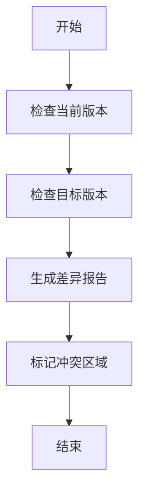
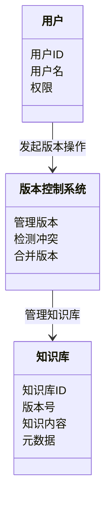
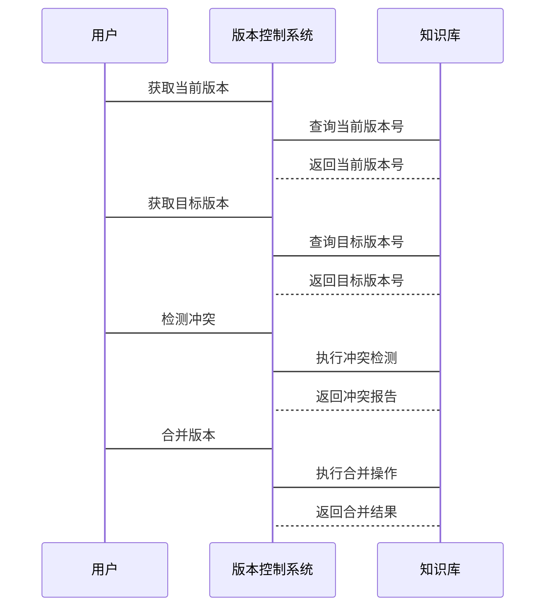

                 


# 《构建AI Agent的知识库版本控制系统》

## 关键词
- AI Agent
- 知识库
- 版本控制系统
- 系统架构
- 项目实战

## 摘要
本书系统地探讨了构建AI Agent的知识库版本控制系统的各个方面，从基础概念到算法实现，再到系统架构设计和项目实战，全面解析了如何有效地管理AI Agent的知识库版本。通过详细的步骤和实例分析，读者将掌握构建高效、可靠的AI Agent知识库版本控制系统的技能。

---

## 第一部分：背景介绍

### 第1章：问题背景与描述

#### 1.1 问题背景
- 1.1.1 知识库版本控制的重要性
  - 在AI Agent中，知识库是核心，频繁的更新和维护需要有效的版本控制。
  - 版本控制确保知识库的准确性和一致性，避免数据冲突和丢失。
  
- 1.1.2 AI Agent在知识库管理中的作用
  - AI Agent通过学习和推理，能够自动管理知识库的版本。
  - AI Agent的知识库管理需要高效的版本控制机制。

#### 1.2 问题描述
- 1.2.1 知识库版本控制的挑战
  - 知识库的复杂性和动态性导致版本控制的难度增加。
  - 多用户协作和实时更新对版本控制系统提出了更高要求。
  
- 1.2.2 AI Agent的知识库管理需求
  - 需要支持实时更新和多版本回溯。
  - 确保知识库的一致性和可追溯性。

#### 1.3 问题解决方法
- 1.3.1 版本控制的基本原理
  - 使用树状结构表示版本历史，每个版本都有唯一的标识符。
  - 通过分支和合并管理不同的版本流。
  
- 1.3.2 AI Agent的知识库管理解决方案
  - 结合版本控制技术，设计专门的AI Agent知识库管理系统。
  - 利用AI技术优化版本控制的效率和准确性。

#### 1.4 边界与外延
- 1.4.1 系统边界定义
  - 限定在AI Agent的知识库管理范围内，不涉及其他系统的数据。
  
- 1.4.2 知识库版本控制的外延应用
  - 可应用于企业知识管理、数据仓库维护等领域。

#### 1.5 核心要素组成
- 1.5.1 知识库的结构
  - 包括数据层、元数据层和关联层。
  
- 1.5.2 版本控制的关键要素
  - 版本标识符、变更记录、合并策略、冲突检测机制。

---

## 第二部分：核心概念与联系

### 第2章：知识库版本控制的核心原理

#### 2.1 核心概念原理
- 2.1.1 版本控制的基本概念
  - 版本控制是一种记录文件修改过程的工具，通过跟踪每个版本的变化，实现文件的回溯和恢复。
  - 常见的版本控制系统如Git，采用分布式版本控制，确保数据的安全性和一致性。

- 2.1.2 知识库的结构与属性
  - 知识库通常由多个数据块组成，每个数据块有特定的属性，如版本号、创建时间、修改时间等。

#### 2.2 概念属性特征对比
- 使用表格对比版本控制和知识库管理的属性：

| 属性          | 版本控制          | 知识库管理          |
|---------------|------------------|------------------|
| 核心目标      | 管理文件变更      | 管理知识库变更      |
| 实现方式      | 使用版本控制系统  | 使用知识库管理系统  |
| 关键要素      | 版本号、分支      | 知识节点、关联关系  |

#### 2.3 ER实体关系图
- 使用Mermaid绘制知识库版本控制的ER图：

```mermaid
erDiagram
    actor 用户 {
        role 开发者
        role 管理员
    }
    knowledge_base {
        id 知识库ID
        version 版本号
        content 知识内容
        metadata 元数据
    }
    用户 -> knowledge_base : 操作
    knowledge_base -> 版本控制系统 : 管理
```

---

## 第三部分：算法原理讲解

### 第3章：冲突检测与合并算法

#### 3.1 算法原理
- 冲突检测的基本步骤：
  1. 检查当前版本与目标版本是否存在差异。
  2. 生成差异报告，标记冲突的区域。
  3. 提供解决冲突的策略，如优先采用最新版本或手动合并。

- 使用Mermaid绘制冲突检测流程图：



#### 3.2 Python代码实现
- 冲突检测的Python代码示例：

```python
def detect_conflict(current_version, target_version):
    if current_version == target_version:
        return None
    # 生成差异报告
    diff_report = []
    # 假设版本号为整数，按升序排列
    for i in range(min(current_version, target_version), max(current_version, target_version) + 1):
        diff_report.append(f"Version {i} differs from {i+1}")
    return diff_report

# 示例使用
current = 5
target = 3
conflicts = detect_conflict(current, target)
print("差异报告:", conflicts)
```

#### 3.3 数学模型与公式
- 冲突检测的数学模型：

$$ \text{冲突存在} = \exists i \in [1, n], \text{current}_i \neq \text{target}_i $$

- 其中，$n$ 是版本号的最大值，$\text{current}_i$ 和 $\text{target}_i$ 分别是当前版本和目标版本在第$i$个位置的值。

---

## 第四部分：系统分析与架构设计

### 第4章：系统功能与架构

#### 4.1 系统功能设计
- 使用Mermaid绘制领域模型类图：



#### 4.2 系统架构设计
- 使用Mermaid绘制系统架构图：

```mermaid
archi
    知识库管理系统
    components {
        用户界面
        业务逻辑层
        数据访问层
    }
    知识库管理系统 --> 用户界面 : 显示操作界面
    用户界面 --> 业务逻辑层 : 发起操作请求
    业务逻辑层 --> 数据访问层 : 执行数据库操作
    数据访问层 --> 知识库 : 更新或查询知识库数据
```

#### 4.3 系统接口设计
- 关键接口：
  - 获取当前版本：`GET /api/version/current`
  - 获取目标版本：`GET /api/version/target`
  - 检测冲突：`POST /api/conflict/detect`
  - 合并版本：`POST /api/version/merge`

#### 4.4 系统交互
- 使用Mermaid绘制交互序列图：



---

## 第五部分：项目实战

### 第5章：环境安装与核心代码实现

#### 5.1 环境安装
- 安装Python和必要的库：
  ```bash
  pip install mermaid
  pip install -r requirements.txt
  ```

#### 5.2 核心代码实现
- 版本控制系统的核心代码：

```python
class VersionControlSystem:
    def __init__(self, knowledge_base):
        self.knowledge_base = knowledge_base

    def get_current_version(self):
        return self.knowledge_base.current_version

    def get_target_version(self, target):
        return self.knowledge_base.versions[target]

    def detect_conflict(self, current_version, target_version):
        # 实现冲突检测逻辑
        pass

    def merge_version(self, current_version, target_version):
        # 实现版本合并逻辑
        pass
```

#### 5.3 代码解读与分析
- 代码结构：
  - `VersionControlSystem` 类负责管理版本控制操作。
  - `knowledge_base` 包含知识库的版本数据和元数据。
  - `detect_conflict` 方法检测当前版本与目标版本之间的冲突。
  - `merge_version` 方法合并两个版本的知识库。

#### 5.4 实际案例分析
- 案例：合并两个版本的知识库，解决冲突。

```python
vcs = VersionControlSystem(knowledge_base)
current = vcs.get_current_version()
target = vcs.get_target_version(5)
conflicts = vcs.detect_conflict(current, target)
if conflicts:
    # 手动解决冲突
    vcs.merge_version(current, target)
else:
    # 自动合并
    vcs.merge_version(current, target)
```

#### 5.5 项目小结
- 通过项目实战，读者能够掌握如何在实际中应用所学的版本控制和知识库管理技术。

---

## 第六部分：最佳实践与总结

### 第6章：总结与注意事项

#### 6.1 总结
- 本书详细讲解了构建AI Agent的知识库版本控制系统的各个方面。
- 通过理论与实践相结合，帮助读者掌握构建高效版本控制系统的技能。

#### 6.2 最佳实践
- 定期备份知识库，防止数据丢失。
- 使用成熟的版本控制工具，提高开发效率。
- 保持系统简洁，避免过度复杂化。

#### 6.3 注意事项
- 在多人协作开发时，明确分支策略，避免冲突。
- 定期审查版本历史，清理无用版本。
- 注意权限管理，防止未经授权的修改。

#### 6.4 拓展阅读
- 推荐阅读相关领域的书籍和文献，深入理解版本控制和知识库管理的理论和实践。

---

## 附录：参考文献与工具

- 常用工具：Git、Mermaid、Python。
- 参考文献：详细列出相关书籍和论文。

---

通过以上目录大纲，读者可以系统地学习构建AI Agent的知识库版本控制系统的知识，从基础理论到实际应用，逐步掌握相关技术。

