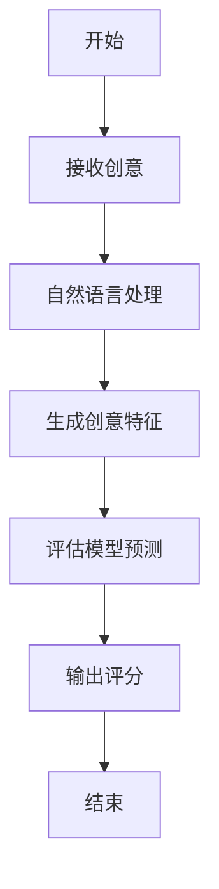
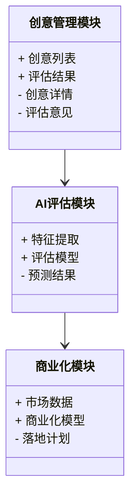
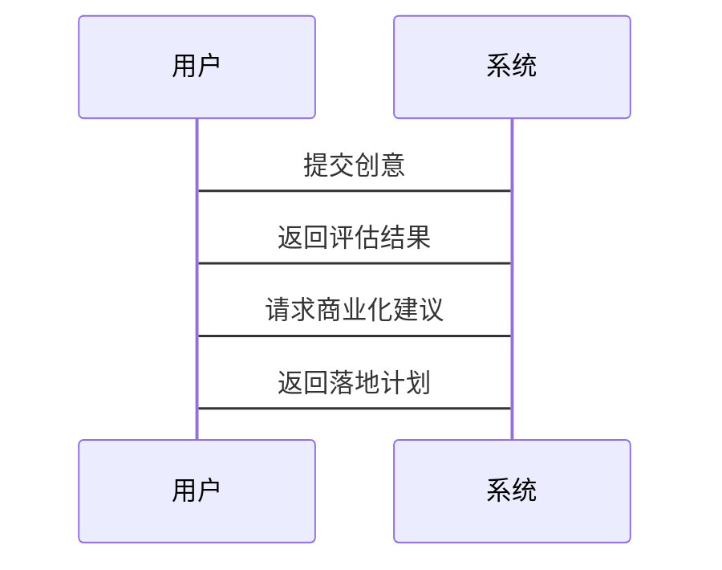

                 


# 《构建AI创新孵化器：从创意管理到商业化落地》

---

## 关键词：
AI创新孵化器、创意管理、AI技术应用、商业化落地、算法原理、系统架构、项目实战

---

## 摘要：
本文详细探讨了构建AI创新孵化器的过程，从创意的管理到商业化落地的每个阶段。文章首先分析了AI创新孵化器的背景与目标，然后深入探讨了创意管理的核心要素与AI技术的应用。接着，详细讲解了AI创新孵化器的算法原理，包括创意评估、资源分配优化等算法的实现与优化。随后，分析了系统架构设计，包括领域模型、架构图和交互序列图。最后，通过项目实战展示了如何将理论应用于实践，并总结了最佳实践和注意事项。

---

## 目录

---

### 第一章：AI创新孵化器的背景与目标

#### 1.1 创新孵化器的定义与作用
- 1.1.1 创新孵化器的基本概念
- 1.1.2 AI创新孵化器的独特性
- 1.1.3 创新孵化器的目标与价值

#### 1.2 AI技术与创新的关系
- 1.2.1 AI技术的核心作用
- 1.2.2 AI在创新中的应用领域
- 1.2.3 AI驱动创新的模式分析

#### 1.3 创业生态中的AI创新
- 1.3.1 创业生态的现状与趋势
- 1.3.2 AI技术对创业生态的影响
- 1.3.3 AI创新孵化器的定位与意义

---

### 第二章：AI创新孵化器的核心概念与联系

#### 2.1 创意管理的核心要素
- 2.1.1 创意的定义与特征
- 2.1.2 创意管理的关键环节
- 2.1.3 创意评估的标准与方法

#### 2.2 AI技术在创意管理中的应用
- 2.2.1 自然语言处理在创意筛选中的应用
- 2.2.2 机器学习在创意评估中的作用
- 2.2.3 数据挖掘在创意分析中的应用

#### 2.3 创意与商业化的关系
- 2.3.1 创意商业化的基本路径
- 2.3.2 AI技术在商业化中的作用
- 2.3.3 创意商业化中的风险与挑战

#### 2.4 核心概念的对比与联系
- 2.4.1 创意管理与AI技术的对比表格
- 2.4.2 ER实体关系图（使用Mermaid）

```mermaid
erDiagram
  actor 创意者 {
    string 创意内容
    integer 创意ID
  }
  actor 评估者 {
    string 评估意见
    integer 评估ID
  }
  actor 决策者 {
    string 决策结果
    integer 决策ID
  }
  创意内容 <--- 关联 创意者
  评估意见 <--- 关联 评估者
  决策结果 <--- 关联 决策者
```

---

### 第三章：AI创新孵化器的算法原理

#### 3.1 创意评估算法
- 3.1.1 创意评估的基本流程
- 3.1.2 基于NLP的创意文本分析
- 3.1.3 创意评分模型的构建与优化

#### 3.2 资源分配优化算法
- 3.2.1 资源分配的基本问题
- 3.2.2 基于强化学习的资源分配策略
- 3.2.3 资源分配算法的实现与优化

#### 3.3 商业化落地算法
- 3.3.1 商业化落地的基本流程
- 3.3.2 基于机器学习的市场预测
- 3.3.3 商业化模型的优化与调整

#### 3.4 算法实现与代码示例
- 3.4.1 创意评估算法的Mermaid流程图
- 3.4.2 Python代码示例
- 3.4.3 算法的数学模型与公式



```python
# 创意评估算法示例
import numpy as np
from sklearn.feature_extraction.text import TfidfVectorizer
from sklearn.svm import SVC

# 数据预处理
X = [...]  # 创意文本
y = [...]  # 标签（0：不可行，1：可行）

# 特征提取
vectorizer = TfidfVectorizer()
X_features = vectorizer.fit_transform(X)

# 模型训练
model = SVC()
model.fit(X_features, y)

# 预测
new_creativity = ["创意文本内容"]
new_features = vectorizer.transform(new_creativity)
prediction = model.predict(new_features)
```

---

### 第四章：系统架构设计与实现

#### 4.1 系统功能设计
- 4.1.1 领域模型（使用Mermaid类图）
- 4.1.2 系统功能模块划分
- 4.1.3 功能交互流程分析



#### 4.2 系统架构设计
- 4.2.1 系统架构图（使用Mermaid架构图）
- 4.2.2 微服务架构的应用
- 4.2.3 架构优化与扩展性分析


#### 4.3 系统接口设计与交互
- 4.3.1 系统接口设计（使用Mermaid序列图）
- 4.3.2 用户与系统交互流程
- 4.3.3 接口的安全性与稳定性



---

### 第五章：AI创新孵化器的项目实战

#### 5.1 环境安装与配置
- 5.1.1 开发环境的选择
- 5.1.2 依赖库的安装
- 5.1.3 数据集的准备

#### 5.2 系统核心代码实现
- 5.2.1 创意管理模块的实现
- 5.2.2 AI评估模块的实现
- 5.2.3 商业化模块的实现

#### 5.3 代码解读与分析
- 5.3.1 核心算法的实现细节
- 5.3.2 系统交互的代码解读
- 5.3.3 项目优化与调试

#### 5.4 实际案例分析
- 5.4.1 案例背景介绍
- 5.4.2 数据分析与处理
- 5.4.3 系统实现与结果展示

---

### 第六章：AI创新孵化器的最佳实践与总结

#### 6.1 项目总结与反思
- 6.1.1 项目成果与经验总结
- 6.1.2 项目中的问题与解决方案
- 6.1.3 项目的未来改进方向

#### 6.2 最佳实践与注意事项
- 6.2.1 创意管理的关键点
- 6.2.2 AI技术应用的注意事项
- 6.2.3 商业化落地的策略与建议

#### 6.3 小结与展望
- 6.3.1 本文的核心内容回顾
- 6.3.2 AI创新孵化器的未来发展趋势
- 6.3.3 对读者的鼓励与建议

---

## 附录
- 附录A：相关术语解释
- 附录B：参考文献
- 附录C：工具与资源推荐

---

## 参考资料
- [1] 《机器学习实战》
- [2] 《深度学习导论》
- [3] 《软件架构设计》
- [4] Mermaid图表使用指南

---

**本文通过系统性地分析AI创新孵化器的构建过程，结合理论与实践，为读者提供了从创意管理到商业化落地的全面指导。**

