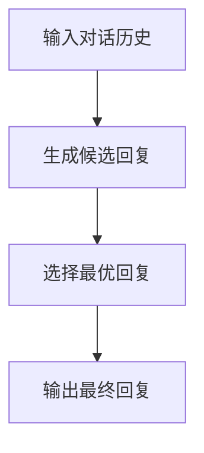
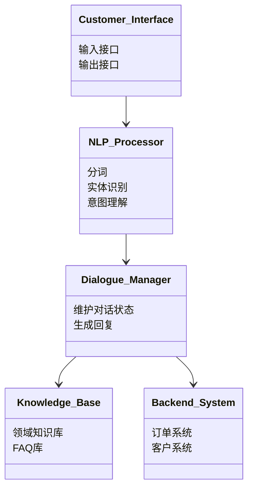
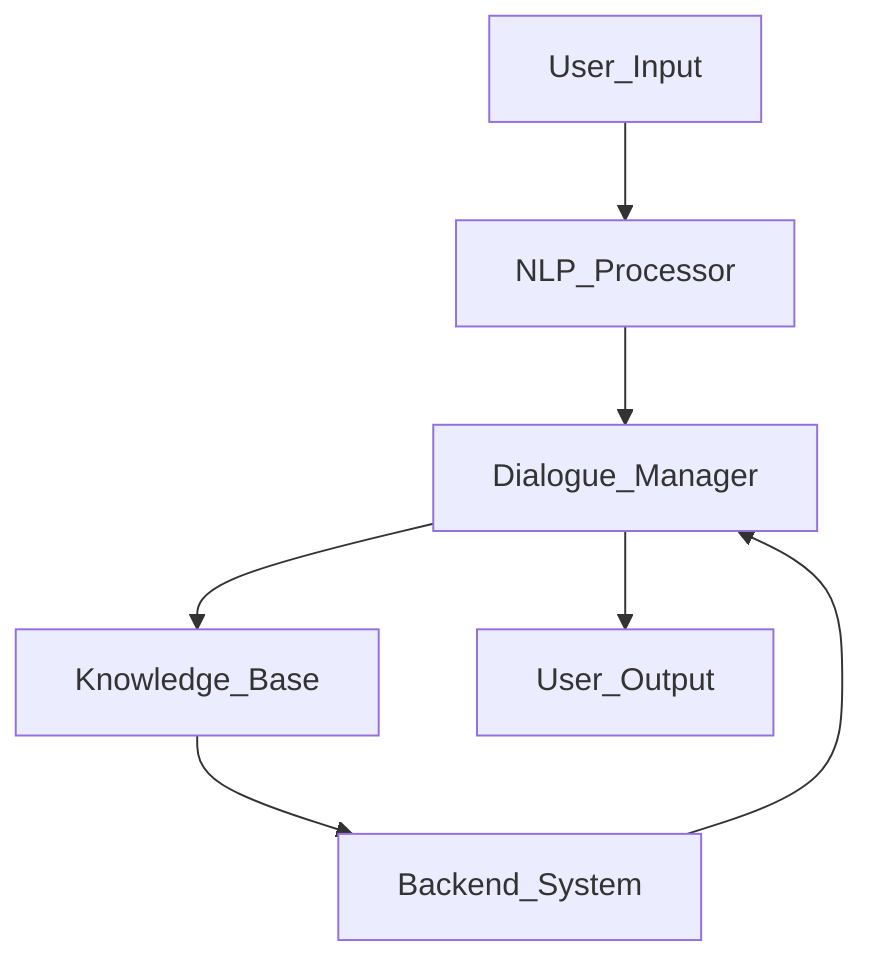
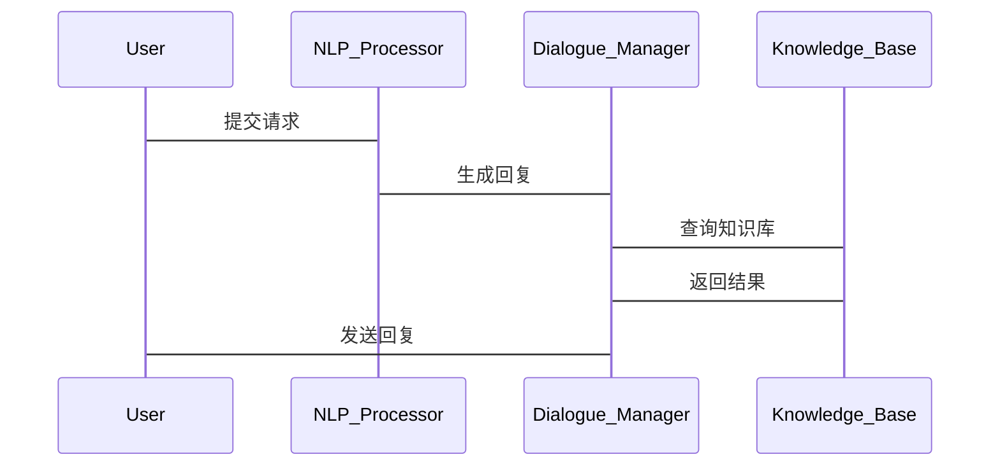

                 


```markdown
# 构建企业级对话式AI助手：跨系统业务流程自动化与协调

> 关键词：对话式AI助手，企业级系统，跨系统业务流程，自动化，协调，自然语言处理，大语言模型

> 摘要：本文详细探讨了构建企业级对话式AI助手的关键技术与实现方法，重点分析了跨系统业务流程的自动化与协调机制。通过系统化的理论阐述与实际案例分析，揭示了对话式AI助手在企业应用中的巨大潜力和实现路径。

---

# 第一部分: 企业级对话式AI助手的背景与必要性

# 第1章: 企业级对话式AI助手的背景与必要性

## 1.1 对话式AI助手的定义与核心概念

### 1.1.1 对话式AI助手的定义

对话式AI助手是一种基于自然语言处理（NLP）技术的智能系统，能够通过文本或语音与用户进行交互，理解用户意图并提供相应的服务或信息。企业级对话式AI助手则是在企业环境中部署的高级版本，能够处理复杂的业务流程和跨系统的协调。

### 1.1.2 企业级对话式AI助手的特点

- **企业级能力**：能够处理复杂的业务逻辑，支持多系统集成。
- **高可用性**：具备高可靠性，支持大规模用户访问。
- **定制化能力**：能够根据企业的具体需求进行定制化开发。
- **智能化**：基于大语言模型，具备深度学习和自适应能力。

### 1.1.3 对话式AI助手的必要性

随着企业数字化转型的深入推进，业务流程的复杂性和用户需求的多样化对企业支持系统的智能化提出了更高要求。对话式AI助手能够显著提升用户体验，降低运营成本，提高业务效率，成为企业数字化转型的重要工具。

---

## 1.2 企业级对话式AI助手的应用场景

### 1.2.1 客户服务与支持

- 提供24/7的客户支持，解答常见问题。
- 处理复杂的客户请求，协调多个部门解决问题。

### 1.2.2 业务流程自动化

- 自动化处理订单、审批、投诉等业务流程。
- 协调跨系统的数据流转，实现无缝业务衔接。

### 1.2.3 内部员工辅助

- 提供知识库查询、任务提醒等辅助功能。
- 支持内部员工高效协作，提升工作效率。

---

## 1.3 企业级对话式AI助手的边界与外延

### 1.3.1 边界定义

- **输入**：用户的自然语言输入（文本或语音）。
- **输出**：系统生成的自然语言回复或执行的操作。
- **核心功能**：理解用户意图、调用后端服务、生成回复。

### 1.3.2 外延与相关技术

- **NLP技术**：如分词、实体识别、意图理解。
- **知识图谱**：构建领域知识库，支持复杂查询。
- **对话管理**：维护对话上下文，确保对话流畅。

---

## 1.4 本章小结

本章从定义、特点、必要性、应用场景和边界等方面，全面介绍了企业级对话式AI助手的基本概念和核心价值，为后续的技术实现奠定了基础。

---

# 第二部分: 对话式AI助手的核心概念与联系

# 第2章: 对话式AI助手的核心概念

## 2.1 自然语言处理（NLP）基础

### 2.1.1 NLP的核心任务

- **分词**：将连续文本分割成词或短语。
- **实体识别**：识别文本中的实体（如人名、地名、组织名）。
- **意图理解**：理解用户的真实需求和意图。

### 2.1.2 NLP在对话式AI中的应用

- **意图分类**：根据用户输入分类意图。
- **文本生成**：基于上下文生成回复。

---

## 2.2 对话管理与上下文理解

### 2.2.1 对话管理的原理

对话管理负责维护对话的状态，包括当前用户的意图、系统已采取的行动等。常见的对话管理策略包括基于规则和基于模型的方法。

### 2.2.2 上下文理解的重要性

上下文理解是对话式AI助手的核心能力之一，能够确保系统在多轮对话中保持一致性，理解用户的深层需求。

---

## 2.3 知识库与领域专家系统

### 2.3.1 知识库的构建与管理

知识库是对话式AI助手的核心知识来源，包含企业的业务规则、产品信息、FAQ等。构建知识库需要结合领域专家的知识，确保信息的准确性和完整性。

### 2.3.2 领域专家系统的作用

领域专家系统能够提供专业的领域知识，帮助对话式AI助手更准确地理解和回答用户的问题。

---

## 2.4 核心概念对比分析

### 2.4.1 对比表格：传统对话系统 vs 现代对话式AI助手

| 特性                | 传统对话系统            | 现代对话式AI助手      |
|---------------------|-------------------------|-----------------------|
| 输入方式            | 文本输入                | 文本/语音输入          |
| 处理能力            | 单一任务处理            | 多轮对话处理          |
| 知识来源            | 预定义规则              | 领域知识库            |
| 智能水平            | 基于规则               | 基于深度学习模型        |

### 2.4.2 ER实体关系图：对话式AI的核心要素组成

```mermaid
erDiagram
    customer[客户] {
        <属性>
        id : 整数
        name : 文本
        email : 文本
    }
    order[订单] {
        <属性>
        id : 整数
        customer_id : 整数
        order_time : 时间
    }
    product[产品] {
        <属性>
        id : 整数
        name : 文本
        price : 数字
    }
    customer --> order : 下单
    order --> product : 订单包含的产品
```

---

## 2.5 本章小结

本章详细探讨了对话式AI助手的核心概念，包括NLP基础、对话管理、知识库与领域专家系统，并通过对比分析和ER图展示了系统的组成和关系。

---

# 第三部分: 对话式AI助手的算法原理

# 第3章: 大语言模型的算法原理

## 3.1 大语言模型的原理概述

### 3.1.1 Transformer模型的基本结构

Transformer模型由编码器和解码器组成，编码器负责将输入文本转化为向量表示，解码器负责根据编码器的输出生成回复。

### 3.1.2 注意力机制的数学公式

注意力机制是Transformer模型的核心，用于计算输入序列中每个位置的重要性。其数学公式如下：

$$
\text{Attention}(Q,K,V) = \text{softmax}\left(\frac{QK^T}{\sqrt{d_k}}\right)V
$$

其中：
- $Q$：查询向量
- $K$：键向量
- $V$：值向量
- $d_k$：键的维度

---

## 3.2 对话式AI助手的算法实现

### 3.2.1 基于预训练模型的微调

预训练模型（如GPT-3、BERT）在大规模数据上进行预训练，然后在特定领域数据上进行微调，以适应企业的具体需求。

### 3.2.2 对话生成的策略优化

对话生成的策略优化包括：
- 基于奖励的学习（Reinforcement Learning from Human Feedback, RLHF）
- 多目标优化（如生成回复的相关性、流畅性）

---

## 3.3 算法流程图



---

## 3.4 本章小结

本章从算法原理的角度，详细介绍了大语言模型的基本结构和对话生成的策略优化，并通过流程图展示了对话生成的总体流程。

---

# 第四部分: 企业级对话式AI助手的系统架构设计

# 第4章: 系统架构设计

## 4.1 问题场景介绍

### 4.1.1 业务背景

假设我们正在为一家电商公司设计对话式AI助手，需要支持客户咨询、订单查询、售后服务等功能。

### 4.1.2 用户需求

- 提供7×24小时的客户服务。
- 支持多语言输入。
- 实现订单查询、退换货申请等业务流程的自动化。

---

## 4.2 系统功能设计

### 4.2.1 系统功能模块



---

## 4.3 系统架构设计

### 4.3.1 架构设计概述

系统采用模块化架构，包括前端、后端、NLP处理、对话管理、知识库等多个模块。

### 4.3.2 数据流设计



---

## 4.4 系统交互设计

### 4.4.1 交互流程



---

## 4.5 本章小结

本章从系统架构设计的角度，详细探讨了对话式AI助手的模块划分、数据流设计和交互流程，为后续的实现奠定了基础。

---

# 第五部分: 项目实战

# 第5章: 项目实战

## 5.1 环境安装与配置

### 5.1.1 安装Python环境

```bash
python --version
pip install --upgrade pip
```

### 5.1.2 安装必要的库

```bash
pip install numpy pandas transformers
```

---

## 5.2 系统核心代码实现

### 5.2.1 NLP处理模块

```python
import torch
from transformers import AutoTokenizer, AutoModelForMaskedLM

tokenizer = AutoTokenizer.from_pretrained('bert-base-uncased')
model = AutoModelForMaskedLM.from_pretrained('bert-base-uncased')

def tokenize(text):
    return tokenizer(text, return_tensors='pt')

def decode(tensor):
    return tokenizer.decode(torch.argmax(tensor).item())
```

### 5.2.2 对话管理模块

```python
class Dialogue_Manager:
    def __init__(self):
        self.dialogue_state = {}

    def process_input(self, user_input):
        # 处理用户输入，更新对话状态
        pass

    def generate_response(self):
        # 根据对话状态生成回复
        pass
```

---

## 5.3 实际案例分析

### 5.3.1 案例介绍

以电商订单查询为例，用户输入“我想要查询我的订单”，系统需要调用订单系统查询订单状态并返回结果。

### 5.3.2 代码实现

```python
def query_order(order_id):
    # 调用订单系统查询订单
    return f"订单{order_id}的状态为已完成。"
```

---

## 5.4 项目总结

本章通过实际案例展示了对话式AI助手的实现过程，包括环境配置、核心代码实现和案例分析。通过这些步骤，读者可以掌握对话式AI助手的基本实现方法。

---

# 第六部分: 最佳实践与小结

# 第6章: 最佳实践与小结

## 6.1 设计原则

### 6.1.1 简洁性

系统设计应尽量简化，确保核心功能的实现。

### 6.1.2 可扩展性

系统应具备良好的扩展性，能够适应未来的业务需求。

---

## 6.2 注意事项

### 6.2.1 数据安全

确保用户数据的安全性，避免数据泄露。

### 6.2.2 系统性能

优化系统性能，确保在高并发情况下依然能够稳定运行。

---

## 6.3 未来趋势

### 6.3.1 多模态对话

未来对话式AI助手将支持文本、语音、图像等多种交互方式。

### 6.3.2 自适应学习

系统将具备更强的自适应学习能力，能够根据用户反馈不断优化自身。

---

## 6.4 本章小结

本章总结了对话式AI助手设计与实现的最佳实践，包括设计原则、注意事项和未来趋势，帮助读者更好地理解和应用相关技术。

---

# 附录

## 附录A: 术语表

- **NLP**：自然语言处理（Natural Language Processing）
- **Transformer**：一种基于注意力机制的深度学习模型
- **对话管理**：维护对话状态，生成回复

## 附录B: 参考文献

1. Vaswani, A., et al. "Attention Is All You Need." arXiv, 2017.
2. Radford, A., et al. "Language Models Are Few-Shot Learners." arXiv, 2019.

---

# 结语

通过本文的系统阐述，读者可以全面了解企业级对话式AI助手的设计与实现方法，掌握跨系统业务流程自动化与协调的核心技术。对话式AI助手的应用前景广阔，未来将为企业数字化转型提供更强大的支持。

```

