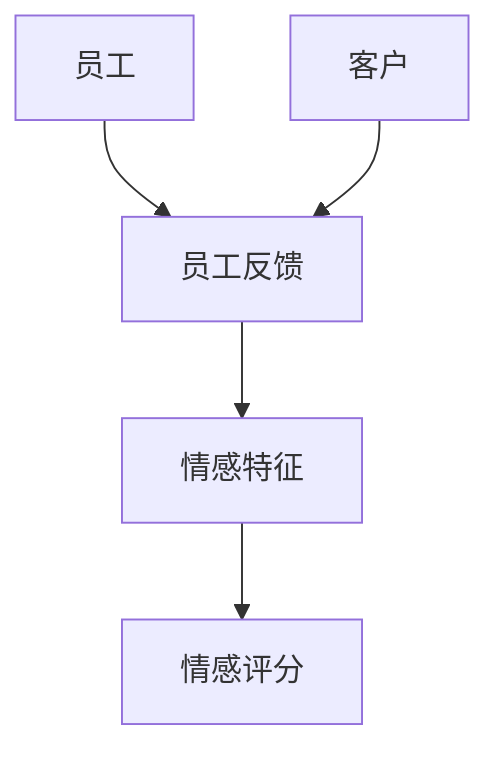
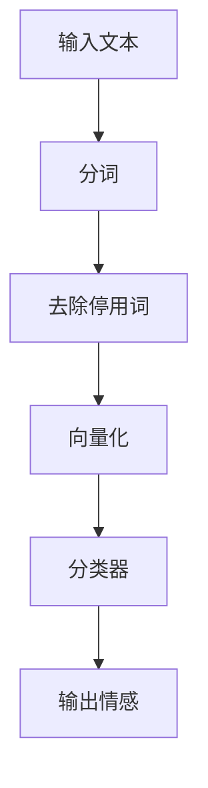
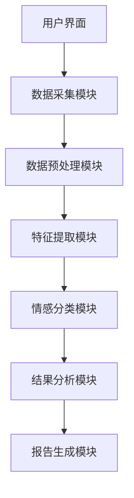
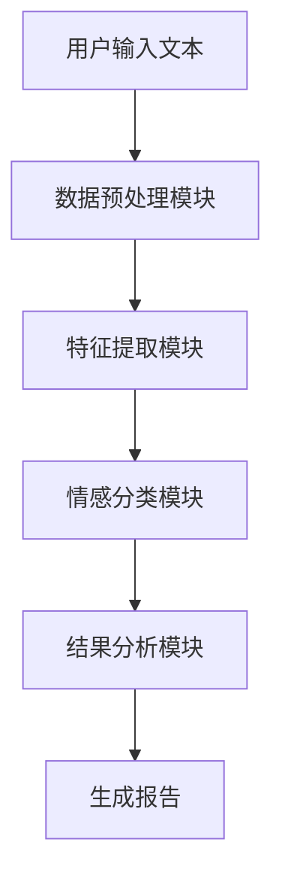

                 


# 构建企业级情感计算平台：员工满意度与客户情绪综合分析

> 关键词：企业级情感计算平台、员工满意度、客户情绪分析、自然语言处理、深度学习、机器学习

> 摘要：企业级情感计算平台通过分析员工和客户的文本数据，提取情感信息，帮助企业管理者做出更明智的决策。本文详细介绍了情感计算的核心概念、算法原理、系统架构设计，以及如何通过项目实战构建一个高效的情感计算平台。文章还提供了最佳实践、小结、注意事项和拓展阅读等内容，帮助读者全面理解和应用情感计算技术。

---

## 第1章: 企业级情感计算平台的背景与核心概念

### 1.1 情感计算平台的定义与核心概念

情感计算（Affective Computing）是一种通过计算机技术分析、识别和理解人类情感状态的方法。它结合了自然语言处理（NLP）、机器学习和深度学习等技术，能够从文本、语音或图像中提取情感信息。企业级情感计算平台的目标是通过分析员工和客户的情绪数据，帮助企业优化管理流程，提升员工满意度和客户忠诚度。

### 1.2 问题背景与问题描述

在企业中，员工满意度和客户情绪是两个重要的指标。员工的满意度直接影响企业的生产力和稳定性，而客户的情绪则直接影响企业的市场表现和客户关系。传统的管理方式依赖于问卷调查和客户反馈，这种方式效率低、成本高，且难以实时获取数据。因此，企业需要一种更高效、更智能的方法来分析和管理情绪数据。

### 1.3 问题解决与边界

情感计算平台通过自动化分析文本数据，帮助企业实时获取员工和客户的情绪信息。这种技术可以显著提高数据处理的效率，降低成本，并提供更精准的决策支持。然而，情感计算也有其局限性，例如数据隐私问题、模型训练数据的质量以及算法的准确性。

### 1.4 情感计算的概念结构与核心要素

情感计算的核心要素包括：

1. **数据源**：员工反馈、客户评论等文本数据。
2. **特征提取**：从文本中提取情感特征，如关键词、语调、语气等。
3. **情感分类**：通过机器学习模型对文本进行情感分类，如正面、负面、中性。
4. **情感评分**：根据分类结果计算情感得分，帮助企业量化情绪状态。
5. **结果分析**：结合业务指标，分析情绪数据对企业的影响。

---

## 第2章: 情感计算的核心概念与联系

### 2.1 情感计算的核心原理

情感计算的核心原理包括数据预处理、特征提取、情感分类和结果分析。数据预处理包括分词、去除停用词、词干提取等步骤。特征提取可以使用词袋模型、词嵌入（如Word2Vec）等方法。情感分类使用机器学习模型（如SVM、NB）或深度学习模型（如LSTM、Transformer）。

### 2.2 核心概念的属性特征对比

以下是情感计算与其他文本分析技术的对比：

| 技术 | 定义 | 优缺点 |
|------|------|--------|
| 基于规则的分类 | 通过预定义规则进行分类 | 易部署，但灵活性差 |
| 机器学习模型 | 基于特征训练分类器 | 高准确性，但需要大量数据 |
| 深度学习模型 | 基于神经网络的端到端学习 | 高准确性，但计算资源需求高 |

### 2.3 ER实体关系图

以下是情感计算平台的核心实体关系图：



---

## 第3章: 情感分析算法原理

### 3.1 情感分析的基本流程

情感分析的基本流程包括以下步骤：

1. **数据预处理**：分词、去除停用词、词干提取。
2. **特征提取**：将文本转换为向量表示。
3. **情感分类**：使用机器学习或深度学习模型进行分类。
4. **结果分析**：计算情感评分，分析情感分布。

### 3.2 常见情感分析算法

以下是常见的情感分析算法：

1. **基于规则的分类**：通过预定义规则判断情感倾向。
2. **机器学习模型**：如支持向量机（SVM）、朴素贝叶斯（NB）。
3. **深度学习模型**：如长短期记忆网络（LSTM）、Transformer模型。

### 3.3 情感分析的数学模型与公式

以下是情感分析的数学模型和公式：

1. **词袋模型**：将文本表示为词袋，计算每个词的权重。
2. **词嵌入模型**：使用Word2Vec等模型将词转换为向量表示。
3. **情感分类的损失函数**：使用交叉熵损失函数进行优化。

$$ \text{损失函数} = -\frac{1}{N} \sum_{i=1}^{N} \sum_{j=1}^{C} y_{ij} \log(p_{ij}) $$

其中，\( y_{ij} \) 是真实标签，\( p_{ij} \) 是预测概率。

### 3.4 情感分析的流程图

以下是情感分析的流程图：



---

## 第4章: 情感计算的数学模型与公式

### 4.1 情感计算的基本公式

以下是情感计算的基本公式：

$$ \text{情感得分} = \sum_{i=1}^{n} w_i \cdot s_i $$

其中，\( w_i \) 是特征的权重，\( s_i \) 是情感评分。

### 4.2 情感计算的分类模型

以下是情感分类的常见模型：

1. **逻辑回归模型**：
   $$ P(y=1|x) = \frac{e^{\beta x}}{1 + e^{\beta x}} $$

2. **支持向量机模型**：
   $$ \text{最大化} \sum_{i=1}^{n} \alpha_i - \frac{1}{2} \sum_{i=1}^{n} \sum_{j=1}^{n} \alpha_i \alpha_j y_i y_j K(x_i, x_j) $$

3. **深度学习模型（如LSTM）**：
   使用递归神经网络处理序列数据，计算情感得分。

---

## 第5章: 系统架构设计与实现

### 5.1 系统功能设计

以下是情感计算平台的功能模块：

1. **数据采集**：从企业系统中获取员工和客户的文本数据。
2. **数据预处理**：分词、去除停用词、词干提取。
3. **特征提取**：使用词袋模型或词嵌入模型提取特征。
4. **情感分类**：使用机器学习或深度学习模型进行分类。
5. **结果分析**：计算情感评分，生成分析报告。

### 5.2 系统架构设计

以下是情感计算平台的系统架构图：



### 5.3 系统接口设计

以下是系统的主要接口：

1. **数据接口**：与企业系统对接，获取文本数据。
2. **API接口**：提供情感分析API，供其他系统调用。
3. **报告接口**：生成分析报告，供企业管理者查看。

### 5.4 系统交互设计

以下是系统交互的流程图：



---

## 第6章: 项目实战与实现

### 6.1 环境安装与配置

以下是项目实战所需的环境和工具：

1. **Python**：安装Python 3.8及以上版本。
2. **库依赖**：安装 `numpy`, `pandas`, `scikit-learn`, `transformers` 等库。

### 6.2 核心代码实现

以下是情感计算平台的核心代码实现：

```python
from transformers import pipeline

# 初始化情感分类器
sentiment_analyzer = pipeline("sentiment-analysis")

# 定义情感分析函数
def analyze_sentiment(text):
    result = sentiment_analyzer(text)
    return result[0]['label']

# 示例文本
text = "我们的员工非常满意他们的工作环境。"
print(analyze_sentiment(text))  # 输出: positive
```

### 6.3 项目实战案例

以下是项目实战案例：

1. **员工满意度分析**：分析员工反馈文本，计算员工的满意度得分。
2. **客户情绪分析**：分析客户评论，识别客户的负面情绪并及时处理。

---

## 第7章: 最佳实践与总结

### 7.1 最佳实践

以下是情感计算平台的最佳实践：

1. **数据预处理**：确保数据质量，去除噪声。
2. **模型调优**：选择合适的模型，并进行参数调优。
3. **数据隐私**：遵守数据隐私法规，保护用户数据。

### 7.2 小结

情感计算平台能够帮助企业高效分析员工和客户的情绪数据，提升管理效率和决策能力。通过本文的讲解，读者可以深入了解情感计算的核心概念、算法原理和系统架构设计。

### 7.3 注意事项

在实际应用中，需要注意以下几点：

1. 数据隐私问题：确保数据的安全性和合规性。
2. 模型准确性：选择合适的模型，并进行充分的训练。
3. 系统性能：优化系统性能，确保实时性。

### 7.4 拓展阅读

以下是拓展阅读的推荐：

1. 《自然语言处理实战：基于Python的机器学习与深度学习》
2. 《情感计算：人工智能中的情感智能》
3. TensorFlow和PyTorch的官方文档

---

通过本文的详细讲解，读者可以系统地了解情感计算平台的构建过程，从理论到实践，全面掌握情感计算的核心技术与应用方法。希望本文能为企业的数字化转型提供有价值的参考和指导。

