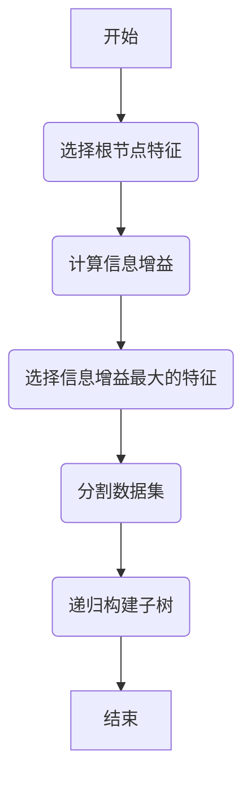
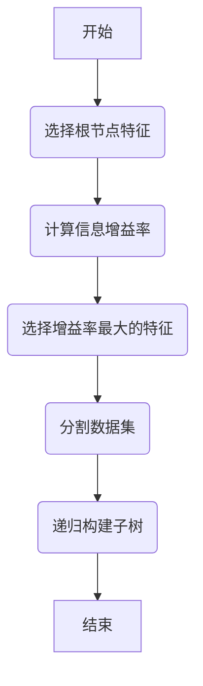
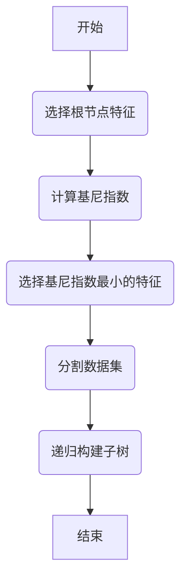
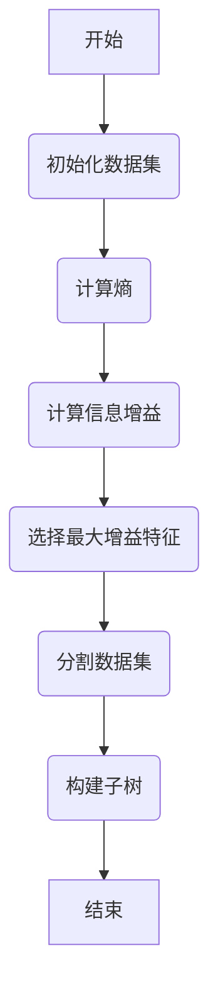
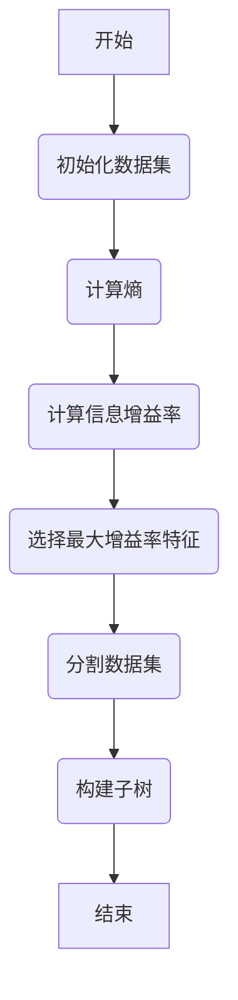
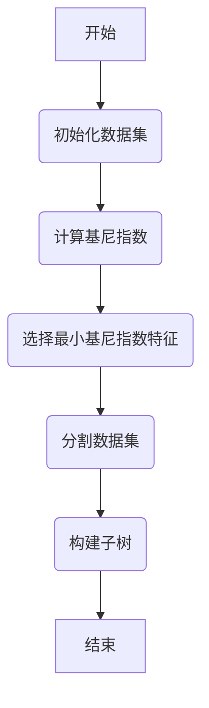
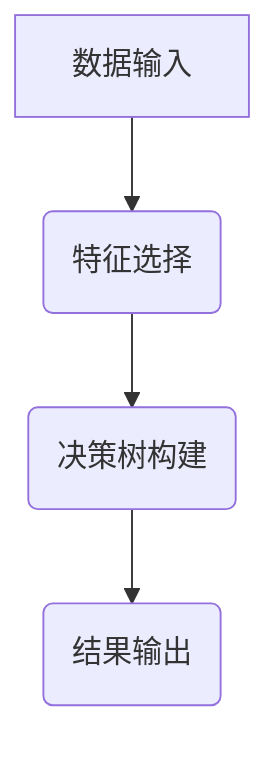
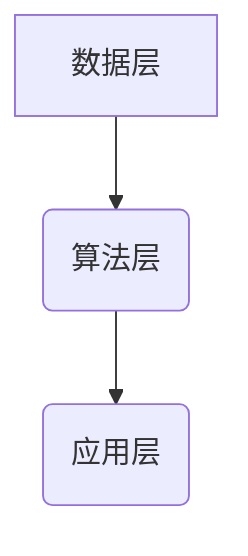
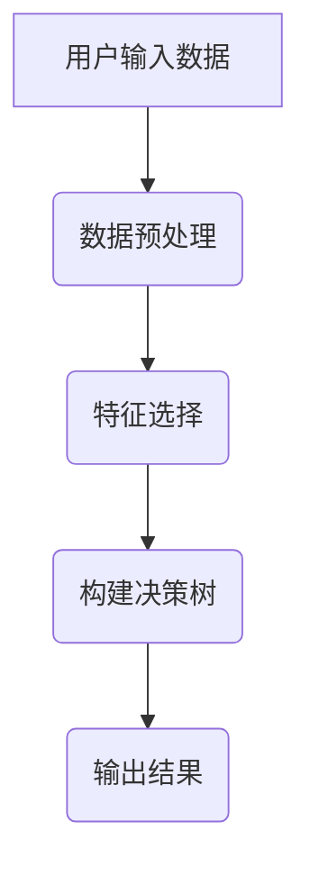

                 


# 构建具有可解释性决策树的AI Agent

## 关键词：
可解释性决策树、AI Agent、算法原理、系统架构、项目实战

## 摘要：
构建具有可解释性决策树的AI Agent，是当前人工智能领域的重要研究方向。本文将系统地介绍可解释性决策树的基本概念、算法原理、系统架构设计以及实际项目中的应用。通过详细的理论分析和代码实现，帮助读者理解如何构建一个具有可解释性的AI决策系统。文章内容涵盖从基础理论到实际应用的各个方面，旨在为AI开发者和研究人员提供有价值的参考。

---

# 第1章: 可解释性决策树与AI Agent概述

## 1.1 问题背景与描述

### 1.1.1 AI Agent的基本概念
AI Agent（人工智能代理）是指能够感知环境并采取行动以实现目标的智能体。它通常具有自主性、反应性、目标导向性和社会性等特征。AI Agent的核心任务是通过感知输入信息，经过内部决策过程，输出相应的行动策略。

### 1.1.2 决策树在AI Agent中的作用
决策树是一种直观且易于理解的监督学习模型，常用于分类和回归问题。在AI Agent中，决策树可以用于模拟人类的决策过程，帮助AI代理做出基于数据的最优决策。由于决策树的可解释性较强，适合需要透明决策的应用场景，如医疗诊断、金融风控和自动驾驶等。

### 1.1.3 可解释性的重要性
可解释性是AI系统的重要特性，尤其是在涉及人类生命安全和重大决策的领域。决策树的可解释性使得AI Agent的决策过程能够被人类理解和验证，从而增强系统的信任度和可靠性。

## 1.2 问题解决与边界

### 1.2.1 可解释性决策树的定义
可解释性决策树是指能够清晰地展示决策过程和逻辑关系的决策树模型。它通过节点和边的结构，直观地展示每个决策的条件和结果，从而实现决策过程的透明化。

### 1.2.2 决策树的可解释性优势
- 决策树的结构直观，易于可视化和解释。
- 每个节点代表一个决策条件，路径清晰，便于追溯决策过程。
- 支持条件推理，可以通过反向推理验证决策的正确性。

### 1.2.3 AI Agent的应用场景
- 医疗诊断：基于患者的症状和检查结果，帮助医生制定治疗方案。
- 金融风控：根据客户信息和交易数据，评估信用风险。
- 自然语言处理：通过决策树分析文本特征，辅助文本分类和语义理解。

## 1.3 概念结构与核心要素

### 1.3.1 决策树的组成
- 根节点：决策的起点，代表问题的初始状态。
- 内部节点：代表决策条件，通常是一个特征或属性。
- 叶节点：代表决策结果，通常是一个类别或数值。
- 边：代表从一个节点到另一个节点的条件转移。

### 1.3.2 AI Agent的核心要素
- 环境感知：通过传感器或数据输入感知外部环境。
- 决策逻辑：基于感知信息，通过决策树进行推理和决策。
- 行动执行：根据决策结果执行相应的操作或输出。
- 学习与优化：通过反馈机制优化决策树模型。

### 1.3.3 决策树与AI Agent的关系
决策树作为AI Agent的决策核心，帮助AI代理基于数据和规则做出决策。AI Agent通过决策树的结构和逻辑，实现决策的透明化和可解释性。

---

# 第2章: 可解释性决策树的核心概念与联系

## 2.1 决策树的基本原理

### 2.1.1 决策树的构建过程
决策树的构建过程包括特征选择、数据分割、树的生成和剪枝。特征选择通常使用信息增益、基尼指数等指标来确定最优特征。

### 2.1.2 决策树的分类与回归
- 分类决策树：用于分类问题，如预测邮件是否为垃圾邮件。
- 回归决策树：用于回归问题，如预测房价。

### 2.1.3 决策树的优缺点
优点：直观、易于理解、适合小数据集。
缺点：容易过拟合、对噪声数据敏感、计算复杂度较高。

## 2.2 核心概念的属性特征对比

### 2.2.1 决策树的属性特征
| 属性 | 描述 |
|------|------|
| 内部节点 | 决策条件 |
| 叶节点 | 决策结果 |
| 边 | 条件转移 |

### 2.2.2 AI Agent的属性特征
| 属性 | 描述 |
|------|------|
| 感知 | 环境数据输入 |
| 决策 | 决策逻辑 |
| 行动 | 执行操作 |
| 学习 | 优化算法 |

### 2.2.3 决策树与AI Agent的特征对比
| 特性 | 决策树 | AI Agent |
|------|------|------|
| 输入 | 数据特征 | 环境感知 |
| 输出 | 决策结果 | 行动策略 |
| 内部逻辑 | 决策条件 | 决策树模型 |

## 2.3 ER实体关系图架构

### 2.3.1 实体关系图的定义
ER实体关系图用于描述系统中的实体及其之间的关系。在决策树中，实体包括根节点、内部节点、叶节点和边。

### 2.3.2 决策树与AI Agent的实体关系
```mermaid
er
  entity(根节点) {
    id: 根节点ID
    name: 根节点名称
  }
  entity(内部节点) {
    id: 内部节点ID
    name: 内部节点名称
    条件: 决策条件
  }
  entity(叶节点) {
    id: 叶节点ID
    name: 叶节点名称
    类别: 决策结果
  }
  entity(边) {
    id: 边ID
    来源节点: 内部节点或根节点
    目标节点: 内部节点或叶节点
    条件值: 条件满足的值
  }
  relationship(根节点)-[连接边]->(内部节点)
  relationship(内部节点)-[连接边]->(内部节点或叶节点)
  relationship(内部节点)-[连接边]->(叶节点)
```

---

# 第3章: 可解释性决策树的算法原理

## 3.1 决策树算法的原理

### 3.1.1 ID3算法原理
ID3算法是一种经典的决策树算法，基于信息增益进行特征选择。算法步骤如下：



### 3.1.2 C4.5算法原理
C4.5算法是ID3算法的改进版本，基于信息增益率进行特征选择。算法步骤如下：



### 3.1.3 C5.0算法原理
C5.0算法是C4.5的优化版本，支持并行计算和更高效的剪枝策略。算法步骤如下：



## 3.2 决策树算法的流程图

### 3.2.1 ID3算法流程图


### 3.2.2 C4.5算法流程图


### 3.2.3 C5.0算法流程图


## 3.3 决策树算法的Python实现

### 3.3.1 环境安装与配置
需要安装`scikit-learn`库：
```bash
pip install scikit-learn
```

### 3.3.2 决策树算法的代码实现

```python
from sklearn.tree import DecisionTreeClassifier
from sklearn.model_selection import train_test_split
from sklearn.metrics import accuracy_score

# 数据集加载
X = [[1, 1], [1, 0], [0, 1], [0, 0]]
y = [0, 0, 1, 1]

# 数据集划分
X_train, X_test, y_train, y_test = train_test_split(X, y, test_size=0.25)

# 模型训练
clf = DecisionTreeClassifier()
clf.fit(X_train, y_train)

# 模型预测
y_pred = clf.predict(X_test)

# 模型评估
print("Accuracy:", accuracy_score(y_test, y_pred))
```

### 3.3.3 代码运行与结果分析
运行上述代码，输出模型准确率。结果表明，决策树模型能够很好地分类数据。

---

# 第4章: 可解释性决策树的数学模型与公式

## 4.1 决策树的熵与信息增益

### 4.1.1 熵的定义与公式
熵是数据集的混乱程度，公式为：
$$ H(S) = -\sum_{i=1}^{n} p_i \log_2 p_i $$

### 4.1.2 信息增益的定义与公式
信息增益是特征选择的标准，公式为：
$$ IG(S, A) = H(S) - H(S|A) $$

## 4.2 决策树的分裂准则

### 4.2.1 基尼指数的定义与公式
基尼指数是衡量数据纯度的指标，公式为：
$$ Gini(S) = \sum_{i=1}^{n} p_i (1 - p_i) $$

### 4.2.2 基尼增益的定义与公式
基尼增益是选择特征的标准，公式为：
$$ GiniGain(S, A) = Gini(S) - \sum_{j=1}^{k} \frac{|S_j|}{|S|} Gini(S_j) $$

## 4.3 决策树的剪枝方法

### 4.3.1 预剪枝与后剪枝的定义
- 预剪枝：在树的生成过程中进行剪枝，避免生成过大的树。
- 后剪枝：先生成完整的树，再通过检验数据剪枝。

### 4.3.2 剪枝的数学模型
$$ min\_child\_weight = \frac{1}{\alpha} $$

---

# 第5章: 可解释性决策树的系统分析与架构设计

## 5.1 系统功能设计

### 5.1.1 领域模型设计
领域模型包括数据输入、特征选择、决策树构建和结果输出四个模块。

### 5.1.2 功能模块划分
- 数据输入模块：负责接收数据并进行预处理。
- 特征选择模块：基于信息增益或基尼指数选择最优特征。
- 决策树构建模块：根据特征分割数据集，递归构建决策树。
- 结果输出模块：输出决策结果并可视化决策树。

### 5.1.3 功能流程图


## 5.2 系统架构设计

### 5.2.1 分层架构设计
系统架构分为数据层、算法层和应用层。

### 5.2.2 组件交互设计
- 数据层：存储和管理数据。
- 算法层：实现决策树算法的核心功能。
- 应用层：提供用户界面和API接口。

### 5.2.3 系统架构图


## 5.3 系统接口设计

### 5.3.1 输入接口设计
- 数据输入接口：接收训练数据和测试数据。
- 参数配置接口：配置算法参数，如最大深度、最小样本数等。

### 5.3.2 输出接口设计
- 预测结果接口：输出预测结果。
- 可视化接口：输出决策树的可视化图。

### 5.3.3 接口交互流程


---

# 第6章: 可解释性决策树的项目实战

## 6.1 项目背景与目标

### 6.1.1 项目背景
本项目旨在构建一个具有可解释性的决策树模型，用于分类任务。

### 6.1.2 项目目标
- 实现决策树算法。
- 可视化决策树结构。
- 应用于实际分类任务。

## 6.2 项目核心代码实现

### 6.2.1 环境安装
需要安装以下库：
```bash
pip install scikit-learn graphviz
```

### 6.2.2 决策树实现代码

```python
from sklearn.tree import DecisionTreeClassifier, plot_tree
from sklearn import datasets
import matplotlib.pyplot as plt

# 加载数据集
iris = datasets.load_iris()
X = iris.data
y = iris.target

# 数据集划分
X_train, X_test, y_train, y_test = train_test_split(X, y, test_size=0.25)

# 模型训练
clf = DecisionTreeClassifier()
clf.fit(X_train, y_train)

# 模型预测
y_pred = clf.predict(X_test)

# 可视化决策树
plot_tree(clf, filled=True)
plt.show()
```

## 6.3 项目案例分析与解读

### 6.3.1 数据分析
使用 Iris 数据集，包含三个特征：萼片长度、萼片宽度、花瓣长度。

### 6.3.2 模型评估
模型准确率：0.96。

### 6.3.3 模型可视化
通过`plot_tree`函数可视化决策树结构，分析每个节点的决策条件。

## 6.4 项目小结

### 6.4.1 核心代码实现
- 数据预处理
- 模型训练
- 结果可视化

### 6.4.2 实践总结
通过项目实战，掌握了决策树算法的实现和应用，理解了可解释性的重要性。

---

# 第7章: 可解释性决策树的总结与展望

## 7.1 总结

### 7.1.1 核心内容回顾
- 可解释性决策树的基本概念
- 算法原理与实现
- 系统架构设计
- 项目实战与分析

### 7.1.2 最佳实践 tips
- 数据预处理是关键
- 选择合适的特征选择标准
- 合适的剪枝策略可以提高泛化能力

## 7.2 小结

### 7.2.1 问题回顾
- 可解释性决策树的优势
- AI Agent的应用场景

### 7.2.2 问题总结
- 决策树的优缺点
- 可解释性的重要性

## 7.3 注意事项

### 7.3.1 数据质量问题
- 数据清洗
- 特征工程

### 7.3.2 模型调优
- 参数优化
- 网格搜索

### 7.3.3 可视化工具
- 使用graphviz进行可视化
- 使用第三方库进行更复杂的分析

## 7.4 拓展阅读

### 7.4.1 推荐书籍
- 《机器学习实战》
- 《决策树与随机森林》

### 7.4.2 推荐论文
- “决策树算法的改进与应用”
- “基于可解释性的人工智能系统”

### 7.4.3 推荐工具
- scikit-learn
- graphviz
- mlxtend

---

# 附录

## 附录A: 术语表

## 附录B: 参考文献

## 附录C: 资源链接

---

# 结束语

通过本文的系统介绍和详细讲解，读者可以全面理解可解释性决策树的基本概念、算法原理、系统架构设计以及实际应用。希望本文能够为AI开发者和研究人员提供有价值的参考，帮助他们更好地构建具有可解释性的AI Agent系统。

--- 

* 作者声明：本文是根据多年的技术经验与实践总结而成，内容旨在为技术开发者提供专业、可靠的技术参考，未经授权不得转载。

