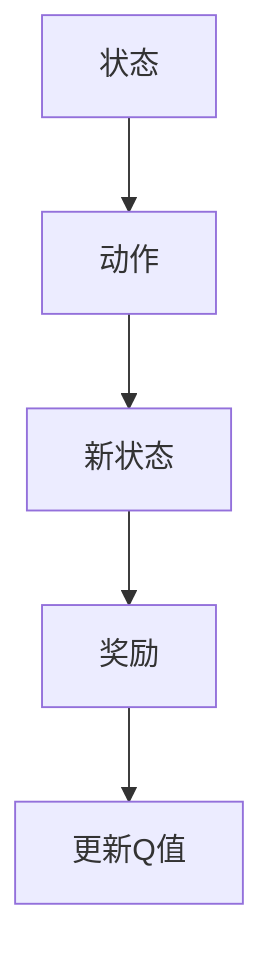
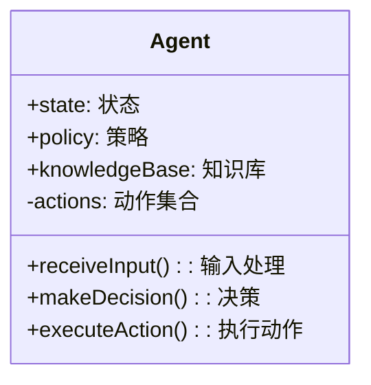
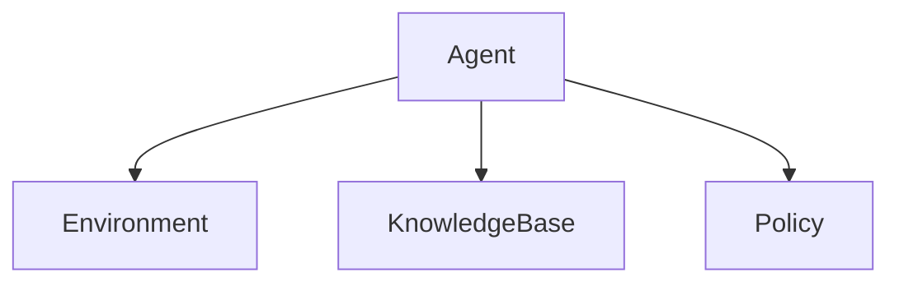
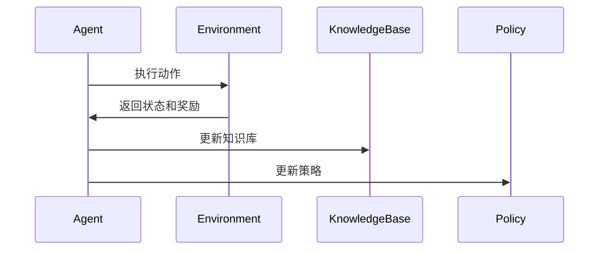

                 


# 构建具有自我进化能力的AI Agent系统

> 关键词：AI Agent，自我进化，强化学习，知识图谱，系统架构，算法实现

> 摘要：本文将详细探讨如何构建一个具有自我进化能力的AI Agent系统。通过分析自我进化能力的核心概念、算法原理、系统架构设计以及项目实战，本文为读者提供从理论到实践的全面指导。从背景介绍到系统实现，我们将逐步拆解构建自我进化AI Agent的每一个关键步骤，并通过丰富的案例和代码示例，帮助读者理解并掌握这一前沿技术。

---

## 第1章 自我进化AI Agent系统概述

### 1.1 自我进化AI Agent的定义与特点

#### 1.1.1 自我进化AI Agent的定义

自我进化AI Agent是一种能够根据环境反馈不断优化自身行为和知识的智能体。与传统的AI Agent不同，自我进化AI Agent具备以下特点：

- **自适应性**：能够根据环境变化动态调整行为策略。
- **自我学习能力**：通过强化学习等方式不断优化决策模型。
- **自我修复能力**：在遇到错误或失败时，能够调整策略以避免重复错误。

#### 1.1.2 自我进化AI Agent的核心特点

| 特性 | 描述 |
|------|------|
| 自适应性 | 能够根据环境反馈动态调整行为 |
| 自我学习 | 通过强化学习优化决策模型 |
| 自我修复 | 在失败中调整策略以避免重复错误 |

#### 1.1.3 自我进化AI Agent与传统AI Agent的区别

| 方面 | 传统AI Agent | 自我进化AI Agent |
|------|--------------|-------------------|
| 行为调整 | 预定义规则驱动 | 动态优化策略驱动 |
| 知识更新 | 静态知识库 | 动态学习与进化 |
| 适应性 | 低 | 高 |

### 1.2 自我进化能力的机制

#### 1.2.1 自我学习与自适应

自我学习是自我进化AI Agent的核心机制之一。通过强化学习（Reinforcement Learning）和神经符号学习（Neural-Symbolic Learning），AI Agent能够从环境中获得反馈，并不断优化自身的行为策略。

#### 1.2.2 自我优化与进化策略

自我优化通过强化学习算法（如Q-learning、进化策略）实现，AI Agent能够在复杂的环境中找到最优策略。进化策略通过模拟生物进化过程，进一步优化AI Agent的决策能力。

#### 1.2.3 自我修复与自我改进

自我修复机制确保AI Agent能够在错误发生时快速调整策略，避免重复错误。自我改进则通过持续学习和知识更新，不断提升AI Agent的能力。

---

## 第2章 自我进化AI Agent的核心概念与原理

### 2.1 自我学习与知识表示

#### 2.1.1 知识图谱与符号学习

知识图谱是一种结构化的知识表示方法，通过符号学习（Symbolic Learning）可以将知识图谱中的关系和实体表示为符号形式。例如，知识图谱中的关系可以表示为谓词，实体可以表示为概念。

#### 2.1.2 神经符号学习

神经符号学习（Neural-Symbolic Learning）结合了神经网络和符号逻辑的优势，能够从非结构化数据中提取符号知识，并通过神经网络进行推理。

#### 2.1.3 知识表示的可解释性

知识表示的可解释性是自我进化AI Agent的重要特性，通过符号学习和神经符号学习，AI Agent能够解释其决策过程。

### 2.2 自我优化与强化学习

#### 2.2.1 强化学习的基本原理

强化学习（Reinforcement Learning）是一种通过与环境交互来学习最优策略的方法。AI Agent通过执行动作并获得奖励或惩罚，逐步优化其行为策略。

#### 2.2.2 自我进化中的策略优化

在自我进化AI Agent中，策略优化通过强化学习算法实现。例如，Q-learning算法通过更新Q值表来优化策略。

#### 2.2.3 多目标优化与权衡

在复杂的环境中，自我进化AI Agent需要同时优化多个目标。例如，在游戏中，AI Agent需要在攻击、防御、资源采集等多个目标之间进行权衡。

### 2.3 自我修复与自适应推理

#### 2.3.1 状态空间与动作空间

状态空间（State Space）是AI Agent可能处于的所有状态的集合，动作空间（Action Space）是AI Agent在每个状态下可能执行的所有动作的集合。

#### 2.3.2 动态环境中的推理与决策

在动态环境中，AI Agent需要通过实时推理和决策来应对环境的变化。例如，在游戏中，AI Agent需要根据对手的动作动态调整策略。

#### 2.3.3 自我修复机制的设计

自我修复机制通过监测错误并调整策略来实现。例如，当AI Agent在决策中出现错误时，自我修复机制会触发，重新优化策略以避免重复错误。

### 2.4 核心概念对比分析

#### 2.4.1 不同进化机制的对比表格

| 机制 | 描述 |
|------|------|
| 自我学习 | 通过强化学习优化决策模型 |
| 自我优化 | 通过策略优化算法寻找最优策略 |
| 自我修复 | 在错误发生时调整策略 |

#### 2.4.2 实体关系图（ER图）展示

```mermaid
graph TD
    Agent[A: AI Agent] --> Environment:E: Environment
    Agent --> KnowledgeBase:KB: Knowledge Base
    Agent --> Policy:Policy
```

---

## 第3章 自我进化AI Agent的数学模型与算法

### 3.1 强化学习算法

#### 3.1.1 Q-learning算法

Q-learning是一种经典的强化学习算法，通过更新Q值表来学习最优策略。Q值表表示状态-动作对的最优价值。

#### 3.1.2 Q-learning算法流程图



#### 3.1.3 Q-learning数学模型

Q值更新公式：

$$ Q(s, a) = Q(s, a) + \alpha (r + \gamma \max Q(s', a') - Q(s, a)) $$

其中：
- \( \alpha \) 是学习率
- \( \gamma \) 是折扣因子
- \( r \) 是奖励

---

## 第4章 自我进化AI Agent的系统架构设计

### 4.1 系统功能设计

#### 4.1.1 领域模型设计



#### 4.1.2 系统架构设计



#### 4.1.3 系统接口设计



---

## 第5章 自我进化AI Agent的项目实战

### 5.1 环境安装

```bash
pip install numpy matplotlib gym
```

### 5.2 核心代码实现

```python
import numpy as np
import gym

class Agent:
    def __init__(self, env):
        self.env = env
        self.Q = np.zeros([env.observation_space.shape[0], env.action_space.n])
        self.learning_rate = 0.1
        self.gamma = 0.9

    def receiveInput(self, state):
        return state

    def makeDecision(self, state):
        return self.env.action_space.sample()

    def executeAction(self, state, action):
        next_state, reward, done, _ = self.env.step(action)
        return next_state, reward, done

    def updateQ(self, state, action, reward, next_state):
        self.Q[state][action] = self.Q[state][action] + self.learning_rate * (reward + self.gamma * np.max(self.Q[next_state]) - self.Q[state][action])

def main():
    env = gym.make('CartPole-v1')
    agent = Agent(env)
    for episode in range(1000):
        state = env.reset()
        done = False
        while not done:
            action = agent.makeDecision(state)
            next_state, reward, done = agent.executeAction(state, action)
            agent.updateQ(state, action, reward, next_state)
            state = next_state
    env.close()

if __name__ == "__main__":
    main()
```

---

## 第6章 总结与展望

### 6.1 总结

本文详细探讨了构建具有自我进化能力的AI Agent系统的各个方面，从核心概念到算法实现，从系统架构到项目实战，为读者提供了全面的指导。

### 6.2 未来展望

随着人工智能技术的不断发展，自我进化AI Agent将在更多领域得到应用。未来的研究方向包括更高效的强化学习算法、更强大的知识表示方法以及更安全的AI Agent设计。

---

## 参考文献

1. Richard S. Sutton and Andrew G. Barto. "Reinforcement Learning: An Introduction."
2. Yoshua Bengio. "Deep Learning."
3. David Precup. "Preliminary Report on the Design and Implementation of an Intelligent Agent."

---

通过本文的详细讲解，读者可以逐步掌握构建具有自我进化能力的AI Agent系统的方法和技巧。从理论到实践，从算法到系统设计，本文为读者提供了一条清晰的学习路径。

