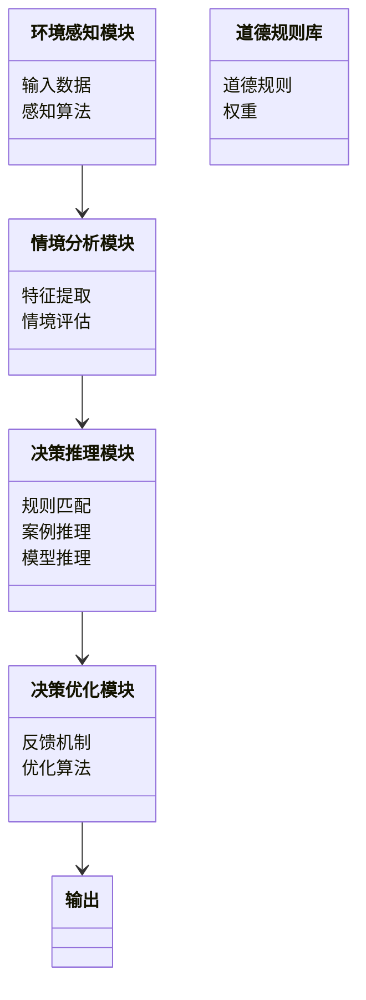
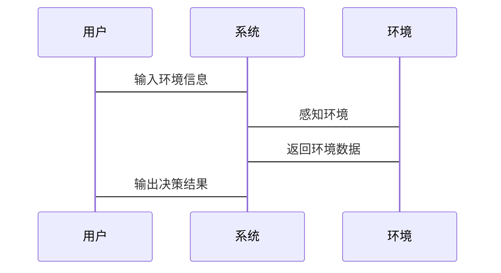

                 


# 《构建具有道德决策框架的AI Agent》

## 关键词：AI Agent, 道德决策, 伦理框架, 人工智能, 伦理决策系统, 责任归属

## 摘要：构建具有道德决策框架的AI Agent，涉及道德决策框架的设计、实现与应用。文章从背景、概念、算法、系统架构、项目实现等方面详细探讨如何在AI Agent中嵌入道德决策逻辑，确保AI系统在复杂情境下做出符合伦理的决策。

---

# 第1章: 背景介绍

## 1.1 问题背景

### 1.1.1 当前AI Agent的发展现状

AI Agent（人工智能代理）正在快速渗透到各个领域，从自动驾驶到医疗诊断，从智能客服到社交机器人。然而，随着AI Agent的决策权限和影响范围不断扩大，其决策的道德性和伦理性问题日益凸显。

- **AI Agent的决策特点**：AI Agent能够自主感知环境、分析问题、制定解决方案并执行决策。这种自主性使得AI Agent的决策结果直接影响到用户、环境甚至社会。
- **道德决策的重要性**：在某些场景中，AI Agent的决策可能涉及到生命安全、财产损失、隐私保护等重大问题。例如，自动驾驶汽车在紧急情况下如何选择刹车或转向，直接关系到人员伤亡。
- **现有问题**：当前大多数AI Agent的决策机制主要基于最大化效用（Utility Maximization）或最小化损失（Loss Minimization）的原则，而忽略了道德和伦理的考量。这种决策方式在某些情况下可能导致不符合人类伦理标准的结果。

### 1.1.2 道德决策的必要性

AI Agent的决策必须符合人类社会的道德和伦理规范。例如：

- **医疗AI Agent**：在辅助医生诊断疾病时，AI Agent需要确保其建议符合患者的最佳利益，避免因算法错误导致误诊或过度治疗。
- **金融AI Agent**：在投资决策中，AI Agent需要避免因追求短期利益而忽视长期的伦理风险。
- **法律AI Agent**：在法律咨询中，AI Agent需要确保其建议符合法律规范，同时兼顾社会公序良俗。

### 1.1.3 道德决策框架的必要性

为了确保AI Agent的决策符合道德和伦理标准，我们需要构建一个专门的道德决策框架，用以规范AI Agent的决策过程。这个框架需要考虑以下方面：

- **决策主体**：AI Agent本身是一个决策主体，但它需要根据人类设定的道德准则进行决策。
- **决策情境**：AI Agent的决策需要考虑具体的情境，包括环境、参与者、可能的结果等。
- **决策规则**：道德决策框架需要为AI Agent提供明确的决策规则，指导其在不同情境下做出符合道德的选择。

## 1.2 问题描述

### 1.2.1 道德决策的复杂性

道德决策是一个复杂的系统工程，涉及到多个方面的因素：

- **情境多样性**：不同场景下的道德决策标准可能截然不同。例如，在自动驾驶中，紧急刹车可能造成财产损失，而转向则可能危及他人的生命安全。
- **利益冲突**：在某些情况下，AI Agent可能需要在多个利益之间进行权衡。例如，在资源分配中，如何在公平性和效率之间找到平衡。
- **不确定性**：现实世界中的许多道德决策问题都存在高度的不确定性，AI Agent需要在信息不完全的情况下做出决策。

### 1.2.2 道德决策框架的设计挑战

构建道德决策框架面临以下挑战：

- **道德准则的多样性**：不同文化、社会、法律体系下的道德准则可能截然不同。AI Agent需要能够适应不同环境下的道德决策需求。
- **动态变化**：社会的道德标准是动态变化的，AI Agent需要能够实时更新其道德决策框架。
- **可解释性**：AI Agent的决策需要具有可解释性，使得用户能够理解AI的决策逻辑，并在必要时进行干预。

### 1.2.3 道德决策框架的实现路径

实现道德决策框架需要从以下几个方面入手：

- **道德准则的编码**：将道德准则转化为计算机可理解的形式，例如规则库、权重模型等。
- **决策逻辑的设计**：设计适合AI Agent的决策逻辑，确保其能够在复杂情境下做出符合道德的决策。
- **动态更新机制**：建立道德准则的动态更新机制，确保AI Agent能够适应不断变化的道德环境。

## 1.3 问题解决

### 1.3.1 道德决策框架的设计目标

- **明确性**：道德决策框架需要明确AI Agent在不同情境下的决策规则。
- **可扩展性**：框架需要能够适应不同场景和不同类型的道德决策需求。
- **可解释性**：框架需要提供清晰的决策逻辑，使得人类能够理解并信任AI Agent的决策。

### 1.3.2 道德决策框架的核心要素

- **道德规则库**：包含AI Agent需要遵循的道德准则和行为规范。
- **情境感知模块**：能够感知当前决策情境，并提取相关特征。
- **决策推理引擎**：根据道德规则和情境信息，推理出最优决策。
- **反馈与优化模块**：根据实际决策结果和反馈，优化道德决策框架。

### 1.3.3 道德决策框架的实现路径

1. **道德准则的获取与编码**：通过专家访谈、文献研究等方式获取相关道德准则，并将其编码为计算机可理解的形式。
2. **决策逻辑的设计**：基于道德准则，设计适合AI Agent的决策逻辑，例如基于规则的推理、基于案例的推理等。
3. **动态更新机制的建立**：通过机器学习、知识图谱等技术，实现道德准则的动态更新和优化。

## 1.4 道德决策框架的边界与外延

### 1.4.1 道德决策的适用范围

- **适用范围**：道德决策框架适用于所有需要考虑道德因素的AI Agent决策场景，例如自动驾驶、医疗诊断、法律咨询等。
- **不适用范围**：对于那些不需要考虑道德因素的简单决策任务，道德决策框架可能显得过于复杂。

### 1.4.2 道德决策框架的局限性

- **复杂性**：道德决策框架的设计和实现需要考虑的因素众多，可能导致系统复杂性增加。
- **动态变化**：社会道德标准的变化可能导致道德决策框架需要频繁更新，增加了维护成本。
- **伦理争议**：某些情况下，道德决策框架可能面临伦理争议，例如在自动驾驶中如何权衡不同生命的权重。

### 1.4.3 道德决策与法律、伦理的关系

- **法律约束**：道德决策框架需要符合相关法律法规的要求，例如数据隐私保护法、反歧视法等。
- **伦理规范**：道德决策框架需要遵循相关的伦理规范，例如保护弱势群体、促进社会公平等。
- **社会接受度**：道德决策框架的最终目的是提高社会对AI Agent的信任度和接受度。

## 1.5 道德决策框架的概念结构与核心要素

### 1.5.1 道德决策框架的核心概念

- **道德目标**：AI Agent希望通过决策实现的目标，例如最大化社会福祉、保护人权等。
- **道德规则**：AI Agent在决策过程中需要遵循的规则，例如“优先保护人类生命”、“避免伤害无辜”等。
- **道德情境感知**：AI Agent对当前决策情境的感知和理解能力。
- **道德推理**：AI Agent基于道德规则和情境信息进行推理，得出决策的过程。

### 1.5.2 AI Agent的决策过程

AI Agent的决策过程可以分为以下几个阶段：

1. **感知环境**：AI Agent通过传感器或数据输入获取环境信息。
2. **分析问题**：AI Agent对获取的信息进行分析，识别出需要决策的问题。
3. **生成候选方案**：基于道德决策框架，生成多个可能的决策方案。
4. **评估方案**：对每个候选方案进行评估，计算其符合道德准则的程度。
5. **选择最优方案**：根据评估结果，选择最优的决策方案。
6. **执行决策**：将选择的方案付诸实施，并实时监控决策结果。
7. **反馈优化**：根据实际结果和反馈，优化道德决策框架。

### 1.5.3 道德决策框架的系统架构

- **输入层**：包括环境感知、用户输入等。
- **处理层**：包括道德规则编码、情境感知、决策推理等核心功能。
- **输出层**：包括决策结果、反馈优化等。

## 1.6 本章小结

本章从背景出发，详细介绍了构建具有道德决策框架的AI Agent的必要性。通过分析道德决策的复杂性和挑战，提出了道德决策框架的核心要素和实现路径。接下来的章节将深入探讨道德决策框架的具体实现方法，包括算法原理、系统架构设计、项目实战等。

---

# 第2章: 道德决策框架的核心概念与联系

## 2.1 道德决策框架的原理

### 2.1.1 道德决策的基本原则

- **功利主义原则**：以最大化社会福祉为目标。
- **义务论原则**：基于道德义务和责任进行决策。
- **美德伦理原则**：基于个体的美德和品格进行决策。

### 2.1.2 道德决策的逻辑结构

1. **问题识别**：识别需要决策的具体问题。
2. **情境分析**：分析决策情境中的各种因素。
3. **规则匹配**：将情境与道德规则进行匹配。
4. **推理与评估**：基于规则进行推理，评估不同方案的道德价值。
5. **决策选择**：选择最优的决策方案。

### 2.1.3 道德决策框架的实现方式

- **基于规则的决策**：通过预定义的道德规则进行决策。
- **基于案例的决策**：通过参考历史案例进行决策。
- **基于模型的决策**：通过建立道德模型进行决策。

### 2.1.4 道德决策的动态性

- **动态规则库**：道德规则需要根据环境变化进行动态调整。
- **自适应推理**：AI Agent需要具备自适应推理能力，以应对复杂情境。

## 2.2 道德决策框架的核心要素

### 2.2.1 道德目标

- **目标设定**：明确AI Agent的决策目标。
- **目标优先级**：确定不同目标的优先级。

### 2.2.2 道德规则

- **规则编码**：将道德准则转化为可执行的规则。
- **规则可解释性**：确保规则的可解释性，便于人类理解和信任。

### 2.2.3 道德情境感知

- **情境识别**：识别当前决策情境。
- **情境特征提取**：提取情境中的关键特征。

### 2.2.4 道德推理与决策

- **推理算法**：选择适合的推理算法，例如逻辑推理、概率推理等。
- **决策优化**：通过优化算法，选择最优的决策方案。

## 2.3 道德决策框架与AI Agent的联系

### 2.3.1 AI Agent的决策过程

AI Agent的决策过程可以分为以下几个步骤：

1. **感知环境**：通过传感器或数据输入获取环境信息。
2. **分析问题**：识别需要决策的具体问题。
3. **生成候选方案**：基于道德决策框架生成多个可能的决策方案。
4. **评估方案**：对每个候选方案进行评估，计算其符合道德准则的程度。
5. **选择最优方案**：根据评估结果，选择最优的决策方案。
6. **执行决策**：将选择的方案付诸实施，并实时监控决策结果。
7. **反馈优化**：根据实际结果和反馈，优化道德决策框架。

### 2.3.2 道德决策框架在AI Agent中的应用

- **自动驾驶汽车**：在紧急情况下，AI Agent需要根据道德准则进行决策。
- **医疗诊断系统**：在诊断过程中，AI Agent需要确保其建议符合医疗伦理。
- **法律咨询系统**：在提供法律建议时，AI Agent需要遵守法律和伦理规范。

### 2.3.3 道德决策框架对AI Agent性能的影响

- **决策正确性**：道德决策框架能够提高AI Agent的决策正确性。
- **系统可信度**：通过符合道德标准的决策，提高系统的可信度。
- **用户体验**：道德决策框架能够提升用户体验，增强用户对AI Agent的信任。

## 2.4 道德决策框架的核心属性特征对比

### 2.4.1 道德决策框架的可解释性

- **可解释性的重要性**：用户需要理解AI Agent的决策逻辑，以便在必要时进行干预或调整。
- **可解释性的影响因素**：包括规则的清晰性、推理过程的透明性等。

### 2.4.2 道德决策框架的可扩展性

- **可扩展性的重要性**：道德决策框架需要能够适应不同场景和不同类型的道德决策需求。
- **可扩展性的影响因素**：包括规则库的灵活性、系统的模块化设计等。

### 2.4.3 道德决策框架的动态适应性

- **动态适应性的重要性**：社会道德标准是动态变化的，AI Agent需要能够实时更新其道德决策框架。
- **动态适应性的影响因素**：包括反馈机制、自适应学习能力等。

### 2.4.4 道德决策框架的可定制性

- **可定制性的重要性**：不同组织、不同文化背景下，道德决策框架可能需要不同的定制。
- **可定制性的影响因素**：包括规则库的可配置性、系统架构的灵活性等。

## 2.5 道德决策框架的ER实体关系图

```mermaid
erDiagram
    actor 用户 {
        <primitive str 用户ID>
        <primitive str 用户名称>
        <primitive str 用户角色>
    }
    actor 系统 {
        <primitive str 系统ID>
        <primitive str 系统名称>
        <primitive str 系统版本>
    }
    actor 环境 {
        <primitive str 环境ID>
        <primitive str 环境类型>
        <primitive str 环境状态>
    }
    role 用户与系统的交互
    role 系统与环境的交互
    role 用户与环境的交互
```

## 2.6 本章小结

本章详细探讨了道德决策框架的核心概念与联系，分析了道德决策框架的设计原则和实现方式。通过对比不同道德决策框架的属性特征，提出了构建道德决策框架的关键要素。接下来的章节将从算法原理、系统架构设计等方面，进一步探讨如何实现具有道德决策框架的AI Agent。

---

# 第3章: 算法原理

## 3.1 道德决策算法的实现原理

### 3.1.1 基于规则的道德决策算法

- **规则库设计**：预定义一组道德规则，例如“优先保护人类生命”、“避免伤害无辜”等。
- **规则匹配**：根据当前情境，匹配适用的道德规则。
- **决策推理**：基于匹配的规则，进行推理，得出决策方案。

### 3.1.2 基于案例的道德决策算法

- **案例库构建**：收集和整理历史决策案例，建立案例库。
- **案例检索**：根据当前情境，检索相似案例。
- **案例推理**：基于相似案例，推导出当前情境下的决策方案。

### 3.1.3 基于模型的道德决策算法

- **模型构建**：建立道德决策模型，例如基于概率的道德决策模型。
- **模型训练**：通过历史数据训练模型，优化模型参数。
- **模型推理**：基于当前情境，进行模型推理，得出决策方案。

### 3.1.4 基于多目标优化的道德决策算法

- **目标设定**：设定多个决策目标，例如最大化社会福祉、最小化负面社会影响等。
- **目标权重设定**：根据情境，设定各目标的权重。
- **优化算法**：使用多目标优化算法，求解最优决策方案。

## 3.2 道德决策算法的实现流程

### 3.2.1 基于规则的道德决策算法流程

1. **输入环境信息**：获取当前决策情境。
2. **提取情境特征**：从环境信息中提取关键特征。
3. **匹配道德规则**：根据情境特征，匹配适用的道德规则。
4. **推理决策方案**：基于匹配的规则，推理出决策方案。
5. **输出决策结果**：将决策方案输出。

### 3.2.2 基于案例的道德决策算法流程

1. **输入环境信息**：获取当前决策情境。
2. **提取情境特征**：从环境信息中提取关键特征。
3. **检索相似案例**：从案例库中检索相似案例。
4. **案例推理**：基于相似案例，推导出当前情境下的决策方案。
5. **输出决策结果**：将决策方案输出。

### 3.2.3 基于模型的道德决策算法流程

1. **输入环境信息**：获取当前决策情境。
2. **提取情境特征**：从环境信息中提取关键特征。
3. **模型推理**：基于道德决策模型，进行推理，得出决策方案。
4. **输出决策结果**：将决策方案输出。

## 3.3 道德决策算法的数学模型

### 3.3.1 基于规则的决策模型

- **规则表示**：将道德规则表示为逻辑条件，例如$R_1 \land R_2 \land \ldots \land R_n$。
- **决策逻辑**：根据匹配的规则，进行逻辑推理，得出决策结果。

### 3.3.2 基于案例的决策模型

- **案例相似度计算**：使用相似度计算公式，例如$similarity(s, c) = \sum_{i=1}^{n} w_i \cdot f_i(s, c)$，其中$w_i$是特征$i$的权重，$f_i$是特征$i$的相似度函数。
- **决策推理**：基于相似案例，进行加权平均或投票，得出决策结果。

### 3.3.3 基于模型的决策模型

- **模型训练**：使用历史数据训练道德决策模型，例如基于支持向量机（SVM）或随机森林（Random Forest）的分类模型。
- **模型推理**：将当前情境输入模型，进行预测，得出决策结果。

## 3.4 道德决策算法的代码实现

### 3.4.1 基于规则的决策算法实现

```python
def moral_decision_rule_based(context):
    # 提取情境特征
    features = extract_features(context)
    # 匹配道德规则
    matched_rules = match_rules(features)
    # 推理决策方案
    decision = infer_decision(matched_rules)
    return decision
```

### 3.4.2 基于案例的决策算法实现

```python
def moral_decision_case_based(context):
    # 提取情境特征
    features = extract_features(context)
    # 检索相似案例
    similar_cases = retrieve_cases(features)
    # 案例推理
    decision = infer_decision(similar_cases)
    return decision
```

### 3.4.3 基于模型的决策算法实现

```python
def moral_decision_model_based(context):
    # 提取情境特征
    features = extract_features(context)
    # 模型推理
    decision = model.predict(features)
    return decision
```

## 3.5 道德决策算法的数学模型详细解释

### 3.5.1 基于规则的决策模型数学表示

$$ R = \bigwedge_{i=1}^{n} R_i $$

其中，$R_i$表示第$i$个道德规则，$\bigwedge$表示逻辑与运算。

### 3.5.2 基于案例的决策模型数学表示

$$ similarity(s, c) = \sum_{i=1}^{m} w_i \cdot f_i(s, c) $$

其中，$w_i$表示第$i$个特征的权重，$f_i(s, c)$表示第$i$个特征的相似度函数。

### 3.5.3 基于模型的决策模型数学表示

$$ P(y|x) = \frac{P(x|y)P(y)}{P(x)} $$

其中，$P(y|x)$表示在特征$x$下决策$y$的概率，$P(x|y)$是似然概率，$P(y)$是先验概率，$P(x)$是边缘概率。

## 3.6 本章小结

本章详细探讨了道德决策算法的实现原理，包括基于规则、基于案例和基于模型的三种实现方式。通过数学模型和代码实现，展示了如何将道德决策框架嵌入到AI Agent的决策过程中。接下来的章节将从系统架构设计的角度，进一步探讨如何实现具有道德决策框架的AI Agent。

---

# 第4章: 系统分析与架构设计

## 4.1 项目场景介绍

### 4.1.1 项目背景

- **项目目标**：构建一个具有道德决策框架的AI Agent，能够在复杂情境下做出符合伦理的决策。
- **项目范围**：涵盖AI Agent的感知、分析、决策、执行和反馈优化全过程。
- **项目目标群体**：适用于自动驾驶、医疗诊断、法律咨询等领域。

### 4.1.2 项目需求

- **功能需求**：
  1. 实现实时环境感知功能。
  2. 提供多目标优化的决策能力。
  3. 具备动态更新的道德决策框架。
  4. 提供可解释的决策过程。
- **性能需求**：
  1. 快速响应决策需求。
  2. 高精度的决策正确性。
  3. 强大的环境适应能力。
- **接口需求**：
  1. 提供标准的API接口。
  2. 支持多种数据格式的输入输出。

## 4.2 系统功能设计

### 4.2.1 领域模型类图



### 4.2.2 系统架构设计

```mermaid
archiDiagram
    component 用户接口 {
        输入
        输出
    }
    component 环境感知模块 {
        感知算法
    }
    component 情境分析模块 {
        特征提取
        情境评估
    }
    component 决策推理模块 {
        规则匹配
        案例推理
        模型推理
    }
    component 决策优化模块 {
        反馈机制
        优化算法
    }
    用户接口 --> 环境感知模块
    环境感知模块 --> 情境分析模块
    情境分析模块 --> 决策推理模块
    决策推理模块 --> 决策优化模块
    决策优化模块 --> 用户接口
```

### 4.2.3 接口设计与交互



## 4.3 系统交互流程

### 4.3.1 系统输入

- **输入方式**：
  1. 用户输入：通过用户接口输入环境信息。
  2. 系统感知：通过传感器或数据接口获取环境信息。

### 4.3.2 系统处理

- **处理流程**：
  1. 环境感知模块：获取环境数据。
  2. 情境分析模块：提取情境特征，评估情境。
  3. 决策推理模块：基于道德规则库，进行推理，生成决策方案。
  4. 决策优化模块：根据反馈优化决策框架。

### 4.3.3 系统输出

- **输出形式**：
  1. 决策结果：通过用户接口输出。
  2. 反馈信息：收集用户反馈，优化决策框架。

## 4.4 系统架构设计的优缺点

### 4.4.1 优点

- **模块化设计**：系统架构清晰，各模块独立，便于维护和扩展。
- **可扩展性**：系统架构支持不同模块的替换和扩展。
- **可维护性**：各模块之间的耦合度低，便于修改和优化。

### 4.4.2 缺点

- **复杂性**：系统架构较为复杂，需要较多的资源和时间进行开发和维护。
- **性能瓶颈**：在某些情况下，模块化设计可能导致系统性能下降。

## 4.5 本章小结

本章从系统架构设计的角度，详细探讨了如何实现具有道德决策框架的AI Agent。通过领域模型类图、系统架构图和系统交互序列图，展示了系统的整体架构和各模块之间的关系。接下来的章节将从项目实战的角度，进一步探讨如何实现具有道德决策框架的AI Agent。

---

# 第5章: 项目实战

## 5.1 项目环境安装与配置

### 5.1.1 系统需求

- **硬件需求**：具备一定的计算能力，例如多核处理器、足够的内存。
- **软件需求**：
  1. 操作系统：Linux/Windows/MacOS。
  2. Python编程语言：建议使用Python 3.8及以上版本。
  3. 第三方库：例如numpy、scikit-learn、pymysql等。

### 5.1.2 环境安装步骤

1. **安装Python**：
   ```bash
   # 在Linux系统中安装Python
   sudo apt-get install python3 python3-pip
   ```
2. **安装第三方库**：
   ```bash
   pip install numpy scikit-learn pymysql
   ```
3. **配置开发环境**：
   - 安装IDE：例如PyCharm、VS Code。
   - 配置Python解释器。

### 5.1.3 环境配置注意事项

- **版本管理**：确保所有依赖库的版本兼容。
- **权限管理**：在安装过程中注意权限问题，避免权限不足导致的安装失败。

## 5.2 系统核心代码实现

### 5.2.1 环境感知模块

```python
def environment_perception():
    # 模拟环境感知数据
    data = {
        'temperature': 25,
        'humidity': 60,
        'light': 100
    }
    return data
```

### 5.2.2 情境分析模块

```python
def situation_analysis(data):
    # 提取情境特征
    features = {
        'temperature': data['temperature'],
        'humidity': data['humidity'],
        'light': data['light']
    }
    return features
```

### 5.2.3 决策推理模块

```python
def decision_reasoning(features):
    # 道德规则库
    rules = {
        'rule1': {'name': '高温情况下，建议开启空调', 'weight': 0.8},
        'rule2': {'name': '高湿度情况下，建议开启除湿功能', 'weight': 0.7}
    }
    # 匹配规则
    matched_rules = []
    for rule in rules.values():
        if features['temperature'] > 28 or features['humidity'] > 70:
            matched_rules.append(rule)
    # 推理决策
    decision = '开启空调和除湿功能'
    return decision
```

### 5.2.4 决策优化模块

```python
def decision_optimization(decision):
    # 反馈机制
    feedback = input('请输入反馈：')
    # 优化决策框架
    if feedback == '满意':
        print('感谢您的反馈，系统将继续优化。')
    else:
        print('我们将根据您的反馈进行改进。')
    return
```

## 5.3 代码实现与解读

### 5.3.1 环境感知模块解读

- **功能**：获取环境数据，例如温度、湿度、光照强度等。
- **实现**：通过传感器或数据接口获取数据，并返回数据字典。

### 5.3.2 情境分析模块解读

- **功能**：从环境数据中提取情境特征，例如高温、高湿度等。
- **实现**：将环境数据转换为特征向量，便于后续的决策推理。

### 5.3.3 决策推理模块解读

- **功能**：根据情境特征，匹配适用的道德规则，进行决策推理，生成决策方案。
- **实现**：基于预定义的道德规则库，进行规则匹配和决策推理。

### 5.3.4 决策优化模块解读

- **功能**：根据用户反馈，优化道德决策框架，提升决策正确性。
- **实现**：通过反馈机制，动态调整道德规则的权重，优化决策模型。

## 5.4 项目实战案例分析

### 5.4.1 案例背景

- **场景**：高温高湿环境下，AI Agent需要决定是否开启空调和除湿功能。
- **目标**：在保证舒适度的同时，遵循节能原则。

### 5.4.2 案例分析

1. **环境感知**：环境感知模块获取温度=28℃，湿度=75%，光照强度=100lux。
2. **情境分析**：高温和高湿特征匹配规则1和规则2。
3. **决策推理**：根据匹配的规则，推理出开启空调和除湿功能的决策。
4. **决策优化**：用户反馈为“满意”，系统确认优化。

### 5.4.3 决策过程详细解释

1. **环境感知模块**：获取环境数据，包括温度、湿度、光照强度等。
2. **情境分析模块**：提取情境特征，判断是否高温和高湿。
3. **决策推理模块**：匹配适用的道德规则，进行决策推理，生成决策方案。
4. **决策优化模块**：根据用户反馈，优化道德决策框架，提升决策正确性。

## 5.5 项目小结

本章通过项目实战，详细展示了如何实现具有道德决策框架的AI Agent。通过具体的代码实现和案例分析，验证了道德决策框架的有效性和可行性。接下来的章节将从最佳实践的角度，进一步总结经验和教训。

---

# 第6章: 最佳实践

## 6.1 最佳实践总结

### 6.1.1 知识总结

- **道德决策框架的重要性**：在AI Agent的决策过程中，道德决策框架能够确保决策的正确性和伦理性。
- **系统架构设计的关键性**：清晰的系统架构设计是实现具有道德决策框架的AI Agent的基础。
- **项目实战的经验**：通过项目实战，我们掌握了道德决策框架的实现方法和实际应用。

### 6.1.2 经验总结

- **模块化设计的优势**：模块化设计能够提高系统的可维护性和可扩展性。
- **动态更新的重要性**：动态更新机制能够确保道德决策框架适应不断变化的道德环境。
- **用户反馈的价值**：用户反馈是优化道德决策框架的重要依据。

### 6.1.3 教训总结

- **复杂性带来的挑战**：系统的复杂性可能导致开发和维护成本增加。
- **动态适应性的难度**：动态适应性的实现需要较高的技术和资源投入。
- **用户接受度的挑战**：用户对AI Agent决策的接受度可能受到多种因素的影响。

## 6.2 道德决策框架的注意事项

### 6.2.1 道德决策框架的设计注意事项

- **清晰性**：道德规则需要清晰明确，便于理解和实施。
- **可扩展性**：道德决策框架需要具备可扩展性，能够适应不同场景和不同类型的道德决策需求。
- **动态适应性**：道德决策框架需要具备动态适应性，能够实时更新以适应变化的道德环境。

### 6.2.2 道德决策框架的实施注意事项

- **用户参与**：在设计道德决策框架时，需要充分考虑用户的参与和反馈。
- **伦理审查**：在实施道德决策框架时，需要进行伦理审查，确保其符合相关法律法规和伦理规范。
- **系统监控**：在系统运行过程中，需要实时监控道德决策框架的运行状态，及时发现和解决问题。

## 6.3 道德决策框架的拓展阅读

### 6.3.1 道德决策框架的理论研究

- **伦理决策理论**：研究如何将伦理决策理论应用于AI Agent的决策过程中。
- **社会契约论**：研究如何通过社会契约论构建AI Agent的道德决策框架。

### 6.3.2 道德决策框架的技术实现

- **人工智能伦理**：研究人工智能伦理的理论和技术实现方法。
- **伦理算法**：研究如何将伦理准则转化为可执行的算法。

### 6.3.3 道德决策框架的应用案例

- **自动驾驶汽车**：研究自动驾驶汽车的道德决策框架。
- **医疗诊断系统**：研究医疗诊断系统的道德决策框架。
- **法律咨询系统**：研究法律咨询系统的道德决策框架。

## 6.4 本章小结

本章总结了构建具有道德决策框架的AI Agent的最佳实践，包括知识总结、经验总结和教训总结。同时，提出了道德决策框架的设计注意事项和实施注意事项。最后，通过拓展阅读，进一步探讨了道德决策框架的理论研究、技术实现和应用案例。通过本章的总结，读者可以更好地理解和应用道德决策框架，构建更加智能和伦

