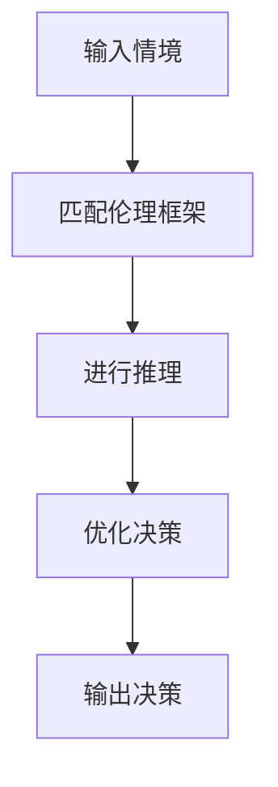
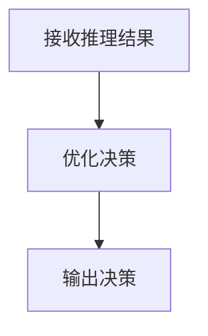
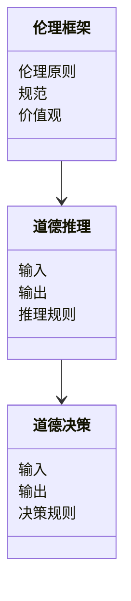
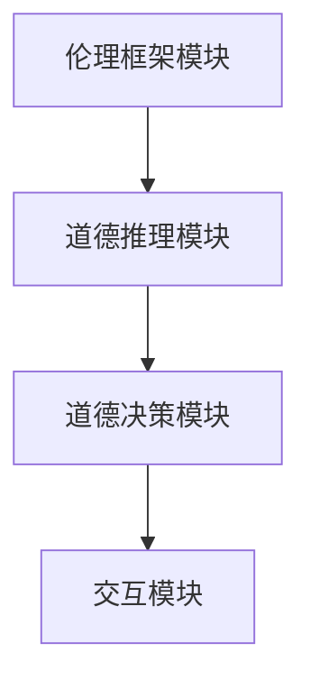
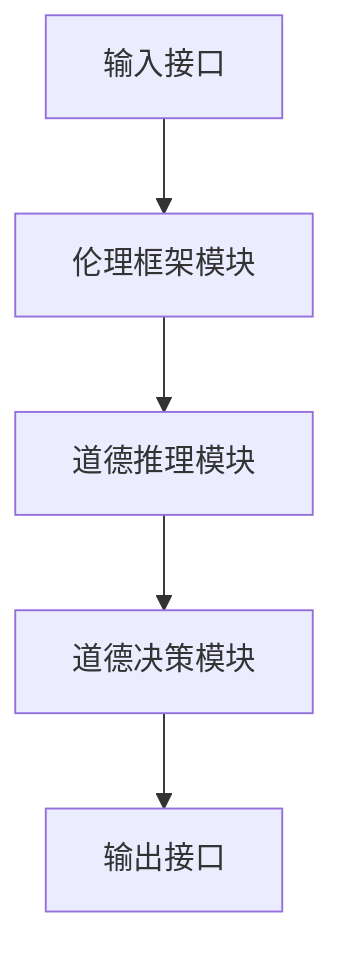
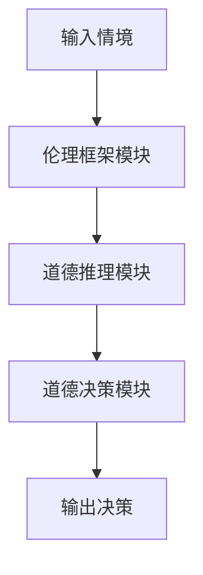

                 


# 构建具有道德决策能力的AI Agent

> 关键词：AI Agent, 道德决策, 伦理框架, 道德推理, 人工智能

> 摘要：本文详细探讨了构建具有道德决策能力的AI Agent的关键技术与实现方法。从背景介绍到核心概念，从算法原理到系统架构，从项目实战到最佳实践，系统地分析了如何赋予AI Agent道德决策能力，确保其在复杂情境中做出符合伦理规范的决策。

---

# 第一部分: 背景介绍

## 第1章: 问题背景

### 1.1 问题背景
随着人工智能技术的飞速发展，AI Agent在各个领域的应用越来越广泛。然而，AI Agent在决策过程中往往缺乏对伦理和道德的考虑，导致在某些情况下可能出现违背人类价值观的行为。例如，在自动驾驶汽车中，AI需要在紧急情况下做出决策，这涉及到生命安全和伦理选择的问题。因此，构建具有道德决策能力的AI Agent显得尤为重要。

### 1.2 问题描述
AI Agent的道德决策能力是指其在复杂情境中，能够根据伦理规范和价值观做出合理决策的能力。这涉及到多个方面，包括伦理框架的构建、道德推理的实现、道德决策的优化等。然而，当前的AI技术在道德决策方面还存在诸多挑战，例如如何将伦理规范转化为可计算的模型，如何处理动态变化的道德情境等。

### 1.3 问题解决
为了实现AI Agent的道德决策能力，需要从以下几个方面入手：
1. **伦理框架的构建**：设计一套能够涵盖主要伦理原则的框架，例如公正、诚实、责任等。
2. **道德推理的实现**：开发能够处理复杂情境的推理算法，确保AI Agent能够根据伦理框架做出合理的推理。
3. **道德决策的优化**：通过不断优化决策算法，提升AI Agent在复杂情境中的决策能力。

### 1.4 边界与外延
道德决策能力的实现需要明确其边界和外延。例如，道德决策能力并不意味着AI Agent能够完全取代人类的道德判断，而是在特定场景下辅助人类做出决策。此外，道德决策能力还与AI Agent的其他能力，例如学习能力、推理能力等密切相关。

### 1.5 概念结构与核心要素组成
道德决策能力的实现涉及多个核心要素，包括：
- **伦理框架**：AI Agent的道德决策需要基于一定的伦理框架，例如公正、诚实、责任等。
- **道德推理**：AI Agent需要能够根据伦理框架进行推理，得出合理的决策。
- **道德决策**：最终，AI Agent需要根据推理结果做出决策，并输出相应的行动。

---

# 第二部分: 核心概念与联系

## 第2章: 道德决策的核心原理

### 2.1 伦理框架的构建
伦理框架是AI Agent道德决策的基础。它需要涵盖主要的伦理原则，例如公正、诚实、责任等。在构建伦理框架时，需要考虑以下几点：
- **伦理原则的全面性**：确保伦理框架能够涵盖所有可能的伦理原则。
- **伦理原则的可操作性**：将伦理原则转化为可计算的模型，确保AI Agent能够理解并应用这些原则。

### 2.2 道德推理的逻辑模型
道德推理是AI Agent道德决策的核心过程。它需要根据伦理框架和具体情境，进行推理并得出合理的决策。常见的道德推理模型包括：
- **基于规则的推理**：根据预定义的规则进行推理。
- **基于案例的推理**：根据类似案例进行推理。
- **基于知识的推理**：根据知识库中的知识进行推理。

### 2.3 道德决策的实现路径
道德决策的实现需要结合伦理框架和道德推理的结果。具体步骤包括：
1. **输入情境**：AI Agent接收当前情境的信息。
2. **伦理框架匹配**：将情境与伦理框架进行匹配，确定适用的伦理原则。
3. **道德推理**：根据伦理框架和情境信息，进行推理并得出可能的决策。
4. **决策优化**：对推理结果进行优化，选择最优的决策。
5. **输出决策**：将最终决策输出，并执行相应的行动。

### 2.4 核心概念的属性特征对比
以下是核心概念的属性特征对比表格：

| 概念       | 属性       | 特征                                                                 |
|------------|------------|----------------------------------------------------------------------|
| 伦理框架   | 完整性     | 包括主要的伦理原则，如公正、诚实、责任等。                                 |
| 道德推理   | 复杂性     | 需要考虑多种因素和情境，推理过程较为复杂。                                 |
| 道德决策   | 实时性     | 需要在动态环境中快速做出决策，具有较高的实时性。                           |

### 2.5 ER实体关系图
以下是道德决策的核心概念的ER实体关系图：

```mermaid
erd
    entity 道德框架 {
        id
        伦理原则
        规范
        价值观
    }
    entity 道德推理 {
        id
        输入
        输出
        推理规则
    }
    entity 道德决策 {
        id
        输入
        输出
        决策规则
    }
    道德框架 -[1..n]-> 道德推理
    道德推理 -[1..n]-> 道德决策
```

---

# 第三部分: 算法原理讲解

## 第3章: 伦理框架到算法的转换

### 3.1 基于规则的伦理框架
基于规则的伦理框架是一种简单但有效的实现方式。它通过预定义的规则来指导AI Agent的决策过程。例如，在自动驾驶中，可以预定义“优先保护人类生命”的规则。

### 3.2 基于学习的伦理框架
基于学习的伦理框架通过机器学习算法，从大量数据中学习伦理规范。例如，可以通过监督学习，训练AI Agent识别哪些行为符合伦理规范。

### 3.3 基于知识的伦理框架
基于知识的伦理框架利用知识库中的伦理知识，进行推理和决策。例如，可以利用知识图谱中的伦理关系，进行推理并得出决策。

### 3.4 基于情感计算的伦理框架
情感计算是一种新兴的技术，通过分析情感信息，辅助AI Agent做出更符合人类情感的决策。例如，在客服机器人中，可以根据客户的情感状态，调整回应的方式。

---

## 第4章: 道德推理算法

### 4.1 道德推理的实现步骤
道德推理的实现步骤包括：
1. **输入情境**：接收当前情境的信息。
2. **伦理框架匹配**：将情境与伦理框架进行匹配，确定适用的伦理原则。
3. **推理过程**：根据伦理原则和情境信息，进行推理并得出可能的决策。
4. **决策优化**：对推理结果进行优化，选择最优的决策。

### 4.2 道德推理的算法流程图
以下是道德推理的算法流程图：



### 4.3 基于规则的道德推理算法
以下是基于规则的道德推理算法的伪代码：

```python
def moral_reasoning(rule_set, situation):
    for rule in rule_set:
        if rule.applies_to(situation):
            return rule.infer_decision(situation)
    return default_decision
```

### 4.4 基于学习的道德推理算法
以下是基于学习的道德推理算法的伪代码：

```python
def moral_reasoning(model, situation):
    input = prepare_input(situation)
    decision = model.predict(input)
    return decision
```

---

## 第5章: 道德决策算法

### 5.1 道德决策的实现步骤
道德决策的实现步骤包括：
1. **接收推理结果**：接收道德推理算法的输出。
2. **决策优化**：对推理结果进行优化，确保决策的合理性和最优性。
3. **输出决策**：将最终决策输出，并执行相应的行动。

### 5.2 道德决策的算法流程图
以下是道德决策的算法流程图：



### 5.3 基于优化的道德决策算法
以下是基于优化的道德决策算法的伪代码：

```python
def moral_decision-making(decision_options, optimization_criteria):
    for option in decision_options:
        if option.satisfies(optimization_criteria):
            return option
    return default_option
```

---

# 第四部分: 数学模型与公式

## 第6章: 伦理框架的数学模型

### 6.1 伦理框架的表示
伦理框架可以通过数学模型进行表示。例如，可以将伦理原则表示为向量，其中每个维度对应一个伦理原则。

### 6.2 伦理框架的优化
伦理框架的优化可以通过数学方法进行。例如，可以利用优化算法，调整伦理框架的参数，以提高决策的准确性。

### 6.3 伦理框架的公式表示
以下是伦理框架的公式表示：

$$
\text{伦理框架} = \{ e_1, e_2, \ldots, e_n \}
$$

其中，$e_i$ 表示第$i$个伦理原则。

---

## 第7章: 道德推理的数学模型

### 7.1 道德推理的逻辑表示
道德推理可以通过逻辑表示进行。例如，可以使用逻辑推理规则，对伦理框架和情境信息进行推理。

### 7.2 道德推理的优化
道德推理的优化可以通过数学方法进行。例如，可以利用概率论，计算每个决策的可能性，并选择最优的决策。

### 7.3 道德推理的公式表示
以下是道德推理的公式表示：

$$
\text{推理结果} = \arg\max_{d \in D} P(d | e, s)
$$

其中，$D$ 表示决策集合，$e$ 表示伦理框架，$s$ 表示情境信息。

---

# 第五部分: 系统分析与架构设计

## 第8章: 问题场景介绍

### 8.1 问题场景
AI Agent需要在复杂情境中做出道德决策。例如，在自动驾驶中，AI Agent需要在紧急情况下做出决策，优先保护人类生命。

### 8.2 系统介绍
本系统旨在构建一个具有道德决策能力的AI Agent，能够在复杂情境中做出符合伦理规范的决策。

---

## 第9章: 系统功能设计

### 9.1 系统功能概述
系统功能包括：
1. **伦理框架管理**：管理伦理框架，包括伦理原则、规范和价值观。
2. **道德推理**：根据伦理框架和情境信息，进行道德推理。
3. **道德决策**：根据推理结果，做出最终决策。

### 9.2 领域模型
以下是领域模型的类图：



---

## 第10章: 系统架构设计

### 10.1 系统架构概述
系统架构包括以下几个部分：
1. **伦理框架模块**：管理伦理框架。
2. **道德推理模块**：进行道德推理。
3. **道德决策模块**：做出最终决策。
4. **交互模块**：与外部环境进行交互。

### 10.2 系统架构图
以下是系统架构图：



---

## 第11章: 系统接口设计

### 11.1 系统接口概述
系统接口包括：
1. **输入接口**：接收外部环境的信息。
2. **输出接口**：输出决策结果。
3. **内部接口**：模块之间的交互接口。

### 11.2 系统接口图
以下是系统接口图：



---

## 第12章: 系统交互流程图

### 12.1 系统交互流程概述
系统交互流程包括：
1. **输入情境**：接收外部环境的信息。
2. **伦理框架匹配**：将情境与伦理框架进行匹配。
3. **道德推理**：根据伦理框架和情境信息，进行推理。
4. **道德决策**：根据推理结果，做出最终决策。
5. **输出决策**：将最终决策输出，并执行相应的行动。

### 12.2 系统交互流程图
以下是系统交互流程图：



---

# 第六部分: 项目实战

## 第13章: 环境安装与配置

### 13.1 环境要求
- **操作系统**：Windows/Mac/Linux
- **编程语言**：Python 3.6+
- **框架**：TensorFlow/PyTorch
- **依赖库**：numpy, pandas, matplotlib

### 13.2 安装依赖
```bash
pip install numpy pandas matplotlib
```

---

## 第14章: 核心代码实现

### 14.1 伦理框架管理模块
```python
class EthicalFramework:
    def __init__(self, principles, norms, values):
        self.principles = principles
        self.norms = norms
        self.values = values

    def get_principle(self, index):
        return self.principles[index]
```

### 14.2 道德推理模块
```python
class MoralReasoning:
    def __init__(self, ethical_framework):
        self.ethical_framework = ethical_framework

    def infer_decision(self, situation):
        for principle in self.ethical_framework.principles:
            if principle.applies_to(situation):
                return principle.infer_decision(situation)
        return default_decision
```

### 14.3 道德决策模块
```python
class MoralDecisionMaking:
    def __init__(self, decision_options, optimization_criteria):
        self.decision_options = decision_options
        self.optimization_criteria = optimization_criteria

    def make_decision(self):
        for option in self.decision_options:
            if option.satisfies(self.optimization_criteria):
                return option
        return default_option
```

---

## 第15章: 代码解读与分析

### 15.1 伦理框架管理模块
伦理框架管理模块负责管理伦理框架，包括伦理原则、规范和价值观。通过类`EthicalFramework`实现，提供获取伦理原则的方法。

### 15.2 道德推理模块
道德推理模块负责根据伦理框架和情境信息，进行推理并得出可能的决策。通过类`MoralReasoning`实现，提供推理决策的方法。

### 15.3 道德决策模块
道德决策模块负责根据推理结果，做出最终决策。通过类`MoralDecisionMaking`实现，提供决策优化的方法。

---

## 第16章: 案例分析

### 16.1 案例背景
假设在自动驾驶中，AI Agent需要在紧急情况下做出决策，优先保护人类生命。

### 16.2 实际应用
通过代码实现，AI Agent能够根据伦理框架和情境信息，进行推理并得出最优决策。

### 16.3 详细解读
通过代码实现，AI Agent能够在复杂情境中，做出符合伦理规范的决策，并执行相应的行动。

---

## 第17章: 项目小结

### 17.1 项目总结
通过本项目，我们成功构建了一个具有道德决策能力的AI Agent，能够在复杂情境中，做出符合伦理规范的决策。

### 17.2 经验总结
在实现过程中，我们需要注意以下几点：
1. **伦理框架的设计**：需要全面且合理。
2. **道德推理的实现**：需要考虑多种因素和情境。
3. **道德决策的优化**：需要不断优化和调整。

### 17.3 项目意义
本项目为AI Agent的道德决策能力的实现提供了重要的参考和指导，具有重要的理论和实践意义。

---

# 第七部分: 最佳实践

## 第18章: 小结

### 18.1 本章总结
通过本文的详细介绍，我们了解了构建具有道德决策能力的AI Agent的关键技术与实现方法。

## 第19章: 注意事项

### 19.1 实现注意事项
在实现过程中，需要注意以下几点：
1. **伦理框架的设计**：需要全面且合理。
2. **道德推理的实现**：需要考虑多种因素和情境。
3. **道德决策的优化**：需要不断优化和调整。

## 第20章: 拓展阅读

### 20.1 推荐书籍
1. 《道德机器》
2. 《人工智能的伦理》

### 20.2 推荐论文
1. "Moral Reasoning in AI Agents"
2. "Ethical Decision-Making in Autonomous Systems"

---

# 附录

## 附录A: 术语表

## 附录B: 参考文献

## 附录C: 代码示例

---

# 结束语

构建具有道德决策能力的AI Agent是一项具有挑战性的任务，需要我们不断探索和实践。通过本文的详细介绍，我们希望读者能够深入了解如何实现这一目标，并在实际应用中取得成功。

