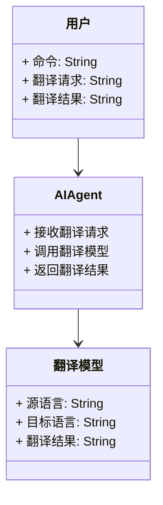
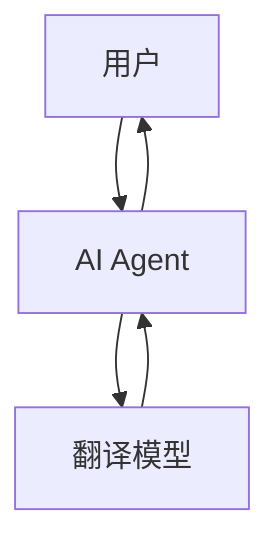
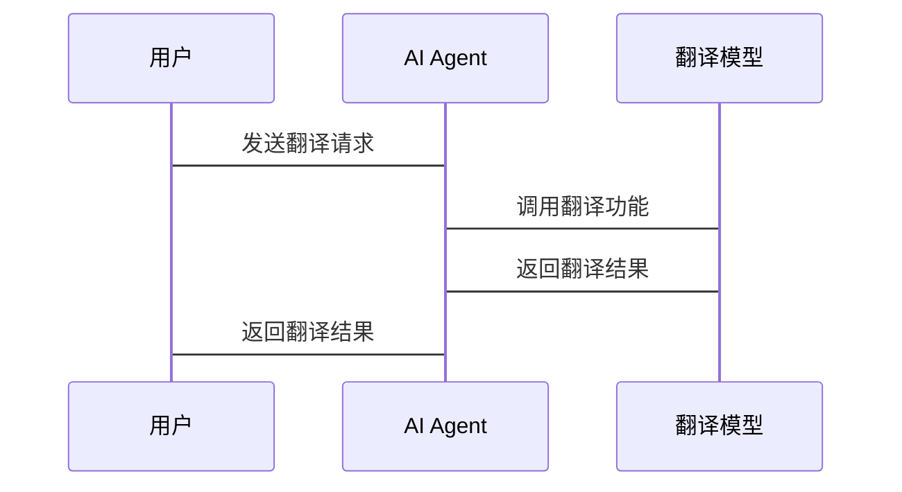

                 


# 构建多语言翻译AI Agent

> 关键词：多语言翻译、AI Agent、自然语言处理、机器学习、深度学习

> 摘要：本文将详细探讨如何构建一个多语言翻译AI Agent，涵盖从背景介绍、核心概念、算法原理到系统架构设计的各个方面。通过逐步分析，我们将了解如何利用自然语言处理技术和机器学习算法来实现高效的多语言翻译功能。

---

## 第一部分: 多语言翻译AI Agent的背景与基础

### 第1章: 多语言翻译AI Agent的背景介绍

#### 1.1 问题背景与描述

##### 1.1.1 多语言翻译的需求与挑战
随着全球化的发展，跨语言交流的需求日益增长。然而，现有的翻译工具在处理复杂语境、专业术语和文化差异时仍存在诸多不足。例如，传统的统计机器翻译方法依赖于双语对照数据，难以应对长句翻译和语义理解的挑战。

##### 1.1.2 AI Agent在翻译中的作用
AI Agent（智能代理）是一种能够感知环境、执行任务并做出决策的智能系统。在翻译领域，AI Agent可以通过实时语言理解、上下文推理和多模态交互，提供更精准的翻译服务。

##### 1.1.3 当前翻译技术的局限性
- 统计机器翻译依赖大量双语数据，且难以处理未知词汇和语境。
- 基于规则的翻译方法灵活性差，难以应对复杂的语言结构。
- 神经机器翻译（NMT）虽然在某些场景下表现优异，但仍需优化其泛化能力和多语言支持。

#### 1.2 多语言翻译的核心概念

##### 1.2.1 多语言翻译的定义与特点
多语言翻译是指在多种语言之间进行文本或语音转换的过程。其特点是支持多种语言、语境理解和动态调整。

##### 1.2.2 AI Agent的基本概念
AI Agent是一种能够感知环境、执行任务、与用户交互的智能系统。在翻译场景中，AI Agent能够理解用户意图、上下文，并提供实时翻译服务。

##### 1.2.3 多语言翻译AI Agent的边界与外延
多语言翻译AI Agent的边界包括输入输出接口、翻译范围和任务类型。外延则涉及支持的语言种类、翻译精度和实时性要求。

#### 1.3 多语言翻译AI Agent的核心要素

##### 1.3.1 自然语言处理技术
自然语言处理（NLP）是实现翻译的核心技术，包括分词、句法分析、语义理解等。

##### 1.3.2 机器学习与深度学习
机器学习和深度学习算法（如RNN、Transformer）用于训练翻译模型，提升翻译精度。

##### 1.3.3 多语言模型的构建与优化
多语言模型需要在多种语言间共享参数，优化模型结构以提升翻译效率和精度。

### 第2章: 多语言翻译AI Agent的核心概念与联系

#### 2.1 核心概念原理

##### 2.1.1 多语言翻译的实现原理
多语言翻译通过构建跨语言映射模型，将源语言文本转换为目标语言文本。

##### 2.1.2 AI Agent的智能决策机制
AI Agent通过上下文分析和意图识别，选择最优的翻译策略和输出。

##### 2.1.3 翻译与理解的关联性
翻译不仅仅是语言转换，更是语义理解和意图表达的过程。

#### 2.2 核心概念属性对比表

| 对比维度 | 多语言翻译 | AI Agent |
|----------|------------|----------|
| 核心功能 | 跨语言转换 | 智能决策 |
| 输入方式 | 文本/语音 | 用户指令 |
| 输出方式 | 目标语言文本 | 翻译结果 |
| 处理能力 | 语言转换 | 上下文理解 |

#### 2.3 ER实体关系图架构

```mermaid
er
actor(用户) -->
event(翻译请求) -->
entity(源语言文本) -->
entity(翻译模型) -->
entity(目标语言文本)
```

---

## 第二部分: 多语言翻译AI Agent的算法原理

### 第3章: 多语言翻译的算法原理

#### 3.1 神经机器翻译模型

##### 3.1.1 神经机器翻译的基本结构
神经机器翻译模型（如Transformer）由编码器和解码器组成，用于学习源语言到目标语言的映射关系。

##### 3.1.2 翻译模型的训练过程
模型通过端到端训练，学习源语言和目标语言的语义表示。

##### 3.1.3 翻译结果的评估指标
BLEU、ROUGE等指标用于评估翻译质量。

#### 3.2 翻译模型的优化策略

##### 3.2.1 多任务学习
通过多任务学习，模型同时学习多种翻译任务，提升泛化能力。

##### 3.2.2 知识蒸馏
通过教师模型指导学生模型，减少模型参数，提升推理速度。

##### 3.2.3 增量学习
通过增量学习，模型逐步优化翻译效果，适应新语言或领域。

---

## 第三部分: 多语言翻译AI Agent的系统分析与架构设计

### 第4章: 多语言翻译AI Agent的系统架构设计

#### 4.1 问题场景介绍
用户需要一个多语言翻译AI Agent，支持多种语言的实时翻译和语境理解。

#### 4.2 系统功能设计

##### 4.2.1 领域模型设计


#### 4.3 系统架构设计

##### 4.3.1 系统架构图


#### 4.4 系统接口设计

##### 4.4.1 API接口定义
```python
class TranslationAPI:
    def __init__(self, model):
        self.model = model

    def translate(self, source_text, source_lang, target_lang):
        # 调用翻译模型进行翻译
        return self.model.translate(source_text, source_lang, target_lang)
```

#### 4.5 系统交互设计

##### 4.5.1 序列图


---

## 第四部分: 多语言翻译AI Agent的项目实战

### 第5章: 多语言翻译AI Agent的项目实战

#### 5.1 环境安装

##### 5.1.1 安装Python环境
```bash
python --version
pip install --upgrade pip
```

##### 5.1.2 安装依赖库
```bash
pip install numpy torch transformers
```

#### 5.2 系统核心实现

##### 5.2.1 翻译模型实现
```python
class Translator:
    def __init__(self, model_name):
        self.model = AutoModelForTranslation.from_pretrained(model_name)

    def translate(self, source_text, source_lang, target_lang):
        return self.model.translate(source_text, source_lang, target_lang)
```

##### 5.2.2 AI Agent实现
```python
class AIAgent:
    def __init__(self, translator):
        self.translator = translator

    def handle_translation_request(self, source_text, source_lang, target_lang):
        return self.translator.translate(source_text, source_lang, target_lang)
```

#### 5.3 实际案例分析

##### 5.3.1 翻译案例
```python
agent = AIAgent(Translator("model_name"))
result = agent.handle_translation_request("Hello, how are you?", "en", "zh")
print(result)  # 输出："你好，你怎么样？"
```

#### 5.4 项目小结
通过本章的实现，我们构建了一个简单的多语言翻译AI Agent，能够处理基本的翻译请求。

---

## 第五部分: 多语言翻译AI Agent的最佳实践与总结

### 第6章: 多语言翻译AI Agent的最佳实践

#### 6.1 小结
本文详细介绍了如何构建一个多语言翻译AI Agent，涵盖了从背景介绍到系统实现的各个方面。

#### 6.2 注意事项
- 确保翻译模型的多样性和可扩展性。
- 处理好语言间的文化差异和专业术语。
- 优化模型的训练效率和推理速度。

#### 6.3 拓展阅读
- 探索多模态翻译技术，如图像翻译。
- 研究基于生成式AI的翻译模型。

---

通过以上步骤，我们可以构建一个多语言翻译AI Agent，实现高效、智能的语言翻译服务。

