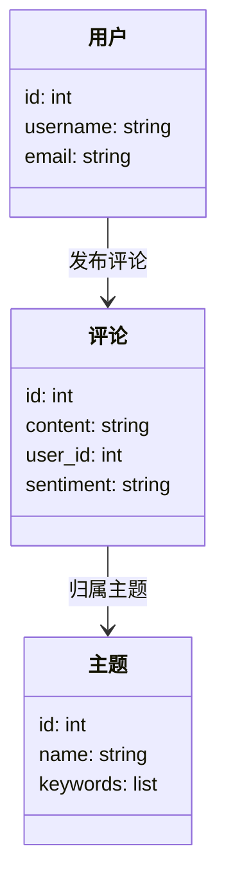

                 


# 构建智能企业市场调研系统：社交媒体聆听与趋势预测的AI驱动

---

## 关键词：
智能企业市场调研系统、社交媒体聆听、趋势预测、AI驱动、数据采集、自然语言处理、机器学习

---

## 摘要：
在数字化时代，企业市场调研的重要性日益凸显。传统的市场调研方法依赖于问卷调查和专家访谈，但这种方法效率低下、成本高昂且难以捕捉实时市场动态。随着社交媒体的普及，海量用户评论和互动数据为企业提供了前所未有的洞察机会。然而，如何高效地从这些数据中提取有价值的信息，并预测市场趋势，成为了企业的关键挑战。

本文章介绍了一种基于人工智能的智能企业市场调研系统，该系统通过社交媒体聆听技术，实时采集、处理和分析社交媒体数据，结合先进的趋势预测算法，为企业提供精准的市场洞察和决策支持。文章详细探讨了系统的构建过程，包括数据采集、自然语言处理、趋势预测、系统架构设计等关键环节，并通过实际案例展示了系统的应用价值。

---

# 第1章: 智能企业市场调研系统概述

## 1.1 问题背景与挑战

### 1.1.1 传统市场调研的局限性
传统市场调研方法依赖于问卷调查和专家访谈，存在以下问题：
- 数据采集成本高、耗时长。
- 数据范围有限，难以覆盖广泛市场。
- 数据分析依赖人工，效率低下。
- 无法捕捉实时市场动态，难以应对快速变化的市场环境。

### 1.1.2 社交媒体数据的崛起
社交媒体的普及为企业提供了海量用户评论、点赞、分享等数据，这些数据蕴含着丰富的市场洞察：
- 数据来源广泛，覆盖消费者真实反馈。
- 数据实时更新，捕捉市场动态。
- 数据量大，适合通过AI技术进行深度分析。

### 1.1.3 AI驱动的必要性
AI技术的快速发展为市场调研带来了新的可能性：
- 自然语言处理技术可以自动提取文本中的情感和主题信息。
- 机器学习算法可以预测市场趋势，辅助决策。
- 大数据处理能力可以高效处理海量社交媒体数据。

## 1.2 核心概念与目标

### 1.2.1 智能企业市场调研系统的定义
智能企业市场调研系统是一种基于AI技术的系统，通过实时采集、处理和分析社交媒体数据，为企业提供市场洞察和趋势预测。

### 1.2.2 系统的核心功能
- 数据采集：从社交媒体平台获取用户评论、点赞、分享等数据。
- 数据处理：清洗、标注和建模处理数据，提取有价值的信息。
- 趋势预测：利用机器学习算法预测市场趋势。
- 结果可视化：将分析结果以图表形式展示，方便企业决策者理解。

### 1.2.3 系统的目标与价值
- 提高市场调研效率，降低调研成本。
- 实时捕捉市场动态，提供精准的市场洞察。
- 为企业制定市场策略提供数据支持。

## 1.3 系统架构与模块划分

### 1.3.1 数据采集模块
- 通过API接口或网络爬虫从社交媒体平台获取数据。
- 数据清洗：去除无效数据，如重复数据和噪音信息。

### 1.3.2 数据处理模块
- 分词：将文本数据拆分成词语或短语。
- 情感分析：判断文本的情感倾向（正面、负面、中性）。
- 主题建模：识别文本的主题和关键词。

### 1.3.3 趋势预测模块
- 时间序列分析：基于历史数据预测未来趋势。
- 机器学习模型：如LSTM和ARIMA模型。

### 1.3.4 结果可视化模块
- 将预测结果以图表形式展示，如折线图、柱状图等。
- 提供直观的市场洞察报告。

## 1.4 本章小结
本章介绍了智能企业市场调研系统的背景、核心概念和系统架构，为后续章节的详细探讨奠定了基础。

---

# 第2章: 社交媒体数据采集与处理

## 2.1 数据采集技术

### 2.1.1 API接口调用
- 使用社交媒体平台提供的API接口，如Twitter API、Facebook API等。
- 示例代码：
  ```python
  import tweepy
  auth = tweepy.OAuthHandler(consumer_key, consumer_secret)
  auth.set_access_token(access_token, access_token_secret)
  api = tweepy.API(auth)
  ```

### 2.1.2 网页抓取技术
- 使用BeautifulSoup或Scrapy等工具抓取网页数据。
- 示例代码：
  ```python
  from bs4 import BeautifulSoup
  import requests
  url = "https://www.example.com"
  response = requests.get(url)
  soup = BeautifulSoup(response.text, 'html.parser')
  ```

### 2.1.3 数据清洗与预处理
- 去除无效数据：如重复数据、噪音信息。
- 数据格式统一：如将日期格式统一为ISO格式。

## 2.2 自然语言处理技术

### 2.2.1 分词与词性标注
- 使用分词工具如jieba进行分词。
- 示例代码：
  ```python
  import jieba
  text = "这个产品真的很好用"
  words = jieba.lcut(text)
  print(words)  # 输出: ['这个', '产品', '真的', '很好用']
  ```

### 2.2.2 情感分析算法
- 使用预训练的情感分析模型，如BERT。
- 示例代码：
  ```python
  from transformers import pipeline
  sentiment_analyzer = pipeline("sentiment-analysis")
  result = sentiment_analyzer("这个产品很好用")
  print(result)  # 输出: [{'label': 'positive', 'score': 0.95}]
  ```

### 2.2.3 主题建模
- 使用主题建模算法如LDA进行主题提取。
- 示例代码：
  ```python
  from gensim import corpora, models
  corpus = corpora.Dictionary(texts).build()
  lda_model = models.LdaModel(corpus, num_topics=5, id2word=corpus)
  ```

## 2.3 数据存储与管理

### 2.3.1 数据库设计
- 使用关系型数据库如MySQL存储数据。
- 数据表设计：用户表、评论表、情感分析结果表。

### 2.3.2 数据索引与查询优化
- 在评论表中建立全文索引，提高查询效率。
- 示例代码：
  ```sql
  CREATE TABLE comments (
    id INT AUTO_INCREMENT PRIMARY KEY,
    user_id INT,
    content TEXT,
    sentiment VARCHAR(20),
    created_at DATETIME
  );
  ```

### 2.3.3 数据安全与隐私保护
- 数据加密存储，避免用户隐私泄露。
- 数据脱敏处理，如隐藏用户的个人信息。

## 2.4 本章小结
本章详细介绍了社交媒体数据采集与处理的技术，包括数据采集方法、自然语言处理技术和数据存储与管理策略。

---

# 第3章: 趋势预测算法

## 3.1 时间序列分析

### 3.1.1 ARIMA模型
- ARIMA模型用于时间序列预测。
- 示例代码：
  ```python
  from statsmodels.tsa.arima.model import ARIMA
  model = ARIMA(data, order=(5,1,0))
  model_fit = model.fit()
  ```

### 3.1.2 LSTM网络
- LSTM用于处理长序列数据。
- 示例代码：
  ```python
  import tensorflow as tf
  model = tf.keras.Sequential()
  model.add(tf.keras.layers.LSTM(128, input_shape=(timesteps, features)))
  model.add(tf.keras.layers.Dense(1))
  ```

### 3.1.3 Prophet模型
- Prophet模型适用于非平稳时间序列。
- 示例代码：
  ```python
  from fbprophet import Prophet
  model = Prophet()
  model.fit(train_data)
  ```

## 3.2 机器学习模型

### 3.2.1 线性回归模型
- 线性回归用于预测连续型变量。
- 示例代码：
  ```python
  import sklearn.linear_model as lm
  model = lm.LinearRegression()
  model.fit(X, y)
  ```

### 3.2.2 支持向量机
- SVM用于分类和回归问题。
- 示例代码：
  ```python
  from sklearn import svm
  model = svm.SVC()
  model.fit(X, y)
  ```

### 3.2.3 随机森林
- 随机森林用于分类和回归问题。
- 示例代码：
  ```python
  from sklearn.ensemble import RandomForestClassifier
  model = RandomForestClassifier()
  model.fit(X, y)
  ```

## 3.3 集成学习方法

### 3.3.1 基于投票的集成
- 使用投票法进行预测。
- 示例代码：
  ```python
  from sklearn.ensemble import VotingClassifier
  model = VotingClassifier(estimators=[('lr', lr_model), ('svm', svm_model)])
  ```

### 3.3.2 基于加权的集成
- 根据模型性能分配权重。
- 示例代码：
  ```python
  from sklearn.ensemble import StackingClassifier
  model = StackingClassifier(estimators=[('lr', lr_model), ('svm', svm_model)], stacker=lr_model)
  ```

## 3.4 本章小结
本章介绍了几种常用的趋势预测算法，包括时间序列分析、机器学习模型和集成学习方法，并通过示例代码展示了如何实现这些算法。

---

# 第4章: 系统架构设计

## 4.1 问题场景介绍
企业需要实时监控市场动态，快速响应市场变化。社交媒体数据量大、类型多样，需要高效的数据处理和分析能力。

## 4.2 系统功能设计

### 4.2.1 领域模型（类图）


### 4.2.2 系统架构（分层架构）
```mermaid
split
    前端 -> 后端API: 调用接口
    后端API -> 数据库: 查询数据
    后端API -> 分析模块: 分析数据
    分析模块 -> 模型: 进行预测
    前端 <- 后端API: 返回结果
```

### 4.2.3 系统接口设计
- 数据采集接口：`/api/social_media_data`
- 数据处理接口：`/api/process_data`
- 趋势预测接口：`/api/trend_prediction`

### 4.2.4 系统交互（序列图）
```mermaid
sequenceDiagram
    用户 -> 前端: 提交请求
    前端 -> 后端API: 调用接口
    后端API -> 数据库: 查询数据
    后端API -> 分析模块: 分析数据
    分析模块 -> 模型: 进行预测
    后端API <- 分析模块: 返回结果
    前端 <- 后端API: 返回结果
```

## 4.3 本章小结
本章详细描述了系统的架构设计，包括功能模块划分、系统接口设计和系统交互流程。

---

# 第5章: 项目实战

## 5.1 环境安装
- 安装必要的库：
  - Python: 3.8+
  - NumPy, Pandas, Matplotlib: 数据处理与可视化。
  - Scikit-learn, TensorFlow: 机器学习模型。
  - Tweepy, BeautifulSoup: 数据采集。

## 5.2 系统核心实现

### 5.2.1 数据采集模块实现
- 使用tweepy采集Twitter数据：
  ```python
  import tweepy
  def get_tweets(api, query, max_tweets=100):
      tweets = []
      try:
          for tweet in api.search(q=query, count=max_tweets):
              tweets.append(tweet.text)
          return tweets
      except Exception as e:
          print(e)
          return tweets
  ```

### 5.2.2 数据处理模块实现
- 分词和情感分析：
  ```python
  from textblob import TextBlob
  def analyze_sentiment(text):
      blob = TextBlob(text)
      return blob.sentiment.polarity
  ```

### 5.2.3 趋势预测模块实现
- 使用Prophet模型预测销售趋势：
  ```python
  from fbprophet import Prophet
  def predict_trend(data):
      model = Prophet()
      model.fit(data)
      future = model.make_future_dataframe(periods=30)
      forecast = model.predict(future)
      return forecast
  ```

### 5.2.4 结果可视化模块实现
- 使用Matplotlib绘制趋势图：
  ```python
  import matplotlib.pyplot as plt
  def plot_trend(data):
      plt.figure(figsize=(10, 6))
      plt.plot(data['date'], data['value'], label='Trend')
      plt.xlabel('Date')
      plt.ylabel('Value')
      plt.title('Trend Analysis')
      plt.legend()
      plt.show()
  ```

## 5.3 实际案例分析
- 案例背景：某电子产品在社交媒体上的评论数据。
- 数据采集：采集过去一个月的评论数据。
- 数据处理：分词、情感分析。
- 趋势预测：预测未来一周的销售趋势。
- 结果可视化：生成趋势图和情感分布图。

## 5.4 本章小结
本章通过实际案例展示了系统的实现过程，从数据采集到趋势预测，再到结果可视化，为读者提供了完整的实战指导。

---

# 第6章: 最佳实践与注意事项

## 6.1 数据质量控制
- 确保数据的准确性和完整性。
- 定期更新数据，避免过时数据影响预测结果。

## 6.2 模型调优与优化
- 使用交叉验证优化模型参数。
- 调整模型结构，如增加或减少层数。

## 6.3 系统性能优化
- 优化数据处理流程，减少计算时间。
- 使用分布式计算框架如Spark处理海量数据。

## 6.4 注意事项
- 数据隐私保护：避免泄露用户个人信息。
- 系统稳定性：确保系统在高负载下仍能正常运行。
- 模型解释性：选择可解释性高的模型，便于分析结果。

## 6.5 本章小结
本章总结了构建智能企业市场调研系统时的最佳实践和注意事项，帮助读者在实际应用中避免常见问题，提高系统性能。

---

# 第7章: 总结与展望

## 7.1 本文总结
本文详细介绍了智能企业市场调研系统的构建过程，包括数据采集、自然语言处理、趋势预测和系统架构设计等关键环节。通过实际案例展示了系统的应用价值。

## 7.2 未来展望
未来，随着AI技术的不断发展，智能企业市场调研系统将更加智能化和自动化。可能的发展方向包括：
- 更加精准的情感分析模型。
- 更高效的实时数据处理技术。
- 更智能的趋势预测算法。

## 7.3 结语
智能企业市场调研系统为企业提供了强大的市场洞察能力，帮助企业更好地应对市场变化，抓住市场机会。随着技术的不断进步，系统将为企业创造更大的价值。

---

# 结束语

通过本文的详细讲解，读者可以全面了解智能企业市场调研系统的构建过程，并掌握关键的技术点。希望本文能为企业的市场调研工作提供有价值的参考和指导。

