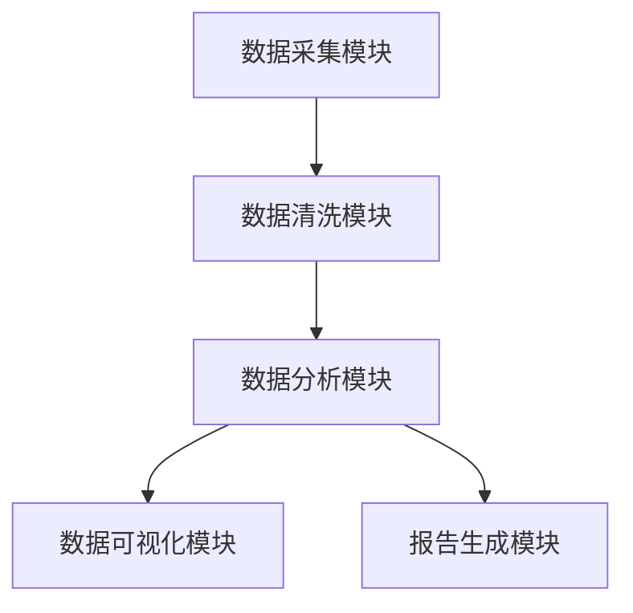

                 


# 构建智能企业市场调研系统：自动化数据收集与分析

> **关键词**：智能企业、市场调研、数据收集、数据分析、NLP、机器学习、数据可视化  
> **摘要**：随着企业对市场信息需求的增加，传统市场调研方法逐渐显现出效率低下、成本高昂、数据不准确等问题。为了提高市场调研的效率和准确性，我们提出了基于自动化数据收集与分析的智能企业市场调研系统。该系统利用自然语言处理（NLP）和机器学习技术，实现从数据采集到分析的全流程自动化，帮助企业快速获取市场动态，制定精准的市场策略。本文将详细阐述该系统的构建过程，包括背景介绍、核心概念、算法原理、系统架构、项目实战和小结。

---

## 第一部分: 智能企业市场调研系统概述

### 第1章: 市场调研系统的背景与重要性

#### 1.1 企业市场调研的背景
市场调研是企业在制定市场策略时不可或缺的重要环节。通过收集和分析市场数据，企业可以更好地了解市场需求、竞争环境、消费者行为等关键信息。然而，传统市场调研方法存在以下问题：
- **效率低下**：依赖人工数据采集和分析，耗时长且成本高。
- **数据不准确**：依赖抽样调查和问卷填写，结果可能存在偏差。
- **覆盖范围有限**：难以实时获取海量数据，尤其是非结构化数据（如社交媒体评论）。

为了应对这些问题，企业需要一种高效、智能的市场调研方法，能够自动化地收集和分析数据，快速生成准确的市场洞察。

#### 1.2 智能企业市场调研系统的定义
智能企业市场调研系统是一种基于人工智能技术的自动化市场调研系统，能够从多种数据源（如社交媒体、新闻网站、行业报告等）实时采集数据，并通过自然语言处理和机器学习技术进行分析，最终生成市场报告。

#### 1.3 企业市场调研的核心目标
- **市场趋势分析**：识别市场趋势和潜在机会。
- **竞争分析**：分析竞争对手的市场策略和产品特点。
- **消费者洞察**：了解消费者需求、偏好和行为。
- **风险预警**：实时监测市场风险，如负面舆情。

#### 1.4 系统的核心功能
- **数据采集模块**：从多种数据源采集数据。
- **数据清洗模块**：对采集到的原始数据进行预处理。
- **数据分析模块**：利用NLP和机器学习技术对数据进行分析。
- **数据可视化模块**：将分析结果以图表形式展示。
- **报告生成模块**：自动生成市场调研报告。

#### 1.5 系统的边界与外延
- **边界**：系统仅负责数据采集、清洗、分析和报告生成，不包括市场策略的具体实施。
- **外延**：系统可以与其他企业系统（如CRM）集成，提供更全面的市场洞察。

---

### 第2章: 智能企业市场调研系统的核心概念

#### 2.1 数据收集与分析的基本原理
数据收集与分析的基本原理是通过自动化工具从多个数据源（如社交媒体、新闻网站、行业报告等）采集数据，并对数据进行清洗、转换和分析，最终生成市场报告。以下是数据收集与分析的基本流程：
1. 数据采集：从多个数据源采集数据。
2. 数据清洗：对采集到的原始数据进行预处理，去除噪声数据。
3. 数据分析：利用NLP和机器学习技术对数据进行分析。
4. 数据可视化：将分析结果以图表形式展示。
5. 报告生成：自动生成市场调研报告。

#### 2.2 核心概念与联系
以下是系统的核心概念及其联系：

| **核心概念** | **描述** | **与其他概念的关系** |
|--------------|----------|-----------------------|
| 数据源       | 数据的来源，如社交媒体、新闻网站等 | 数据采集模块从数据源采集数据 |
| 数据清洗     | 对数据进行预处理，去除噪声数据 | 数据清洗模块对数据进行清洗 |
| 数据分析     | 对数据进行分析，提取有用信息 | 数据分析模块利用NLP和机器学习技术进行分析 |
| 数据可视化   | 将分析结果以图表形式展示 | 数据可视化模块将分析结果以图表形式展示 |
| 报告生成     | 自动生成市场调研报告 | 报告生成模块根据分析结果生成报告 |

#### 2.3 系统架构的初步分析
以下是系统的初步架构分析：

- **功能模块**：数据采集模块、数据清洗模块、数据分析模块、数据可视化模块、报告生成模块。
- **模块之间的关系**：数据采集模块将数据传递给数据清洗模块，清洗后的数据传递给数据分析模块，分析结果传递给数据可视化模块和报告生成模块。

---

## 第二部分: 数据收集与分析的算法原理

### 第3章: 数据预处理与清洗算法

#### 3.1 数据预处理的基本流程
数据预处理的基本流程包括以下步骤：
1. **数据清洗**：去除噪声数据，如重复数据、空值等。
2. **数据转换**：将数据转换为适合分析的形式，如文本分词、数值标准化等。
3. **数据增强**：对数据进行增强，如添加时间戳、地理位置等。

#### 3.2 数据清洗的算法实现
以下是数据清洗的Python代码实现：

```python
import pandas as pd
import numpy as np

# 示例数据
data = {
    'id': [1, 2, 3, 4, 5],
    'text': ['NaN', 'hello', 'world', 'NaN', 'test']
}

df = pd.DataFrame(data)

# 去除空值
df_cleaned = df.dropna()

# 去除重复数据
df_cleaned = df_cleaned.drop_duplicates()

# 输出清洗后的数据
print(df_cleaned)
```

#### 3.3 数据清洗的数学模型
数据清洗的数学模型可以表示为：

$$
\text{清洗后的数据} = \text{原始数据} \setminus (\text{空值} \cup \text{重复值})
$$

---

### 第4章: 数据分析算法的实现

#### 4.1 基于NLP的文本挖掘
以下是基于NLP的文本挖掘的实现步骤：

1. **文本分词**：将文本分割成词语或短语。
2. **文本去停用词**：去除无意义的词语，如“的”、“了”等。
3. **文本向量化**：将文本转换为数值向量，如TF-IDF、Word2Vec等。
4. **主题建模**：利用主题建模技术（如LDA）提取文本的主题。

#### 4.2 基于机器学习的分类算法
以下是基于机器学习的分类算法的实现步骤：

1. **特征提取**：从文本中提取特征，如TF-IDF特征。
2. **模型训练**：利用训练数据训练分类模型，如逻辑回归、支持向量机（SVM）等。
3. **模型预测**：利用训练好的模型对新数据进行分类预测。

---

## 第三部分: 系统架构与设计

### 第5章: 系统功能设计

#### 5.1 系统功能模块划分
系统功能模块包括：
1. **数据采集模块**：从多种数据源采集数据。
2. **数据清洗模块**：对采集到的原始数据进行预处理。
3. **数据分析模块**：利用NLP和机器学习技术对数据进行分析。
4. **数据可视化模块**：将分析结果以图表形式展示。
5. **报告生成模块**：自动生成市场调研报告。

#### 5.2 系统架构设计
以下是系统的架构设计：



---

## 第四部分: 项目实战

### 第6章: 项目实战

#### 6.1 项目环境搭建
以下是项目环境搭建的步骤：
1. **安装Python**：安装Python 3.8及以上版本。
2. **安装依赖库**：安装以下库：
   - `pandas`：用于数据处理。
   - `numpy`：用于数值计算。
   - `scikit-learn`：用于机器学习。
   - `matplotlib`：用于数据可视化。
   - `nltk`：用于自然语言处理。

#### 6.2 数据采集与清洗
以下是数据采集与清洗的代码示例：

```python
import pandas as pd
import requests
from bs4 import BeautifulSoup

# 示例数据源：新闻网站
url = 'https://example.com/news'

response = requests.get(url)
soup = BeautifulSoup(response.text, 'html.parser')

# 提取新闻标题
news_titles = [title.text for title in soup.find_all('h2')]

# 创建数据框
df = pd.DataFrame({'title': news_titles})

# 清洗数据
df_cleaned = df.drop_duplicates()
```

#### 6.3 数据分析与可视化
以下是数据分析与可视化的代码示例：

```python
import matplotlib.pyplot as plt

# 统计新闻标题中关键词的出现频率
from collections import Counter

words = [title.lower() for title in df_cleaned['title']]
word_counts = Counter(words)

# 绘制柱状图
plt.figure(figsize=(10, 6))
word_counts.plot.bar()
plt.title('关键词出现频率')
plt.xlabel('关键词')
plt.ylabel('出现次数')
plt.show()
```

#### 6.4 报告生成
以下是报告生成的代码示例：

```python
from reportlab.pdfgen import canvas

# 创建PDF报告
pdf = canvas.Canvas('market_report.pdf')

# 添加标题
pdf.setFont('Helvetica', 20)
pdf.drawString(50, 750, '市场调研报告')

# 添加正文
pdf.setFont('Helvetica', 12)
pdf.drawString(50, 700, '数据分析结果：')

# 保存并关闭PDF
pdf.save()
```

---

## 第五部分: 总结与展望

### 第7章: 总结与展望

#### 7.1 总结
本文详细介绍了智能企业市场调研系统的构建过程，包括系统背景、核心概念、算法原理、系统架构和项目实战。通过自动化数据收集与分析，企业可以快速获取市场洞察，制定精准的市场策略。

#### 7.2 展望
未来，随着人工智能技术的不断发展，智能企业市场调研系统将更加智能化和自动化。企业可以通过该系统实时监测市场动态，快速响应市场变化，从而在竞争中占据优势。

---

### **小结**

通过本文的介绍，读者可以全面了解智能企业市场调研系统的构建过程和核心原理。如果您对本文内容有疑问或需要进一步探讨，请随时与我联系。

