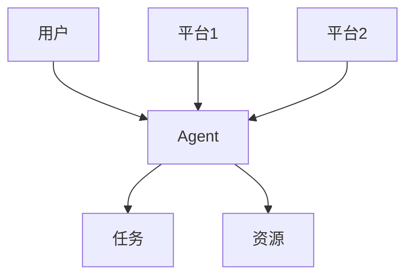
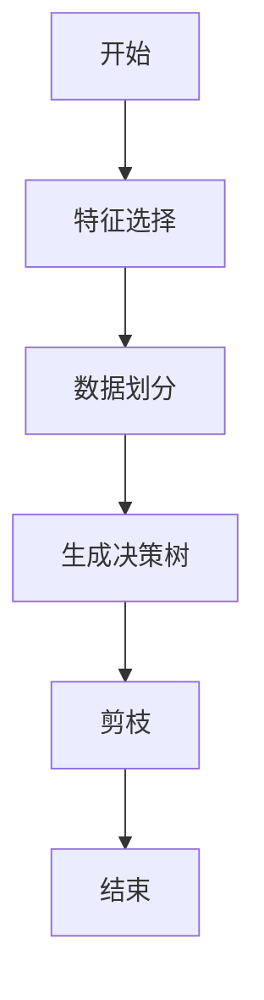
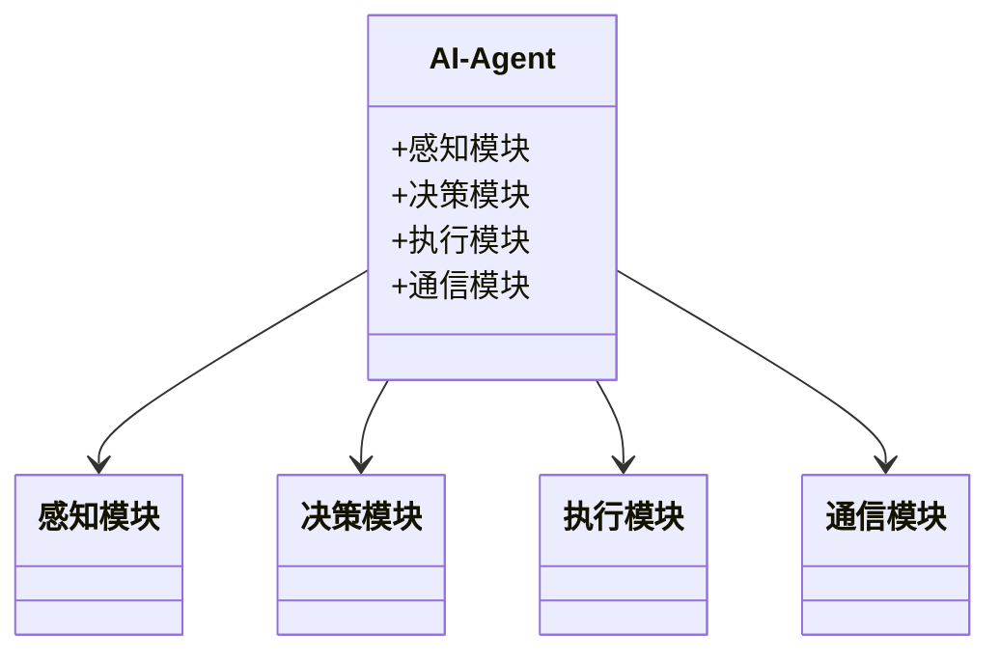
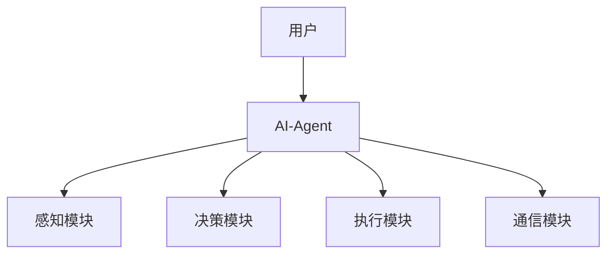
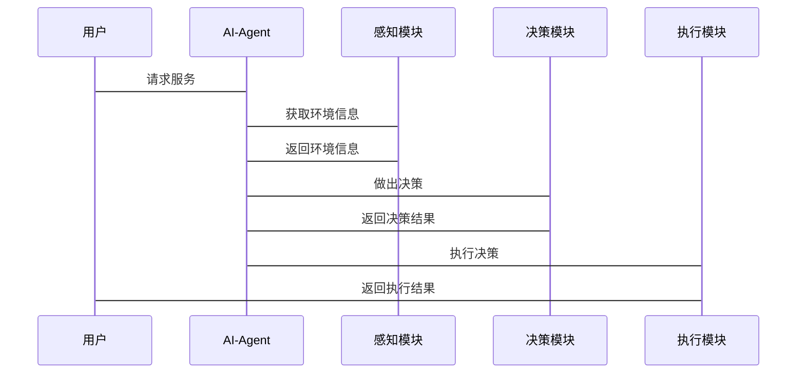

                 


# 《构建跨平台AI Agent的技术挑战》

> **关键词**：跨平台AI Agent、AI算法、系统架构、分布式系统、技术挑战、实现方法

> **摘要**：本文详细探讨了构建跨平台AI Agent的技术挑战，从背景介绍到核心概念，再到算法原理、系统架构设计、项目实战及最佳实践，全面分析了跨平台AI Agent的实现过程。文章结合理论与实践，通过具体案例和代码实现，深入剖析了跨平台AI Agent的技术细节和实现难点，为读者提供了系统的解决方案和实践指导。

---

## 第1章 跨平台AI Agent的背景与问题描述

### 1.1 问题背景

#### 1.1.1 当前AI Agent的发展现状
AI Agent（智能体）是一种能够感知环境并采取行动以实现目标的实体。近年来，随着人工智能技术的快速发展，AI Agent的应用场景不断扩大，涵盖自动驾驶、智能助手、机器人控制等领域。然而，随着应用场景的复杂化，单一平台的AI Agent已无法满足实际需求，跨平台AI Agent的需求日益增长。

#### 1.1.2 跨平台AI Agent的必要性
在实际应用中，AI Agent可能需要在多个平台上运行，例如自动驾驶汽车可能需要同时与车载系统、云端服务器和其他设备进行交互。跨平台AI Agent能够实现不同平台之间的协同工作，提高系统的灵活性和可扩展性。

#### 1.1.3 跨平台AI Agent的核心挑战
跨平台AI Agent的实现面临技术复杂性、性能优化和安全性等多重挑战。不同平台的硬件架构、操作系统和编程语言差异，使得AI Agent的设计和实现更加复杂。同时，如何确保跨平台AI Agent的性能和安全性也是需要解决的关键问题。

### 1.2 问题描述

#### 1.2.1 跨平台AI Agent的定义
跨平台AI Agent是一种能够在多种平台上运行，并通过跨平台通信和协调机制实现复杂任务的智能体。

#### 1.2.2 跨平台AI Agent的关键特性
- **跨平台性**：能够在多种平台上运行。
- **通信能力**：能够与不同平台上的组件进行交互。
- **协调机制**：能够协调不同平台上的资源和任务。

#### 1.2.3 跨平台AI Agent的解决方法
- **跨平台通信**：通过标准化接口实现不同平台之间的通信。
- **分布式计算**：利用分布式系统技术实现任务的分解与协调。
- **统一控制逻辑**：设计统一的控制逻辑，适用于不同平台。

### 1.3 问题解决思路

#### 1.3.1 跨平台AI Agent的设计原则
- **模块化设计**：将AI Agent分解为多个模块，每个模块负责特定功能。
- **平台无关性**：设计平台无关的接口和协议，确保不同平台之间的兼容性。
- **容错性**：设计容错机制，确保在部分平台故障时，AI Agent仍能正常运行。

#### 1.3.2 跨平台AI Agent的实现方法
- **多平台适配**：针对不同平台进行适配，确保AI Agent能够在多个平台上运行。
- **跨平台通信**：设计跨平台通信协议，实现不同平台之间的数据交互。
- **任务协调**：设计任务协调算法，确保不同平台上的任务能够协同完成。

#### 1.3.3 跨平台AI Agent的优化策略
- **性能优化**：通过优化算法和数据结构，提升跨平台AI Agent的运行效率。
- **资源分配优化**：合理分配资源，确保任务的高效执行。
- **安全性优化**：设计安全机制，防止跨平台通信中的安全漏洞。

### 1.4 问题的边界与外延

#### 1.4.1 跨平台AI Agent的边界条件
- **平台限制**：AI Agent只能在特定的平台上运行。
- **通信限制**：跨平台通信仅限于特定的协议和接口。
- **任务限制**：AI Agent只能执行特定的任务。

#### 1.4.2 跨平台AI Agent的外延领域
- **多智能体系统**：多个AI Agent协同工作的系统。
- **分布式系统**：AI Agent分布在不同的平台上，通过通信和协调完成任务。
- **边缘计算**：AI Agent在边缘设备上运行，与云端协同工作。

#### 1.4.3 跨平台AI Agent与其他技术的关系
- **分布式系统**：跨平台AI Agent依赖于分布式系统技术实现任务协调。
- **边缘计算**：跨平台AI Agent与边缘计算技术密切相关。
- **多智能体系统**：跨平台AI Agent是多智能体系统的一种实现方式。

### 1.5 概念结构与核心要素组成

#### 1.5.1 跨平台AI Agent的构成要素
- **感知模块**：感知环境并获取信息。
- **决策模块**：根据感知信息做出决策。
- **执行模块**：执行决策并产生行动。
- **通信模块**：与其他平台进行通信和数据交换。

#### 1.5.2 跨平台AI Agent的系统架构
跨平台AI Agent的系统架构包括以下几个部分：
- **AI Agent核心**：负责感知、决策和执行。
- **通信模块**：负责与其他平台的通信和数据交换。
- **任务协调模块**：负责任务的分解和协调。

#### 1.5.3 跨平台AI Agent的核心算法
跨平台AI Agent的核心算法包括：
- **决策树算法**：用于决策模块的实现。
- **分布式协调算法**：用于任务协调模块的实现。

---

## 第2章 跨平台AI Agent的核心概念与联系

### 2.1 核心概念原理

#### 2.1.1 跨平台AI Agent的核心算法
跨平台AI Agent的核心算法包括：
- **决策树算法**：用于决策模块的实现。
- **分布式协调算法**：用于任务协调模块的实现。

#### 2.1.2 跨平台AI Agent的通信机制
跨平台AI Agent的通信机制包括：
- **跨平台通信协议**：用于不同平台之间的数据交换。
- **消息队列机制**：用于异步通信。

#### 2.1.3 跨平台AI Agent的协调机制
跨平台AI Agent的协调机制包括：
- **任务分解算法**：用于将复杂任务分解为简单任务。
- **资源分配算法**：用于合理分配资源。

### 2.2 核心概念属性特征对比

#### 2.2.1 基于规则的AI Agent与基于学习的AI Agent对比
| 属性             | 基于规则的AI Agent         | 基于学习的AI Agent         |
|------------------|---------------------------|---------------------------|
| 决策方式         | 基于预定义规则            | 基于机器学习模型          |
| 适应性           | 较低                      | 较高                      |
| 维护成本         | 较低                      | 较高                      |
| 适用场景         | 简单、规则明确的任务      | 复杂、规则不明确的任务    |

#### 2.2.2 跨平台AI Agent与单平台AI Agent的对比
| 属性             | 跨平台AI Agent            | 单平台AI Agent            |
|------------------|---------------------------|---------------------------|
| 运行环境         | 多个平台                  | 单个平台                  |
| 通信能力         | 支持跨平台通信            | 仅支持单平台通信          |
| 协调能力         | 支持多平台任务协调        | 仅支持单平台任务协调      |

#### 2.2.3 跨平台AI Agent与分布式系统的关系
跨平台AI Agent与分布式系统密切相关。跨平台AI Agent依赖于分布式系统技术实现任务协调和资源分配。分布式系统为跨平台AI Agent提供了技术支持，而跨平台AI Agent则为分布式系统提供了智能化的决策能力。

### 2.3 ER实体关系图架构

#### 2.3.1 实体关系图


#### 2.3.2 核心算法实现
跨平台AI Agent的核心算法是决策树算法，其数学模型如下：
$$
决策树算法是一种用于分类和回归的机器学习算法，通过构建树状结构来实现决策。
$$

决策树算法的实现步骤如下：
1. **特征选择**：选择对分类最有影响力的特征。
2. **划分数据集**：根据选择的特征将数据集划分为子集。
3. **生成决策树**：递归地构建决策树，直到满足停止条件。
4. **剪枝**：为了防止过拟合，对决策树进行剪枝处理。

决策树算法的Python代码实现如下：
```python
import numpy as np
from sklearn.tree import DecisionTreeClassifier

# 数据集
X = np.array([[2, 3], [5, 6], [7, 8], [1, 2], [3, 4]])
y = np.array([0, 1, 1, 0, 1])

# 创建决策树模型
clf = DecisionTreeClassifier()

# 训练模型
clf.fit(X, y)

# 预测
print(clf.predict([[4, 5]]))  # 输出结果：1
```

---

## 第3章 跨平台AI Agent的算法原理讲解

### 3.1 算法原理
跨平台AI Agent的核心算法是决策树算法，其数学模型如下：
$$
决策树算法是一种用于分类和回归的机器学习算法，通过构建树状结构来实现决策。
$$

### 3.2 算法实现

#### 3.2.1 mermaid流程图


#### 3.2.2 Python代码实现
```python
import numpy as np
from sklearn.tree import DecisionTreeClassifier

# 数据集
X = np.array([[2, 3], [5, 6], [7, 8], [1, 2], [3, 4]])
y = np.array([0, 1, 1, 0, 1])

# 创建决策树模型
clf = DecisionTreeClassifier()

# 训练模型
clf.fit(X, y)

# 预测
print(clf.predict([[4, 5]]))  # 输出结果：1
```

### 3.3 算法优化
为了提高决策树算法的性能，可以采用以下优化策略：
- **特征选择优化**：选择对分类最有影响力的特征。
- **剪枝优化**：防止过拟合，提高泛化能力。
- **随机森林优化**：通过集成学习提高模型的准确性和鲁棒性。

---

## 第4章 跨平台AI Agent的系统分析与架构设计

### 4.1 系统功能设计

#### 4.1.1 领域模型


### 4.2 系统架构设计

#### 4.2.1 系统架构图


### 4.3 系统接口设计

#### 4.3.1 接口描述
- **感知接口**：获取环境信息。
- **决策接口**：做出决策。
- **执行接口**：执行决策。
- **通信接口**：与其他平台通信。

### 4.4 系统交互设计

#### 4.4.1 序列图


---

## 第5章 跨平台AI Agent的项目实战

### 5.1 环境安装

#### 5.1.1 Python环境安装
```bash
python --version
pip install numpy scikit-learn
```

### 5.2 系统核心实现源代码

#### 5.2.1 AI Agent实现代码
```python
class AI-Agent:
    def __init__(self):
        self感知模块 = 感知模块()
        self决策模块 = 决策模块()
        self执行模块 = 执行模块()
        self通信模块 = 通信模块()

    def 运行(self):
        while True:
            环境信息 = self感知模块 获取环境信息()
            决策结果 = self决策模块 做出决策(环境信息)
            self执行模块 执行决策(决策结果)
            self通信模块 与其他平台通信(环境信息, 决策结果)
```

### 5.3 代码应用解读与分析

#### 5.3.1 代码解读
AI-Agent类包含四个模块：感知模块、决策模块、执行模块和通信模块。运行方法实现AI-Agent的主循环，不断获取环境信息，做出决策并执行，同时与其他平台通信。

### 5.4 实际案例分析和详细讲解剖析

#### 5.4.1 应用场景
以自动驾驶为例，AI-Agent需要在车载系统、云端服务器和其他设备之间协调工作，实现自动驾驶功能。

### 5.5 项目小结

#### 5.5.1 实践总结
跨平台AI Agent的实现需要综合运用多种技术，包括机器学习、分布式系统和通信协议设计。通过实际项目的实施，可以更好地理解跨平台AI Agent的技术挑战和实现方法。

---

## 第6章 跨平台AI Agent的最佳实践

### 6.1 小结

#### 6.1.1 核心内容总结
跨平台AI Agent的实现需要考虑多平台适配、跨平台通信和任务协调等问题。通过模块化设计和分布式系统技术，可以有效解决这些挑战。

### 6.2 注意事项

#### 6.2.1 开发注意事项
- **平台兼容性**：确保AI Agent能够在不同平台上运行。
- **通信安全**：设计安全的通信机制，防止数据泄露。
- **性能优化**：优化算法和数据结构，提升运行效率。

### 6.3 拓展阅读

#### 6.3.1 推荐书籍
- 《分布式系统：概念与设计》
- 《机器学习实战》

#### 6.3.2 推荐博客
- [分布式系统技术博客](https://example.com)
- [机器学习技术博客](https://example.com)

---

## 第7章 总结与展望

### 7.1 总结

#### 7.1.1 全文总结
本文详细探讨了构建跨平台AI Agent的技术挑战，从背景介绍到核心概念，再到算法原理、系统架构设计、项目实战及最佳实践，全面分析了跨平台AI Agent的实现过程。文章结合理论与实践，通过具体案例和代码实现，深入剖析了跨平台AI Agent的技术细节和实现难点，为读者提供了系统的解决方案和实践指导。

### 7.2 展望

#### 7.2.1 未来发展方向
随着人工智能和分布式系统技术的不断发展，跨平台AI Agent的应用场景将更加广泛。未来的研究方向包括：
- **更高效的跨平台通信协议**：提高跨平台通信的效率和安全性。
- **更智能的决策算法**：提升AI Agent的决策能力和自适应能力。
- **更复杂的多智能体系统**：实现更加复杂的多智能体协同工作。

---

通过本文的系统讲解和实践指导，读者可以全面理解跨平台AI Agent的技术挑战，并掌握其实现方法和最佳实践。

