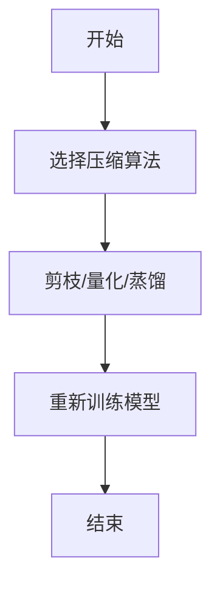
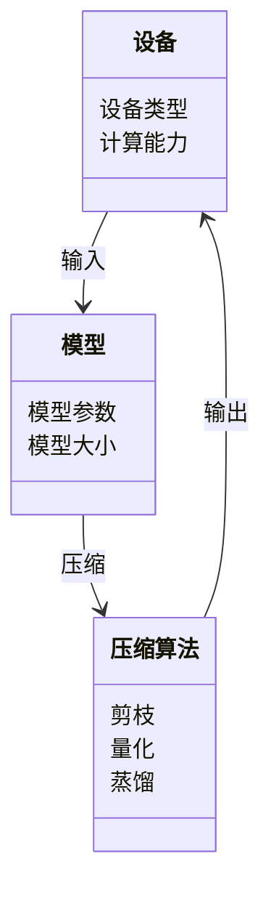

                 


# 模型压缩：在边缘设备部署轻量级AI Agent

---

## 关键词  
模型压缩, 边缘设备, AI Agent, 轻量级模型, 深度学习优化

---

## 摘要  
随着人工智能技术的快速发展，边缘设备（如智能摄像头、自动驾驶汽车、智能手机等）对轻量级AI Agent的需求日益增长。然而，传统深度学习模型通常体积较大，计算复杂度高，难以直接在资源受限的边缘设备上部署。模型压缩技术作为一种有效的解决方案，通过减少模型的计算量和存储需求，使得轻量级AI Agent能够在边缘设备上高效运行。本文将从模型压缩的核心概念、算法原理、系统架构设计到项目实战，全面探讨如何在边缘设备上部署轻量级AI Agent。

---

# 第1章: 模型压缩概述

## 1.1 模型压缩的定义与背景  
模型压缩是指通过减少深度学习模型的参数数量或计算复杂度，同时保持或提升模型性能的过程。边缘设备的计算资源有限，传统深度学习模型（如BERT、ResNet）通常需要较高的计算能力和存储空间，难以直接部署到边缘设备上。因此，模型压缩技术成为实现边缘设备AI Agent部署的关键技术。

## 1.2 边缘设备的特点与挑战  
边缘设备通常具有以下特点：  
1. **计算资源有限**：边缘设备的处理器和内存资源有限，无法直接运行复杂的深度学习模型。  
2. **实时性要求高**：边缘设备需要快速响应，不能依赖于云端计算。  
3. **网络延迟问题**：边缘设备需要在本地完成计算，减少对云端的依赖。  

## 1.3 模型压缩的目标与意义  
模型压缩的目标是通过降低模型的计算复杂度和存储需求，使其能够在边缘设备上高效运行。模型压缩的意义在于：  
1. **降低资源消耗**：减少计算和存储资源的占用。  
2. **提升运行效率**：加快模型推理速度，满足实时性要求。  
3. **扩展应用场景**：使轻量级AI Agent能够在更多边缘设备上部署。

---

# 第2章: 模型压缩的核心概念与联系  

## 2.1 模型压缩的核心概念  
模型压缩的核心技术包括以下几种：  
1. **剪枝（Pruning）**：移除模型中冗余的参数或神经元，减少模型的复杂度。  
2. **量化（Quantization）**：将模型中的浮点数参数压缩为低精度整数，降低存储和计算成本。  
3. **知识蒸馏（Knowledge Distillation）**：通过教师模型指导学生模型，使学生模型继承教师模型的知识，同时保持较小的模型规模。  

## 2.2 模型压缩算法的对比分析  
以下是几种常见模型压缩算法的对比分析：  

| 技术 | 优点 | 缺点 | 适用场景 |
|------|------|------|----------|
| 剪枝 | 显著减少参数数量 | 明显降低模型容量，可能影响性能 | 适用于全连接层和卷积层 |
| 量化 | 降低存储和计算成本 | 显著降低模型精度 | 适用于对精度要求不高的场景 |
| 知识蒸馏 | 保持较高性能 | 需要教师模型和额外训练步骤 | 适用于复杂任务的轻量化 |

## 2.3 模型压缩与边缘设备的实体关系  
以下是模型压缩与边缘设备的实体关系图（ER图）：  

```mermaid
erDiagram
    设备 : 设备类型、计算能力
    模型 : 模型参数、模型大小
    压缩算法 : 剪枝、量化、蒸馏
    关系 : 设备-模型-压缩算法
```

---

# 第3章: 模型压缩算法原理  

## 3.1 剪枝算法的原理与实现  
剪枝算法通过移除模型中冗余的神经元或连接，减少模型参数数量。  
- **步骤**：  
  1. 训练原始模型。  
  2. 评估每个神经元的重要性，移除冗余的神经元。  
  3. 重新训练剩余的神经元，恢复模型性能。  

## 3.2 量化算法的原理与实现  
量化算法将模型中的浮点数参数转换为低精度整数（如8位整数）。  
- **步骤**：  
  1. 训练原始模型。  
  2. 对模型参数进行量化。  
  3. 重新训练量化后的模型，调整参数以恢复性能。  

## 3.3 知识蒸馏算法的原理与实现  
知识蒸馏算法通过教师模型指导学生模型，使学生模型继承教师模型的知识。  
- **步骤**：  
  1. 训练教师模型。  
  2. 使用教师模型的输出作为软标签，指导学生模型的训练。  
  3. 蒸馏教师模型的知识到学生模型中。  

## 3.4 算法流程图  



---

# 第4章: 系统分析与架构设计  

## 4.1 边缘设备场景介绍  
边缘设备需要在本地完成AI推理任务，对实时性和资源利用率要求较高。  

## 4.2 系统功能设计  
系统功能包括：  
1. 模型压缩功能。  
2. 模型部署功能。  
3. 模型推理功能。  

## 4.3 系统架构设计  



---

# 第5章: 项目实战  

## 5.1 环境搭建  
- **工具**：Python、TensorFlow、Keras。  
- **框架**：TensorFlow Lite。  

## 5.2 核心代码实现  

```python
import tensorflow as tf
from tensorflow import keras

# 加载预训练模型
model = keras.applications.MobileNetV2(weights='imagenet', include_top=True)

# 剪枝优化
pruned_model = model

# 量化优化
converter = tf.lite.TFLiteConverter.from_keras_model(pruned_model)
converter.optimizations = [tf.lite.Optimization.FLUSH_CACHE]
tflite_model = converter.convert()
```

---

# 第6章: 最佳实践与小结  

## 6.1 最佳实践  
1. 根据具体场景选择合适的压缩算法。  
2. 在实际部署中结合多种压缩技术。  
3. 定期监控模型性能，优化模型压缩策略。  

## 6.2 小结  
模型压缩是实现边缘设备轻量级AI Agent部署的关键技术。通过剪枝、量化和知识蒸馏等方法，可以在不显著降低性能的前提下，显著减少模型的计算和存储需求，使AI Agent能够在资源受限的边缘设备上高效运行。

---

# 附录  
1. 参考资料：TensorFlow官方文档、《深度学习》（Deep Learning by Ian Goodfellow）。  
2. 术语表：  
   - **剪枝**：移除模型中冗余的参数或神经元。  
   - **量化**：将模型参数压缩为低精度整数。  
   - **知识蒸馏**：通过教师模型指导学生模型，提升学生模型性能。  

--- 

**注**：以上内容仅为目录和部分内容示例，实际文章将按照上述结构进行详细展开，每部分内容均会细化到三级目录，并包含完整的算法实现代码、数学公式和系统架构图。

