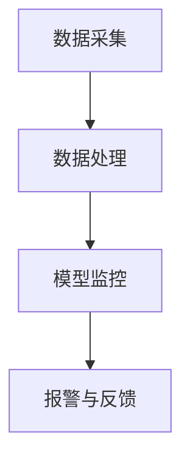

                 


# 模型监控：实时跟踪AI Agent的健康状态

## 关键词：模型监控, AI Agent, 实时跟踪, 模型健康, 异常检测

## 摘要：  
随着人工智能技术的快速发展，AI Agent在各个领域的应用越来越广泛。然而，AI模型在运行过程中可能会因为数据漂移、性能下降或行为异常而导致系统故障或决策失误。模型监控作为保障AI系统稳定运行的关键技术，能够实时跟踪AI Agent的健康状态，及时发现并解决潜在问题。本文将从模型监控的核心概念、算法原理、系统架构、项目实战等多个方面进行详细探讨，帮助读者全面理解如何实现和应用模型监控技术。

---

## 第1章：背景与概述

### 1.1 模型监控的背景与重要性

#### 1.1.1 从规则驱动到数据驱动的转变
随着深度学习和机器学习技术的普及，AI系统逐渐从传统的规则驱动模式转变为数据驱动模式。数据驱动的AI系统依赖于大量的训练数据，模型性能会受到数据质量和多样性的直接影响。然而，数据分布的变化（数据漂移）可能导致模型性能下降，甚至引发错误决策。因此，实时监控模型的健康状态变得至关重要。

#### 1.1.2 AI Agent的定义与应用场景
AI Agent是一种智能体，能够感知环境并自主决策，执行特定任务。例如，在推荐系统中，AI Agent可以根据用户行为实时调整推荐策略；在自动驾驶中，AI Agent需要实时感知环境并做出安全决策。AI Agent的应用场景涵盖了金融、医疗、交通、教育等多个领域。

#### 1.1.3 模型监控在AI系统中的作用
模型监控是保障AI系统稳定运行的核心技术之一。通过实时跟踪AI Agent的健康状态，模型监控能够：
1. 及时发现模型性能下降或行为异常。
2. 分析数据分布变化，评估模型的适应性。
3. 提供实时反馈，优化模型性能或调整系统策略。

### 1.2 模型监控的核心目标
模型监控的目标是确保AI Agent的行为符合预期，及时发现并解决潜在问题。具体目标包括：
1. 监控模型性能，确保输出结果的准确性。
2. 检测数据分布变化，防止模型性能下降。
3. 分析模型行为，发现异常或偏离预期的情况。
4. 提供实时反馈，优化模型或调整系统参数。

---

## 第2章：模型健康状态的多维度评估

### 2.1 模型性能指标

#### 2.1.1 分类模型的性能指标
对于分类模型，常用的性能指标包括：
- **准确率（Accuracy）**：正确预测的比例。
- **召回率（Recall）**：真实为正样本中被正确预测的比例。
- **F1值（F1 Score）**：准确率和召回率的调和平均值。

$$ F1 = \frac{2 \times Precision \times Recall}{Precision + Recall} $$

#### 2.1.2 回归模型的性能指标
对于回归模型，常用的性能指标包括：
- **均方误差（MSE）**：预测值与真实值之间平方差的平均值。
- **均方根误差（RMSE）**：MSE的平方根，衡量预测值与真实值之间的平均距离。
- **R²值（R-squared）**：回归模型对数据变化的解释程度。

#### 2.1.3 NLP模型的性能指标
对于自然语言处理模型，常用的性能指标包括：
- **困惑度（Perplexity）**：衡量模型对测试数据的预测能力。
- **BLEU分数**：评估生成文本的质量。

### 2.2 数据分布变化的检测

#### 2.2.1 数据漂移的定义与分类
数据漂移是指数据分布的变化，可能由数据源的变化、数据采集方式的改变或环境因素的变化引起。数据漂移可以分为：
1. **特征空间漂移**：数据特征的分布发生变化。
2. **类别分布漂移**：数据类别比例的变化。
3. **概念漂移**：数据分布的根本变化，导致模型性能下降。

#### 2.2.2 数据分布变化对模型性能的影响
数据分布变化可能导致模型性能下降，例如分类模型的准确率降低、回归模型的预测误差增大。及时发现数据漂移有助于采取措施优化模型或调整系统参数。

#### 2.2.3 数据变化检测方法
常用的数据变化检测方法包括：
1. **统计方法**：卡方检验、t检验等。
2. **分布对比方法**：Kullback-Leibler散度、Jensen-Shannon散度。
3. **机器学习方法**：使用聚类或分类模型检测数据分布变化。

---

## 第3章：模型监控的算法原理

### 3.1 基于统计的异常检测算法

#### 3.1.1 卡方检验
卡方检验用于判断两个分布是否独立，常用于数据漂移检测。假设原分布为$P$，新分布为$Q$，卡方统计量为：

$$ \chi^2 = \sum_{i=1}^{n} \frac{(P_i - Q_i)^2}{P_i} $$

#### 3.1.2 Grubbs检验
Grubbs检验用于检测单个异常值，适用于小样本数据。其统计量为：

$$ G = \frac{|x - \bar{x}|}{s} $$

其中，$\bar{x}$为样本均值，$s$为样本标准差。

#### 3.1.3 t检验
t检验用于比较两组数据的均值是否相同，适用于样本均值的变化检测。

### 3.2 基于机器学习的异常检测算法

#### 3.2.1 Isolation Forest
Isolation Forest是一种基于树结构的异常检测算法，适用于高维数据。其核心思想是通过构建随机树将数据点隔离出来，异常点更容易被隔离。

#### 3.2.2 LOF（局部异常因子）
LOF算法通过计算数据点的局部密度差异来检测异常点。其公式为：

$$ LOF = \frac{d_{k}(x)}{d_{k}(x_{\text{nearest}})} $$

其中，$d_{k}(x)$表示点$x$的k近邻密度。

---

## 第4章：系统架构与实现

### 4.1 系统功能模块设计

#### 4.1.1 数据采集模块
数据采集模块负责收集实时数据，包括输入数据和模型输出结果。采集的数据需要进行预处理，确保数据格式和质量符合后续分析要求。

#### 4.1.2 数据处理模块
数据处理模块负责对采集的数据进行清洗、归一化和特征提取。例如，对数值型数据进行标准化处理，对文本数据进行词袋模型或TF-IDF特征提取。

#### 4.1.3 模型监控模块
模型监控模块是系统的核心，负责计算模型健康指标、检测数据分布变化和异常行为。模块包括性能指标计算、数据变化检测和异常检测三个子模块。

#### 4.1.4 报警与反馈模块
报警与反馈模块负责根据监控结果触发报警，并提供优化建议。例如，当模型准确率下降时，触发模型重新训练或参数调整。

### 4.2 系统架构设计

#### 4.2.1 分层架构设计
系统采用分层架构，包括数据层、业务逻辑层和展示层。数据层负责数据存储和处理，业务逻辑层负责模型监控和报警，展示层提供可视化界面。

#### 4.2.2 微服务架构设计
系统采用微服务架构，每个功能模块独立运行，通过API进行通信。例如，数据采集服务、数据处理服务、模型监控服务和报警服务。

---

## 第5章：项目实战

### 5.1 项目背景与目标

#### 5.1.1 项目背景
本项目旨在开发一个实时模型监控系统，用于跟踪AI Agent的健康状态。项目目标包括：
1. 实时监控模型性能。
2. 检测数据分布变化。
3. 发现模型行为异常。

#### 5.1.2 项目目标
通过本项目，实现一个可扩展、易部署的模型监控系统，能够支持多种类型模型的监控需求。

### 5.2 系统实现

#### 5.2.1 环境搭建
- 安装Python 3.8+
- 安装相关库：pandas、scikit-learn、tensorflow、flask。

#### 5.2.2 核心代码实现

##### 数据采集模块
```python
import requests
import json

def fetch_data(api_url):
    response = requests.get(api_url)
    if response.status_code == 200:
        return response.json()
    else:
        return None
```

##### 数据处理模块
```python
from sklearn.preprocessing import StandardScaler

def preprocess_data(data, features):
    scaler = StandardScaler()
    processed_data = scaler.fit_transform(data[features])
    return processed_data
```

##### 模型监控模块
```python
from sklearn.metrics import accuracy_score
from sklearn.metrics import confusion_matrix

def calculate_accuracy(y_true, y_pred):
    return accuracy_score(y_true, y_pred)

def calculate_confusion_matrix(y_true, y_pred):
    return confusion_matrix(y_true, y_pred)
```

##### 报警与反馈模块
```python
import logging

def trigger_alarm(threshold, current_value):
    if current_value < threshold:
        logging.error("Performance drop detected")
        return True
    else:
        return False
```

### 5.3 系统交互流程

#### 5.3.1 交互流程说明
1. 数据采集模块从API获取实时数据。
2. 数据处理模块对数据进行预处理。
3. 模型监控模块计算模型性能指标。
4. 报警与反馈模块根据设定的阈值触发报警。

#### 5.3.2 流程图


---

## 第6章：最佳实践与总结

### 6.1 最佳实践

#### 6.1.1 监控指标的选择
根据模型类型选择合适的监控指标，例如分类模型关注准确率和召回率，回归模型关注MSE和R²值。

#### 6.1.2 数据预处理的重要性
确保数据预处理模块能够适应不同数据源和数据类型，避免因数据质量问题影响监控结果。

#### 6.1.3 模型监控的可扩展性
设计系统时考虑模块化和可扩展性，便于后续添加新的监控指标或算法。

### 6.2 小结

模型监控是保障AI系统稳定运行的重要技术，通过实时跟踪AI Agent的健康状态，能够及时发现并解决潜在问题。本文从核心概念、算法原理、系统架构到项目实战进行了详细探讨，为读者提供了全面的模型监控技术指南。

### 6.3 注意事项

- 定期更新监控指标，适应业务需求的变化。
- 选择合适的算法和工具，确保系统性能和可维护性。
- 建立完善的报警机制，避免漏报和误报。

### 6.4 拓展阅读

- 《Model Monitoring and Model Management》
- 《Real-time Machine Learning Systems》
- 《Drift Detection in Machine Learning Models》

---

## 附录：相关工具与库

- 数据采集：Flask、FastAPI
- 数据处理：Pandas、NumPy
- 模型监控：Scikit-learn、TensorFlow
- 可视化：Matplotlib、Plotly

通过以上内容，读者可以系统地了解模型监控的实现和应用，为实际项目提供参考和指导。

