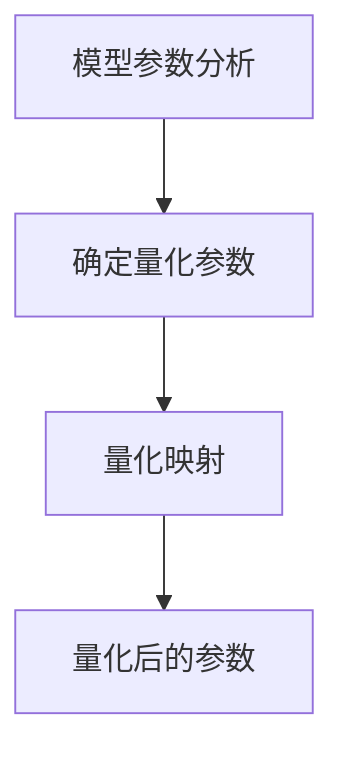
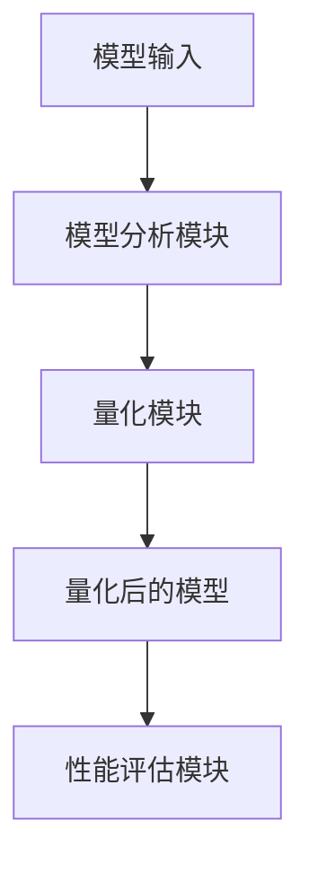

                 


# 模型量化：降低AI Agent的硬件需求

## 关键词：模型量化，AI Agent，硬件需求，量化算法，模型压缩，低精度计算

## 摘要：  
随着人工智能技术的快速发展，AI Agent在各个领域的应用越来越广泛。然而，AI Agent的硬件需求也越来越高，尤其是对于计算资源有限的场景，如移动设备、边缘计算等。为了降低硬件需求，模型量化技术应运而生。本文将深入探讨模型量化的核心概念、算法原理、系统设计以及实际应用，帮助读者全面理解如何通过模型量化技术降低AI Agent的硬件需求。

---

## 第1章：模型量化背景与概念

### 1.1 模型量化的基本概念  
模型量化是指通过减少模型的参数数量或降低参数的精度，从而降低模型的计算量和存储需求。量化的核心在于将高精度的模型参数（如32位浮点数）转换为低精度的表示（如8位整数或4位二进制），以减少模型的内存占用和计算开销。

#### 问题背景  
随着深度学习模型的复杂度不断提高，模型参数量也急剧增加。例如，主流的深度学习框架如TensorFlow和PyTorch默认使用32位浮点数来表示模型参数。对于计算资源有限的设备（如手机、嵌入式设备等），直接运行高精度模型往往会导致计算速度慢、能耗高甚至无法运行的问题。

#### 问题解决  
模型量化通过将高精度参数转换为低精度参数，显著降低了模型的计算和存储需求，使其能够在资源受限的设备上高效运行。此外，量化还可以减少网络传输的数据量，提升数据传输效率。

#### 边界与外延  
- **边界**：模型量化主要针对模型参数的精度进行调整，不涉及模型结构的改变。  
- **外延**：量化技术可以与其他模型压缩技术（如剪枝、知识蒸馏等）结合使用，进一步降低模型的硬件需求。

### 1.2 模型量化的核心问题  
模型量化的核心问题在于如何在保证模型性能的前提下，尽可能降低模型的精度。具体包括以下三个问题：  
1. **量化粒度**：确定哪些模型参数需要量化，以及量化到什么程度。  
2. **量化误差**：量化过程中引入的误差对模型性能的影响。  
3. **量化策略**：如何设计量化算法，以平衡模型性能和硬件需求。  

---

## 第2章：模型量化的核心概念与联系

### 2.1 模型量化的基本原理  
模型量化的基本原理是将高精度的模型参数（如32位浮点数）映射到低精度的表示（如8位整数）。量化过程通常包括以下步骤：  
1. **参数分析**：分析模型参数的分布，确定量化的目标参数。  
2. **量化映射**：将高精度参数映射到低精度表示。  
3. **反量化**：将低精度参数恢复为高精度参数（可选）。  

#### 比较：量化与模型压缩  
| 比较维度 | 量化 | 模型压缩 |  
|----------|------|----------|  
| 核心目标 | 降低参数精度 | 减少参数数量 |  
| 实现方法 | 参数量化 | 参数剪枝、网络蒸馏 |  
| 优缺点   | 简单易实现，但可能引入误差 | 效果显著，但实现复杂 |  

### 2.2 模型量化的核心要素  
模型量化的核心要素包括：  
1. **量化粒度**：量化操作的粒度，可以是单个参数、参数组或整个层。  
2. **量化精度**：量化后的参数精度，如8位整数、4位二进制等。  
3. **量化范围**：量化参数的取值范围，通常与模型参数的动态范围相关。  

---

## 第3章：模型量化算法原理

### 3.1 量化算法的流程  
量化算法的流程可以分为以下几个步骤：  
1. **参数分析**：分析模型参数的分布，确定量化的目标参数。  
2. **确定量化参数**：根据参数分布确定量化参数，如量化步长和偏移。  
3. **量化映射**：将高精度参数映射到低精度表示。  
4. **反量化（可选）**：将低精度参数恢复为高精度参数。  

#### 算法流程图  


### 3.2 量化算法的数学模型  
量化过程可以用以下公式表示：  
$$ y = \text{round}\left(\frac{x}{\Delta} \right) \cdot \Delta $$  
其中，$x$ 是原始高精度参数，$\Delta$ 是量化步长，$y$ 是量化后的参数。  

#### 量化误差  
量化误差可以用以下公式表示：  
$$ \text{误差} = |x - y| $$  
量化误差的大小取决于量化步长 $\Delta$ 和参数分布的动态范围。  

---

## 第4章：系统分析与架构设计

### 4.1 系统架构设计  
模型量化系统的架构可以分为以下几个部分：  
1. **模型分析模块**：分析模型参数的分布，确定量化目标。  
2. **量化模块**：根据量化参数对模型参数进行量化。  
3. **反量化模块（可选）**：将低精度参数恢复为高精度参数。  
4. **性能评估模块**：评估量化后的模型性能。  

#### 系统架构图  


### 4.2 接口设计  
系统接口设计包括以下部分：  
1. **输入接口**：接收原始模型参数。  
2. **输出接口**：输出量化后的模型参数。  
3. **控制接口**：设置量化参数（如量化步长、量化粒度等）。  

---

## 第5章：项目实战

### 5.1 项目环境配置  
```bash
pip install numpy
pip install matplotlib
pip install scikit-learn
```

### 5.2 核心代码实现  
```python
import numpy as np

def quantize(x, bit_width=8):
    # 确定量化范围
    max_val = np.max(x)
    min_val = np.min(x)
    # 计算量化步长
    delta = (max_val - min_val) / (2 ** bit_width - 1)
    # 量化映射
    quantized = np.round(x / delta) * delta
    return quantized

# 示例：量化一个32位浮点数数组
x = np.array([0.1, 0.2, 0.3], dtype=np.float32)
quantized_x = quantize(x, bit_width=8)
print("量化后的结果：", quantized_x)
```

### 5.3 测试与结果分析  
```python
# 量化前的模型参数
print("原始参数：", x)
print("量化后的参数：", quantized_x)
print("量化误差：", np.mean(np.abs(x - quantized_x)))
```

---

## 第6章：最佳实践与小结

### 6.1 最佳实践  
1. **选择合适的量化粒度**：根据模型性能需求选择量化粒度。  
2. **结合其他压缩技术**：将量化与其他压缩技术（如剪枝、知识蒸馏）结合使用。  
3. **进行误差分析**：量化前对模型参数分布进行分析，确保量化误差在可接受范围内。  

### 6.2 小结  
模型量化是降低AI Agent硬件需求的重要技术，通过减少模型参数的精度，可以在保证模型性能的前提下显著降低计算和存储需求。本文详细介绍了模型量化的核心概念、算法原理、系统设计以及实际应用，为读者提供了全面的指导。

---

## 附录：工具与资源  

### 附录A：相关工具  
- **TensorFlow Model Optimization**：Google提供的模型量化工具。  
- **PyTorch Quantization**：PyTorch内置的量化工具包。  

### 附录B：参考文献  
1. TensorFlow官方文档：[TensorFlow Model Optimization](https://www.tensorflow.org/model_optimization)  
2. PyTorch官方文档：[Quantization](https://pytorch.org/docs/stable/quantization.html)  

--- 

**全文完**

