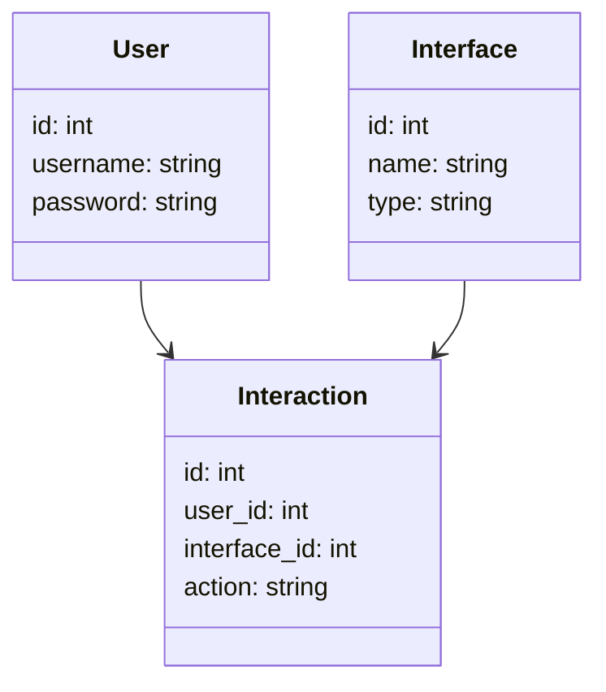
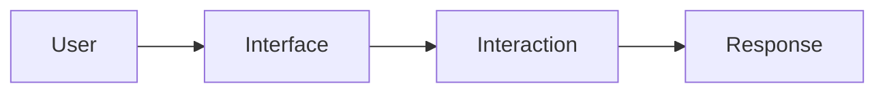
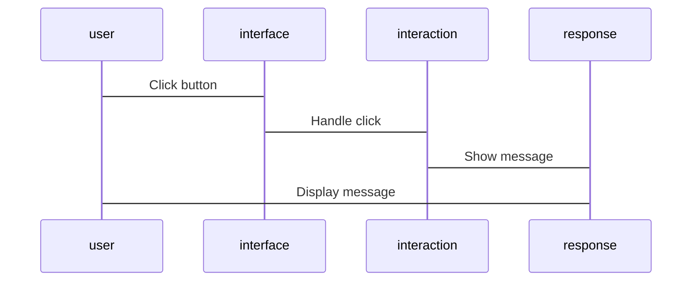

                 


# 用户界面设计

> 关键词：用户界面设计，交互设计，视觉设计，信息架构，用户体验，UI/UX设计

> 摘要：用户界面设计是人机交互领域的重要组成部分，涉及信息架构、交互设计和视觉设计等多个方面。本文从用户界面设计的基本概念出发，深入探讨其核心原理、算法实现、数学模型、系统架构以及实际项目中的应用。通过对比分析、图表展示、代码实现和案例研究，系统地剖析用户界面设计的理论与实践，为读者提供全面而深入的指导。

---

# 第一部分: 用户界面设计基础

# 第1章: 用户界面设计概述

## 1.1 用户界面设计的基本概念

### 1.1.1 用户界面的定义与范围

用户界面（User Interface, UI）是用户与计算机系统或其他设备进行交互的媒介。它包括了用户通过设备看到的图形界面、按钮、菜单、图标等元素。用户界面设计的核心目标是使用户能够方便、直观地与系统进行交互，同时提升用户体验。

**核心概念：**
- **输入输出界面**：用户通过输入设备（如键盘、鼠标）与系统互动，系统通过输出设备（如屏幕、扬声器）反馈结果。
- **人机交互**：用户界面是人机交互的核心媒介，设计好坏直接影响用户体验和效率。
- **跨平台一致性**：用户界面设计需要考虑不同平台（如Windows、MacOS、Android、iOS）的差异，确保界面风格和交互逻辑的一致性。

### 1.1.2 用户界面设计的重要性

在现代计算机系统中，用户界面设计的重要性不容忽视：
- **提升用户体验**：直观、友好的界面能够减少用户的学习成本，提高使用效率。
- **增强用户满意度**：良好的界面设计能够提升用户对产品的满意度和忠诚度。
- **提高产品竞争力**：优秀的用户界面设计是产品区别于竞争对手的重要因素。

### 1.1.3 用户界面设计的核心要素

用户界面设计的核心要素包括：
1. **信息架构**：信息的组织和结构化，确保用户能够快速找到所需信息。
2. **交互设计**：设计用户与系统之间的互动流程，确保交互逻辑清晰、反馈及时。
3. **视觉设计**：通过颜色、字体、布局等视觉元素，提升界面的美观性和可读性。

## 1.2 用户界面设计的历史与发展

### 1.2.1 从命令行到图形界面的演变

早期的计算机界面主要是命令行界面（CLI），用户需要通过输入命令与系统交互。随着技术的发展，图形用户界面（GUI）逐渐取代了命令行界面，成为现代计算机系统的主流界面。

**关键转折点：**
- **1968年**：Douglas Engelbart演示了第一个交互式图形用户界面，展示了鼠标和图形界面的可能性。
- **1985年**：苹果Macintosh计算机的发布，标志着图形用户界面的普及。
- **现代**：移动互联网时代，用户界面设计从PC端扩展到移动端，界面设计更加注重触摸交互和响应速度。

### 1.2.2 不同平台的界面设计风格

不同平台（如iOS、Android、Windows、macOS）的用户界面设计有着各自独特的风格和规范：
- **iOS**：以简洁、直观、扁平化设计为主，注重动画效果和触感反馈。
- **Android**：采用 Material Design 设计语言，强调模块化和一致性。
- **Windows**：以经典风格为基础，结合现代设计元素，注重功能性和美观性。
- **macOS**：以简洁、优雅的设计著称，注重用户体验和视觉一致性。

### 1.2.3 用户界面设计的未来趋势

随着人工智能和虚拟现实技术的发展，用户界面设计将朝着以下方向发展：
- **智能化**：通过AI技术实现更智能的交互设计，例如智能语音助手和手势识别。
- **沉浸式体验**：虚拟现实（VR）和增强现实（AR）技术将为用户提供更加沉浸式的交互体验。
- **个性化**：用户界面将更加个性化，根据用户的偏好和行为习惯动态调整界面布局和功能。

## 1.3 用户界面设计的背景与问题

### 1.3.1 用户需求与设计目标

用户界面设计的核心目标是满足用户的需求，提升用户体验。然而，在实际设计过程中，往往面临以下问题：
- **需求理解偏差**：设计团队对用户需求的理解不一致，导致设计偏离用户实际需求。
- **用户行为预测困难**：用户的行为习惯和偏好难以准确预测，影响交互设计的合理性。
- **跨平台适配问题**：不同平台的设计规范和交互逻辑差异较大，导致设计适配困难。

### 1.3.2 用户界面设计中的常见问题

在用户界面设计过程中，常见的问题包括：
- **信息过载**：界面元素过多，导致用户难以聚焦，降低用户体验。
- **交互逻辑混乱**：用户操作流程复杂，用户容易迷失，降低操作效率。
- **视觉干扰**：界面设计过于花哨，分散用户注意力，影响用户体验。

### 1.3.3 用户界面设计的边界与外延

用户界面设计的边界和外延需要明确：
- **边界**：用户界面设计仅关注用户与系统交互的媒介，不涉及后端逻辑和数据处理。
- **外延**：用户界面设计与用户体验（UX）、信息架构（IA）、视觉设计（Visual Design）密切相关，是用户体验设计的重要组成部分。

## 1.4 本章小结

本章从用户界面设计的基本概念出发，探讨了其重要性、核心要素以及历史发展。同时，分析了不同平台的界面设计风格和未来趋势，明确了用户界面设计的背景与问题。通过这些内容，读者可以对用户界面设计有一个全面而系统的理解。

---

# 第二部分: 用户界面设计的核心概念与联系

# 第2章: 用户界面设计的核心原理

## 2.1 用户界面设计的理论基础

### 2.1.1 信息架构设计

**信息架构**是用户界面设计的重要组成部分，它决定了信息的组织方式和用户如何访问这些信息。

#### 2.1.1.1 信息架构的核心原则

- **简洁性**：信息架构应尽量简化，避免冗余。
- **逻辑性**：信息的组织应符合用户的认知习惯，逻辑清晰。
- **可扩展性**：信息架构应具有灵活性，能够适应未来的变化。

#### 2.1.1.2 信息架构设计的关键步骤

1. **信息收集**：通过用户调研、数据分析等方式收集相关信息。
2. **信息分类**：将收集到的信息进行分类，建立信息的层级结构。
3. **信息组织**：根据分类结果，设计信息的展示方式和导航路径。

### 2.1.2 交互设计原理

**交互设计**是用户界面设计的核心，它决定了用户与系统之间的互动方式。

#### 2.1.2.1 交互设计的核心原则

- **反馈性**：用户操作后，系统应给予及时的反馈，增强用户的操作信心。
- **一致性**：交互逻辑和操作流程应保持一致，减少用户的认知负担。
- **可用性**：设计应确保用户能够方便地完成操作，减少误操作的可能性。

#### 2.1.2.2 交互设计的关键步骤

1. **需求分析**：明确用户的使用场景和需求，设计交互流程。
2. **原型设计**：通过原型工具（如Figma、Sketch）设计交互流程图。
3. **用户测试**：通过用户测试，收集反馈，优化交互设计。

### 2.1.3 视觉设计原则

**视觉设计**是用户界面设计的重要组成部分，它决定了界面的美观性和可读性。

#### 2.1.3.1 视觉设计的核心原则

- **简洁性**：视觉元素应尽量简洁，避免过于复杂的设计。
- **一致性**：界面风格、颜色、字体等应保持一致，增强品牌识别度。
- **可读性**：文字、图标等视觉元素应易于识别，确保用户能够快速获取信息。

#### 2.1.3.2 视觉设计的关键步骤

1. **色彩搭配**：选择合适的色彩方案，确保界面的美观性和可读性。
2. **字体设计**：选择合适的字体，确保文字清晰易读。
3. **布局设计**：合理安排界面元素的位置，确保布局的合理性。

## 2.2 用户界面设计的核心要素对比

### 2.2.1 对比表格: 信息架构、交互设计与视觉设计的特征对比

| 要素          | 特征                              |
|---------------|-----------------------------------|
| 信息架构      | 结构化、逻辑性                    |
| 交互设计      | 反馈性、一致性                    |
| 视觉设计      | 美学性、可读性                    |

### 2.2.2 用户界面设计的ER实体关系图

```mermaid
entity User {
  id: int
  username: string
  password: string
}
entity Interface {
  id: int
  name: string
  type: string
}
entity Interaction {
  id: int
  user_id: int
  interface_id: int
  action: string
}
```

---

# 第三部分: 用户界面设计的算法与数学模型

# 第3章: 用户界面设计的算法原理

## 3.1 用户界面设计中的交互逻辑

### 3.1.1 交互逻辑的算法实现

用户界面设计中的交互逻辑可以通过算法来实现。以下是一个简单的交互逻辑算法示例：

```python
def handle_user_interaction(event):
    if event.type == 'click':
        handle_click(event)
    elif event.type == 'hover':
        handle_hover(event)
    elif event.type == 'keydown':
        handle_keydown(event)
```

### 3.1.2 用户行为分析的数学模型

用户行为分析可以通过数学模型来实现。以下是一个简单的用户行为分析模型：

$$ P = \frac{clicks}{impressions} $$

其中：
- \( P \) 表示点击率
- \( clicks \) 表示用户的点击次数
- \( impressions \) 表示用户的浏览次数

---

# 第四部分: 用户界面设计的系统架构

# 第4章: 用户界面设计的系统架构

## 4.1 系统功能设计

### 4.1.1 领域模型设计

领域模型是用户界面设计的重要组成部分，它描述了系统的功能和交互流程。



### 4.1.2 系统架构设计

用户界面设计的系统架构可以通过以下方式实现：



---

# 第五部分: 用户界面设计的项目实战

# 第5章: 用户界面设计的实战应用

## 5.1 环境安装与配置

### 5.1.1 开发工具安装

- **Figma**：在线界面设计工具，支持团队协作。
- **Sketch**： macOS 平台的界面设计工具。
- **Adobe XD**：跨平台的界面设计工具。

## 5.2 系统核心实现

### 5.2.1 核心代码实现

以下是一个简单的用户界面设计代码示例：

```python
import tkinter as tk

root = tk.Tk()
root.title("User Interface Design")

label = tk.Label(root, text="Welcome to User Interface Design", font=('Arial', 12, 'bold'))
label.pack()

button = tk.Button(root, text="Click Me", command=lambda: label.config(text="Thank you for clicking!"))
button.pack()

root.mainloop()
```

### 5.2.2 代码解读与分析

- **导入库**：使用 `tkinter` 库创建 GUI 界面。
- **创建主窗口**：`root = tk.Tk()` 创建主窗口，并设置标题。
- **创建标签**：`label = tk.Label(root, text="Welcome to User Interface Design", font=('Arial', 12, 'bold'))` 创建标签，并设置字体和大小。
- **创建按钮**：`button = tk.Button(root, text="Click Me", command=lambda: label.config(text="Thank you for clicking!"))` 创建按钮，并设置点击事件的回调函数。
- **主循环**：`root.mainloop()` 进入主循环，显示窗口。

## 5.3 案例分析与详细讲解

### 5.3.1 案例分析

以下是一个简单的用户界面设计案例：



### 5.3.2 详细讲解

- **用户操作**：用户点击按钮。
- **交互处理**：系统接收用户的点击事件。
- **响应处理**：系统处理用户的点击事件，并显示相应的反馈信息。
- **用户反馈**：用户看到反馈信息，并继续操作。

## 5.4 项目小结

通过本章的项目实战，读者可以掌握用户界面设计的基本方法和技巧。从环境安装到代码实现，再到案例分析，全面提升了用户界面设计的能力。

---

# 第六部分: 用户界面设计的最佳实践

# 第6章: 用户界面设计的最佳实践

## 6.1 小结与回顾

用户界面设计是一个复杂而重要的过程，需要综合考虑信息架构、交互设计和视觉设计等多个方面。通过本章的探讨，读者可以全面了解用户界面设计的核心概念和实现方法。

## 6.2 注意事项与常见问题

在用户界面设计过程中，需要注意以下事项：
- **避免信息过载**：确保界面简洁，避免过多的信息干扰用户。
- **注重交互反馈**：确保用户操作有明确的反馈，增强用户的操作信心。
- **保持视觉一致性**：确保界面风格一致，提升品牌识别度。

## 6.3 拓展阅读与深入学习

对于希望深入学习用户界面设计的读者，可以参考以下资源：
- **《用户体验要素》**： Jakob Nielsen 的经典著作，深入探讨用户体验设计的核心要素。
- **《设计心理学》**： Donald A. Norman 的著作，从心理学角度探讨设计的原理和方法。
- **《交互设计精髓》**： Alan Cooper 的著作，系统地介绍了交互设计的理论和实践。

---

# 结语

用户界面设计是人机交互领域的重要组成部分，它直接关系到用户的体验和系统的可用性。通过本篇文章的探讨，读者可以全面了解用户界面设计的核心概念、实现方法和实际应用。希望本文能够为读者提供有价值的指导，帮助他们在用户界面设计领域取得更大的成功。

--- 

（注：以上目录大纲结构和内容仅为示例，实际撰写时需要根据具体需求进行调整和补充。）

