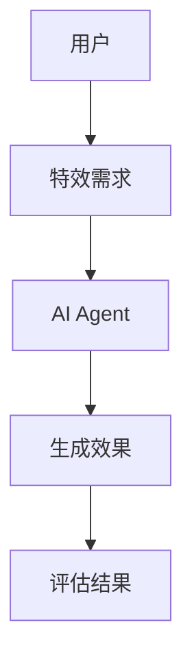
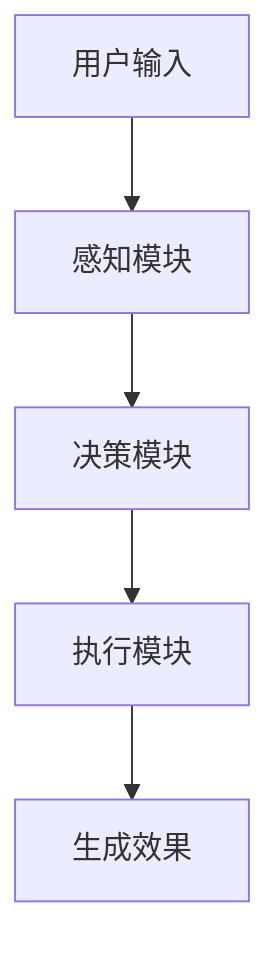
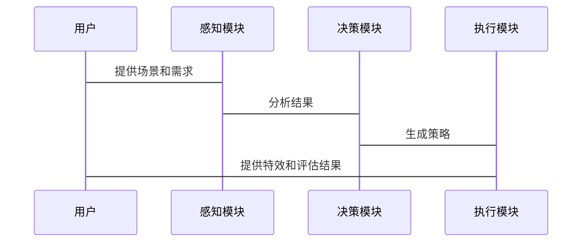

                 


# 电影制作中的AI Agent特效生成

## 关键词
- AI Agent
- 电影特效
- 特效生成
- 人工智能
- 深度学习

## 摘要
本文探讨了AI Agent在电影特效生成中的应用，分析了其技术原理、系统架构及实际案例，展示了AI如何提升特效制作效率与质量。

---

## 第一部分：背景与概念

### 第1章：AI Agent与电影特效的背景

#### 1.1 AI Agent的基本概念
- **AI Agent**：智能体，具备感知、决策、行动能力。
- **核心特征**：自主性、反应性、目标导向。
- **与传统特效的区别**：AI Agent能自动生成和优化特效，减少人工干预。

#### 1.2 电影特效的生成需求
- **特效类型**：视觉效果、动作捕捉、虚拟场景。
- **传统特效的局限性**：耗时长、成本高、难以实现复杂效果。
- **AI Agent的优势**：提高效率、降低成本、实现复杂效果。

#### 1.3 问题背景与描述
- **问题**：传统特效制作周期长、成本高，难以满足现代电影的复杂需求。
- **解决方案**：AI Agent通过自动化和智能化提升特效生成效率和质量。
- **技术边界**：AI Agent目前主要用于辅助生成，无法完全替代人类创意。

---

## 第二部分：核心概念与技术原理

### 第2章：AI Agent特效生成的核心概念

#### 2.1 AI Agent的感知与决策
- **感知模块**：通过图像识别和目标检测理解场景。
- **决策机制**：基于强化学习优化特效生成策略。
- **执行模块**：使用生成对抗网络（GAN）生成特效。

#### 2.2 核心概念对比分析
- **AI Agent与传统算法对比**：AI Agent具备自主学习和优化能力。
- **不同AI模型对比**：GAN在图像生成上表现优异，强化学习适用于复杂决策。
- **生成效果评估标准**：真实感、细节丰富度、渲染速度。

#### 2.3 ER实体关系图


### 第3章：AI Agent的算法原理

#### 3.1 感知模块的实现
- **基于深度学习的图像识别**：使用CNN提取图像特征。
- **目标检测与图像分割**：应用Faster R-CNN检测目标，U-Net进行分割。

#### 3.2 决策模块的算法
- **强化学习策略优化**：通过Q-Learning优化决策策略。
- **多目标优化**：平衡生成速度与质量。

#### 3.3 执行模块的实现
- **生成对抗网络（GAN）**：生成逼真特效。
- **深度伪造技术**：用于人物替换和场景生成。
- **物理模拟**：模拟真实物理效果。

### 第4章：数学模型与公式

#### 4.1 卷积神经网络（CNN）模型
$$ \text{CNN结构：} \text{conv} \rightarrow \text{pool} \rightarrow \text{conv} \rightarrow \text{pool} $$

#### 4.2 GAN模型
- **生成器**：$G(z) = D(G(z))$，其中$z$是噪声向量。
- **判别器**：$D(x) = 1$当$x$是真实图像，$D(G(z))=0$当$x$是生成图像。

---

## 第三部分：系统分析与架构设计

### 第5章：系统架构设计

#### 5.1 问题场景介绍
- **场景描述**：电影特效生成需要快速、高质量的输出。
- **项目介绍**：开发一个AI Agent驱动的特效生成系统。

#### 5.2 系统功能设计
- **模块划分**：感知模块、决策模块、执行模块。
- **功能描述**：感知环境、生成优化策略、执行特效生成。

#### 5.3 系统架构设计


#### 5.4 系统接口设计
- **输入接口**：接收场景描述和特效需求。
- **输出接口**：提供生成的特效和评估结果。

#### 5.5 系统交互流程


---

## 第四部分：项目实战

### 第6章：项目实战

#### 6.1 环境安装
- **工具安装**：安装Python、TensorFlow、Keras、OpenCV。
- **数据准备**：收集电影场景和特效素材。

#### 6.2 系统核心实现
- **感知模块实现**：使用Faster R-CNN进行目标检测。
- **决策模块实现**：应用强化学习优化生成策略。
- **执行模块实现**：利用GAN生成特效图像。

#### 6.3 代码应用解读与分析
```python
import tensorflow as tf
from tensorflow.keras import layers

# 感知模块：目标检测
def build_detector_model():
    model = tf.keras.Sequential()
    model.add(layers.Conv2D(32, (3,3), activation='relu'))
    model.add(layers.MaxPooling2D())
    model.add(layers.Conv2D(64, (3,3), activation='relu'))
    model.add(layers.MaxPooling2D())
    model.add(layers.Flatten())
    model.add(layers.Dense(128, activation='relu'))
    model.add(layers.Dense(1, activation='sigmoid'))
    return model

# 决策模块：强化学习策略
def build_qnetwork():
    model = tf.keras.Sequential()
    model.add(layers.Dense(32, activation='relu', input_dim=10))
    model.add(layers.Dense(4, activation='linear'))
    return model

# 执行模块：GAN生成器
def build_generator():
    model = tf.keras.Sequential()
    model.add(layers.Dense(256, activation='relu', input_dim=100))
    model.add(layers.Reshape((16,16,1)))
    model.add(layers.Conv2DTranspose(3, (3,3), activation='sigmoid'))
    return model
```

#### 6.4 实际案例分析
- **案例描述**：生成电影中的虚拟场景。
- **实现细节**：感知模块识别场景，决策模块优化生成策略，执行模块生成场景图像。
- **效果展示**：生成的场景图像与真实场景对比，评估生成效果。

---

## 第五部分：总结与展望

### 第7章：总结与展望

#### 7.1 项目小结
- **总结**：AI Agent显著提升了特效生成效率和质量。
- **优化建议**：优化感知模块的准确性，提升决策模块的策略优化能力。

#### 7.2 最佳实践 tips
- **数据质量**：高质量的数据训练提升模型性能。
- **模型调优**：定期更新模型参数，适应不同场景需求。
- **团队协作**：AI Agent与人类艺术家协作，结合创意与技术。

#### 7.3 未来展望
- **技术进步**：更强大的AI模型（如Transformer）应用于特效生成。
- **行业应用**：AI Agent在影视、游戏等领域的广泛应用。
- **伦理问题**：关注生成内容的版权和真实性问题。

---

## 附录：扩展阅读

### 附录A：相关技术资源

- **推荐书籍**：《深度学习》、《强化学习》。
- **推荐论文**：CycleGAN、GAN in Action。
- **在线课程**：Coursera上的相关课程。

### 附录B：工具与库

- **深度学习框架**：TensorFlow、Keras。
- **目标检测库**：Faster R-CNN、YOLO。
- **生成对抗网络库**：TensorFlow GANs。

---

通过以上目录大纲，您可以撰写一篇结构清晰、内容详实的技术博客文章，深入探讨AI Agent在电影特效生成中的应用。

