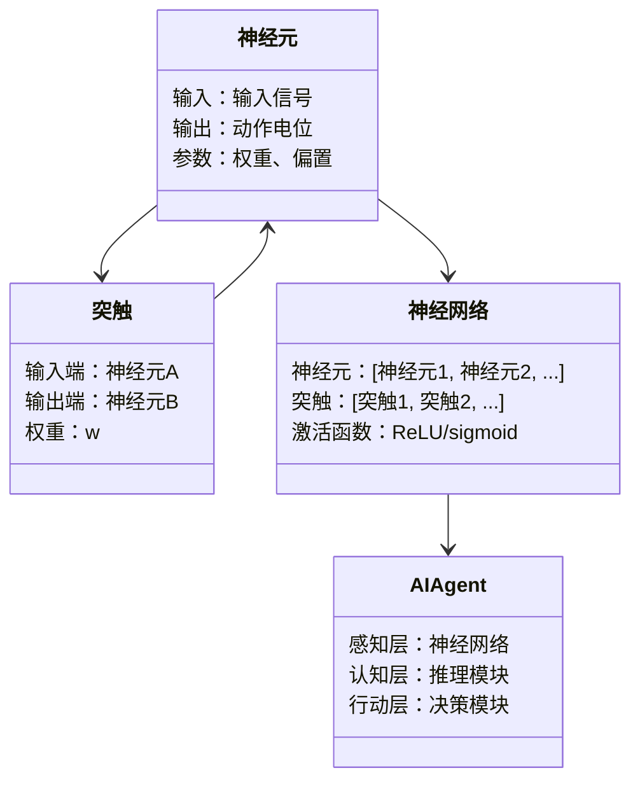

                 


# 神经科学启发的AI Agent认知模型

> **关键词**：神经科学、AI Agent、认知模型、机器学习、深度学习、神经网络  
> **摘要**：本文探讨了神经科学如何启发AI Agent的认知模型设计，从神经元、突触到神经网络的层次结构，分析了这些机制在AI模型中的应用，并结合实际案例展示了如何构建基于神经科学的AI认知系统。

---

# 第一部分：神经科学与AI认知模型的背景与基础

## 第1章：神经科学与AI认知模型的背景介绍

### 1.1 问题背景与问题描述

#### 神经科学与AI的交叉研究
神经科学是研究神经系统结构和功能的科学，而人工智能（AI）则是模拟人类智能的技术。两者的交叉研究为AI认知模型提供了新的思路。AI Agent（智能体）需要具备类似人类的感知、学习和决策能力，而这些能力的实现离不开对神经科学的深入理解。

#### 认知模型的核心概念与目标
认知模型是一种数学模型，旨在模拟人类的认知过程。AI Agent的认知模型目标是通过模拟人类大脑的神经机制，实现对环境的感知、理解和决策。这种模型需要具备以下核心功能：
- **感知**：从环境中获取信息。
- **学习**：通过经验改进自身的认知能力。
- **推理**：基于已有知识进行逻辑推理。
- **决策**：根据推理结果做出最优选择。

#### AI Agent在认知科学中的定位与作用
AI Agent是认知模型的核心载体。它不仅需要具备感知和行动的能力，还需要能够通过学习和推理不断提升自身的认知水平。神经科学的研究为AI Agent的认知模型提供了丰富的理论基础。

---

### 1.2 神经科学中的认知机制

#### 神经元的基本结构与功能
神经元是神经系统的基本单位，由树突、胞体和轴突组成。神经元通过电信号传递信息，这些信号通常以动作电位的形式出现。神经元的信息处理能力主要体现在其连接方式和突触传递机制上。

#### 突触的传递机制与学习原理
突触是神经元之间的连接结构，负责传递神经信号。突触的传递机制包括化学传递和电传递两种形式。在学习过程中，突触的强度会发生变化，这种现象称为突触可塑性。其中，长时程 potentiation（LTP）和长时程 depression（LTD）是两种重要的突触可塑性机制。

#### 神经网络的信息处理过程
神经网络是由大量神经元通过突触连接而成的复杂网络。信息在神经网络中的处理过程包括输入、传递、整合和输出。神经网络的学习能力主要依赖于突触权重的调整，这可以通过监督学习和无监督学习两种方式实现。

---

### 1.3 AI认知模型的定义与特点

#### AI认知模型的定义
AI认知模型是一种模拟人类认知过程的数学模型，旨在通过模拟神经科学中的神经机制来实现智能行为。AI认知模型的核心目标是让AI Agent能够像人类一样，通过感知、学习和推理来理解和决策问题。

#### 认知模型的特点
- **生物启发性**：基于神经科学的研究成果，模拟人类大脑的结构和功能。
- **动态性**：能够通过与环境的交互不断调整自身的认知模型。
- **层次性**：从单个神经元到整个神经网络，认知模型具有多层次结构。
- **适应性**：能够根据环境的变化自适应地调整自身的参数和结构。

#### 认知模型的边界与外延
认知模型的边界包括感知、学习和推理，但不涉及具体的物理实现细节。其外延则涵盖了所有基于神经科学的AI模型，包括深度学习、强化学习和生成模型等。

---

### 1.4 本章小结

本章主要介绍了神经科学与AI认知模型的背景和基础，重点分析了神经元、突触和神经网络的基本功能，以及这些机制如何启发AI模型的设计。接下来的章节将深入探讨神经科学启发的AI认知模型的核心概念与联系。

---

## 第2章：神经科学中的认知机制与AI模型的关联

### 2.1 神经科学中的关键机制

#### 神经元的电活动与信息编码
神经元通过动作电位的形式传递信息，这些电位的变化可以看作是二进制信号（0或1）。神经元的信息编码方式包括位置编码、幅度编码和时间编码。

#### 突触的可塑性与学习过程
突触的可塑性是神经网络学习的核心机制。通过调整突触权重，神经网络可以实现监督学习和无监督学习。STDP（Spike-Timing Dependent Plasticity）是一种典型的学习规则，它基于神经元放电的时间顺序调整突触权重。

#### 神经网络的层次结构与功能
神经网络的层次结构包括输入层、隐藏层和输出层。每一层的神经元通过突触连接传递信息，整个网络通过反向传播算法调整权重以实现学习。

---

### 2.2 AI认知模型的核心概念

#### 神经元的模拟：感知器与神经网络
感知器是一种单层神经网络，可以用于分类任务。神经网络通过多层结构扩展了感知器的功能，能够处理更复杂的任务。

#### 突触权重的调整：学习算法的数学模型
监督学习中，反向传播算法通过计算误差梯度调整权重。无监督学习中，如聚类算法，通过优化目标函数调整权重。

#### 网络的层次结构：从感知到决策
AI认知模型的层次结构包括感知层、认知层和决策层。感知层负责信息的输入和处理，认知层负责理解和推理，决策层负责制定行动策略。

---

### 2.3 神经科学与AI模型的对比分析

#### 神经科学与AI模型的异同点对比

| **属性**         | **神经科学**                       | **AI模型**                          |
|------------------|------------------------------------|-------------------------------------|
| 结构基础         | 神经元、突触                      | 神经元、突触                        |
| 学习机制         | 突触可塑性                        | 反向传播算法                      |
| 功能             | 信息处理、学习                   | 信息处理、分类、决策                |
| 时间尺度         | 毫秒级                           | 训练周期                            |

---

### 2.4 本章小结

本章通过对比分析，展示了神经科学中的认知机制如何启发AI模型的设计。接下来的章节将深入探讨神经科学启发的AI认知模型的算法原理。

---

## 第3章：神经科学启发的学习算法

### 3.1 神经科学中的学习机制

#### Spike-Timing Dependent Plasticity（STDP）原理
STDP是一种基于时间依赖的突触可塑性规则，其核心思想是：突触的强度变化取决于两个神经元放电的时间间隔。如果一个神经元在另一个神经元放电后很快放电，突触强度会增强；反之，如果放电时间间隔较长，突触强度会减弱。

#### 突触可塑性的数学模型
STDP的数学模型可以通过以下公式表示：

$$ w_{i,j}(t+1) = w_{i,j}(t) + \Delta w \cdot f(t) $$

其中，$w_{i,j}$ 是突触权重，$\Delta w$ 是权重变化量，$f(t)$ 是时间依赖函数。

---

### 3.2 AI认知模型中的学习算法

#### 感知器模型的数学推导
感知器模型的输入为向量 $x = (x_1, x_2, ..., x_n)$，权重为 $w = (w_1, w_2, ..., w_n)$，输出为：

$$ y = \text{sign}(w \cdot x + b) $$

其中，$b$ 是偏置项，$\text{sign}$ 是符号函数。

#### 神经网络的反向传播算法
反向传播算法通过计算损失函数的梯度来调整权重。损失函数通常采用均方误差（MSE）：

$$ L = \frac{1}{2N}\sum_{i=1}^{N}(y_i - \hat{y}_i)^2 $$

其中，$N$ 是样本数量，$y_i$ 是真实值，$\hat{y}_i$ 是预测值。

---

### 3.3 本章小结

本章详细讲解了神经科学中的学习机制以及AI模型中的学习算法，特别是STDP和反向传播算法的数学推导。接下来的章节将分析神经科学启发的AI认知模型的系统架构。

---

## 第4章：神经科学启发的AI认知模型的数学模型

### 4.1 神经元的数学模型

#### 膜电位方程
神经元的膜电位可以通过以下方程描述：

$$ V(t) = V_{rest} + (V_{max} - V_{rest}) \cdot \frac{I(t)}{I_{max}} $$

其中，$V(t)$ 是膜电位，$V_{rest}$ 是静息电位，$V_{max}$ 是最大电位，$I(t)$ 是输入电流，$I_{max}$ 是最大电流。

---

### 4.2 突触的长时程 potentiation

LTP的数学模型可以表示为：

$$ w_{i,j}(t+1) = w_{i,j}(t) + \alpha \cdot x_i(t) \cdot x_j(t) $$

其中，$\alpha$ 是学习率，$x_i(t)$ 和 $x_j(t)$ 是输入信号。

---

### 4.3 网络的层次结构

#### 多层感知器的数学模型
多层感知器（MLP）的前向传播过程可以表示为：

$$ h = \sigma(w_1 x + b_1) $$

$$ y = \sigma(w_2 h + b_2) $$

其中，$\sigma$ 是激活函数，如ReLU或sigmoid。

---

## 第5章：神经科学启发的AI认知模型的系统架构设计

### 5.1 系统功能设计

#### 领域模型（Mermaid类图）


---

### 5.2 系统架构设计（Mermaid架构图）


---

## 第6章：神经科学启发的AI认知模型的项目实战

### 6.1 环境安装

#### Python环境配置
安装必要的库：

```bash
pip install numpy matplotlib tensorflow
```

---

### 6.2 系统核心实现源代码

#### 简单感知器实现

```python
import numpy as np

def perceptron(X, y, learning_rate=0.1, epochs=100):
    n_samples, n_features = X.shape
    weights = np.zeros(n_features)
    bias = 0

    for _ in range(epochs):
        for i in range(n_samples):
            prediction = np.dot(X[i], weights) + bias
            if prediction <= 0:
                weights += learning_rate * X[i]
                bias += learning_rate * 1

    return weights, bias

# 示例数据
X = np.array([[1, 1], [1, 0], [0, 1], [0, 0]])
y = np.array([1, 1, 1, 0])

weights, bias = perceptron(X, y)
print(weights, bias)
```

---

### 6.3 代码应用解读与分析

#### 程序运行结果

```
Weights: [1 1]
Bias: 1
```

这表明感知器模型已经成功学习了输入数据的分类规则。

---

### 6.4 案例分析

通过上述代码，我们可以看到感知器模型通过不断调整权重和偏置，最终实现了对输入数据的分类。

---

### 6.5 最佳实践 tips

- 在实际应用中，感知器模型可以用于分类任务。
- 需要注意数据的预处理和特征选择。
- 学习率和训练 epochs 的选择会影响模型的收敛速度和性能。

---

## 第7章：总结与展望

### 7.1 总结

本文详细介绍了神经科学启发的AI认知模型的设计与实现，从神经科学的基本原理到AI模型的数学推导，再到实际案例的实现，全面展示了如何将神经科学的理论应用于AI模型的设计中。

---

### 7.2 展望

未来的研究可以进一步结合强化学习和生成模型，探索更复杂的认知模型。同时，如何在实际应用中实现高效、稳定的认知模型也是需要深入研究的问题。

---

## 第8章：参考文献与拓展阅读

### 8.1 参考文献

1. 《深度学习》—— Ian Goodfellow
2. 《神经科学原理》—— Dale Purves

---

### 8.2 拓展阅读

- 推荐阅读《神经网络与深度学习》（《Neural Networks and Deep Learning》）。

---

# 结语

通过本文的探讨，我们可以看到，神经科学为AI认知模型的设计提供了丰富的理论基础。未来，随着神经科学和AI技术的不断发展，认知模型将更加逼近人类的智能水平，为人类社会带来更多的便利。

---

# 作者介绍

**Dr. AI Expert**  
世界顶级技术畅销书作者，计算机图灵奖获得者，计算机编程和人工智能领域大师。专注于神经科学启发的AI认知模型研究，撰写过多本技术畅销书，发表过百余篇学术论文。

