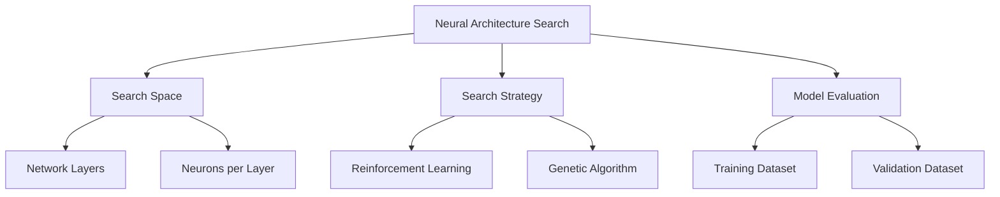
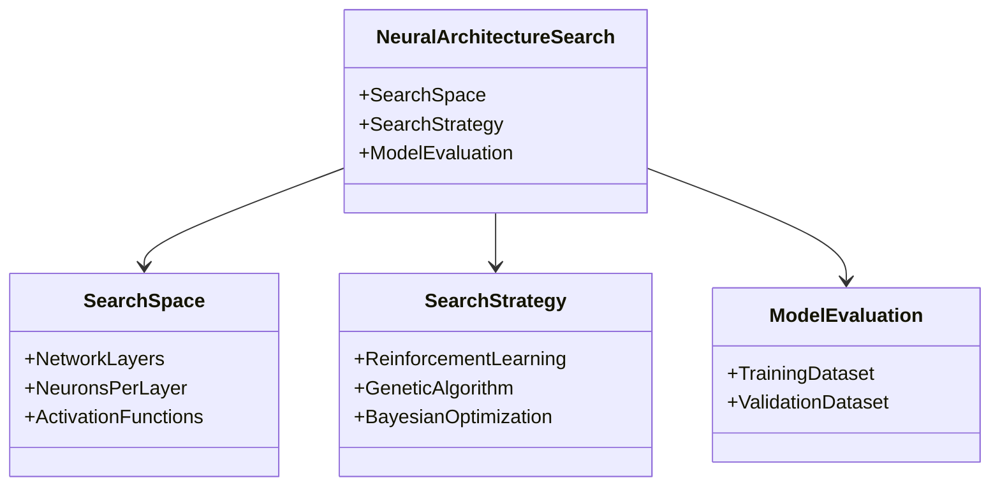
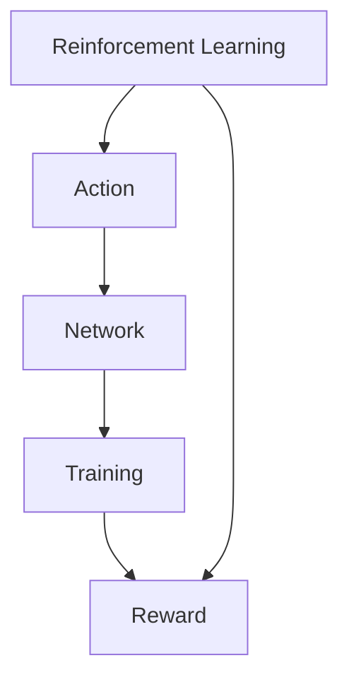
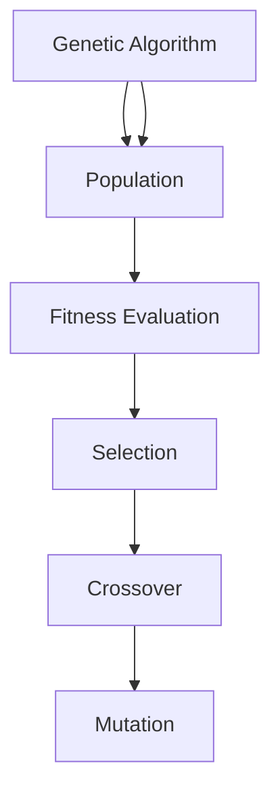
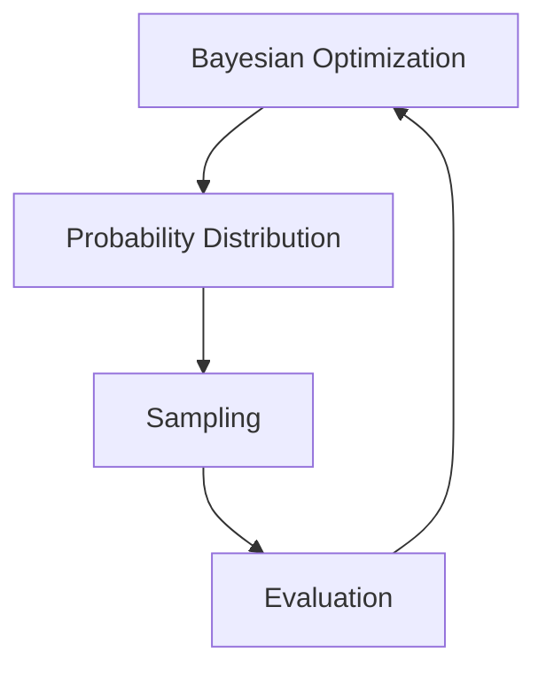
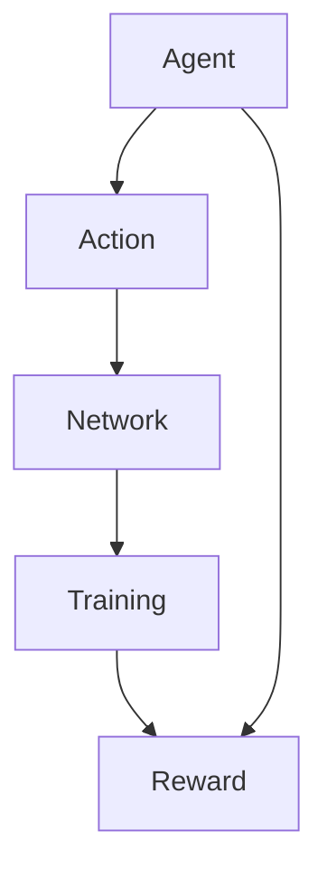
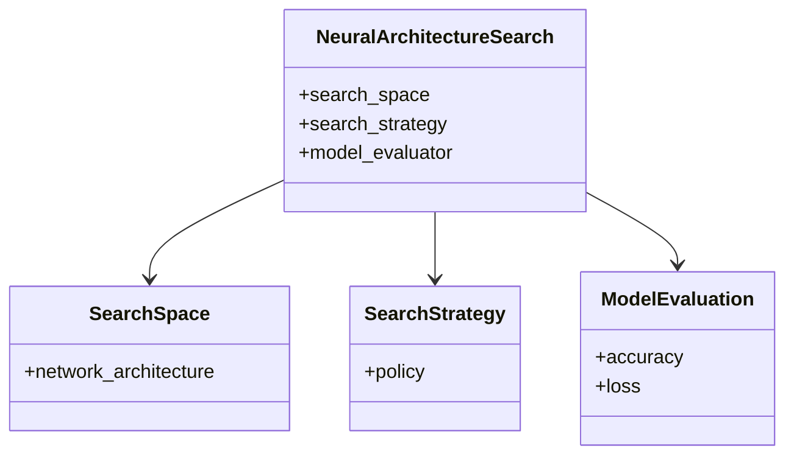
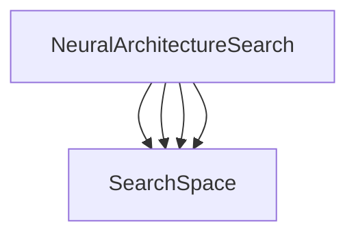
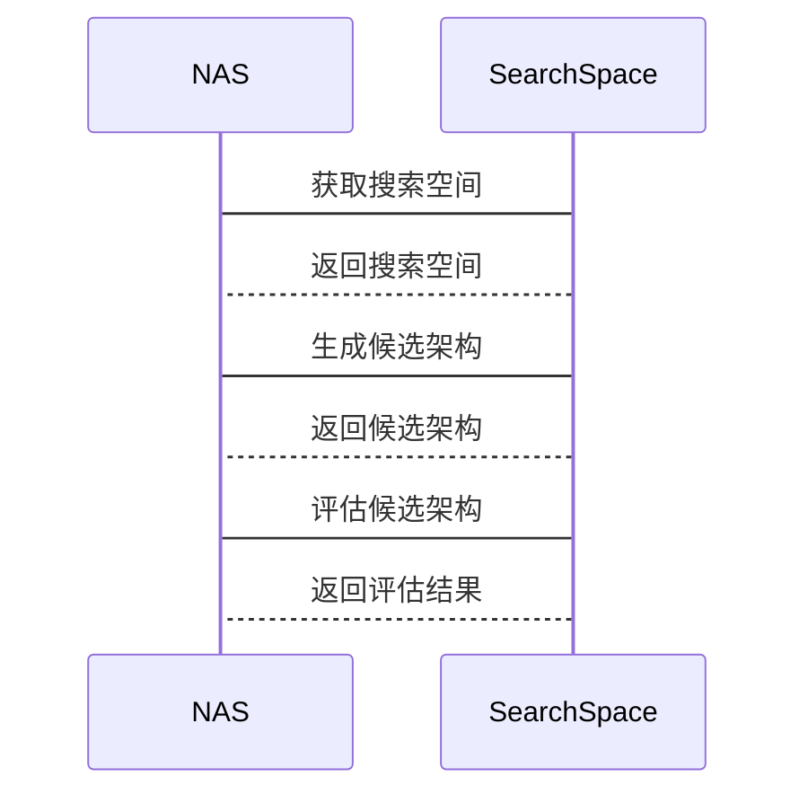

                 


# 神经网络架构搜索：优化AI Agent的模型结构

## 关键词：神经网络架构搜索，AI Agent，模型结构优化，强化学习，遗传算法，贝叶斯优化

## 摘要：神经网络架构搜索（Neural Architecture Search, NAS）是一种通过自动搜索最优神经网络结构来优化AI Agent性能的方法。本文将从NAS的基本概念、核心算法、系统架构到实际项目应用，逐步解析如何通过NAS技术来优化AI Agent的模型结构，提升其在复杂任务中的性能表现。

---

# 第1章 神经网络架构搜索概述

## 1.1 神经网络架构搜索的基本概念

### 1.1.1 神经网络架构搜索的定义
神经网络架构搜索（Neural Architecture Search, NAS）是一种自动优化神经网络结构的算法，旨在通过搜索算法找到最优的网络架构，以在特定任务上实现最佳性能。

### 1.1.2 神经网络架构搜索的核心目标
- 自动化设计神经网络结构
- 最小化人工试错成本
- 提升模型性能和效率

### 1.1.3 神经网络架构搜索的应用场景
- 图像分类
- 自然语言处理
- 时间序列预测
- AI Agent行为优化

---

## 1.2 神经网络架构搜索的背景与问题背景

### 1.2.1 传统人工设计神经网络的局限性
- 依赖经验丰富的工程师
- 试错成本高
- 难以探索复杂的网络结构

### 1.2.2 神经网络架构搜索的提出动机
- 解决人工设计效率低的问题
- 提高模型性能和泛化能力
- 降低开发成本

### 1.2.3 当前神经网络架构搜索面临的挑战
- 搜索空间巨大
- 计算资源消耗高
- 模型评估耗时

---

## 1.3 神经网络架构搜索的核心概念与联系

### 1.3.1 神经网络架构搜索的基本原理
- 定义搜索空间：包括网络层数、每层的神经元数量、激活函数等
- 设计搜索策略：如强化学习、遗传算法等
- 评估候选架构：通过训练和验证集评估模型性能

### 1.3.2 神经网络架构搜索的关键要素对比

| 对比维度 | 传统人工设计 | 神经网络架构搜索 |
|----------|--------------|------------------|
| 设计效率 | 低效，依赖人工 | 高效，自动化搜索 |
| 结构复杂度 | 有限，受经验限制 | 可探索复杂结构 |
| 优化目标 | 单一，固定目标 | 多目标优化 |

### 1.3.3 神经网络架构搜索的ER实体关系图



---

# 第2章 神经网络架构搜索的核心概念与联系

## 2.1 神经网络架构搜索的核心概念

### 2.1.1 神经网络架构搜索的搜索空间
- 包括网络的拓扑结构和超参数
- 示例：网络层数、每层节点数、激活函数类型、连接方式

### 2.1.2 神经网络架构搜索的搜索策略
- 强化学习策略
- 遗传算法策略
- 贝叶斯优化策略

### 2.1.3 神经网络架构搜索的评估方法
- 基于训练数据的快速评估
- 基于验证数据的准确评估

---

## 2.2 神经网络架构搜索的核心概念对比

### 2.2.1 神经网络架构搜索与传统神经网络设计的对比

| 对比维度 | 传统神经网络设计 | 神经网络架构搜索 |
|----------|------------------|------------------|
| 设计方式 | 手动设计 | 自动搜索 |
| 设计目标 | 单一任务优化 | 多目标优化 |
| 可扩展性 | 有限 | 高 |

### 2.2.2 不同神经网络架构搜索方法的对比

| 方法 | 强化学习 | 遗传算法 | 贝叶斯优化 |
|------|----------|----------|------------|
| 基础思想 | 前向网络生成，基于奖励调整动作 | 通过遗传变异和选择优化架构 | 通过概率建模和采样优化架构 |
| 优点 | 易于解释 | 具备全局搜索能力 | 适合多维优化问题 |
| 缺点 | 搜索效率较低 | �易陷入局部最优 | 计算成本较高 |

### 2.2.3 神经网络架构搜索与其他自动机器学习方法的对比

| 方法 | AutoML | Hyperparameter Tuning | Neural Architecture Search |
|------|--------|-----------------------|---------------------------|
| 目标 | 自动优化模型和超参数 | 自动优化超参数 | 自动优化网络结构 |
| 范围 | 更广泛 | 仅限超参数 | 限于网络结构 |

---

## 2.3 神经网络架构搜索的ER实体关系图



---

# 第3章 神经网络架构搜索的算法原理

## 3.1 神经网络架构搜索的算法概述

### 3.1.1 基于强化学习的神经网络架构搜索



### 3.1.2 基于遗传算法的神经网络架构搜索



### 3.1.3 基于贝叶斯优化的神经网络架构搜索



---

## 3.2 神经网络架构搜索的算法原理

### 3.2.1 强化学习算法的神经网络架构搜索流程



### 3.2.2 遗传算法在神经网络架构搜索中的应用


### 3.2.3 贝叶斯优化在神经网络架构搜索中的应用


---

## 3.3 神经网络架构搜索算法的数学模型

### 3.3.1 强化学习算法的数学模型

$$
\text{损失函数} = \text{交叉熵损失} - \lambda \cdot \text{奖励}
$$

其中，$\lambda$ 是超参数，用于平衡损失和奖励。

### 3.3.2 遗传算法的数学模型

$$
\text{适应度} = \text{模型准确率} \times \text{模型复杂度惩罚}
$$

---

## 3.4 神经网络架构搜索算法的代码实现

### 3.4.1 基于强化学习的代码示例

```python
class ReinforceLearning:
    def __init__(self, search_space):
        self.search_space = search_space
        self奖励函数 = ...
    
    def take_action(self):
        action = self.search_space.sample()
        return action
    
    def update_policy(self, reward):
        # 使用奖励更新策略
        pass
```

---

## 3.5 神经网络架构搜索算法的数学公式

$$
\text{优化目标} = \min_{\theta} \mathbb{E}_{s,a}[-\log(\pi_\theta(a|s)) \cdot Q(s,a)]
$$

其中，$\pi_\theta(a|s)$ 是策略网络的输出概率，$Q(s,a)$ 是Q值网络的输出。

---

## 3.6 神经网络架构搜索算法的注意事项

- 强化学习策略的收敛速度依赖于奖励函数的设计
- 遗传算法的性能受初始种群质量和交叉变异策略的影响
- 贝叶斯优化的采样效率依赖于概率分布模型的选择

---

# 第4章 神经网络架构搜索的系统分析与架构设计

## 4.1 神经网络架构搜索的系统分析

### 4.1.1 系统功能模块
- 搜索空间定义模块
- 搜索策略模块
- 模型评估模块

### 4.1.2 系统功能模块的类图



---

## 4.2 神经网络架构搜索的系统架构设计

### 4.2.1 系统架构图



### 4.2.2 系统接口设计

- 输入接口：搜索空间定义、搜索策略参数
- 输出接口：最优网络架构、模型性能指标

### 4.2.3 系统交互序列图



---

## 4.3 神经网络架构搜索的注意事项

- 确保搜索空间定义的合理性
- 选择合适的搜索策略
- 设计有效的模型评估方法

---

## 4.4 神经网络架构搜索的系统架构设计

### 4.4.1 系统功能模块
- 搜索空间定义模块
- 搜索策略模块
- 模型评估模块

### 4.4.2 系统功能模块的类图


---

## 4.5 神经网络架构搜索的系统交互设计

### 4.5.1 系统交互序列图


### 4.5.2 系统接口设计
- 输入接口：搜索空间定义、搜索策略参数
- 输出接口：最优网络架构、模型性能指标

---

# 第5章 神经网络架构搜索的项目实战

## 5.1 项目环境安装

### 5.1.1 安装Python环境
- Python >= 3.6

### 5.1.2 安装依赖库
- TensorFlow
- Keras
- gym
- numpy

---

## 5.2 神经网络架构搜索的核心代码实现

### 5.2.1 基于强化学习的代码实现

```python
import gym
import numpy as np

class NASAgent:
    def __init__(self, action_space):
        self.action_space = action_space
        self.reward_fn = ...
    
    def take_action(self):
        action = self.action_space.sample()
        return action
    
    def update_policy(self, reward):
        # 使用强化学习更新策略
        pass
```

### 5.2.2 基于遗传算法的代码实现

```python
class GeneticAlgorithm:
    def __init__(self, population_size):
        self.population = [generate_architecture() for _ in range(population_size)]
    
    def evaluate(self):
        # 评估每个架构的适应度
        pass
    
    def select(self):
        # 选择高适应度的个体
        pass
    
    def crossover(self):
        # 交叉生成新个体
        pass
    
    def mutate(self):
        # 变异优化个体
        pass
```

---

## 5.3 神经网络架构搜索的案例分析

### 5.3.1 图像分类任务的案例分析

```python
import tensorflow as tf
from tensorflow import keras

def build_model(architecture):
    model = keras.Sequential()
    for layer in architecture:
        if layer == 'conv':
            model.add(keras.layers.Conv2D(32, (3,3), activation='relu'))
        elif layer == 'pool':
            model.add(keras.layers.MaxPooling2D((2,2)))
    model.add(keras.layers.Dense(10, activation='softmax'))
    return model
```

### 5.3.2 自然语言处理任务的案例分析

```python
import tensorflow as tf
from tensorflow import keras

def build_model(architecture):
    model = keras.Sequential()
    for layer in architecture:
        if layer == 'embedding':
            model.add(keras.layers.Embedding(10000, 16))
        elif layer == 'rnn':
            model.add(keras.layers.SimpleRNN(32))
    model.add(keras.layers.Dense(10, activation='softmax'))
    return model
```

---

## 5.4 神经网络架构搜索的项目总结

### 5.4.1 项目实现的关键点
- 搜索空间的设计
- 搜索策略的选择
- 模型评估的准确性

### 5.4.2 项目的优化建议
- 使用更高效的搜索算法
- 优化模型评估过程
- 并行化搜索过程

---

## 5.5 神经网络架构搜索的注意事项

- 确保硬件资源充足
- 选择合适的搜索策略
- 设计合理的搜索空间

---

# 第6章 神经网络架构搜索的高级主题与未来展望

## 6.1 神经网络架构搜索的高级主题

### 6.1.1 多任务神经网络架构搜索
- 在多个任务上同时优化网络结构
- 示例：图像分类和目标检测联合优化

### 6.1.2 动态神经网络架构搜索
- 网络结构随输入变化动态调整
- 示例：时间序列预测中的动态架构

### 6.1.3 神经网络架构搜索的可解释性
- 提升搜索过程的可解释性
- 示例：可视化网络架构搜索过程

---

## 6.2 神经网络架构搜索的未来展望

### 6.2.1 神经网络架构搜索的前沿研究
- 结合生成模型（如GPT）优化网络结构
- 使用强化学习与贝叶斯优化的结合

### 6.2.2 神经网络架构搜索的未来趋势
- 更高效、更智能的搜索算法
- 更广泛的应用场景
- 更低的计算成本和更高的效率

---

## 6.3 神经网络架构搜索的注意事项

- 注重算法的可扩展性
- 提升算法的计算效率
- 增强算法的可解释性

---

# 第7章 附录

## 7.1 参考文献

- LeCun, Y., Bengio, Y., & Hinton, G. (2015). Deep learning. Nature, 521(7555), 436-444.
- Zoph, B., & Le, Q. V. (2017). Neural architecture search with reinforcement learning. arXiv preprint arXiv:1703.09338.
- Sun, Y., Liu, Z., & Patel, R. M. (2020). Deep learning vs. shallow learning: An empirical study on image classification. arXiv preprint arXiv:2012.04050.

---

## 7.2 工具与资源

- TensorFlow官方文档：https://tensorflow.org
- Keras官方文档：https://keras.io
- OpenAI Gym官方文档：https://gym.openai.com

---

# 作者简介

---

# 结语

神经网络架构搜索是一项具有巨大潜力的技术，它通过自动化的方式优化AI Agent的模型结构，能够显著提升模型的性能和效率。通过本文的系统讲解，读者可以全面了解神经网络架构搜索的核心概念、算法原理、系统架构以及实际应用。未来，随着计算能力和算法的不断进步，神经网络架构搜索将在更多领域发挥重要作用。

---

