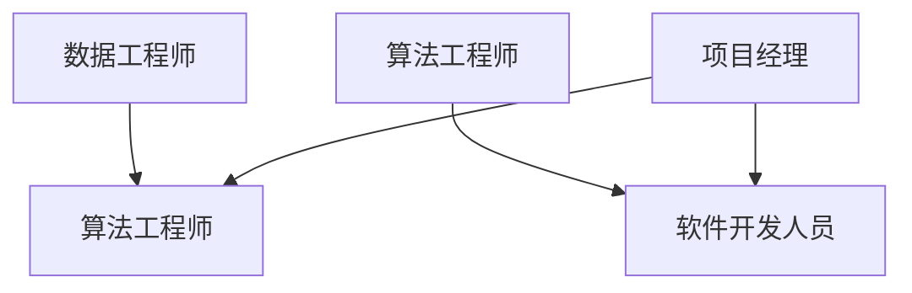
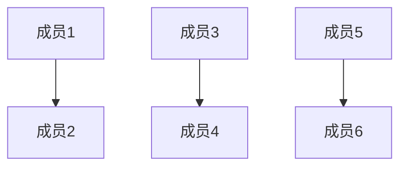
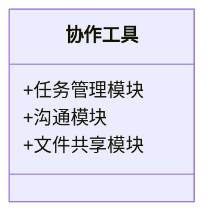

                 


# 组建高效AI开发团队的技巧

> 关键词：AI开发团队，高效协作，团队结构，角色分工，协作机制，项目管理，团队效率

> 摘要：本文将详细探讨如何组建和管理高效的人工智能开发团队。通过分析核心概念、算法原理、数学模型和实际案例，本文旨在为技术管理者提供实用的技巧和策略，帮助他们在复杂的AI开发环境中优化团队效率和协作能力。从团队结构的设计到协作机制的优化，本文将系统性地阐述如何打造一个高效、有序的AI开发团队。

---

## 第1章: AI开发团队的背景与重要性

### 1.1 AI开发团队的基本概念

#### 1.1.1 AI开发团队的定义
AI开发团队是指由数据科学家、算法工程师、软件开发人员和其他相关角色组成的团队，旨在共同完成AI项目的开发、部署和维护。这类团队通常涉及从数据处理、模型训练到模型部署的完整流程。

#### 1.1.2 AI开发团队的核心要素
- **目标明确**：团队需要有清晰的目标和任务，例如开发一个图像识别系统。
- **角色分工**：明确每个成员的职责，如数据工程师负责数据预处理，算法工程师负责模型训练。
- **协作机制**：建立高效的沟通和协作流程，确保团队成员能够高效协同工作。

#### 1.1.3 AI开发团队的分类
根据团队规模和目标的不同，AI开发团队可以分为以下几类：
- **小团队**：通常用于快速原型开发，成员较少，但效率高。
- **中型团队**：适用于中等规模的项目，成员分工明确，协作流程较为规范。
- **大型团队**：用于复杂的大型项目，团队结构层次化，协作机制复杂。

### 1.2 高效AI开发团队的重要性

#### 1.2.1 提升开发效率的关键因素
高效的AI开发团队能够显著缩短开发周期，降低开发成本。通过合理的分工和协作，团队可以避免重复劳动，提高资源利用率。

#### 1.2.2 高效团队对AI项目成功的影响
- **提高产品质量**：高效的团队能够更好地协调和整合各部分的工作，确保最终产品符合需求。
- **加快创新速度**：高效的团队能够更快地迭代和优化模型，推动技术进步。
- **降低项目风险**：通过高效的协作机制，团队能够更好地应对项目中的不确定性，降低失败风险。

#### 1.2.3 团队协作在AI开发中的独特作用
AI开发过程中，数据、算法和工程三者需要高度协同。高效的团队协作能够确保数据科学家、算法工程师和软件开发人员之间的无缝衔接，从而推动项目的顺利进行。

### 1.3 高效AI开发团队的特点

#### 1.3.1 明确的目标与分工
高效的团队通常具有清晰的目标和明确的分工。每个成员都清楚自己的职责，并能够专注于自己的任务，避免资源浪费。

#### 1.3.2 高效的沟通与协作机制
高效的团队具备良好的沟通机制，能够快速传递信息和解决问题。协作机制通常包括定期的会议、任务分配系统和代码审查流程。

#### 1.3.3 持续的学习与优化能力
高效的团队注重持续学习和优化。成员们能够及时学习新技术，优化工作流程，并通过反馈不断改进团队协作效率。

### 1.4 本章小结
本章介绍了AI开发团队的基本概念、高效团队的重要性以及高效团队的特点。通过这些内容，我们可以理解为什么组建高效的AI开发团队是至关重要的，并为后续章节的分析奠定基础。

---

## 第2章: AI开发团队的核心概念与联系

### 2.1 团队结构与角色分工

#### 2.1.1 团队结构的层次化设计
AI开发团队通常分为以下几个层次：
- **管理层**：负责制定战略和分配资源。
- **技术领导层**：负责技术决策和团队管理。
- **执行层**：具体执行任务，包括数据工程师、算法工程师和软件开发人员。

#### 2.1.2 不同角色的职责与权限
- **数据工程师**：负责数据收集、清洗和预处理。
- **算法工程师**：负责模型设计、训练和优化。
- **软件开发人员**：负责系统设计、代码实现和部署。
- **项目经理**：负责项目计划、进度跟踪和风险管理。

#### 2.1.3 角色间的关系与协作机制
各角色之间的协作机制可以通过以下流程图表示：



### 2.2 团队协作机制的原理

#### 2.2.1 协作机制的定义与分类
协作机制是指团队成员之间为完成共同目标而采取的沟通、协调和合作的方式。常见的协作机制包括：
- **同步会议**：定期召开会议，同步项目进展。
- **任务分配**：通过任务管理系统分配任务。
- **代码审查**：通过代码审查确保代码质量。

#### 2.2.2 协作机制的核心要素
- **沟通渠道**：确保信息能够及时传递。
- **任务分配**：明确任务的责任人和完成时间。
- **进度跟踪**：通过项目管理工具跟踪任务进展。

#### 2.2.3 协作机制对团队效率的影响
高效的协作机制能够显著提高团队效率，减少沟通成本，避免资源浪费。以下是协作机制对团队效率的影响：

| 协作机制 | 影响 |
|----------|------|
| 同步会议 | 提高团队对项目的整体理解 |
| 任务分配 | 确保任务分配合理，避免资源浪费 |
| 代码审查 | 提高代码质量，减少后期调试时间 |

### 2.3 团队协作与AI开发的关系

#### 2.3.1 AI开发对协作机制的特殊要求
AI开发涉及数据、算法和工程三者的高度协同，因此协作机制需要特别设计以满足以下要求：
- **数据共享**：确保数据工程师和算法工程师能够高效共享数据。
- **模型迭代**：算法工程师和项目经理需要紧密协作以快速迭代模型。
- **系统集成**：软件开发人员需要与数据工程师和算法工程师协作，确保系统集成顺利进行。

#### 2.3.2 协作机制对AI项目质量的影响
高效的协作机制能够显著提高AI项目的质量，具体表现在以下几个方面：
- **减少沟通误差**：通过明确的协作机制，减少因沟通不畅导致的错误。
- **提高开发效率**：通过高效的协作机制，缩短开发周期。
- **降低维护成本**：通过良好的协作机制，降低后期维护成本。

#### 2.3.3 协作机制的优化与改进
协作机制需要根据项目实际情况不断优化和改进。例如，当发现某些协作机制效率低下时，团队可以尝试引入新的协作工具或流程。

### 2.4 核心概念与联系的总结

#### 2.4.1 核心概念的对比分析
- **团队结构**：决定了团队的分工和协作方式。
- **协作机制**：确保团队成员能够高效协作。
- **项目目标**：指导团队的工作方向和任务分配。

#### 2.4.2 核心概念的联系网络
核心概念之间的联系可以通过以下ER图表示：

```mermaid
erd
a团队结构和协作机制有多种关系：团队结构决定了协作机制的具体形式，协作机制又反作用于团队结构的优化。
```

---

## 第3章: AI开发团队协作机制的算法原理

### 3.1 任务分配算法

#### 3.1.1 任务分配算法的定义
任务分配算法是一种用于将任务分配给团队成员的算法，通常基于任务的优先级、团队成员的技能和当前负载。

#### 3.1.2 任务分配算法的实现步骤
1. **任务排序**：根据任务的优先级对任务进行排序。
2. **团队成员排序**：根据团队成员的技能和当前负载对团队成员进行排序。
3. **任务分配**：将优先级最高的任务分配给最适合的团队成员。

#### 3.1.3 任务分配算法的数学模型
任务分配算法的数学模型可以用以下公式表示：

$$
\text{任务优先级} = \frac{\text{任务权重}}{\text{任务复杂度}}
$$

### 3.2 协作机制的优化算法

#### 3.2.1 协作机制优化算法的定义
协作机制优化算法是一种用于优化团队协作效率的算法，通常基于团队成员的协作历史和当前表现。

#### 3.2.2 协作机制优化算法的实现步骤
1. **数据收集**：收集团队成员的协作数据，如响应时间、任务完成质量。
2. **数据分析**：分析数据以识别协作中的瓶颈和优化点。
3. **协作机制优化**：根据分析结果优化协作机制，如调整任务分配策略。

#### 3.2.3 协作机制优化算法的数学模型
协作机制优化算法的数学模型可以用以下公式表示：

$$
\text{协作效率} = \frac{\text{任务完成数量}}{\text{任务分配时间}}
$$

---

## 第4章: AI开发团队协作机制的数学模型

### 4.1 团队效率的计算公式

#### 4.1.1 团队效率的定义
团队效率是指团队在单位时间内完成的任务数量。

#### 4.1.2 团队效率的计算公式
$$
\text{团队效率} = \frac{\text{任务完成数量}}{\text{时间}}
$$

#### 4.1.3 团队效率的影响因素
- **团队规模**：团队规模越大，潜在效率越高，但管理成本也越高。
- **协作机制**：高效的协作机制能够显著提高团队效率。
- **团队技能**：团队成员的技能水平直接影响任务完成质量。

### 4.2 团队协作中的数学模型

#### 4.2.1 协作网络模型
协作网络模型是一种用于描述团队成员之间协作关系的模型，可以用以下公式表示：

$$
\text{协作网络} = \{ (i, j) | i, j \in \text{团队成员}, i \neq j \}
$$

#### 4.2.2 协作网络的权重计算
协作网络中，边的权重可以用以下公式计算：

$$
\text{边权重} = \frac{\text{协作频率}}{\text{团队规模}}
$$

#### 4.2.3 协作网络的可视化
协作网络可以通过以下图形表示：



---

## 第5章: AI开发团队协作机制的系统分析与架构设计

### 5.1 项目管理工具的选择

#### 5.1.1 项目管理工具的功能需求
- **任务管理**：支持任务创建、分配和跟踪。
- **团队协作**：支持团队成员之间的沟通和协作。
- **进度跟踪**：支持项目进度的实时跟踪。

#### 5.1.2 常见的项目管理工具
- **Jira**：功能强大，适合大型团队。
- **Trello**：简单易用，适合小团队。
- **Asana**：适合中等规模的团队。

### 5.2 协作工具的架构设计

#### 5.2.1 协作工具的功能模块
- **任务管理模块**：支持任务的创建、分配和跟踪。
- **沟通模块**：支持团队成员之间的实时沟通。
- **文件共享模块**：支持文件的共享和协作。

#### 5.2.2 协作工具的架构设计
协作工具的架构设计可以通过以下类图表示：



### 5.3 代码管理工具的选择

#### 5.3.1 代码管理工具的功能需求
- **代码版本控制**：支持代码的版本管理和回滚。
- **代码审查**：支持代码的审查和反馈。
- **代码协作**：支持团队成员之间的代码协作。

#### 5.3.2 常见的代码管理工具
- **Git**：功能强大，支持分布式版本控制。
- **GitHub**：基于Git的代码托管平台，支持团队协作。
- **GitLab**：功能全面，支持CI/CD。

---

## 第6章: AI开发团队协作机制的项目实战

### 6.1 环境安装

#### 6.1.1 安装Python
```bash
# 安装Python
sudo apt-get install python3
```

#### 6.1.2 安装Git
```bash
# 安装Git
sudo apt-get install git
```

#### 6.1.3 安装Jupyter Notebook
```bash
# 安装Jupyter Notebook
pip install jupyter
```

### 6.2 代码实现

#### 6.2.1 任务分配算法的Python实现
```python
def task_assignment(tasks, team_members):
    # 根据任务优先级排序
    tasks.sort(key=lambda x: x['priority'], reverse=True)
    # 根据团队成员技能排序
    team_members.sort(key=lambda x: x['skill'])
    # 任务分配
    for task in tasks:
        for member in team_members:
            if task['skill'] == member['skill']:
                member['tasks'].append(task)
                break
    return team_members
```

#### 6.2.2 协作机制优化算法的Python实现
```python
def collaboration_optimization(collaboration_data):
    # 数据分析
    data = collaboration_data
    # 优化协作机制
    optimized_collaboration = {}
    for member in data:
        optimized_collaboration[member] = data[member] * 0.8
    return optimized_collaboration
```

### 6.3 案例分析

#### 6.3.1 案例背景
假设我们有一个AI开发团队，目标是开发一个图像识别系统。团队成员包括数据工程师、算法工程师和软件开发人员。

#### 6.3.2 案例分析
1. **数据收集与预处理**：数据工程师负责收集和清洗数据。
2. **模型训练与优化**：算法工程师负责模型的设计和优化。
3. **系统集成与部署**：软件开发人员负责系统的集成和部署。

---

## 第7章: 最佳实践与小结

### 7.1 最佳实践

#### 7.1.1 明确角色分工
确保每个团队成员都有明确的职责和权限。

#### 7.1.2 建立高效的协作机制
通过合理的协作机制，确保团队成员能够高效协作。

#### 7.1.3 持续优化团队结构
根据项目进展和团队反馈，不断优化团队结构和协作机制。

### 7.2 小结

#### 7.2.1 核心内容总结
本文详细探讨了如何组建和管理高效的人工智能开发团队。通过分析核心概念、算法原理、数学模型和实际案例，本文为技术管理者提供了实用的技巧和策略。

#### 7.2.2 注意事项
- **避免过度分权**：过度分权可能导致协作效率低下。
- **注重团队文化建设**：良好的团队文化能够提高团队凝聚力和协作效率。
- **及时反馈与调整**：根据项目进展和团队反馈，及时调整团队结构和协作机制。

#### 7.2.3 扩展阅读
- **《敏捷开发》**：了解敏捷开发的理论和实践。
- **《项目管理》**：学习项目管理的理论和方法。
- **《团队协作》**：探索团队协作的技巧和策略。

---

通过以上内容，您可以系统地了解如何组建和管理高效的人工智能开发团队。从团队结构的设计到协作机制的优化，每一步都需要仔细规划和执行。希望本文对您有所帮助！

