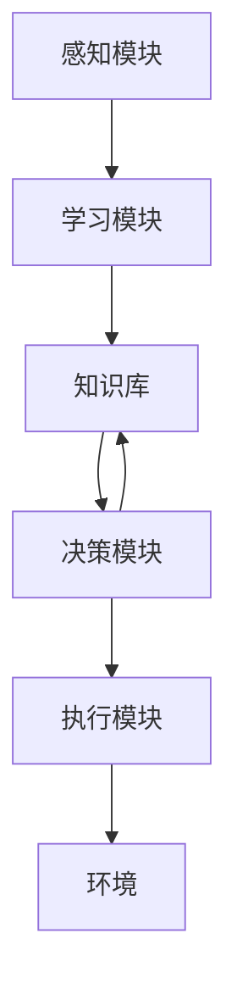
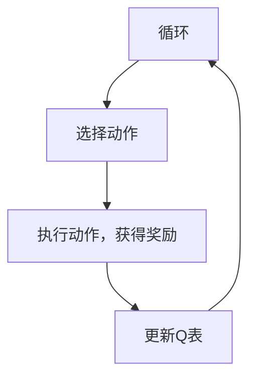
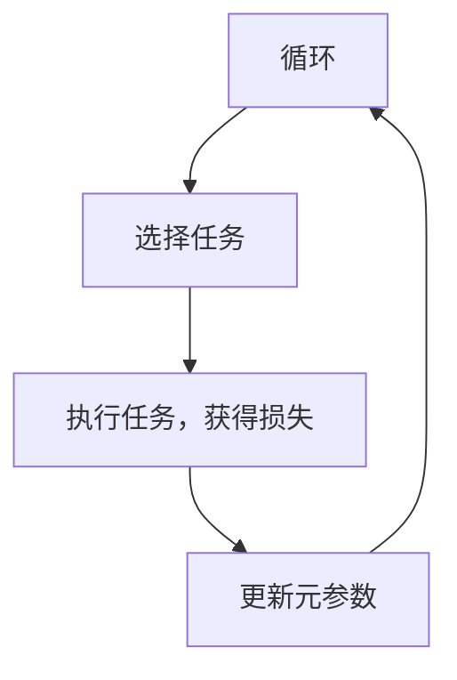
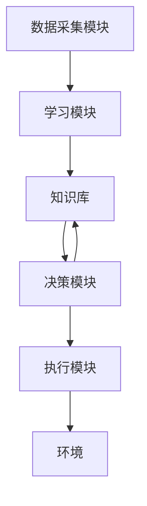

                 


# 终身学习：构建能持续进化的AI Agent

> 关键词：AI Agent, 终身学习, 强化学习, 元学习, 系统架构, 项目实战

> 摘要：本文详细探讨了如何构建一个能够持续进化的AI Agent，重点介绍了终身学习在AI Agent中的应用，包括理论基础、算法原理、系统架构设计以及实际项目案例。通过结合强化学习和元学习算法，我们展示了如何设计一个能够适应动态环境并不断优化自身性能的AI系统。文章还提供了详细的代码实现和系统架构图，帮助读者更好地理解和应用这些技术。

---

# 第一部分: 终身学习与AI Agent的背景与概念

## 第1章: 终身学习与AI Agent概述

### 1.1 AI Agent的基本概念

#### 1.1.1 AI Agent的定义
AI Agent（人工智能代理）是指能够感知环境、自主决策并采取行动的智能体。AI Agent可以是软件程序、机器人或其他智能系统，其核心目标是通过与环境的交互来实现特定任务。

#### 1.1.2 AI Agent的核心特征
- **自主性**：AI Agent能够在没有外部干预的情况下自主运作。
- **反应性**：能够实时感知环境并做出反应。
- **目标导向**：具备明确的目标，并采取行动以实现这些目标。
- **学习能力**：能够通过经验或数据来改进自身的性能。

#### 1.1.3 终身学习在AI Agent中的作用
终身学习使AI Agent能够不断适应新环境、新任务和新数据，从而保持其性能的持续提升。通过终身学习，AI Agent可以在动态环境中实现自我优化和进化。

### 1.2 终身学习的定义与特点

#### 1.2.1 终身学习的定义
终身学习是指AI Agent在运行过程中，能够持续地从新数据和新任务中学习，不断更新自身的知识库和模型，以应对变化的环境。

#### 1.2.2 终身学习的核心特点
- **持续性**：学习过程是持续的，而不是一次性完成的。
- **适应性**：能够根据新环境和新任务调整自身的行为和决策。
- **自我改进**：通过学习不断优化自身的性能和决策能力。

#### 1.2.3 终身学习与传统学习方式的区别
传统的机器学习通常是基于静态数据集进行训练，而终身学习则强调动态学习和持续适应。终身学习能够更好地应对实时变化和不确定性，适用于复杂的现实场景。

### 1.3 终身学习与AI Agent的结合

#### 1.3.1 终身学习在AI Agent中的必要性
在动态和不确定的环境中，AI Agent需要能够快速适应变化，终身学习为其提供了这种能力。通过不断学习新知识，AI Agent可以更好地应对复杂任务和新挑战。

#### 1.3.2 AI Agent实现终身学习的挑战
- **知识遗忘**：在持续学习过程中，旧知识可能被遗忘，影响系统稳定性。
- **计算资源限制**：实时学习需要大量的计算资源，可能对硬件要求较高。
- **数据质量**：新数据的质量可能影响学习效果，需要有效的数据筛选机制。

#### 1.3.3 终身学习AI Agent的应用场景
- **自动驾驶**：实时感知和决策需要AI Agent能够不断学习新路况和驾驶规则。
- **智能助手**：通过与用户的持续交互，智能助手需要不断优化自身的响应和推荐策略。
- **机器人控制**：在复杂环境中，机器人需要通过终身学习来优化其运动和操作策略。

## 第2章: 终身学习AI Agent的核心概念

### 2.1 终身学习AI Agent的理论基础

#### 2.1.1 知识表示与更新机制
知识表示是将AI Agent的知识以某种形式存储和表示的过程。常见的知识表示方法包括符号表示、概率表示和神经网络表示。更新机制则负责根据新数据更新知识库，保持知识的准确性和适用性。

#### 2.1.2 自适应学习策略
自适应学习策略是指AI Agent能够根据当前任务和环境动态调整学习方法和策略。例如，在强化学习中，自适应策略可以根据奖励信号调整动作选择策略。

#### 2.1.3 知识库的构建与管理
知识库是AI Agent存储和管理知识的核心部分。有效的知识库管理需要考虑知识的组织、存储和检索效率。终身学习中，知识库需要能够动态扩展和更新。

### 2.2 终身学习与AI Agent的系统架构

#### 2.2.1 系统模块划分
- **感知模块**：负责感知环境并收集数据。
- **学习模块**：负责对数据进行学习并更新知识库。
- **决策模块**：根据当前知识和环境状态做出决策。
- **执行模块**：根据决策执行具体操作。

#### 2.2.2 各模块之间的关系
感知模块向学习模块提供数据，学习模块更新知识库并将其传递给决策模块。决策模块根据知识库和环境状态做出决策，执行模块将决策转化为具体操作。

#### 2.2.3 系统的整体架构图（Mermaid流程图）


## 第3章: 终身学习AI Agent的算法原理

### 3.1 强化学习算法

#### 3.1.1 强化学习的基本原理
强化学习是一种通过试错机制来学习策略的方法。智能体通过与环境交互，根据获得的奖励信号调整动作，以最大化累计奖励。

#### 3.1.2 Q-learning算法的实现
Q-learning是一种经典的强化学习算法，适用于离散动作空间和状态空间的情况。其核心思想是通过维护一个Q表，记录每个状态-动作对的期望奖励。

##### 3.1.2.1 Q-learning算法的数学模型
$$ Q(s, a) = Q(s, a) + \alpha (r + \gamma \max Q(s', a') - Q(s, a)) $$
其中，$\alpha$是学习率，$\gamma$是折扣因子，$r$是奖励，$s'$是下一个状态。

##### 3.1.2.2 Q-learning算法的流程图（Mermaid）


##### 3.1.2.3 Q-learning算法的Python代码实现
```python
import numpy as np

class QLearning:
    def __init__(self, state_space_size, action_space_size, gamma=0.99, alpha=0.1):
        self.Q = np.zeros((state_space_size, action_space_size))
        self.gamma = gamma
        self.alpha = alpha

    def choose_action(self, state, epsilon=0.1):
        if np.random.random() < epsilon:
            return np.random.randint(0, self.Q.shape[1])
        return np.argmax(self.Q[state, :])

    def update_Q(self, state, action, reward, next_state):
        self.Q[state, action] = self.Q[state, action] + self.alpha * (reward + self.gamma * np.max(self.Q[next_state, :]) - self.Q[state, action])
```

#### 3.1.3 强化学习算法的数学模型和公式
强化学习的核心是通过最大化累计奖励来优化策略。其数学模型涉及状态、动作、奖励和策略空间，通过动态规划和近似方法来解决复杂的决策问题。

### 3.2 元学习算法

#### 3.2.1 元学习的定义与特点
元学习是一种学习如何学习的方法，旨在通过在多个任务上的经验，快速适应新任务。与传统学习不同，元学习强调跨任务的知识迁移和快速适应能力。

#### 3.2.2 Meta-LSTM算法的实现
Meta-LSTM是一种基于循环神经网络的元学习算法，适用于序列任务的快速适应。其核心思想是通过元参数的优化，使得模型能够快速调整以适应新任务。

##### 3.2.2.1 Meta-LSTM算法的数学模型
$$ \theta_{t+1} = \theta_t + \alpha \nabla_{\theta_t} J(\theta_t, x_t, y_t) $$
其中，$\theta$是模型参数，$\alpha$是学习率，$J$是损失函数。

##### 3.2.2.2 Meta-LSTM算法的流程图（Mermaid）


##### 3.2.2.3 Meta-LSTM算法的Python代码实现
```python
import torch
import torch.nn as nn

class MetaLSTM(nn.Module):
    def __init__(self, input_size, hidden_size, output_size):
        super(MetaLSTM, self).__init__()
        self.lstm = nn.LSTM(input_size, hidden_size, batch_first=True)
        self.fc = nn.Linear(hidden_size, output_size)

    def forward(self, x, hidden=None):
        out, hidden = self.lstm(x, hidden)
        out = self.fc(out[:, -1, :])
        return out, hidden

    def meta_update(self, loss, params=None):
        if params is None:
            params = list(self.parameters())
        grads = torch.autograd.grad(loss, params)
        with torch.no_grad():
            for p, g in zip(params, grads):
                p -= 0.1 * g  # 假设学习率为0.1
        return params
```

## 第4章: 终身学习AI Agent的系统分析与架构设计

### 4.1 问题场景介绍

#### 4.1.1 终身学习AI Agent的应用场景
在智能客服、自动驾驶、智能推荐等领域，终身学习AI Agent能够通过持续学习不断优化性能，适应用户需求和环境变化。

#### 4.1.2 系统需要解决的核心问题
- 如何高效地收集和处理环境数据。
- 如何设计有效的学习算法和策略。
- 如何实现知识的动态更新和管理。

#### 4.1.3 系统的目标与约束条件
系统的目标是设计一个能够持续学习和适应的AI Agent，约束条件包括计算资源限制、数据隐私保护和系统稳定性。

### 4.2 系统功能设计

#### 4.2.1 系统功能模块划分
- **数据采集模块**：负责收集环境数据。
- **学习模块**：负责数据的预处理和学习。
- **决策模块**：根据学习结果做出决策。
- **执行模块**：执行具体的任务。

#### 4.2.2 各功能模块的交互关系
数据采集模块向学习模块提供数据，学习模块更新知识库并将其传递给决策模块，决策模块根据知识库和环境状态做出决策，执行模块将决策转化为具体操作。

#### 4.2.3 系统的功能类图（Mermaid）


### 4.3 系统架构设计

#### 4.3.1 系统架构图（Mermaid）


#### 4.3.2 系统接口设计
- 数据采集模块接口：提供环境数据的采集和传输。
- 学习模块接口：负责数据的预处理和学习算法的实现。
- 决策模块接口：根据知识库和环境状态做出决策。
- 执行模块接口：将决策转化为具体操作。

#### 4.3.3 系统交互流程图（Mermaid）


## 第5章: 终身学习AI Agent的项目实战

### 5.1 环境安装与配置

#### 5.1.1 安装Python环境
使用Anaconda或virtualenv创建独立的Python环境，推荐Python版本3.6及以上。

#### 5.1.2 安装依赖库
安装所需的第三方库，例如numpy、torch、matplotlib等。

#### 5.1.3 配置开发环境
配置IDE（如PyCharm、VS Code）并确保其能够识别当前Python环境。

### 5.2 系统核心实现

#### 5.2.1 数据采集模块实现
实现从传感器、数据库或其他数据源采集数据的功能。

#### 5.2.2 学习模块实现
实现强化学习和元学习算法的核心功能，包括Q-learning和Meta-LSTM算法的实现。

#### 5.2.3 决策模块实现
根据学习结果和环境状态做出决策，例如在自动驾驶中选择转向或加速。

#### 5.2.4 执行模块实现
将决策转化为具体操作，例如控制机器人移动或调整系统参数。

### 5.3 代码实现与解读

#### 5.3.1 Q-learning算法实现
```python
import numpy as np

class QLearning:
    def __init__(self, state_space_size, action_space_size, gamma=0.99, alpha=0.1):
        self.Q = np.zeros((state_space_size, action_space_size))
        self.gamma = gamma
        self.alpha = alpha

    def choose_action(self, state, epsilon=0.1):
        if np.random.random() < epsilon:
            return np.random.randint(0, self.Q.shape[1])
        return np.argmax(self.Q[state, :])

    def update_Q(self, state, action, reward, next_state):
        self.Q[state, action] = self.Q[state, action] + self.alpha * (reward + self.gamma * np.max(self.Q[next_state, :]) - self.Q[state, action])
```

#### 5.3.2 Meta-LSTM算法实现
```python
import torch
import torch.nn as nn

class MetaLSTM(nn.Module):
    def __init__(self, input_size, hidden_size, output_size):
        super(MetaLSTM, self).__init__()
        self.lstm = nn.LSTM(input_size, hidden_size, batch_first=True)
        self.fc = nn.Linear(hidden_size, output_size)

    def forward(self, x, hidden=None):
        out, hidden = self.lstm(x, hidden)
        out = self.fc(out[:, -1, :])
        return out, hidden

    def meta_update(self, loss, params=None):
        if params is None:
            params = list(self.parameters())
        grads = torch.autograd.grad(loss, params)
        with torch.no_grad():
            for p, g in zip(params, grads):
                p -= 0.1 * g
        return params
```

### 5.4 案例分析与详细讲解

#### 5.4.1 案例分析
以自动驾驶为例，展示如何通过Q-learning和Meta-LSTM算法实现路径规划和避障。

#### 5.4.2 详细讲解
通过具体案例，详细解释系统各模块的功能实现和交互流程。

### 5.5 项目小结

#### 5.5.1 项目总结
总结项目的实现过程和主要成果，强调终身学习在AI Agent中的重要性。

#### 5.5.2 经验与教训
分享项目实施过程中的经验和教训，为后续项目提供参考。

---

# 第六章: 终身学习AI Agent的总结与展望

## 6.1 总结

### 6.1.1 终身学习AI Agent的核心思想
通过持续学习和自适应策略，AI Agent能够不断优化自身性能，适应复杂环境。

### 6.1.2 本文的主要贡献
本文详细探讨了终身学习在AI Agent中的应用，提出了基于强化学习和元学习的实现方法，并提供了具体的代码实现和系统架构设计。

## 6.2 展望

### 6.2.1 未来研究方向
- 更高效的终身学习算法。
- 更强大的知识表示与更新机制。
- 更广泛的应用场景探索。

### 6.2.2 技术发展趋势
随着AI技术的不断发展，终身学习AI Agent将在更多领域得到应用，推动人工智能技术的进一步发展。

---

## 总结

本文通过理论分析、算法实现和项目实践，详细探讨了如何构建一个能够持续进化的AI Agent。通过结合强化学习和元学习算法，我们展示了如何设计一个能够适应动态环境并不断优化自身性能的AI系统。未来，随着技术的不断进步，终身学习AI Agent将在更多领域发挥重要作用。

