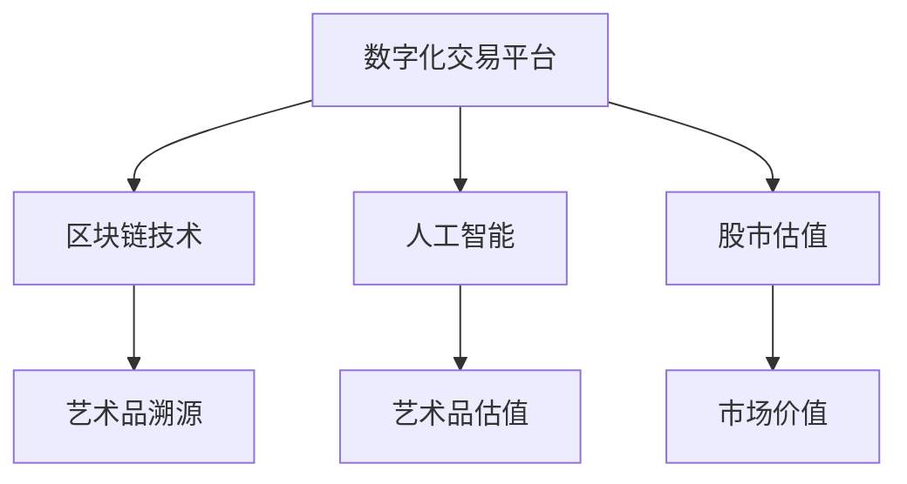
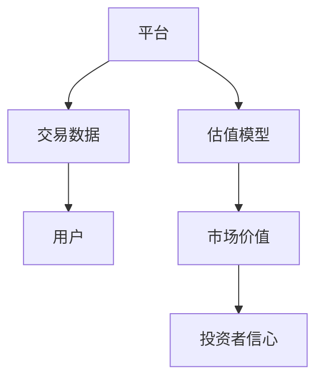
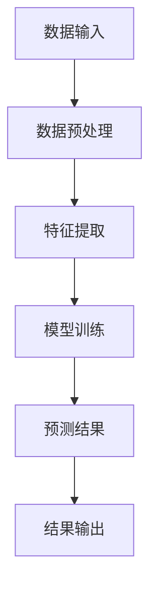
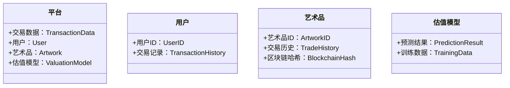
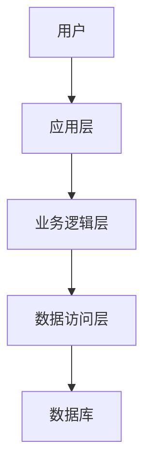
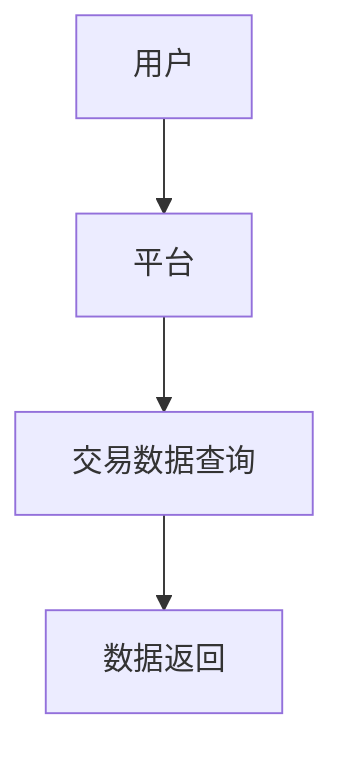

                 


---

# 股市估值对国际艺术品数字化交易平台的影响

**关键词：数字化转型，艺术品市场，股市估值，区块链技术，人工智能，风险管理**

**摘要**：随着数字化转型的推进，艺术品市场与金融市场的结合日益紧密。本文探讨股市估值如何影响国际艺术品数字化交易平台，分析其背后的算法原理、系统架构和实际应用案例。通过数学模型和系统设计，揭示数字化平台如何利用区块链技术和人工智能优化交易流程，降低风险，提升市场透明度。同时，本文提出构建一个基于机器学习和时间序列分析的预测模型，帮助平台实现精准估值，为投资者和艺术品交易者提供可靠的数据支持。

---

## 第1章 背景介绍

### 1.1 问题背景

#### 1.1.1 数字化转型与艺术品市场的结合  
随着区块链技术和人工智能的快速发展，艺术品市场正在经历一场数字化革命。传统艺术品交易依赖于拍卖行和画廊，效率低下且透明度不足。数字化交易平台的出现，不仅提高了交易效率，还通过区块链技术实现了艺术品的溯源和确权，为市场注入了新的活力。

#### 1.1.2 股市估值的定义与作用  
股市估值是指通过对公司财务数据和市场表现的分析，确定其股票的合理价格。在艺术品数字化交易平台中，股市估值的作用类似于传统股市，用于评估平台的市场价值和投资吸引力。

#### 1.1.3 数字化交易平台的兴起  
数字化交易平台通过在线拍卖、区块链溯源和智能合约等技术，降低了交易成本，提高了交易效率。这些平台的兴起，为艺术品市场带来了前所未有的发展机遇。

### 1.2 问题描述

#### 1.2.1 股市估值对数字化交易平台的影响  
股市估值直接影响投资者对平台的信心和投资意愿。高估值意味着平台具有较高的市场价值，吸引更多投资者参与，从而推动平台的进一步发展。

#### 1.2.2 数字化交易平台对艺术品市场的重塑  
数字化交易平台通过提高透明度和效率，重构了传统艺术品市场的交易流程。区块链技术的应用，确保了艺术品的溯源和确权，降低了赝品风险。

#### 1.2.3 股市估值与数字化交易平台的相互作用  
数字化交易平台的出现，不仅改变了艺术品交易的方式，还为股市估值提供了新的参考指标。例如，平台的交易数据可以作为评估其市场价值的重要依据。

### 1.3 问题解决

#### 1.3.1 数字化交易平台的构建目标  
构建一个高效、透明、安全的艺术品数字化交易平台，通过技术创新提升交易效率和市场信任度。

#### 1.3.2 股市估值对平台价值的影响  
通过分析平台的交易数据和财务指标，评估其市场价值，为投资者提供参考。

#### 1.3.3 平台如何影响股市估值  
平台的交易量、用户活跃度和技术创新能力等指标，都会影响其市场估值，进而影响股市的整体表现。

### 1.4 边界与外延

#### 1.4.1 数字化交易平台的边界  
平台主要关注艺术品的在线交易和区块链溯源，不涉及传统拍卖行的线下活动。

#### 1.4.2 股市估值的外延  
股市估值不仅包括平台本身的市场价值，还包括其对整个艺术品市场的影响力。

#### 1.4.3 平台与股市的相互作用范围  
平台通过提供交易数据和技术创新，影响股市估值；股市估值则反过来影响平台的市场表现和投资者信心。

### 1.5 核心要素与概念结构

#### 1.5.1 核心要素组成  
1. 区块链技术：用于艺术品溯源和确权。  
2. 人工智能：用于艺术品估值和市场预测。  
3. 数字化交易平台：提供在线交易服务。  
4. 股市估值：评估平台的市场价值。  

#### 1.5.2 概念结构图  
以下是核心要素的概念结构图：



---

## 第2章 核心概念与联系

### 2.1 核心概念原理

#### 2.1.1 股市估值的核心原理  
股市估值基于公司基本面和市场情绪的分析。在数字化交易平台中，基本面包括平台的交易量、用户活跃度和财务状况，市场情绪则反映投资者对平台的信心。

#### 2.1.2 数字化交易平台的运作机制  
平台通过在线拍卖、区块链溯源和智能合约实现艺术品的高效交易和确权。人工智能技术用于艺术品的自动估值和市场预测。

#### 2.1.3 两者结合的数学模型  
将平台的交易数据与市场估值模型结合，构建一个预测平台未来市场表现的数学模型。

### 2.2 核心概念属性特征对比

以下表格对比了数字化交易平台和股市估值的核心属性：

| 属性               | 数字化交易平台       | 股市估值         |
|--------------------|--------------------|-----------------|
| 核心功能           | 提供在线交易服务     | 评估市场价值     |
| 技术基础           | 区块链、人工智能     | 财务分析、市场情绪分析 |
| 影响因素           | 交易量、用户活跃度   | 财务指标、市场情绪 |
| 输出结果           | 交易成功、艺术品确权 | 股票价格预测     |

### 2.3 ER实体关系图

以下是数字化交易平台和股市估值的ER实体关系图：



---

## 第3章 算法原理与实现

### 3.1 算法原理

#### 3.1.1 机器学习算法在估值中的应用  
使用回归分析预测平台的市场价值。通过收集平台的交易数据和财务指标，训练一个线性回归模型，预测其未来市场表现。

#### 3.1.2 时间序列分析  
通过分析平台的历史交易数据，识别其价格趋势和周期性波动，为市场估值提供参考。

#### 3.1.3 聚类算法在交易数据中的应用  
将平台的交易数据进行聚类分析，识别高价值艺术品和低价值艺术品的交易模式，优化交易策略。

### 3.2 算法流程图

以下是机器学习算法的流程图：



### 3.3 数学模型与公式

#### 3.3.1 线性回归模型  
线性回归模型用于预测平台的市场价值。公式如下：

$$
y = \beta_0 + \beta_1x_1 + \beta_2x_2 + \ldots + \beta_nx_n + \epsilon
$$

其中，$y$ 是平台的市场价值，$x_i$ 是各个自变量（如交易量、用户活跃度），$\beta_i$ 是回归系数，$\epsilon$ 是误差项。

#### 3.3.2 时间序列模型  
使用ARIMA模型分析平台的历史交易数据，预测其未来走势：

$$
\Delta y_t = \phi_1\Delta y_{t-1} + \theta_1\epsilon_{t-1} + \epsilon_t
$$

其中，$\Delta y_t$ 是差分序列，$\phi_1$ 是自回归系数，$\theta_1$ 是移动平均系数，$\epsilon_t$ 是白噪声。

---

## 第4章 系统分析与架构设计

### 4.1 问题场景介绍

#### 4.1.1 平台功能需求  
平台需要支持在线拍卖、区块链溯源和智能合约等功能。  

#### 4.1.2 交易数据管理  
需要高效管理艺术品的交易数据，并支持实时查询和分析。

### 4.2 系统功能设计

以下是系统功能的领域模型图：



### 4.3 系统架构设计

以下是系统的分层架构图：



### 4.4 系统接口设计

以下是系统接口的交互流程图：



---

## 第5章 项目实战

### 5.1 环境安装

#### 5.1.1 安装Python和相关库  
安装Python 3.8以上版本，并安装以下库：  
- `pandas`：数据处理  
- `scikit-learn`：机器学习算法  
- `mermaid`：图表生成  

#### 5.1.2 安装区块链框架  
安装以太坊的Python库`web3.py`，用于与区块链交互。

### 5.2 核心代码实现

#### 5.2.1 数据预处理代码  
```python
import pandas as pd

# 读取交易数据
data = pd.read_csv('transaction_data.csv')

# 数据清洗
data.dropna(inplace=True)
data = pd.get_dummies(data)
```

#### 5.2.2 机器学习模型训练  
```python
from sklearn.linear_model import LinearRegression

# 初始化模型
model = LinearRegression()

# 训练模型
model.fit(X_train, y_train)

# 预测结果
y_pred = model.predict(X_test)
```

#### 5.2.3 区块链交互代码  
```python
from web3 import Web3

# 连接以太坊节点
w3 = Web3(Web3.HTTPProvider('https://eth-mainnet.g.alchemy.com/v2/your_api_key'))

# 获取区块链数据
block_info = w3.eth.getBlock(block_number)
```

### 5.3 项目小结

通过以上代码实现，我们构建了一个基于机器学习和区块链技术的艺术品数字化交易平台。该平台能够高效处理交易数据，准确预测市场价值，为投资者和交易者提供可靠的数据支持。

---

## 第6章 最佳实践

### 6.1 小结

本文详细探讨了股市估值对国际艺术品数字化交易平台的影响，通过数学模型和系统设计，揭示了数字化平台如何利用技术创新优化交易流程，提升市场透明度。

### 6.2 注意事项

1. 数据隐私保护：确保用户数据和交易数据的安全性。  
2. 技术创新：持续优化算法，提升平台的交易效率和市场价值。  
3. 风险管理：建立完善的风险控制机制，降低市场波动对平台的影响。

### 6.3 拓展阅读

1. 区块链技术在艺术品市场的应用。  
2. 人工智能在金融市场的预测模型。  
3. 数字化转型对传统行业的颠覆性影响。

---

# 结语

数字化转型正在重塑艺术品市场，股市估值对国际艺术品数字化交易平台的影响日益显著。通过技术创新和系统优化，我们可以构建一个高效、透明、安全的艺术品交易平台，为市场参与者创造更大的价值。未来，随着技术的进一步发展，数字化交易平台将在艺术品市场中发挥越来越重要的作用。

