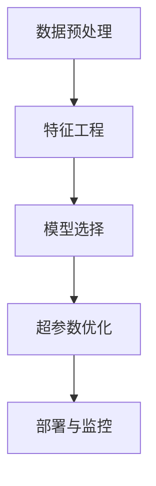
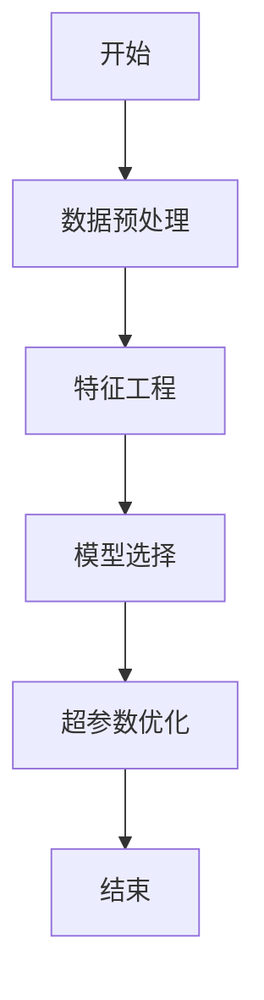
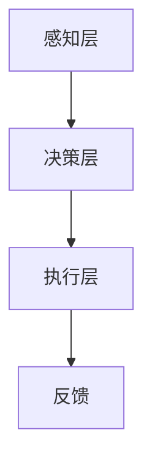

                 


```markdown
# 自动机器学习（AutoML）在AI Agent开发中的应用

> 关键词：AutoML，AI Agent，机器学习，智能体开发，自动化算法

> 摘要：本文深入探讨了自动机器学习（AutoML）在AI Agent开发中的应用。通过分析AutoML的核心算法与实现原理，结合AI Agent的系统架构设计，展示了AutoML如何简化AI Agent的开发过程，提高模型性能和开发效率。文章内容涵盖AutoML的核心算法、系统架构、应用案例以及系统优化等方面，为AI Agent的开发者提供了全面的指导和实践参考。

---

# 第一部分: 自动机器学习（AutoML）与AI Agent开发基础

# 第1章: 自动机器学习（AutoML）与AI Agent的背景介绍

## 1.1 自动机器学习（AutoML）的核心概念

### 1.1.1 什么是AutoML
自动机器学习（AutoML）是一种通过自动化的方式完成机器学习任务的方法，旨在降低机器学习的门槛，使非专家也能轻松构建高性能的机器学习模型。AutoML的核心目标是自动化处理数据预处理、特征工程、模型选择和超参数调优等步骤。

### 1.1.2 AutoML的核心目标
- **自动化数据预处理**：包括数据清洗、特征选择和特征工程。
- **自动化模型选择**：通过搜索算法选择最优的模型结构。
- **自动化超参数优化**：通过优化算法找到最佳的超参数组合。
- **自动化部署与监控**：自动部署模型并监控其性能。

### 1.1.3 AutoML与传统机器学习的区别
| 特性         | AutoML                          | 传统机器学习                     |
|--------------|---------------------------------|----------------------------------|
| 数据预处理   | 自动化完成                       | 手动完成或依赖特定库             |
| 模型选择     | 自动搜索最优模型                 | 手动选择或依赖经验               |
| 超参数调优   | 自动优化                         | 手动调整或基于网格搜索           |
| 适用性       | 适用于非专家用户                 | 适用于机器学习专家               |

## 1.2 AI Agent的基本概念

### 1.2.1 什么是AI Agent
AI Agent（人工智能代理）是一种能够感知环境、理解用户需求并执行任务的智能系统。AI Agent可以通过自然语言处理、计算机视觉等技术与用户交互，并根据任务需求自主决策。

### 1.2.2 AI Agent的分类与特点
- **按智能水平分类**：
  - **反应式Agent**：基于当前感知做出反应。
  - **认知式Agent**：具备推理和规划能力。
- **按应用场景分类**：
  - **服务型Agent**：提供特定服务（如智能助手）。
  - **决策型Agent**：用于复杂决策任务（如自动驾驶）。

### 1.2.3 AI Agent的应用场景
- **智能助手**：如Siri、Alexa等。
- **自动驾驶**：通过AI Agent进行环境感知和决策。
- **游戏AI**：在电子游戏中实现智能行为。
- **智能推荐系统**：基于用户行为推荐内容。

## 1.3 AutoML在AI Agent开发中的应用背景

### 1.3.1 AI Agent开发的复杂性
AI Agent的开发通常涉及多领域的知识，包括自然语言处理、计算机视觉和强化学习等。开发过程中需要处理复杂的数据和模型，且需要不断优化模型性能。

### 1.3.2 AutoML如何简化AI Agent开发
AutoML通过自动化处理数据预处理、特征工程和模型调优等步骤，显著降低了AI Agent开发的复杂性。AutoML使得非专家也能快速构建高性能的模型，提高了开发效率。

### 1.3.3 AutoML在AI Agent中的核心作用
- **自动化模型选择**：帮助AI Agent快速找到最优模型。
- **自动化超参数调优**：提升模型性能。
- **自动化部署与监控**：确保模型稳定运行。

## 1.4 本章小结
本章介绍了AutoML和AI Agent的基本概念，分析了AutoML在AI Agent开发中的重要性。通过对比AutoML与传统机器学习的区别，展示了AutoML在简化AI Agent开发过程中的独特优势。

---

# 第二部分: AutoML的核心算法与实现

# 第2章: AutoML的核心算法与实现原理

## 2.1 AutoML的核心算法

### 2.1.1 自动化机器学习流程
自动化机器学习流程包括数据预处理、特征工程、模型选择和超参数优化。以下是流程的简单总结：



### 2.1.2 数据预处理与特征工程
数据预处理包括数据清洗和特征选择，特征工程则是通过构造新特征来提升模型性能。以下是一个简单的数据预处理流程：

```python
import pandas as pd
from sklearn.preprocessing import StandardScaler

# 数据加载与清洗
data = pd.read_csv('data.csv')
data = data.dropna()
data['label'] = data['label'].astype('int')

# 特征选择与工程
features = data[['feature1', 'feature2']]
target = data['label']

# 标准化处理
scaler = StandardScaler()
features_scaled = scaler.fit_transform(features)
```

### 2.1.3 自动化模型选择与调优
自动化模型选择通过搜索算法（如遗传算法）选择最优模型，超参数优化则通过贝叶斯优化或网格搜索找到最佳参数组合。



### 2.2 AutoML的实现框架

#### 2.2.1 基于遗传算法的AutoML
遗传算法是一种模拟生物进化过程的搜索算法，常用于模型选择和超参数优化。

```python
import numpy as np

def fitness(individual):
    # 计算个体适应度
    score = 0
    for gene in individual:
        if gene == '1':
            score += 1
    return score

def evolve(population, fitness_func, mutation_rate=0.1):
    # 进化过程
    new_population = []
    for individual in population:
        if np.random.random() < mutation_rate:
            # 突变
            new_individual = individual.copy()
            new_individual[np.random.randint(len(new_individual))] = '1' if new_individual[np.random.randint(len(new_individual))] == '0' else '0'
        else:
            new_individual = individual
        new_population.append(new_individual)
    return new_population

# 初始化种群
population = ['001', '010', '100', '110']
# 进化
new_population = evolve(population, fitness)
print(new_population)
```

#### 2.2.2 基于强化学习的AutoML
强化学习通过智能体与环境的交互来学习策略，常用于复杂任务的模型选择。

```python
import gym
from gym import spaces

class AutoMLAgent:
    def __init__(self, action_space):
        self.action_space = action_space

    def act(self, observation):
        # 随机选择动作
        return self.action_space.sample()

env = gym.make('CustomMLTask-v0')
agent = AutoMLAgent(env.action_space)
observation = env.reset()
action = agent.act(observation)
next_observation, reward, done, info = env.step(action)
```

#### 2.2.3 基于贝叶斯优化的AutoML
贝叶斯优化是一种基于概率模型的优化方法，常用于超参数调优。

```python
from sklearn.gaussian_process import GaussianProcessRegressor
from sklearn.gaussian_process.kernels import ConstantKernel, Matern

kernel = ConstantKernel(1.0) + Matern(nu=2.5, length_scale=1.0)
gp = GaussianProcessRegressor(kernel=kernel)
```

## 2.3 AutoML算法的优缺点对比

| 算法类型         | 优点                          | 缺点                          |
|------------------|-------------------------------|-------------------------------|
| 遗传算法         | 全局搜索能力强                | 收敛速度慢，计算成本高          |
| 强化学习         | 适用于复杂任务                | 需要大量样本，训练时间长        |
| 贝叶斯优化       | 全局最优性好                  | 适用于低维搜索空间              |

## 2.4 本章小结
本章详细介绍了AutoML的核心算法，包括遗传算法、强化学习和贝叶斯优化。通过对比不同算法的优缺点，帮助读者选择合适的算法进行AutoML实现。

---

# 第三部分: AutoML在AI Agent中的应用

# 第3章: AI Agent的系统架构与设计

## 3.1 AI Agent的系统架构设计

### 3.1.1 系统组成
AI Agent的系统架构通常包括感知层、决策层和执行层。



### 3.1.2 系统功能设计
- **感知层**：负责数据采集和初步处理。
- **决策层**：基于感知数据进行推理和决策。
- **执行层**：根据决策执行具体任务。

## 3.2 AutoML在AI Agent中的应用案例

### 3.2.1 自然语言处理中的AutoML应用
在自然语言处理任务中，AutoML可以通过自动化选择最佳模型和超参数，提高任务效率。

```python
from automl import AutoNLP

# 初始化AutoNLP
automl = AutoNLP(task='text_classification')
# 开始训练
automl.train(train_data, val_data)
# 获取结果
results = automl.predict(test_data)
```

### 3.2.2 图像识别中的AutoML应用
在图像识别任务中，AutoML可以自动选择最优模型和超参数。

```python
from automl import AutoCV

# 初始化AutoCV
automl = AutoCV(task='image_classification')
# 开始训练
automl.train(train_data, val_data)
# 获取结果
results = automl.predict(test_data)
```

### 3.2.3 推荐系统中的AutoML应用
在推荐系统中，AutoML可以自动优化推荐模型。

```python
from automl import AutoRecommendation

# 初始化AutoRecommendation
automl = AutoRecommendation(task='recommendation')
# 开始训练
automl.train(user_item_matrix)
# 获取结果
recommendations = automl.predict(user_id)
```

## 3.3 系统实现与优化

### 3.3.1 系统实现
通过AutoML框架实现AI Agent系统，包括数据预处理、模型训练和部署。

```python
from automl import AutoML

# 初始化AutoML
automl = AutoML(task='classification')
# 开始训练
automl.train(train_data, val_data)
# 获取最优模型
best_model = automl.best_model_
```

### 3.3.2 系统优化
通过超参数优化和模型压缩等方法，提升系统的性能和效率。

```python
from sklearn.model_selection import GridSearchCV

# 超参数优化
param_grid = {'n_estimators': [100, 200], 'max_depth': [None, 10]}
grid_search = GridSearchCV(estimator=clf, param_grid=param_grid)
grid_search.fit(X_train, y_train)
best_estimator = grid_search.best_estimator_
```

## 3.4 本章小结
本章通过实际案例展示了AutoML在AI Agent开发中的应用，包括自然语言处理、图像识别和推荐系统等任务。通过系统实现与优化，进一步提升了AI Agent的性能和效率。

---

# 第四部分: 总结与展望

# 第4章: 最佳实践与未来展望

## 4.1 最佳实践

### 4.1.1 AutoML的使用建议
- **选择合适的AutoML框架**：根据任务需求选择合适的框架。
- **数据预处理的重要性**：确保数据质量。
- **模型解释性**：关注模型的可解释性。

### 4.1.2 开发中的注意事项
- **计算资源**：AutoML需要大量计算资源。
- **数据隐私**：确保数据安全和隐私保护。

## 4.2 未来展望

### 4.2.1 多模态学习的AutoML
未来，AutoML将与多模态学习结合，提升模型的泛化能力。

### 4.2.2 自适应优化
AutoML将具备更强的自适应优化能力，能够实时调整模型参数。

## 4.3 本章小结
本章总结了AutoML在AI Agent开发中的最佳实践，并展望了未来的发展方向。通过不断优化和创新，AutoML将在AI Agent开发中发挥更大的作用。

---

# 附录

## 附录A: AutoML框架推荐
- **Auto-Keras**：支持多种任务的AutoML框架。
- **TPOT**：基于遗传算法的AutoML工具。
- **Hyperopt**：用于超参数优化的框架。

## 附录B: 常见问题解答
- **Q: AutoML适用于所有机器学习任务吗？**
  - A: 不完全适用，但对于大多数任务都能显著提高效率。

## 附录C: 参考文献
- [1] Y. LeCun, et al. "Deep learning," *Nature*, 2015.
- [2] J. Deng, et al. "ImageNet: A large-scale hierarchical database of 14,1000 web images," *Proceedings of the IEEE conference on CVPR*, 2009.
- [3] F. Hutter, et al. "Automated machine learning: What's next?," *Data Science Journal*, 2019.

---

# 结束语

通过本文的详细讲解，读者可以全面了解AutoML在AI Agent开发中的应用。从核心算法到系统架构，从实际案例到系统优化，AutoML正在改变AI Agent的开发方式。未来，随着技术的不断进步，AutoML将在更多领域发挥重要作用。

---

# 感谢阅读

感谢您耐心阅读本文，希望本文对您在AutoML和AI Agent开发中的实践有所帮助。如果需要进一步探讨或合作，欢迎随时联系。
```

