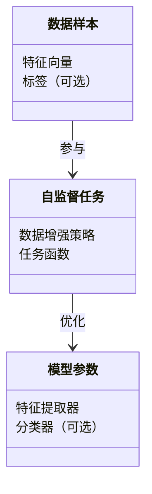
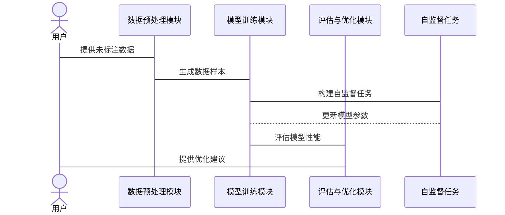

                 


# 自监督学习：减少AI Agent的标注数据依赖

> 关键词：自监督学习, AI Agent, 标注数据, 对比学习, 生成式模型, 系统架构, 项目实战

> 摘要：  
在当前的人工智能领域，标注数据的获取成本高昂且耗时，严重制约了AI Agent的发展。自监督学习作为一种创新的机器学习范式，通过利用未标注数据构建自监督任务，有效降低了对标注数据的依赖。本文系统地探讨了自监督学习的核心概念、算法原理、系统架构，并通过实际项目案例展示了其在减少标注数据依赖方面的应用。文章最后总结了自监督学习的关键优势与未来发展方向。

---

# 第一部分: 自监督学习的背景与核心概念

## 第1章: 自监督学习的背景与问题描述

### 1.1 自监督学习的起源与发展
#### 1.1.1 自监督学习的起源
- 自监督学习的概念与历史背景
- 自监督学习与监督学习的对比
- 自监督学习的核心思想：利用未标注数据构建任务

#### 1.1.2 自监督学习的核心思想
- 数据驱动的特征学习
- 自监督任务的设计原则

#### 1.1.3 自监督学习与监督学习的对比
- 数据标注成本的差异
- 模型泛化的优劣对比

### 1.2 AI Agent与标注数据的依赖问题
#### 1.2.1 AI Agent的核心任务
- 数据驱动的任务执行
- 对标注数据的依赖性

#### 1.2.2 标注数据的局限性
- 数据获取成本高
- 标注资源的稀缺性
- 标注数据的主观性问题

#### 1.2.3 减少标注数据依赖的必要性
- 提高模型的泛化能力
- 降低AI Agent的开发成本
- 扩大AI Agent的应用场景

### 1.3 自监督学习的目标与应用场景
#### 1.3.1 自监督学习的目标
- 学习数据的内在特征
- 减少标注数据的依赖

#### 1.3.2 自监督学习的主要应用场景
- 图像识别
- 自然语言处理
- 强化学习中的应用

#### 1.3.3 自监督学习的边界与外延
- 适用场景与限制
- 与其他无监督学习方法的对比

### 1.4 本章小结
- 总结自监督学习的核心思想与目标
- 强调减少标注数据依赖的重要性

---

# 第二部分: 自监督学习的核心概念与原理

## 第2章: 自监督学习的核心概念

### 2.1 自监督学习的定义与核心要素
#### 2.1.1 自监督学习的定义
- 数据驱动的无监督学习范式
- 自监督任务的设计

#### 2.1.2 自监督学习的核心要素
- 数据样本
- 自监督任务
- 模型参数

#### 2.1.3 自监督学习的属性特征对比
| 特性 | 监督学习 | 自监督学习 |
|------|----------|------------|
| 数据需求 | 需要标注数据 | 利用未标注数据构建任务 |
| 模型泛化能力 | 依赖标注质量 | 更强的泛化能力 |
| 数据利用效率 | 较低 | 较高 |

### 2.2 自监督学习的原理与机制
#### 2.2.1 自监督任务的构建
- 对比学习
- 排序任务
- 分类任务

#### 2.2.2 数据样本与自监督任务的关系
- 数据样本作为输入
- 自监督任务指导特征学习

#### 2.2.3 模型参数与自监督任务的优化
- 模型参数的更新
- 自监督任务的优化目标

### 2.3 自监督学习的ER实体关系图
```mermaid
er-diagram
  actor: 数据样本
  task: 自监督任务
  model: 模型参数
  relation: 属于
  actor --> task: 参与
  task --> model: 优化
```

### 2.4 本章小结
- 总结自监督学习的核心概念
- 强调数据样本、自监督任务和模型参数之间的关系

---

# 第三部分: 自监督学习的算法原理与数学模型

## 第3章: 自监督学习的算法原理

### 3.1 对比学习算法
#### 3.1.1 对比学习的基本思想
- 对比学习的目标函数
- 常见的对比学习方法

#### 3.1.2 对比学习的实现流程
- 数据增强
- 特征提取
- 对比损失计算

#### 3.1.3 对比学习的优缺点
- 优点：特征对齐能力强
- 缺点：需要精心设计的数据增强策略

### 3.2 生成式自监督学习
#### 3.2.1 生成式自监督学习的基本原理
- 利用生成模型构建自监督任务
- GAN和VAE的应用

#### 3.2.2 GAN在自监督学习中的应用
- GAN的对抗训练机制
- 自监督任务的设计

#### 3.2.3 VAE在自监督学习中的应用
- 变分推断的基本思想
- 自监督任务的设计

### 3.3 其他自监督学习算法
#### 3.3.1 知识蒸馏
- 知识蒸馏的基本原理
- 在自监督学习中的应用

#### 3.3.2 排序任务
- 排序任务的自监督学习方法
- 应用场景

#### 3.3.3 分类任务
- 分类任务的自监督学习方法
- 应用场景

### 3.4 自监督学习算法的数学模型
#### 3.4.1 对比学习的数学模型
- 对比损失函数
$$ L = \log \text{Similarity}(x_i, x_j) + \log \text{Similarity}(x_i, x_k) $$
- 类似度计算公式
$$ \text{Similarity}(x, y) = \frac{x \cdot y}{\|x\| \|y\|} $$

#### 3.4.2 GAN的数学模型
- GAN的生成器和判别器
- 损失函数
$$ \mathcal{L}_{\text{GAN}} = \mathbb{E}_{x \sim p_{\text{data}}}[D(x)] + \mathbb{E}_{z \sim p_z}[1 - D(G(z))] $$$

#### 3.4.3 VAE的数学模型
- 变分下界
$$ \mathcal{L} = \mathbb{E}_{x}[ \mathbb{E}_{z}[ \log p(x|z) ] - \text{KL}(q(z|x) || p(z)) ] $$$

---

# 第四部分: 自监督学习的系统分析与架构设计

## 第4章: 自监督学习的系统分析与架构设计

### 4.1 问题场景介绍
#### 4.1.1 项目背景
- 减少标注数据依赖的必要性
- 自监督学习的应用场景

#### 4.1.2 项目介绍
- 项目目标
- 项目范围
- 项目约束

### 4.2 系统功能设计
#### 4.2.1 领域模型类图


#### 4.2.2 系统架构设计


### 4.3 系统交互流程
#### 4.3.1 系统交互流程图


---

# 第五部分: 自监督学习的项目实战

## 第5章: 项目实战

### 5.1 环境安装与配置
#### 5.1.1 安装必要的库
- PyTorch
- TensorFlow
- 其他依赖库

#### 5.1.2 环境配置
- GPU配置
- CPU配置

### 5.2 系统核心实现
#### 5.2.1 对比学习代码实现
```python
import torch
import torch.nn as nn
import torch.optim as optim

class ContrastiveLoss(nn.Module):
    def __init__(self, temperature=0.1):
        super(ContrastiveLoss, self).__init__()
        self.temperature = temperature

    def forward(self, features, labels):
        # 计算相似度
        sim = torch.mm(features, features.T) / self.temperature
        # 对角线元素置零
        sim = sim - torch.eye(sim.size(0), sim.size(1))
        # 计算损失
        loss = -torch.log(torch.mean(torch.exp(sim)))
        return loss

# 初始化模型和优化器
model = nn.Linear(input_dim, output_dim)
optimizer = optim.Adam(model.parameters(), lr=1e-3)
criterion = ContrastiveLoss()

# 训练循环
for epoch in range(num_epochs):
    optimizer.zero_grad()
    outputs = model(inputs)
    loss = criterion(outputs, labels)
    loss.backward()
    optimizer.step()
```

#### 5.2.2 系统功能实现
- 数据预处理模块
- 模型训练模块
- 评估与优化模块

### 5.3 实际案例分析
#### 5.3.1 案例背景
- 数据集描述
- 任务目标

#### 5.3.2 实验结果与分析
- 对比学习效果
- 生成式模型效果
- 优缺点分析

### 5.4 本章小结
- 总结项目实现的关键步骤
- 强调自监督学习的实际应用价值

---

# 第六部分: 自监督学习的最佳实践与总结

## 第6章: 最佳实践与总结

### 6.1 自监督学习的关键优势
#### 6.1.1 降低标注数据依赖
- 减少标注成本
- 提高模型泛化能力

#### 6.1.2 适应性与灵活性
- 适用于多种数据类型
- 支持在线学习

### 6.2 自监督学习的注意事项
#### 6.2.1 数据质量的重要性
- 数据分布的均衡性
- 数据多样性的保证

#### 6.2.2 任务设计的合理性
- 自监督任务的有效性
- 模型优化的方向性

### 6.3 未来发展方向
#### 6.3.1 算法优化
- 更高效的自监督任务设计
- 更强大的模型架构

#### 6.3.2 应用场景拓展
- 新兴领域的应用
- 多模态数据的融合

### 6.4 本章小结
- 总结自监督学习的核心优势
- 展望未来的研究方向

---

# 参考文献
- [1] 知识蒸馏的相关研究
- [2] 对比学习的最新进展
- [3] GAN和VAE在自监督学习中的应用
- [4] 自监督学习的数学基础

---

# 结束语
自监督学习作为一种创新的机器学习范式，正在逐步改变AI Agent的发展模式。通过减少对标注数据的依赖，自监督学习为AI技术的普及和应用带来了新的可能性。未来，随着算法的不断优化和应用场景的拓展，自监督学习将在更多领域发挥重要作用。

