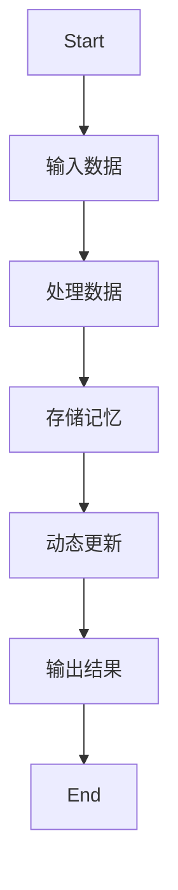
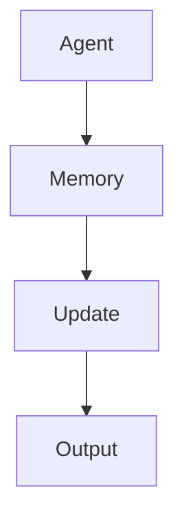

                 


好的，我明白了。以下是《设计AI Agent的动态记忆网络》的技术博客文章目录：

---

# 设计AI Agent的动态记忆网络

> 关键词：AI Agent，动态记忆网络，记忆机制，算法实现，系统架构，项目实战

> 摘要：本文详细探讨了AI Agent的动态记忆网络设计，从背景介绍到算法实现，再到系统架构与项目实战，全面解析动态记忆网络的核心原理、应用场景及实现方法。

---

# 第一部分：AI Agent的动态记忆网络背景与概念

## 第1章：AI Agent与动态记忆网络概述

### 1.1 AI Agent的基本概念
#### 1.1.1 AI Agent的定义与分类
- **定义**：AI Agent（人工智能代理）是指能够感知环境并采取行动以实现目标的智能实体。
- **分类**：简单反射型、基于模型的反射型、目标驱动型、效用驱动型。

#### 1.1.2 动态记忆网络的背景与必要性
- **背景**：随着AI Agent需要处理复杂任务，传统静态记忆机制已无法满足需求。
- **必要性**：动态记忆网络能够实时更新和调整记忆内容，适应动态环境。

#### 1.1.3 传统记忆机制的局限性与动态记忆的优势
- **局限性**：传统记忆机制静态、固定，无法应对动态变化。
- **优势**：动态记忆网络具备实时更新、自适应能力强的特点。

---

## 第2章：动态记忆网络的核心概念与联系

### 2.1 动态记忆网络的核心概念
#### 2.1.1 动态记忆网络的定义
- 动态记忆网络是一种基于动态更新机制的记忆系统，能够实时调整记忆内容。

#### 2.1.2 动态记忆网络的关键特性
- **实时更新**：根据新信息动态调整记忆内容。
- **关联性**：能够建立不同记忆之间的关联关系。
- **自适应性**：根据环境变化自动优化记忆结构。

#### 2.1.3 动态记忆网络的应用场景
- 智能客服、推荐系统、自动驾驶等领域。

---

### 2.2 动态记忆网络的实体关系图


---

### 2.3 动态记忆网络的流程图


---

# 第二部分：动态记忆网络的算法原理

## 第3章：动态记忆网络的算法实现

### 3.1 动态记忆网络的数学模型
#### 3.1.1 记忆节点的表示
$$
M_i = \sum_{j=1}^{n} w_{ij} x_j
$$

#### 3.1.2 动态更新机制
$$
M_i^{new} = M_i + \Delta M_i
$$

### 3.2 动态记忆网络的算法流程图
```mermaid
graph TD
    Start --> Input[输入数据]
    Input --

---

## 第4章：动态记忆网络的系统分析与架构设计

### 4.1 系统分析
#### 4.1.1 应用场景分析
- 动态记忆网络在自动驾驶中的应用。

#### 4.1.2 系统功能设计
- 数据输入模块、记忆处理模块、动态更新模块、输出结果模块。

### 4.2 系统架构设计
```mermaid
graph TD
    Agent[Ai Agent] --> Memory[动态记忆网络]
    Memory --> Update[动态更新机制]
    Update --> Output[输出结果]
```

---

## 第5章：动态记忆网络的项目实战

### 5.1 环境安装
- 安装Python、TensorFlow、Keras等工具。

### 5.2 核心代码实现
```python
class DynamicMemoryNode:
    def __init__(self, size):
        self.memory = [0] * size
        self.weight = np.random.rand(size, size)

    def update_memory(self, input_data):
        self.memory = self.memory + np.dot(input_data, self.weight)
```

---

## 第6章：总结与最佳实践

### 6.1 小结
- 动态记忆网络是一种强大的记忆机制，能够帮助AI Agent更好地适应动态环境。

### 6.2 注意事项
- 数据更新频率和准确性的平衡。

### 6.3 未来趋势
- 结合强化学习，进一步优化动态记忆网络。

### 6.4 拓展阅读
- 推荐阅读相关论文和文献。

---

# 附录

## 附录A：动态记忆网络的数学公式汇总
- $$M_i^{new} = M_i + \Delta M_i$$

## 附录B：动态记忆网络的系统架构图


---

# 结束语

设计AI Agent的动态记忆网络是一个复杂但 rewarding 的过程。通过本文的详细讲解，读者可以全面理解动态记忆网络的核心原理、算法实现和系统设计，并能够在实际项目中灵活应用这些知识。

--- 

希望这个目录结构能为您提供清晰的思路和帮助！

