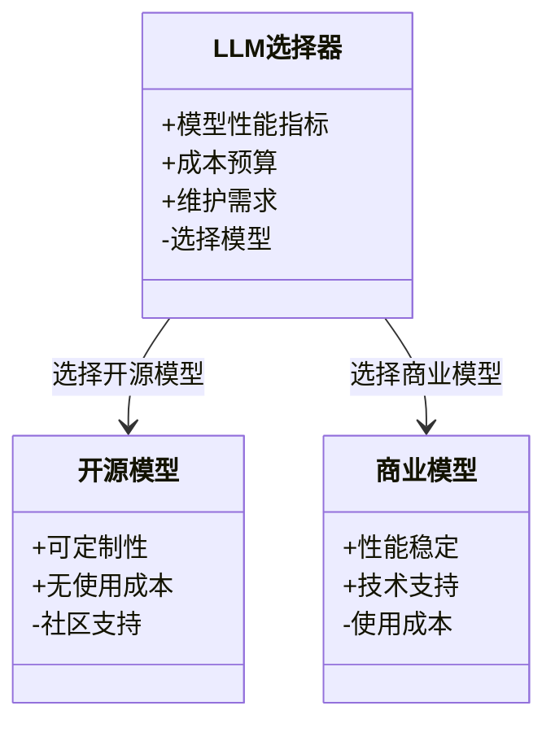
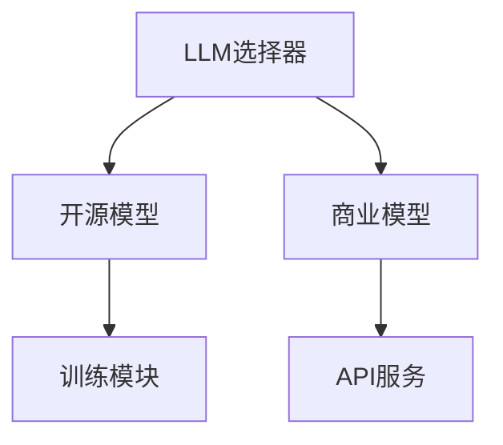

                 


# 选择合适的LLM：开源vs商业模型的对比

> 关键词：大语言模型，LLM选择，开源模型，商业模型，性能对比，成本分析

> 摘要：选择合适的LLM模型对企业的应用至关重要。本文详细对比开源和商业模型的优缺点，涵盖性能、成本、灵活性、维护和支持等方面，帮助读者做出明智的选择。

---

# 正文

## 第一章: 大语言模型（LLM）概述

### 1.1 什么是大语言模型

大语言模型（Large Language Model, LLM）是基于深度学习技术构建的自然语言处理模型，能够理解和生成人类语言。LLM通过大量的文本数据训练，掌握了语言的语法、语义和上下文信息，从而能够进行多种语言任务，如文本生成、翻译、问答和情感分析等。

### 1.2 开源与商业模型的基本概念

#### 开源模型

开源模型指的是源代码开放、任何人都可以免费获取、修改和优化的模型。典型的开源LLM包括GPT-3（通过许可使用）、T5、PaLM等。这些模型的优势在于灵活性高，可以根据具体需求进行定制，且通常不需要支付 licensing 费用。但开源模型的维护和优化需要投入大量资源，企业需要自行解决算力、训练数据和模型调优的问题。

#### 商业模型

商业模型则由企业或公司提供，通常以API的形式对外服务。用户需要支付一定的费用才能使用这些模型，典型的商业模型包括OpenAI的GPT-3.5和GPT-4、Anthropic的Claude、Google的PaLM等。商业模型的优势在于性能稳定、支持服务完善，但成本较高，且企业对模型的定制能力有限。

### 1.3 选择合适的LLM的重要性

选择合适的LLM模型直接影响企业的应用效果和成本。开源模型适合需要高度定制化和追求成本控制的企业，而商业模型则适合希望快速部署、注重性能和稳定性的企业。本文将从性能、成本、灵活性等多个维度对开源和商业模型进行对比分析。

---

## 第二章: 开源与商业模型的对比分析

### 2.1 性能对比

#### 2.1.1 模型参数与训练数据

开源模型通常由研究机构或开源社区发布，参数量和训练数据相对有限。例如，GPT-3的开源版本（如GPT-3 175B）参数量为175亿，而商业模型如GPT-4则拥有更多参数，训练数据更全面，模型性能更优。

#### 2.1.2 模型更新与优化

商业模型通常由专业的团队持续优化和更新，能够更快地迭代和改进。而开源模型的优化依赖社区贡献，更新速度相对较慢。

### 2.2 成本对比

#### 2.2.1 开源模型的成本优势

开源模型的优势在于零 licensing 成本，企业可以免费下载和使用。但需要自行承担算力、数据和维护的成本，总体成本较高。

#### 2.2.2 商业模型的成本劣势

商业模型通常按API调用次数收费，成本与使用量直接相关。虽然初始投入较低，但随着使用量的增加，成本可能会显著上升。

### 2.3 灵活性对比

#### 2.3.1 开源模型的灵活性

开源模型可以根据需求进行定制化开发，支持私有化部署，适应企业的特定需求。但需要投入大量资源进行模型训练和优化。

#### 2.3.2 商业模型的灵活性

商业模型通常不支持定制化修改，只能通过API调用，灵活性较低。但企业可以根据需求选择不同的模型版本，如免费层、付费层和企业版。

### 2.4 维护与支持对比

#### 2.4.1 开源模型的维护

开源模型的维护依赖社区支持，遇到问题需要自行解决或依赖社区贡献。企业需要投入资源进行维护和更新。

#### 2.4.2 商业模型的支持

商业模型通常提供专业的技术支持和客户服务，遇到问题可以及时联系厂商解决。但可能需要额外支付支持费用。

---

## 第三章: LLM的算法原理

### 3.1 Transformer模型的工作原理

#### 3.1.1 自注意力机制

自注意力机制（Self-attention）是Transformer模型的核心，允许模型在处理每个词时，自动关注其他词的重要性。通过计算词与词之间的相关性，模型可以更好地理解上下文关系。

#### 3.1.2 前馈网络结构

Transformer模型的编码器和解码器部分都包含多层的前馈神经网络，每一层都包含线性变换和激活函数，用于提取特征。

#### 3.1.3 梯度下降优化

模型通过梯度下降优化算法（如Adam）进行训练，不断调整参数以最小化损失函数，提升模型性能。

### 3.2 开源与商业模型的算法差异

#### 3.2.1 开源模型的训练策略

开源模型通常采用开源的训练框架（如TensorFlow、PyTorch）进行训练，训练数据和模型结构公开，方便研究人员进行改进和优化。

#### 3.2.2 商业模型的优化方法

商业模型的训练通常采用 proprietary 的优化方法，训练数据和模型结构可能不公开。商业模型可能采用更高效的训练策略和优化算法，以提升性能。

---

## 第四章: 系统分析与架构设计

### 4.1 系统功能设计

#### 4.1.1 领域模型设计

以下是一个简单的领域模型类图，展示了LLM选择器、开源模型和商业模型之间的关系：



#### 4.1.2 系统架构设计

以下是一个系统的架构图，展示了开源和商业模型在系统中的集成方式：



---

## 第五章: 项目实战

### 5.1 环境安装

#### 5.1.1 安装开源模型

以Hugging Face的开源模型为例，安装环境如下：

```bash
pip install transformers
```

#### 5.1.2 使用商业模型

以OpenAI的商业模型为例，安装环境如下：

```bash
pip install openai
```

### 5.2 代码实现

#### 5.2.1 开源模型实现

以下是一个简单的开源模型实现代码：

```python
from transformers import AutoTokenizer, AutoModelForCausalLM

model_name = "gpt2"
tokenizer = AutoTokenizer.from_pretrained(model_name)
model = AutoModelForCausalLM.from_pretrained(model_name)

input_text = "Hello, how are you?"
inputs = tokenizer(input_text, return_tensors="np")
output = model.generate(inputs.input_ids, max_length=50)
print(tokenizer.decode(output[0]))
```

#### 5.2.2 商业模型实现

以下是一个简单的商业模型实现代码：

```python
import openai

openai.api_key = "your_api_key"

def generate_text(prompt):
    response = openai.ChatCompletion.create(
        model="gpt-3.5-turbo",
        messages=[{"role": "user", "content": prompt}]
    )
    return response.choices[0].message.content

print(generate_text("Hello, how are you?"))
```

### 5.3 案例分析

#### 5.3.1 开源模型的应用

假设我们选择一个开源模型进行部署，首先需要进行模型训练和优化，然后编写接口代码，最后部署到服务器上。

#### 5.3.2 商业模型的应用

如果选择商业模型，可以直接调用API，省去训练和部署的过程，但需要支付调用费用。

---

## 第六章: 最佳实践和小结

### 6.1 最佳实践

- **明确需求**：根据实际需求选择模型，开源模型适合需要高度定制化的企业，商业模型适合需要快速部署的企业。
- **评估成本**：综合考虑模型的使用成本，包括 licensing 费用、算力成本和维护成本。
- **选择支持**：选择有良好技术支持的模型，确保在出现问题时能够及时解决。

### 6.2 小结

选择合适的LLM模型需要综合考虑性能、成本、灵活性和维护等多个因素。开源模型适合需要高度定制化和追求成本控制的企业，而商业模型适合需要快速部署和注重性能与稳定性的企业。未来，随着技术的发展，开源和商业模型的界限可能会进一步模糊，企业可以根据自身需求灵活选择。

---

## 注意事项

- 开源模型的维护和优化需要投入大量资源，企业需要有相应的技术团队支持。
- 商业模型的API调用可能会面临使用限制，需要提前了解API的调用次数和响应时间。
- 在选择模型时，建议先进行小规模测试，评估模型的性能和适用性。

---

## 拓展阅读

- [Hugging Face Transformers库](https://huggingface.co/transformers)
- [OpenAI API文档](https://beta.openai.com/docs)
- [Google的PaLM模型](https://github.com/google/palm)
- [Anthropic的Claude模型](https://github.com/anthropic/claude)

---

通过本文的详细对比和分析，希望读者能够更好地理解开源和商业LLM模型的优缺点，做出更明智的选择。

