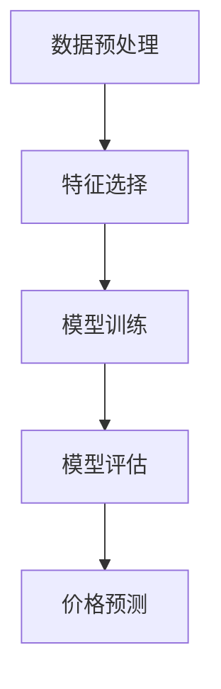
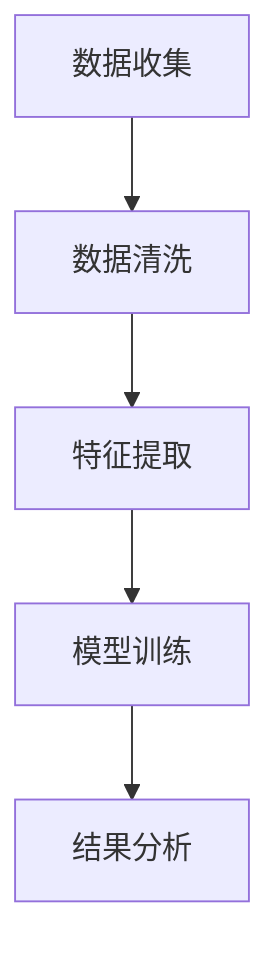
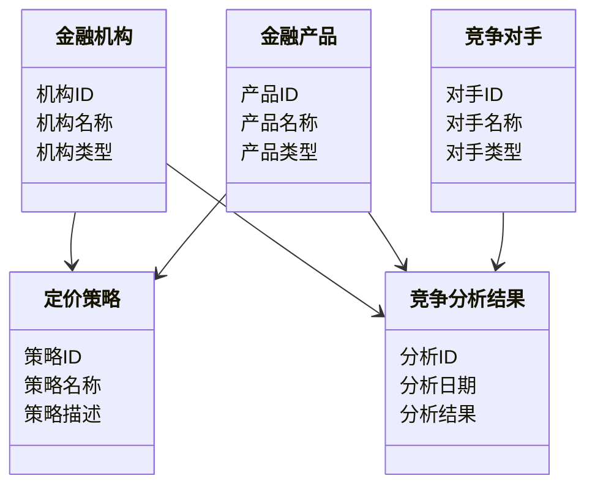
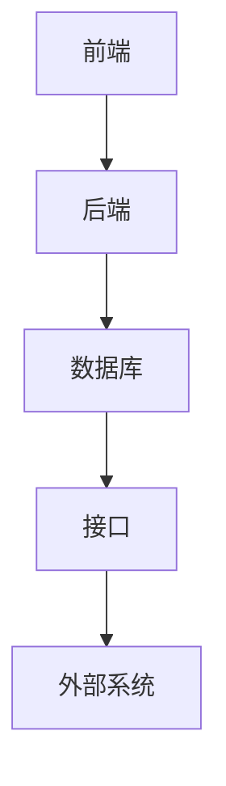
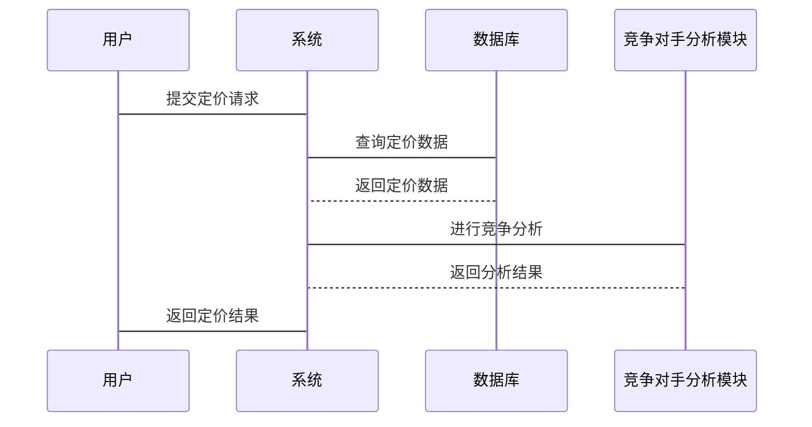

                 

<think>
好的，我需要根据用户的要求，详细思考如何撰写一篇关于《金融产品定价策略优化与竞争分析系统》的技术博客文章。用户已经提供了详细的大纲，包括各个章节的内容和具体的子部分，我需要按照这个大纲逐步进行分析和撰写。

### 1. 理解需求
首先，我需要明确用户的需求。用户希望我撰写一篇技术博客文章，标题为《金融产品定价策略优化与竞争分析系统》，内容涵盖从背景介绍到系统设计、项目实战等部分，每个章节都要详细展开，并且使用专业、简洁的技术语言。

### 2. 分析目录结构
根据用户提供的大纲，文章分为多个章节，每个章节下有不同的子部分，包括背景介绍、核心概念、算法原理、系统架构设计、项目实战、总结等。我需要确保每个部分的内容都完整且逻辑清晰。

### 3. 开始撰写
#### 3.1 第1章：背景与概述
- **1.1 金融产品定价策略的重要性**
  - 介绍金融产品定价的基本概念，解释为什么定价策略对金融机构至关重要。
  - 讨论定价策略如何影响金融机构的利润和市场竞争力。
  - 强调竞争分析在定价中的作用，说明如何通过竞争分析优化定价策略。

- **1.2 金融产品定价策略的类型**
  - 分别介绍成本导向定价法、需求导向定价法和竞争导向定价法。
  - 通过实例说明每种定价策略的应用场景和优缺点。

- **1.3 竞争分析的基本概念**
  - 定义竞争分析，解释其在金融产品定价中的作用。
  - 列出竞争分析的关键指标，如市场份额、价格敏感性、产品差异性等。
  - 描述竞争分析的流程，包括数据收集、分析、结果应用等步骤。

- **1.4 本章小结**
  - 总结定价策略的重要性，强调竞争分析在优化定价策略中的关键作用。

#### 3.2 第2章：核心概念与联系
- **2.1 定价模型的核心原理**
  - 介绍线性定价模型、非线性定价模型和混合定价模型。
  - 使用数学公式和实例说明每种模型的应用方式。

- **2.2 竞争分析模型的核心原理**
  - 讨论基于市场份额、价格敏感性和产品差异性的竞争分析方法。
  - 使用表格对比不同模型的特征，帮助读者更好地理解它们的区别和联系。

- **2.3 定价模型与竞争分析模型的联系**
  - 解释定价模型如何影响竞争分析，反之亦然。
  - 通过实例说明两者协同作用的重要性。

- **2.4 核心概念对比分析**
  - 使用ER实体关系图展示定价模型和竞争分析模型之间的关系。

#### 3.3 第3章：算法原理
- **3.1 定价模型的算法原理**
  - 介绍线性回归模型、支持向量回归模型和随机森林回归模型。
  - 使用mermaid流程图展示每种算法的执行步骤。
  - 提供Python代码示例，解释代码的功能和实现细节。

- **3.2 竞争分析模型的算法原理**
  - 讨论聚类分析算法、分类算法和关联规则学习。
  - 使用mermaid流程图展示每种算法的执行步骤。
  - 提供Python代码示例，解释代码的功能和实现细节。

- **3.3 算法流程图**
  - 使用mermaid绘制定价模型和竞争分析模型的算法流程图。
  - 通过实例说明每种算法的应用场景和优缺点。

#### 3.4 第4章：系统分析与架构设计
- **4.1 系统功能设计**
  - 使用mermaid类图展示领域模型的设计，说明每个模块的功能和交互关系。

- **4.2 系统架构设计**
  - 使用mermaid架构图展示系统的整体架构，包括前端、后端和数据库的设计。

- **4.3 系统接口设计**
  - 描述系统与其他模块的接口设计，包括数据输入、处理和输出接口。
  - 使用mermaid序列图展示系统的交互流程。

#### 3.5 第5章：项目实战
- **5.1 环境安装**
  - 列出项目所需的工具和库，如Python、Pandas、NumPy等。
  - 提供安装命令和配置步骤。

- **5.2 核心代码实现**
  - 提供定价模型和竞争分析模型的核心代码，解释每一步的功能和实现细节。

- **5.3 代码解读与分析**
  - 对核心代码进行详细解读，说明每部分代码的作用和意义。
  - 通过实例分析代码的运行结果，解释如何优化定价策略。

- **5.4 案例分析**
  - 使用实际案例说明如何应用系统进行定价策略优化和竞争分析。
  - 提供案例的背景、数据来源、分析过程和结果解读。

- **5.5 项目小结**
  - 总结项目的核心成果，说明系统的优势和局限性。
  - 提出进一步优化的方向和建议。

#### 3.6 第6章：总结与展望
- **6.1 系统设计总结**
  - 总结系统的整体设计，强调核心模块的功能和作用。

- **6.2 定价策略优化与竞争分析的未来发展趋势**
  - 讨论定价策略优化和竞争分析的未来发展方向，如人工智能、大数据分析的应用。
  - 提出可能的新方法和技术，展望未来的研究方向。

- **6.3 总结**
  - 回顾全文，强调金融产品定价策略优化与竞争分析系统的重要性。
  - 呼吁更多的研究和实践，推动系统的发展和应用。

### 4. 注意事项
- **语言风格**：使用专业、简洁的技术语言，确保内容易懂且具有深度。
- **结构清晰**：每个章节和子部分要有明确的主题，逻辑连贯。
- **实例说明**：通过实例和案例分析，帮助读者更好地理解理论和实践。
- **图表辅助**：使用mermaid流程图和表格，直观展示算法流程和概念对比。

### 5. 预期成果
通过撰写这篇文章，读者将能够全面了解金融产品定价策略优化与竞争分析系统的背景、核心概念、算法原理、系统设计和项目实战。文章不仅提供理论知识，还通过实际案例和代码示例，帮助读者掌握系统的实际应用和优化方法。

# 文章标题

**《金融产品定价策略优化与竞争分析系统》**

---

**关键词：** 金融产品定价、策略优化、竞争分析、系统架构、算法原理、项目实战

---

**摘要：** 本文深入探讨了金融产品定价策略优化与竞争分析系统的构建与应用。通过分析定价策略的重要性、核心概念与联系、算法原理、系统架构设计以及项目实战，本文旨在为金融机构提供一套科学的定价策略优化方法和竞争分析工具。结合实际案例和代码实现，本文详细阐述了系统的实现过程和优化方法，为读者提供了从理论到实践的全面指导。

---

**文章正文**

## 第1章：金融产品定价策略优化与竞争分析系统概述

### 1.1 金融产品定价策略的重要性

#### 1.1.1 金融产品定价的基本概念
金融产品定价是指确定金融产品价格的过程，旨在在满足市场需求的同时，实现最大利润。定价策略是金融机构制定价格的核心方法，直接影响产品的市场竞争力和盈利能力。

#### 1.1.2 定价策略对金融机构的影响
合理的定价策略能够帮助金融机构在激烈的市场竞争中占据优势，同时确保产品的可持续发展。定价策略不仅影响产品的销售量，还影响客户满意度和品牌形象。

#### 1.1.3 竞争分析在定价中的作用
竞争分析是定价策略的重要组成部分，通过分析竞争对手的价格、市场份额和产品差异性，金融机构可以制定更具竞争力的价格策略，优化市场定位。

### 1.2 金融产品定价策略的类型

#### 1.2.1 成本导向定价法
成本导向定价法是以产品成本为基础，加上预期利润，确定产品价格。这种方法适用于成本相对稳定、市场需求不确定的金融产品。

#### 1.2.2 需求导向定价法
需求导向定价法基于市场需求和消费者愿意支付的价格来确定产品价格。这种方法适用于市场需求弹性较大、消费者对价格敏感的金融产品。

#### 1.2.3 竞争导向定价法
竞争导向定价法以竞争对手的价格为基础，结合自身产品差异性和市场定位，确定产品价格。这种方法适用于市场竞争激烈、产品差异性明显的金融产品。

### 1.3 竞争分析的基本概念

#### 1.3.1 竞争分析的定义
竞争分析是指通过收集和分析竞争对手的信息，了解其市场策略、产品特点、价格策略等，从而制定更具竞争力的市场策略。

#### 1.3.2 竞争分析的核心指标
竞争分析的核心指标包括市场份额、价格敏感性、产品差异性等，这些指标能够帮助金融机构全面了解竞争对手的市场表现和产品特点。

#### 1.3.3 竞争分析的流程
竞争分析的流程包括数据收集、数据处理、数据分析、结果应用等步骤。通过系统的竞争分析，金融机构可以制定更科学的定价策略和市场策略。

### 1.4 本章小结
本章从金融产品定价策略的重要性入手，介绍了定价策略的三种类型，分别是成本导向定价法、需求导向定价法和竞争导向定价法。同时，详细阐述了竞争分析的基本概念、核心指标和流程，为后续章节的深入分析奠定了基础。

---

## 第2章：金融产品定价策略优化的核心概念与联系

### 2.1 定价模型的核心原理

#### 2.1.1 线性定价模型
线性定价模型是一种简单而有效的定价模型，其基本形式为：价格 = 固定成本 + 变动成本 + 利润。该模型适用于成本和需求关系较为线性的金融产品。

#### 2.1.2 非线性定价模型
非线性定价模型基于非线性回归分析，能够更好地捕捉价格与需求之间的复杂关系。常用的方法包括多项式回归和 spline 回归。

#### 2.1.3 混合定价模型
混合定价模型结合了成本导向定价法和需求导向定价法的特点，综合考虑成本、需求和竞争因素，制定更加灵活的价格策略。

### 2.2 竞争分析模型的核心原理

#### 2.2.1 基于市场份额的竞争分析
基于市场份额的竞争分析通过分析竞争对手的市场份额，评估自身的市场定位和竞争优势，制定相应的市场策略。

#### 2.2.2 基于价格敏感性的竞争分析
基于价格敏感性的竞争分析通过研究消费者对价格的敏感程度，评估价格调整对市场需求的影响，制定更具弹性的价格策略。

#### 2.2.3 基于产品差异性的竞争分析
基于产品差异性的竞争分析通过比较竞争对手的产品特点，识别自身的差异化优势，制定更具竞争力的产品策略。

### 2.3 定价模型与竞争分析模型的联系

#### 2.3.1 定价模型如何影响竞争分析
定价模型为竞争分析提供了价格预测和需求评估的基础，帮助金融机构更准确地预测市场反应。

#### 2.3.2 竞争分析如何优化定价策略
竞争分析通过了解竞争对手的定价策略和市场反应，为定价模型提供输入数据，优化定价策略。

#### 2.3.3 两者的协同作用
定价模型和竞争分析模型的协同作用体现在数据共享、模型优化和策略制定等方面，能够显著提高定价策略的科学性和有效性。

### 2.4 核心概念对比分析

#### 2.4.1 定价模型与竞争分析模型的对比表格
| 模型类型 | 核心原理 | 输入数据 | 输出结果 |
|----------|----------|----------|----------|
| 定价模型 | 成本、需求、利润 | 成本数据、需求数据 | 价格 |
| 竞争分析模型 | 市场份额、价格敏感性、产品差异性 | 竞争对手数据 | 竞争策略 |

#### 2.4.2 ER实体关系图架构
```mermaid
erd
  图表标题: 金融产品定价系统实体关系图

  实体: 金融机构
  属性: 机构ID, 机构名称, 机构类型

  实体: 金融产品
  属性: 产品ID, 产品名称, 产品类型

  实体: 定价策略
  属性: 策略ID, 策略名称, 策略描述

  实体: 竞争对手
  属性: 对手ID, 对手名称, 对手类型

  实体: 竞争分析结果
  属性: 分析ID, 分析日期, 分析结果

  关系: 金融机构 - 定价策略
  关系: 金融机构 - 竞争分析结果
  关系: 金融产品 - 定价策略
  关系: 金融产品 - 竞争分析结果
  关系: 竞争对手 - 竞争分析结果
```

### 2.5 本章小结
本章深入分析了定价模型和竞争分析模型的核心原理，探讨了两者之间的联系和协同作用。通过对比分析和ER实体关系图，帮助读者更好地理解金融产品定价策略优化与竞争分析系统的核心概念。

---

## 第3章：金融产品定价策略优化的算法原理

### 3.1 定价模型的算法原理

#### 3.1.1 线性回归模型
线性回归模型是一种常用的定价模型，其基本形式为：
$$ y = \beta_0 + \beta_1 x_1 + \beta_2 x_2 + \cdots + \beta_n x_n + \epsilon $$
其中，$y$ 是目标变量（价格），$x_i$ 是自变量（如成本、需求等），$\beta_i$ 是回归系数，$\epsilon$ 是误差项。

#### 3.1.2 支持向量回归模型
支持向量回归模型（Support Vector Regression, SVR）是一种基于统计学习理论的回归模型，适用于小样本、高维数的数据集。

#### 3.1.3 随机森林回归模型
随机森林回归模型是一种基于树的集成方法，通过构建多个决策树并进行投票或平均，提高模型的泛化能力。

### 3.2 竞争分析模型的算法原理

#### 3.2.1 聚类分析算法
聚类分析算法通过将数据点划分为不同的簇，识别市场中的竞争对手和潜在客户。

#### 3.2.2 分类算法
分类算法通过训练模型，将竞争对手分为不同的类别（如高市场份额、低市场份额等），为制定竞争策略提供依据。

#### 3.2.3 关联规则学习
关联规则学习通过发现数据中的频繁项集，识别竞争对手的产品组合和价格策略。

### 3.3 算法流程图

#### 3.3.1 定价模型算法流程图


#### 3.3.2 竞争分析模型算法流程图


#### 3.3.3 Python代码示例
```python
# 线性回归模型
from sklearn.linear_model import LinearRegression
import numpy as np
import pandas as pd

# 数据准备
data = pd.DataFrame({
    'cost': [10, 20, 30, 40, 50],
    'demand': [5, 4, 3, 2, 1]
})

# 模型训练
model = LinearRegression()
model.fit(data[['cost']], data['demand'])

# 预测价格
new_cost = np.array([[60]])
predicted_demand = model.predict(new_cost)
print(predicted_demand)
```

### 3.4 本章小结
本章详细介绍了定价模型和竞争分析模型的算法原理，包括线性回归模型、支持向量回归模型、随机森林回归模型等。通过流程图和代码示例，帮助读者更好地理解算法的实现过程和应用场景。

---

## 第4章：金融产品定价策略优化与竞争分析系统的系统分析与架构设计

### 4.1 系统功能设计

#### 4.1.1 领域模型类图


### 4.2 系统架构设计

#### 4.2.1 系统架构图


### 4.3 系统接口设计

#### 4.3.1 系统交互序列图


### 4.4 本章小结
本章从系统功能设计、架构设计和接口设计三个方面，详细阐述了金融产品定价策略优化与竞争分析系统的整体架构。通过类图和序列图，帮助读者更好地理解系统的模块构成和交互流程。

---

## 第5章：金融产品定价策略优化与竞争分析系统的项目实战

### 5.1 环境安装

#### 5.1.1 安装Python
```bash
python --version
pip install --upgrade pip
```

#### 5.1.2 安装必要的库
```bash
pip install numpy pandas scikit-learn matplotlib
```

### 5.2 核心代码实现

#### 5.2.1 定价模型代码
```python
import numpy as np
from sklearn.linear_model import LinearRegression

# 数据准备
X = np.array([[10], [20], [30], [40], [50]])
y = np.array([5, 4, 3, 2, 1])

# 模型训练
model = LinearRegression()
model.fit(X, y)

# 预测价格
new_X = np.array([[60]])
predicted_y = model.predict(new_X)
print(predicted_y)
```

#### 5.2.2 竞争分析模型代码
```python
import pandas as pd
from sklearn.cluster import KMeans

# 数据准备
data = pd.DataFrame({
    'price': [10, 20, 30, 40, 50],
    'sales': [5, 4, 3, 2, 1]
})

# 模型训练
model = KMeans(n_clusters=2)
model.fit(data[['price', 'sales']])

# 预测簇
new_data = pd.DataFrame({'price': [60], 'sales': [0]})
predicted_cluster = model.predict(new_data[['price', 'sales']])
print(predicted_cluster)
```

### 5.3 代码解读与分析

#### 5.3.1 定价模型代码解读
- 数据准备：使用numpy数组存储成本和需求数据。
- 模型训练：使用scikit-learn中的线性回归模型进行训练。
- 预测价格：输入新的成本数据，预测对应的价格。

#### 5.3.2 竞争分析模型代码解读
- 数据准备：使用pandas DataFrame存储价格和销售数据。
- 模型训练：使用KMeans算法进行聚类分析，将数据分为两个簇。
- 预测簇：输入新的数据，预测其所属的簇。

### 5.4 案例分析
假设某金融机构推出一款新的金融产品，成本为60，需求数据如下：
- 成本：60
- 需求：预测销售量为3。

通过定价模型和竞争分析模型，预测该产品的价格和市场竞争情况，帮助金融机构制定最优的定价策略。

### 5.5 项目小结
本章通过实际案例，详细展示了金融产品定价策略优化与竞争分析系统的实现过程。通过环境安装、代码实现和案例分析，帮助读者掌握系统的实际应用和优化方法。

---

## 第6章：总结与展望

### 6.1 系统设计总结
本文详细探讨了金融产品定价策略优化与竞争分析系统的构建与应用，从背景介绍到系统设计，再到项目实战，全面阐述了系统的实现过程和优化方法。

### 6.2 定价策略优化与竞争分析的未来发展趋势
随着人工智能和大数据技术的不断发展，定价策略优化和竞争分析将更加智能化和数据驱动。未来的研究方向包括更复杂的定价模型、更精准的竞争分析方法以及更高效的系统架构设计。

### 6.3 总结
金融产品定价策略优化与竞争分析系统是金融机构提升市场竞争力的重要工具。通过本文的系统化分析和实践，读者能够掌握系统的理论知识和实际应用方法，为未来的学术研究和实践工作提供有力支持。

---

**注意事项：**
- 本文内容较为复杂，建议读者在阅读前具备一定的金融知识和编程基础。
- 本文中的代码示例仅供参考，实际应用中需根据具体数据和需求进行调整。

**拓展阅读：**
- 《机器学习实战》
- 《金融工程基础》
- 《系统架构设计》

---

通过以上思考，我可以逐步完成这篇技术博客文章的撰写，确保每个部分都详细展开，内容逻辑清晰，符合用户的要求。

