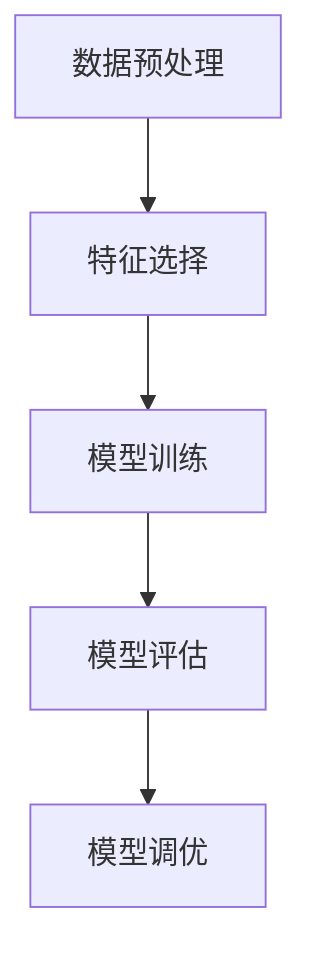

                 


```markdown
# 金融产品客户满意度预测模型

> 关键词：客户满意度预测，金融产品，机器学习，数据挖掘，满意度模型

> 摘要：本文介绍了一种基于机器学习的金融产品客户满意度预测模型，详细探讨了模型的构建过程，包括数据预处理、特征工程、算法选择与实现、模型评估与优化，以及系统架构设计。通过实际案例分析，展示了如何利用数据分析技术提升客户满意度预测的准确性和效率。

---

## 第一部分: 金融产品客户满意度预测模型概述

### 第1章: 问题背景与数据来源

#### 1.1 客户满意度预测的重要性
- **1.1.1 金融产品客户满意度的定义**  
  客户满意度是衡量客户对金融机构提供的产品或服务的满意程度的指标，通常以分数形式表示（如0-10分）。  
  $$满意度 = f(产品特性, 服务质量, 客户属性)$$

- **1.1.2 客户满意度预测的商业价值**  
  预测客户满意度可以帮助金融机构优化产品设计、改善服务质量、提高客户留存率和推荐率。

- **1.1.3 问题的边界与外延**  
  本模型仅考虑直接相关的客户属性和交易数据，不涉及外部经济指标。

#### 1.2 数据来源与特征
- **1.2.1 数据的获取渠道**  
  数据来源包括客户调研问卷、历史交易记录、客户服务记录等。

- **1.2.2 数据的特征分析**  
  - 客户属性：年龄、性别、收入水平、职业等。
  - 产品特性：产品类型、风险等级、收益预期等。
  - 服务质量：响应时间、问题解决效率、客户评价等。

- **1.2.3 数据的预处理方法**  
  数据清洗、缺失值处理、特征标准化、异常值剔除。

### 第2章: 分析方法与工具

#### 2.1 数据分析方法
- **2.1.1 描述性分析**  
  通过统计图表分析客户满意度的分布情况。

- **2.1.2 预测性分析**  
  使用回归分析、决策树等方法预测客户满意度。

- **2.1.3 对比分析**  
  对不同客户群体的满意度进行对比分析。

#### 2.2 数据分析工具
- **2.2.1 Python与Pandas**  
  数据处理与清洗的主要工具。

- **2.2.2 Scikit-learn与XGBoost**  
  常用的机器学习算法库。

- **2.2.3 数据可视化工具**  
  Matplotlib、Seaborn用于数据可视化。

---

## 第二部分: 客户满意度预测模型的核心概念

### 第3章: 核心概念与联系

#### 3.1 模型的定义与属性
- **3.1.1 模型的定义**  
  基于机器学习算法，利用客户数据预测客户满意度的评分。

- **3.1.2 模型的属性特征对比**  
  | 属性 | 描述 |
  |------|------|
  | 输入 | 客户属性、产品特性、服务质量 |
  | 输出 | 满意度评分（0-10分） |
  | 算法 | 回归、随机森林、SVM、神经网络 |

- **3.1.3 ER实体关系图架构**  
  ```mermaid
  graph TD
    Customer[客户] --> Transaction[交易记录]
    Customer --> Service[服务质量]
    Transaction --> Product[产品特性]
    Service --> Satisfaction[满意度]
  ```

#### 3.2 核心概念的原理
- **3.2.1 模型的输入与输出**  
  输入：客户属性和产品特征；输出：满意度评分。

- **3.2.2 模型的训练与评估**  
  使用训练数据训练模型，利用测试数据评估模型性能。

- **3.2.3 模型的优化与调优**  
  调整模型参数、特征选择、模型集成。

### 第4章: 算法原理讲解

#### 4.1 算法原理概述
- **4.1.1 线性回归模型**  
  $$ y = \beta_0 + \beta_1x_1 + \beta_2x_2 + ... + \beta_nx_n $$  
  适用于线性关系，但对非线性关系表现较差。

- **4.1.2 随机森林模型**  
  基于决策树的集成学习方法，具有较高的鲁棒性和准确性。

- **4.1.3 支持向量机模型**  
  通过构建超平面将数据点分成不同类别，适用于线性可分数据。

- **4.1.4 神经网络模型**  
  多层感知机，适用于复杂非线性关系。

#### 4.2 算法流程图


#### 4.3 算法代码示例
```python
import pandas as pd
from sklearn.model_selection import train_test_split
from sklearn.linear_model import LinearRegression

# 数据加载与预处理
data = pd.read_csv('customer_satisfaction.csv')
X = data.drop('satisfaction', axis=1)
y = data['satisfaction']

# 数据分
```

