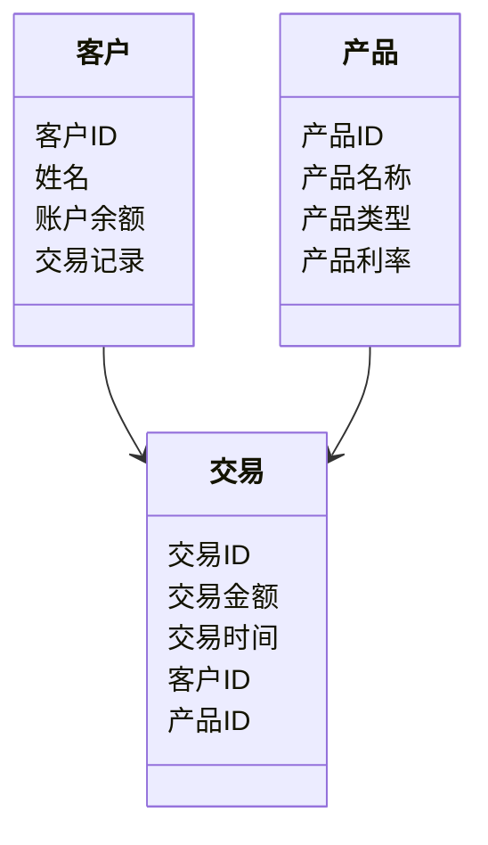
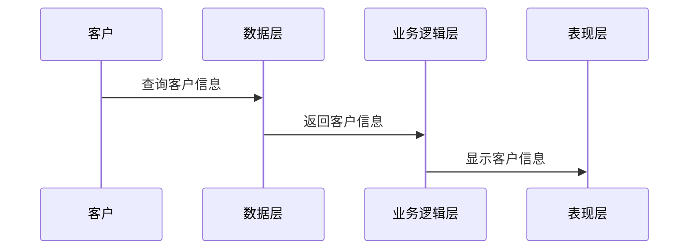
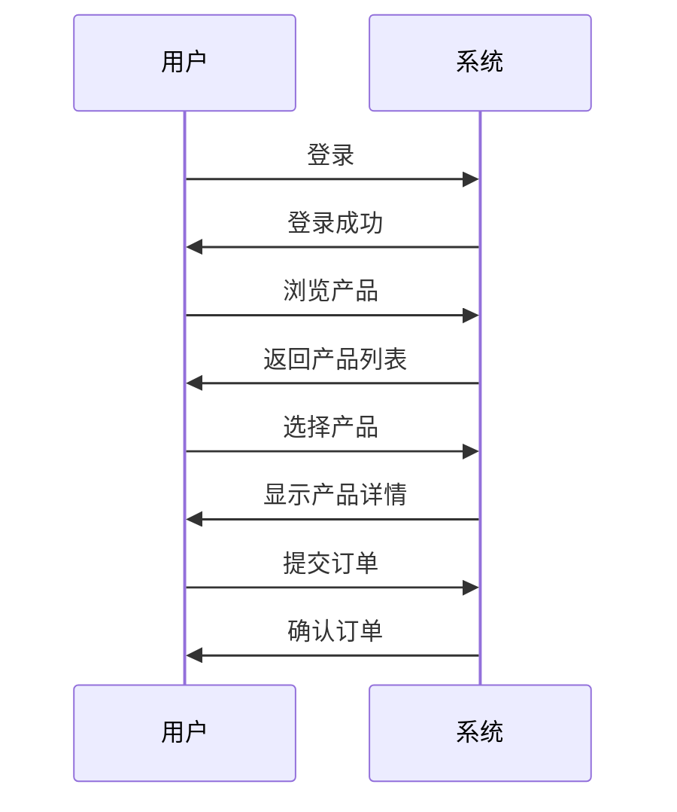

                 


# 《金融产品客户生命周期价值最大化》

## 关键词：客户生命周期价值, 金融产品, 客户价值, 最大化, CLV, 金融创新, 客户管理

## 摘要：  
在金融行业中，客户生命周期价值（Customer Lifetime Value, CLV）是衡量客户长期价值的重要指标。本文通过分析客户生命周期的各个阶段，探讨如何利用数据挖掘、机器学习等技术手段，最大化金融产品的客户生命周期价值。文章从客户生命周期模型、价值评估方法、客户细分策略、系统架构设计等多个维度展开，结合实际案例和最佳实践，为金融机构提供科学的客户管理与价值提升策略。

---

# 第1章: 客户生命周期价值（CLV）概述

## 1.1 客户生命周期价值的核心概念

### 1.1.1 什么是客户生命周期价值  
客户生命周期价值（CLV）是指客户在其生命周期内为企业带来的总收入减去相关成本的净现值。它是衡量客户对企业发展贡献的重要指标，也是企业制定客户管理策略的重要依据。

$$ CLV = \sum_{t=1}^{n} \frac{贡献价值}{(1 + r)^t} $$  
其中，$r$为贴现率，$n$为客户生命周期长度。

### 1.1.2 CLV的计算公式与方法  
CLV的计算方法包括基于历史数据的回归分析、基于机器学习的预测模型以及基于蒙特卡洛模拟的概率模型。其中，最常见的方法是使用客户的历史行为数据和交易记录，结合时间序列分析来预测未来贡献。

### 1.1.3 CLV在金融产品中的应用价值  
在金融行业，CLV可以帮助银行、保险公司等金融机构优化客户获取策略、提升客户留存率、制定个性化服务方案，并最终实现客户价值的最大化。

---

## 1.2 金融产品与客户生命周期的关系

### 1.2.1 金融产品的生命周期  
金融产品的生命周期包括引入期、成长期、成熟期和衰退期。每个阶段的客户行为和需求有所不同，金融机构需要根据不同阶段的特点调整产品策略。

### 1.2.2 客户在金融产品生命周期中的角色  
客户是金融产品生命周期的核心，其生命周期与金融产品的生命周期相互影响。例如，客户在产品引入期可能需要更多的教育和引导，而在成熟期则可能更注重产品的稳定性和收益性。

### 1.2.3 金融产品与客户生命周期的双向影响  
金融产品的设计直接影响客户的生命周期价值，而客户的行为和反馈也会影响金融产品的生命周期。

---

## 1.3 CLV最大化的目标与意义

### 1.3.1 CLV最大化的核心目标  
CLV最大化的目标是通过优化客户体验、提升客户忠诚度和增加客户贡献，实现客户全生命周期价值的最大化。

### 1.3.2 CLV最大化对金融机构的价值  
CLV最大化可以帮助金融机构提高客户留存率、降低客户获取成本、优化产品组合，并最终提升整体盈利能力。

### 1.3.3 CLV最大化对客户体验的提升作用  
通过分析客户生命周期价值，金融机构可以为客户提供更加个性化和贴心的服务，从而提升客户满意度和忠诚度。

---

## 1.4 本章小结  
本章从客户生命周期价值的核心概念出发，详细阐述了CLV在金融产品中的应用价值，并探讨了CLV最大化对金融机构和客户体验的双重意义。

---

# 第2章: 客户生命周期价值的计算与分析

## 2.1 CLV的计算模型

### 2.1.1 基于历史数据的CLV计算  
基于历史数据的CLV计算方法主要依赖客户过去的行为数据，通过回归分析或时间序列分析预测未来的贡献价值。

$$ CLV = \frac{年收入}{客户流失率} \times (1 - \frac{1}{(1 + 贴现率)^{生命周期长度}}) $$  

### 2.1.2 基于机器学习的CLV预测  
机器学习方法（如随机森林、神经网络）可以利用客户特征和行为数据，预测客户的未来价值。

### 2.1.3 基于蒙特卡洛模拟的CLV估计  
蒙特卡洛模拟可以通过多次模拟客户生命周期中的随机事件，估算CLV的期望值和波动性。

---

## 2.2 客户价值评估的关键指标

### 2.2.1 客户获取成本（CAC）  
客户获取成本是指吸引一个新客户所花费的总成本。  
$$ CAC = \frac{营销成本 + 客户获取成本}{新增客户数} $$  

### 2.2.2 客户生命周期价值（CLV）  
CLV的计算公式如前所述，是衡量客户长期价值的核心指标。

### 2.2.3 客户留存率与流失率  
客户留存率是指客户在某个时间段内继续使用产品或服务的概率。  
客户流失率是客户停止使用产品或服务的概率。  
$$ 客户留存率 = 1 - 客户流失率 $$  

---

## 2.3 CLV分析的工具与方法

### 2.3.1 数据挖掘与分析工具  
常用工具包括Python的Scikit-learn、SQL等。  
```python
# 示例代码：使用Scikit-learn进行客户细分
from sklearn.cluster import KMeans
import pandas as pd

data = pd.read_csv('customer_data.csv')
clusters = KMeans(n_clusters=3, random_state=42).fit(data)
```

### 2.3.2 统计分析方法  
包括t检验、方差分析等，用于评估不同客户群体的CLV差异。

### 2.3.3 可视化分析工具  
如Tableau、Power BI等，用于直观展示CLV的变化趋势和分布情况。

---

## 2.4 本章小结  
本章详细介绍了CLV的计算模型和相关分析工具，为后续的客户价值评估和优化策略提供了理论基础。

---

# 第3章: 客户细分与价值评估

## 3.1 客户细分的策略与方法

### 3.1.1 基于RFM模型的客户细分  
RFM模型（Recency、Frequency、Monetary）是一种常用的客户细分方法。  
- Recency：客户最近一次购买的时间  
- Frequency：客户的购买频率  
- Monetary：客户的平均交易金额  

### 3.1.2 基于聚类分析的客户细分  
聚类分析可以通过客户的行为数据，自动将客户分成不同的群体。  
```python
# 示例代码：使用K-means进行客户细分
from sklearn.cluster import KMeans
import pandas as pd

data = pd.read_csv('customer_data.csv')
clusters = KMeans(n_clusters=5, random_state=42).fit(data)
```

### 3.1.3 基于决策树的客户细分  
决策树模型（如ID3、C4.5）可以通过客户特征进行分类，实现客户细分。

---

## 3.2 客户价值评估的维度

### 3.2.1 客户的经济价值  
包括客户的收入贡献、成本支出等。  
$$ 经济价值 = 收入 - 成本 $$  

### 3.2.2 客户的战略价值  
包括客户对企业长期发展的战略意义，例如高端客户的价值。

### 3.2.3 客户的社会价值  
包括客户对企业品牌形象和社会影响力的影响。

---

## 3.3 客户价值评估的实践案例

### 3.3.1 银行客户价值评估案例  
通过分析客户的存款和理财产品的购买情况，评估客户的经济价值和战略价值。

### 3.3.2 保险客户价值评估案例  
通过分析客户的保费支付和理赔记录，预测客户的未来价值。

### 3.3.3 投资客户价值评估案例  
通过分析客户的投资金额和收益情况，评估客户的长期价值。

---

## 3.4 本章小结  
本章通过客户细分和价值评估的方法，帮助金融机构更好地识别高价值客户，并制定针对性的管理策略。

---

# 第4章: 客户生命周期价值的优化策略

## 4.1 客户生命周期的优化路径

### 4.1.1 提高客户获取效率  
通过精准营销和数字化渠道，吸引高质量客户。

### 4.1.2 提升客户留存率  
通过优化产品体验、提供个性化服务，降低客户流失率。

### 4.1.3 增强客户忠诚度  
通过建立客户忠诚计划、提供增值服务，提升客户对品牌的黏性。

---

## 4.2 客户价值提升的关键因素

### 4.2.1 产品创新与优化  
通过不断优化产品功能和服务，满足客户的多样化需求。

### 4.2.2 客户体验优化  
通过提升服务质量和响应速度，增强客户满意度。

### 4.2.3 客户关系管理  
通过建立完善的客户关系管理系统，实现客户全生命周期的精准管理。

---

## 4.3 CLV优化的实践策略

### 4.3.1 数据驱动的优化策略  
通过数据分析和预测模型，制定科学的客户管理策略。

### 4.3.2 个性化服务策略  
根据客户需求和行为，提供个性化的金融产品和服务。

### 4.3.3 风险控制策略  
通过风险评估和预警机制，降低客户流失和财务风险。

---

## 4.4 本章小结  
本章从优化路径、关键因素和实践策略三个方面，探讨了如何最大化客户生命周期价值。

---

# 第5章: 系统架构与技术实现

## 5.1 问题场景介绍

### 5.1.1 客户数据管理的挑战  
包括数据分散、数据孤岛、数据安全等问题。

### 5.1.2 系统集成与数据同步  
需要实现多个系统的集成和数据的实时同步。

### 5.1.3 系统性能优化  
包括数据处理效率、算法计算速度和系统可扩展性。

---

## 5.2 系统功能设计

### 5.2.1 领域模型设计  
领域模型是系统设计的核心，包括客户、产品、交易等核心实体。  


### 5.2.2 系统架构设计  
系统架构采用分层架构，包括数据层、业务逻辑层和表现层。  


### 5.2.3 系统接口设计  
系统接口采用RESTful API，包括客户信息查询、产品推荐、交易记录查询等功能。

### 5.2.4 系统交互设计  
系统交互流程包括用户登录、产品浏览、交易确认等步骤。  


---

## 5.3 系统核心实现

### 5.3.1 数据处理与清洗  
使用Python的Pandas库进行数据清洗和预处理。  
```python
import pandas as pd

data = pd.read_csv('raw_data.csv')
data.dropna(inplace=True)
data['出生日期'] = pd.to_datetime(data['出生日期'])
```

### 5.3.2 算法实现  
使用机器学习算法预测客户生命周期价值。  
```python
from sklearn.linear_model import LinearRegression

model = LinearRegression()
model.fit(X_train, y_train)
y_pred = model.predict(X_test)
```

### 5.3.3 系统集成  
通过Docker进行容器化部署，实现系统的快速部署和扩展。

---

## 5.4 本章小结  
本章详细介绍了系统架构设计和核心实现，为金融机构提供了技术实现的参考。

---

# 第6章: 最佳实践与总结

## 6.1 最佳实践 tips

### 6.1.1 数据驱动的决策  
通过数据分析和预测模型，制定科学的客户管理策略。

### 6.1.2 个性化服务的实施  
根据客户需求和行为，提供个性化的金融产品和服务。

### 6.1.3 风险控制的重要性  
通过风险评估和预警机制，降低客户流失和财务风险。

---

## 6.2 小结  
本文从客户生命周期价值的核心概念出发，详细探讨了CLV的计算方法、客户细分策略、系统架构设计和优化路径。通过实际案例和最佳实践，为金融机构提供了科学的客户管理与价值提升策略。

---

## 6.3 注意事项  
- 数据隐私和安全问题需要特别注意。  
- 算法模型需要不断优化和更新。  
- 系统架构需要具备可扩展性和灵活性。

---

## 6.4 拓展阅读  
- 《客户生命周期管理：理论与实践》  
- 《金融数据分析与建模》  
- 《机器学习在金融行业的应用》  

---

# 《金融产品客户生命周期价值最大化》  

通过本文的分析与探讨，读者可以全面了解如何在金融产品中最大化客户生命周期价值，并通过实际案例和最佳实践，掌握CLV的计算方法和优化策略。希望本文能为金融机构的客户管理和服务创新提供有价值的参考和启发。

